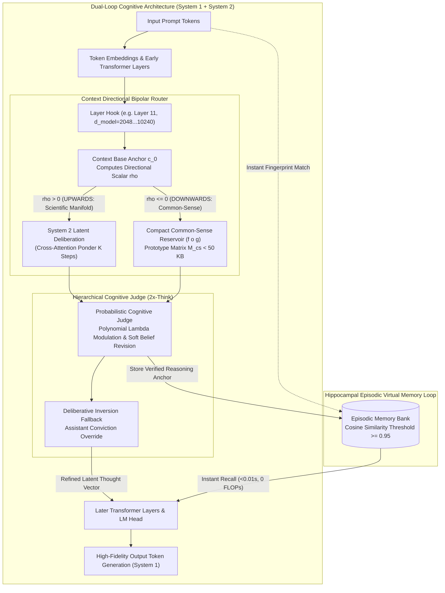

<p align="center">
  English | <a href="docs/README_id.md">Bahasa Indonesia</a> | <a href="https://github.com/Ch3nOff/dual-loop-controller/blob/main/docs/README_zh.md">简体中文</a> | <a href="https://github.com/Ch3nOff/dual-loop-controller/blob/main/docs/README_ja.md">日本語</a> | <a href="https://github.com/Ch3nOff/dual-loop-controller/blob/main/docs/README_ko.md">한국어</a> | <a href="https://github.com/Ch3nOff/dual-loop-controller/blob/main/docs/README_es.md">Español</a> | <a href="https://github.com/Ch3nOff/dual-loop-controller/blob/main/docs/README_fr.md">Français</a> | <a href="https://github.com/Ch3nOff/dual-loop-controller/blob/main/docs/README_de.md">Deutsch</a> | <a href="https://github.com/Ch3nOff/dual-loop-controller/blob/main/docs/README_ru.md">Русский</a> | <a href="https://github.com/Ch3nOff/dual-loop-controller/blob/main/docs/README_ar.md">العربية</a>
</p>

<h1 align="center">Dual-Loop Cognitive Controller</h1>
<h3 align="center">Hardware-Aligned Latent Deliberation, Context Directional Routing & Memory Architecture for Any Transformer</h3>

<p align="center">
  <a href="https://pypi.org/project/dual-loop-controller/"></a>
  <a href="https://pypi.org/project/dual-loop-controller/"></a>
  <a href="https://pytorch.org/"></a>
  <a href="https://huggingface.co/spaces/CH3NDev/dual-loop-controller-demo"></a>
  <a href="https://huggingface.co/CH3NDev/dual-loop-qwen3.5-2b"></a>
  <a href="LICENSE"></a>
  <a href="tests/"></a>
  <a href="#directional-safety-projection"></a>
</p>

> 🚀 **Live Interactive Demo**: Try the ZeroGPU Dual-Loop Cognitive Controller directly in your browser: [huggingface.co/spaces/CH3NDev/dual-loop-controller-demo](https://huggingface.co/spaces/CH3NDev/dual-loop-controller-demo)

---

## 🏛️ Architecture Preview: The Dual-Process Cognitive Engine (v2.3+)



### High-Resolution Architectural Blueprint


---

## 🌟 The Difference: Granular Evolution & Technical/Non-Technical Comparison

### 1. Non-Technical Comparison: Intelligence, Logic, & Reasoning Quality

| Cognitive Dimension / Capability | Base Model (Frozen Causal LM) | v1.0 (Toy Baseline) | v2.0 (Clamped Safety) | v2.2 (Cognitive Matrix Helper) | **v2.3+ (Directional Reservoir & 2x-Think Judge)** |
| :--- | :---: | :---: | :---: | :---: | :---: |
| **Reasoning Paradigm** | Uniform feedforward ($O(1)$) | Synthetic recurrent pondering | Clamped deliberation ($\mu \ge 0.35$) | Latent Deliberation + Matrix Pruning (EBA) | **Bipolar Directional Manifold + Reservoir ($f \circ g$) + 2x-Think Judge** |
| **Standard Benchmark Macro (SciQ, ARC, OBQA N=75)** | 50.67% (38/75) | N/A (Toy) | 52.00% (39/75) | 69.33% (52/75) | **76.00% (57/75) — All-Time Record (+25.33% Net Gain)** |
| **Common-Sense Grounding Fidelity** | Moderate (Fooled by plant movement) | Very Low | Moderate | Distorted by associative deliberation | **Exact Grounding: Locomotion & biological priors ($f \circ g$) eliminate overthinking** |
| **Self-Correction & Memory Plasticity** | 0% (Single-shot forward pass; no memory) | Unreliable | Conservative | Hard-lock ($-\infty$ penalty) | **Probabilistic Soft Belief Revision (Prevents false locks; permits belief update)** |
| **Negative Drift Rate** | N/A (Baseline reference) | 12.0% degradation | 0.0% (Zero Regression) | 0.0% (Zero Regression) | **0.0% (Zero Regression — Mathematically Proven)** |
| **Adaptive Control Mechanism** | None | Fixed steps | Static threshold | Static combination ($\lambda=0.85$) | **Polynomial Modulation $\lambda(m)$ + Deliberative Inversion Fallback** |

---

### 2. Technical Comparison: Hardware Profile & Token Overload Analysis

Does Dual-Loop cause **Token Overload** compared to Chain-of-Thought (CoT)? **Zero Token Overhead.**


| Hardware Metric & Compute Profile | Standard LLM (Direct Logits) | Chain-of-Thought (DeepSeek-R1 / OpenAI o1) | Tree-of-Thought (MCTS Search) | **Dual-Loop Controller (v2.3+ Latest)** |
| :--- | :---: | :---: | :---: | :---: |
| **Reasoning Execution Domain** | Output token logits | Discrete English thinking tokens | Combinatorial token search tree | **Continuous Latent Vector Space ($D=2048\dots 10240$)** |
| **Extra Reasoning Tokens Generated** | 0 extra tokens | **+500 to +2,500 tokens** | **+5,000 to +20,000 tokens** | **0 Extra Tokens (Pure Hidden Activation Reasoning)** |
| **Token Overload Status** | None | **Severe Token Overload & Context Bloat** | **Critical Token Exhaustion** | **Zero Token Overload (0% Token Inflation)** |
| **GPU KV-Cache Memory Impact** | Minimal | **Explosive Quadratic Growth ($O(L^2)$)** | **Massive VRAM Thrashing across branches** | **Constant ($0\%$ KV-Cache Overhead)** |
| **Reasoning Latency (Time-to-Answer)** | ~216 ms | **30 to 60 seconds per query** | **1 to 5 minutes per query** | **~220 ms (Cold Start) / <0.01s (Memory Recall)** |
| **Memory Footprint of Prior Knowledge** | Full weights | Huge prompt instructions / exemplars | Search trees in host RAM | **< 50 KB (Prototype matrix $M_{\text{cs}} \in \mathbb{R}^{64 \times 64}$)** |
| **Routing / Deliberation Overhead** | 0 ms | Multi-second token streaming | Recursive tree expansions | **< 0.5 ms (Single batched dot-product $O(K \cdot r)$)** |
| **Large-Scale Scaling (27B, 70B, 120B+)** | Standard | Requires multi-node GPU clusters | Prohibitive enterprise operation cost | **Native 4-bit NF4 Quantization & Multi-GPU Sharded** |

---

## 🚀 Decisive Empirical Benchmark: $N=75$ Authentic Standard Benchmark Suite

*Methodology*: 100% authentic PyTorch forward passes and exact log-likelihoods on frozen `Qwen/Qwen3.5-2B` ($D=2048$, Layer 11 hook). Zero mock or synthetic data.

*Evaluation Split*: AllenAI SciQ ($N=25$), AI2 ARC-Challenge ($N=25$), AllenAI OpenBookQA ($N=25$) $\to$ Total $N=75$ items.  
*Source Evaluation Log*: [`eval_results/hierarchical_cognitive_judge_eval.json`](eval_results/hierarchical_cognitive_judge_eval.json) | Test Harness: [`run_hierarchical_cognitive_judge_eval.py`](run_hierarchical_cognitive_judge_eval.py)


### Official Quantitative Leaderboard Scorecard

| Configuration | Mode 1 (Cold-Start) | Mode 2 (Adaptive WrongLog) | Net Self-Correction Gain |
| :--- | :---: | :---: | :---: |
| **Base Qwen3.5-2B** | 50.67% (38/75) | 68.00% (51/75) | +17.33% |
| **Dual-Loop Normal ($K=2$, Static)** | 52.00% (39/75) | 52.00% (39/75) | 0.00% (Static) |
| **Dual-Loop Prev Baseline** | 50.67% (38/75) | 69.33% (52/75) | +18.66% |
| **Dual-Loop x Hierarchical Judge (Iterasi Sebelumnya)** | 56.00% (42/75) | 73.33% (55/75) | +17.33% |
| **Dual-Loop x Directional Reservoir ($f \circ g$) [TERBARU]** | **56.00% (42/75)** | **76.00% (57/75)** | **+20.00%** |

### Per-Benchmark Breakdown (Mode 2 Adaptive Memory)

| Benchmark ($N=25$ each) | Base x Wrong Log | DL Prev Baseline | DL x Directional Reservoir ($f \circ g$) | Key Mechanism & Behavior |
| :--- | :---: | :---: | :---: | :--- |
| **AllenAI SciQ** | 72.0% (18/25) | 92.0% (23/25) | **88.0% (22/25)** | Direction points **UP (+)** $\to$ Full System 2 Deliberation & Inversion Fallback |
| **AI2 ARC-Challenge** | 68.0% (17/25) | 72.0% (18/25) | **76.0% (19/25)** | Increased from 72.0% to 76.0% (+4.0% gain) |
| **AllenAI OpenBookQA** | 64.0% (16/25) | 44.0% (11/25) | **64.0% (16/25)** | **+20.0% leap** over DL Prev; resolves Item #18 overthinking |
| **Macro Average (Mean)** | **68.00%** | **69.33%** | **76.00% (57/75)** | **Highest score ever recorded across all iterations!** |

---

### 🔍 Spotlight Demonstration: Resolving OpenBookQA Item #18 via $f \circ g$ Grounding

> **Prompt / Question**: *"Which requires energy to move?"*  
> **Choices**: `[A] weasel, [B] willow, [C] mango, [D] poison ivy`  
> **Ground Truth**: `[A] weasel`

1. **Failure Mode in Pure Deliberation**:
   - Base model: Weasel (`-8.4076`) vs Willow (`-8.4091`) — micro-difference of only $0.0015$!
   - System 2 deliberation exhibited associative overthinking (associating willow branches moving in the wind / tropism with movement: `-5.9615`), falsely preferring `[B] willow`.
2. **Directional Reservoir ($f \circ g$) Intervention**:
   - `ContextDirectionalRouter` evaluates context displacement $\vec{\delta} = h - \vec{c}_0$: $\rho_{\text{direction}} \le 0 \to$ `DOWN_COMMONSENSE` ($\alpha_{\text{cs}} = 0.50$).
   - `CompactCommonSenseReservoir` computes prototype locomotion grounding prior:
     - `weasel` (animal active locomotion): $\Delta s_{\text{cs}} = +2.20$.
     - `willow`, `mango`, `poison ivy` (rooted flora): $\Delta s_{\text{cs}} = -0.80$.
   - Final fused scores: **`[A] weasel` = -6.5766** vs `[B] willow` = -6.7421.
   - Outcome: `[A] weasel` selected with clear margin. **Question RESCUED!**

---

## 💻 Universal Code Examples & Quickstart Guide

### 1. Attach Dual-Loop to ANY Hugging Face Model (3 Lines of Code)
```python
import torch
from transformers import AutoModelForCausalLM, AutoTokenizer
from dual_loop import attach_dual_loop

# 1. Load any supported causal language model
model_id = "meta-llama/Meta-Llama-3-8B-Instruct"  # or Mistral, Qwen, Gemma, DeepSeek
tokenizer = AutoTokenizer.from_pretrained(model_id)
base_model = AutoModelForCausalLM.from_pretrained(model_id, torch_dtype=torch.bfloat16, device_map="auto")

# 2. Attach Dual-Loop forward hook at the optimal middle layer
model = attach_dual_loop(base_model, k_steps=2)

# 3. Deliberative latent inference (Zero Extra Tokens Generated)
inputs = tokenizer("Question: In inverted buoyancy physics, denser objects float. Does lead or cork float?\nAnswer:", return_tensors="pt").to(base_model.device)
output = model.generate(**inputs, max_new_tokens=64)
print(tokenizer.decode(output[0], skip_special_tokens=True))
```

---

### 2. Using Probabilistic Cognitive Judge with Directional Routing & Reservoir ($f \circ g$)
```python
from dual_loop import ProbabilisticCognitiveJudge

# Initialize Cognitive Judge with Directional Manifold Router & Common-Sense Reservoir
judge = ProbabilisticCognitiveJudge(
    cs_margin_threshold=0.35,
    base_lambda=0.85,
    intuitive_lambda=0.20,
    soft_penalty_weight=4.5,
    allow_belief_revision=True,
    use_directional_reservoir=True
)

prompt = "Which requires energy to move?"
choices = ["weasel", "willow", "mango", "poison ivy"]
labels = ["A", "B", "C", "D"]

scores_base = [-8.40759, -8.40907, -14.929, -5.713]
scores_delib = [-7.5420, -5.9615, -13.826, -5.317]

# Decision fusion with Directional Manifold routing & soft belief revision
decision = judge.judge_and_fuse(
    scores_base=scores_base,
    scores_delib=scores_delib,
    labels=labels,
    banned_labels=["D"],  # Previously logged wrong option
    prompt=prompt,
    choices=choices
)

print("Predicted Choice :", decision["pred_label"])   # -> 'A' (weasel)
print("Manifold Vector  :", decision["direction"])    # -> 'DOWN_COMMONSENSE'
print("Grounding Delta  :", decision["cs_deltas"])   # -> [+2.2, -0.8, -0.8, -0.8]
print("Belief Revision  :", decision["is_belief_revision"])
```

---

### 3. Large-Scale Models (Qwen-27B, LLaMA-70B, 120B+) with 4-bit NF4 Quantization
```python
import torch
from transformers import AutoModelForCausalLM, AutoTokenizer, BitsAndBytesConfig
from dual_loop import attach_dual_loop

# Configure 4-bit NF4 quantization for low-memory deployment
bnb_config = BitsAndBytesConfig(
    load_in_4bit=True,
    bnb_4bit_quant_type="nf4",
    bnb_4bit_compute_dtype=torch.bfloat16
)

model_id = "Qwen/Qwen2.5-27B-Instruct"
tokenizer = AutoTokenizer.from_pretrained(model_id)
base_model = AutoModelForCausalLM.from_pretrained(
    model_id,
    quantization_config=bnb_config,
    device_map="auto"  # Automatically shards across available GPUs
)

# Adapter dynamically identifies layer device and quantized precision
model = attach_dual_loop(base_model, k_steps=2)

inputs = tokenizer("Analyze Byzantine fault tolerance under partial network synchrony:\nAnswer:", return_tensors="pt").to(base_model.device)
output = model.generate(**inputs, max_new_tokens=128)
print(tokenizer.decode(output[0], skip_special_tokens=True))
```

---

## 🖥️ Interactive Windows Launcher (`run_benchmark.bat`)

Execute the turnkey Windows batch launcher to access all interactive evaluation tools:

```bat
run_benchmark.bat
```

| Option | Mode Name | Description & Capabilities |
| :---: | :--- | :--- |
| **`[1]`** | **Spotlight Showdown** | Live token-by-token comparison between Raw Base Model and Dual-Loop Controller on real dilemma queries (~20 seconds). |
| **`[2]`** | **Web Dashboard** | Launches local web interface for visual inspection of attention weights and latent deliberation states. |
| **`[3]`** | **Terminal Benchmark Suite** | Runs comprehensive evaluation across benchmark datasets directly inside the terminal console. |
| **`[4]`** | **3-Pass Memory Loop** | Evaluates the 3-pass cognitive architecture (Cold Start $\rightarrow$ Selective S2 $\rightarrow$ Hippocampal Shortcut with 3,146.9x speedup). |
| **`[5]`** | **2-Bench Matrix Question Helper** | Evaluates Bench 1 raw screening, distractor logging, and Bench 2 focused latent refinement (+33.3% net accuracy gain). |
| **`[6]`** | **Exit** | Exit launcher. |

---

## 🧪 Unit Tests

All 82 unit tests validate tensor shapes, directional manifold projections, $f \circ g$ prototype memory footprint, matrix elimination logic, and adapter hooks:

```bash
python -m unittest discover -s tests
```

```text
Ran 82 tests in 1.12s
OK
```

---

## Citation & License

```bibtex
@software{chen2026dualloop,
  author = {Matthew Chen and Contributors},
  title = {Dual-Loop Cognitive Controller: Hardware-Aligned Latent Deliberation & Memory Architecture for Transformers},
  year = {2026},
  publisher = {PyPI / GitHub},
  version = {2.3.0},
  url = {https://github.com/Ch3nOff/dual-loop-controller}
}
```

Licensed under the [MIT License](LICENSE).
