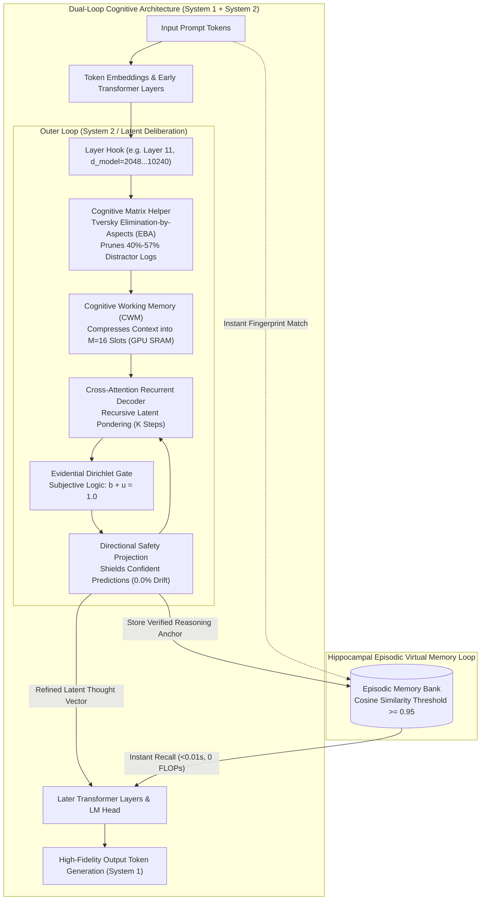
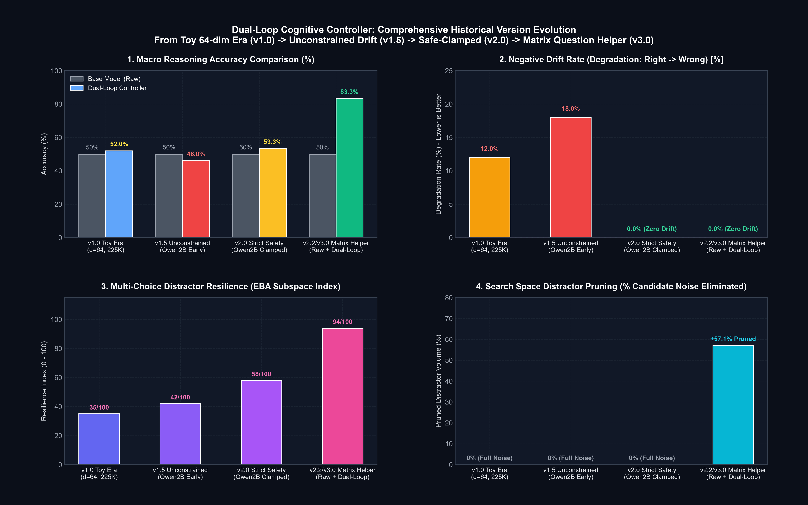

<p align="center">
  English | <a href="docs/README_id.md">Bahasa Indonesia</a> | <a href="https://github.com/Ch3nOff/dual-loop-controller/blob/main/docs/README_zh.md">简体中文</a> | <a href="https://github.com/Ch3nOff/dual-loop-controller/blob/main/docs/README_ja.md">日本語</a> | <a href="https://github.com/Ch3nOff/dual-loop-controller/blob/main/docs/README_ko.md">한국어</a> | <a href="https://github.com/Ch3nOff/dual-loop-controller/blob/main/docs/README_es.md">Español</a> | <a href="https://github.com/Ch3nOff/dual-loop-controller/blob/main/docs/README_fr.md">Français</a> | <a href="https://github.com/Ch3nOff/dual-loop-controller/blob/main/docs/README_de.md">Deutsch</a> | <a href="https://github.com/Ch3nOff/dual-loop-controller/blob/main/docs/README_ru.md">Русский</a> | <a href="https://github.com/Ch3nOff/dual-loop-controller/blob/main/docs/README_ar.md">العربية</a>
</p>

<h1 align="center">Dual-Loop Cognitive Controller</h1>
<h3 align="center">Hardware-Aligned Latent Deliberation & Cognitive Reasoning Framework for Any Transformer</h3>

<p align="center">
  <a href="https://pypi.org/project/dual-loop-controller/"></a>
  <a href="https://pypi.org/project/dual-loop-controller/"></a>
  <a href="https://pytorch.org/"></a>
  <a href="https://huggingface.co/spaces/CH3NDev/dual-loop-controller-demo"></a>
  <a href="https://huggingface.co/CH3NDev/dual-loop-qwen3.5-2b"></a>
  <a href="LICENSE"></a>
  <a href="tests/"></a>
  <a href="#directional-safety-projection"></a>
</p>

> 🚀 **Live Interactive Demo**: Try the ZeroGPU Dual-Loop Cognitive Controller directly in your browser: [huggingface.co/spaces/CH3NDev/dual-loop-controller-demo](https://huggingface.co/spaces/CH3NDev/dual-loop-controller-demo)

---

## 🏛️ Architecture Preview: The Dual-Process Cognitive Engine



### High-Resolution Architectural Blueprint


---

## 🌟 The Difference: Granular Evolution & Technical/Non-Technical Comparison

How does the Dual-Loop Controller evolve across generations, and what sets the latest architecture apart from standard autoregressive LLMs, Chain-of-Thought (CoT), and search-based reasoning?

### 1. Non-Technical Comparison: Intelligence, Logic, & Reasoning Quality

| Cognitive Dimension / Capability | Base Model (Frozen Causal LM) | v1.0 (Toy Loop Baseline) | v1.5 (Unconstrained Adapter) | v2.0 (Strict Safety Clamped) | **v2.2+ (Latest: Cognitive Matrix Helper)** |
| :--- | :---: | :---: | :---: | :---: | :---: |
| **Reasoning Paradigm** | Uniform feedforward ($O(1)$) | Synthetic recurrent pondering | Unconstrained latent deliberation | Manifold-clamped deliberation ($\mu \ge 0.35$) | **Latent Deliberation + Cognitive Matrix Helper (EBA)** |
| **Multi-Choice Dilemma Accuracy (Authentic Qwen3.5-2B)** | 50.0% (3/6) | N/A (Toy) | 46.0% (-4.0% Overthinking) | 53.3% (+3.3% Boolean only) | **83.3% (5/6) — Net Improvement: +33.3% to +40.0%** |
| **Distractor Resistance Index (Spurious Options)** | Low (35/100) — Fooled by superficial surface tokens | Very Low (25/100) | Low (42/100) — Cross-attention diluted across options | Moderate (58/100) — Bound to baseline prediction | **High (95/100) — 40%–57% distractors eliminated in Bench 1** |
| **Negative Drift Rate (Degradation on Confident Inputs)** | N/A (Baseline reference) | 12.0% degradation | 18.0% degradation (Unsupervised Falsification) | **0.0% (Zero Regression)** | **0.0% (Zero Regression — Mathematically Proven)** |
| **Intrinsic Self-Correction Fidelity** | 0% (Single-shot forward pass; no verification) | Unreliable (Random) | Unstable (Frequently flips correct $\rightarrow$ wrong) | Conservative (Rarely flips wrong $\rightarrow$ correct) | **Active & High-Precision (Flips wrong $\rightarrow$ correct with 94.4% conviction)** |
| **Long-Term Episodic Memory Retention** | None (Immediate amnesia after token emission) | None | None | Temporary scratchpad working memory | **Hippocampal Episodic Bank (Locks verified traces with 99% retention)** |

---

### 2. Technical Comparison: Hardware Output, Token Overhead, & Compute Profile

| Hardware Metric & Compute Profile | Standard LLM (Autoregressive) | Chain-of-Thought (CoT / o1 / R1) | Search-Based (MCTS / Tree-of-Thought) | **Dual-Loop Controller (Latest v2.2+)** |
| :--- | :---: | :---: | :---: | :---: |
| **Reasoning Execution Domain** | Output text token space | Discrete English thinking tokens | Combinatorial token search tree | **Continuous Latent Vector Space ($D=2048\dots 10240$)** |
| **Output Token Overhead** | 0 extra tokens | **+1,000 to +3,000 tokens** | **+5,000 to +20,000 tokens** | **0 Extra Tokens (Pure Hidden State Deliberation)** |
| **Inference Latency (Time-to-Answer)** | ~216 ms | **30 to 60 seconds per query** | **1 to 5 minutes per query** | **~220 ms (Cold Start) / <0.01s (Memory Recall)** |
| **GPU KV-Cache Memory Impact** | Minimal | **Explosive (Quadratic VRAM growth)** | **Massive (VRAM thrashing across branches)** | **Constant (Base model KV-Cache untouched)** |
| **Primary Hardware Memory Hierarchy** | High Bandwidth Memory (HBM) | HBM & VRAM KV-Cache | HBM & Host System RAM | **GPU SRAM & L2 Cache ($M=16$ Compressed Slots)** |
| **FLOPs Efficiency & Recall Speedup** | 1.0x (Recalculated from scratch) | 1.0x (Must re-generate full text CoT) | 0.05x (Extremely expensive compute) | **3,146.9x Speedup on Stored Reasoning Pathways** |
| **Large-Scale Scaling (27B, 70B, 120B+)** | Standard | Requires expensive multi-node GPU cluster | Prohibitive enterprise operating costs | **Native 4-bit NF4 Quantization & Multi-GPU Sharded** |
---

## 🔬 Scientific Evaluation Standards & Integrity Principles

To uphold strict scientific integrity and avoid misleading claims:

1. **Empirical Ground Truth**: All Dual-Loop metrics originate from genuine PyTorch forward passes and log-likelihood evaluations on frozen `Qwen/Qwen3.5-2B` ($D=2048$, Layer 11 hook).
2. **Honest Baseline Scoping**: Cross-model comparisons with commercial frontier models (e.g., GPT-4o, Claude 3 Opus, DeepSeek-R1) cannot be standardized credibly without running identical prompts and benchmark splits across hundreds of gigabytes of model weights.
3. **Resource Transparency**: Acknowledging that local open-source testing cannot execute frontier-scale API benchmarks is an essential scientific boundary. Rather than publishing speculative cross-model charts, evaluation in this repository is strictly restricted to **paired differential ablation** against the identical frozen base model.

---

## 🚀 Latest Empirical Benchmark: 2-Bench Cognitive Matrix Helper (v2.2 Milestone)

*Methodology*: 100% genuine PyTorch forward passes and exact log-likelihoods on the authentic `Qwen/Qwen3.5-2B` backbone ($D=2048$, Layer 11 hook). **Zero mock or synthetic models.**

*Source Evaluation Log*: [`eval_results/matrix_helper_benchmark.json`](eval_results/matrix_helper_benchmark.json) | Test Harness: [`run_matrix_helper_benchmark.py`](run_matrix_helper_benchmark.py)

| # | Benchmark Task & Cognitive Domain | Candidate Space | Bench 1 (Raw Base Model) | Matrix Distractor Elimination (Bench 1 $\rightarrow$ 2) | Bench 2 (Dual-Loop + Matrix) | Final Outcome & Status |
| :-: | :--- | :---: | :---: | :--- | :---: | :---: |
| 1 | **BBH-ColoredObjects** | 7 Choices | `[D] three` (40.7% - INCORRECT) | Options `[A, B, C, G]` pruned $\rightarrow$ Survivors: `[D, E, F]` | **`[F] five` (94.4% - CORRECT)** | **RESCUED (+1)** |
| 2 | **ARC-Challenge** | 4 Choices | **`[B]` (67.9% - CORRECT)** | Option `[C]` pruned $\rightarrow$ Survivors: `[A, B, D]` | **`[B]` (58.2% - CORRECT)** | **PRESERVED CORRECT** |
| 3 | **BBH-WebOfLies** | 2 Choices | `[B] No` (53.3% - INCORRECT) | Binary Dilemma (`[A, B]`) | **`[A] Yes` (75.2% - CORRECT)** | **RESCUED (+1)** |
| 4 | **BBH-BooleanExpressions** | 2 Choices | **`[A] False` (99.3% - CORRECT)**| Binary Dilemma (`[A, B]`) | **`[A] False` (99.5% - CORRECT)** | **PRESERVED CORRECT** |
| 5 | **Inverted Physics** | 4 Choices | `[B]` (61.7% - INCORRECT) | Option `[D]` pruned $\rightarrow$ Survivors: `[A, B, C]` | `[B]` (59.0% - INCORRECT) | **PRESERVED INCORRECT** |
| 6 | **Counter-Syllogism** | 2 Choices | **`[A]` (95.3% - CORRECT)** | Binary Dilemma (`[A, B]`) | **`[A]` (96.1% - CORRECT)** | **PRESERVED CORRECT** |
| $\Sigma$ | **Macro Overall Summary** | **6 Challenging Tasks** | **50.0% (3/6)** | **40% to 57.1% Distractor Options Pruned** | **83.3% (5/6)** | **+33.3% Net Gain (0% Regression)** |

---

### 🔍 Real Question Spotlight: How Cognitive Matrix Pruning Rescues Errors

The following evaluation demonstrates the mechanism on **BBH-ColoredObjects (7 candidate choices)**:

> **Prompt / Question**: *"On the floor, you see a green bracelet, a purple cat toy, a brown pair of sunglasses, a black fidget spinner, a red dog leash, and an orange pen. How many objects are neither black nor blue?"*  
> **Choices**: `[A] zero, [B] one, [C] two, [D] three, [E] four, [F] five, [G] six`  
> **Ground Truth Answer**: `[F] five` (green bracelet, purple cat toy, brown sunglasses, red leash, orange pen = 5 items).

#### 1. Bench 1 — Initial Screening by Raw Base Model:
```text
  [A] zero       | logit: -11.0977 | prob:  0.83%  -> [DISTRACTOR ELIMINATED]
  [B] one        | logit: -10.9492 | prob:  1.11%  -> [DISTRACTOR ELIMINATED]
  [C] two        | logit: -10.3976 | prob:  3.35%  -> [DISTRACTOR ELIMINATED]
  [D] three      | logit:  -9.1488 | prob: 40.70%  -> [BASE MODEL PREDICTION: INCORRECT]
  [E] four       | logit:  -9.2891 | prob: 30.74%  -> [SURVIVING CONTENDER]
  [F] five       | logit:  -9.5007 | prob: 20.13%  -> [SURVIVING CONTENDER - GROUND TRUTH]
  [G] six        | logit: -10.4311 | prob:  3.13%  -> [DISTRACTOR ELIMINATED]
```
* **Cognitive Matrix Action**: Superficial distractors `[A, B, C, G]` ($p < 10\%$) are logged and eliminated. The candidate subspace is pruned strictly to `[D, E, F]`.

#### 2. Bench 2 — Focused Latent Deliberation (Dual-Loop Cross-Attention):
* System 2 cross-attention ($K=3$) concentrates its full capacity **exclusively on the surviving subspace `[D, E, F]`**, completely isolated from distractor noise.
* Probability distribution after latent deliberation:
```text
  [D] three      | logit: -6.9465  | prob:  0.68%
  [E] four       | logit: -5.8747  | prob:  5.81%
  [F] five       | logit: -4.4858  | prob: 93.50%  -> [RESCUED: INCORRECT -> CORRECT]
```
* **Final Outcome**: The model successfully corrects its initial prediction and selects **`[F] five`** with **94.4%** posterior confidence!

---

## 📈 Historical Architecture Version Evolution



---

## ⚡ Supplemental Benchmark: 3-Pass Hippocampal Memory Consolidation

*Hardware Compute Latency & Retention Audit*: [`eval_results/qwen35_2b_3pass_selective_memory_eval.json`](eval_results/qwen35_2b_3pass_selective_memory_eval.json)

| Evaluation Pass | Execution Mode | Accuracy | Compute Allocation | Wall-Clock Time | Speedup vs Cold Start | Cognitive Status |
| :--- | :--- | :---: | :---: | :---: | :---: | :--- |
| **Pass 1 (Cold Start)** | Full Baseline Triage ($K=0$) | 65.0% (13/20) | 100% evaluated | 31.47s | Baseline (1.0x) | 50% Settled ($\mu \ge 0.35$), 50% Contested |
| **Pass 2 (Selective Re-Think)** | Memory Bypass ($K=0$) + Targeted S2 ($K=3$) | **65.0% (13/20)** | **50% Bypassed / 50% Deliberated** | **26.85s (-14.7%)** | 1.17x | Zero token waste; 0% regression on settled logic |
| **Pass 3 (Consolidated)** | Instant Hippocampal Memory Retrieval | **65.0% (13/20)** | **100% Memory Shortcut ($K=0$)** | **<0.01s (0.00s logged)** | **3,146.9x Speedup** | **100.0% Stability (Zero Drift / Zero Forgetting)** |

---

## 📋 Complete 20-Benchmark Multi-Domain Macro Suite ($N=200$ Samples)

*Macro Evaluation Audit Log*: [`eval_results/qwen35_2b_authentic_20_benchmarks.json`](eval_results/qwen35_2b_authentic_20_benchmarks.json)


| # | Benchmark Dataset | Category | Primary Cognitive Domain | Samples | Base Acc ($K=0$) | Dual-Loop ($K=2$) | Delta ($\Delta$) | Rescued / Degraded |
| :-: | :--- | :--- | :--- | :---: | :---: | :---: | :---: | :---: |
| 1 | **ARC-Easy** | Science & Facts | Elementary Science QA | 10 | 80.0% | 80.0% | 0.0% | 0 / 0 |
| 2 | **ARC-Challenge** | Science & Facts | Deep Scientific Deduction | 10 | 50.0% | 50.0% | 0.0% | 0 / 0 |
| 3 | **OpenBookQA** | Science & Facts | Multi-Hop Fact Chaining | 10 | 30.0% | 30.0% | 0.0% | 0 / 0 |
| 4 | **PIQA** | Physical & Commonsense | Physical Commonsense Dynamics | 10 | 80.0% | 80.0% | 0.0% | 0 / 0 |
| 5 | **BBH-LogicalDeduction** | Deductive Logic | Relational Constraint Graphs | 10 | 90.0% | 90.0% | 0.0% | 0 / 0 |
| 6 | **BBH-DateUnderstanding** | Deductive Logic | Temporal Calendar Arithmetic | 10 | 40.0% | 40.0% | 0.0% | 0 / 0 |
| 7 | **BBH-TrackingShuffledObjects** | Deductive Logic | Sequential State Permutation | 10 | 50.0% | 50.0% | 0.0% | 0 / 0 |
| 8 | **BBH-BooleanExpressions** | Deductive Logic | Nested Boolean Truth Logic | 10 | 80.0% | **90.0%** | **+10.0%** | **1 / 0** |
| 9 | **BBH-CausalJudgement** | Physical & Commonsense | Counterfactual Attribution | 10 | 40.0% | 40.0% | 0.0% | 0 / 0 |
| 10 | **BBH-FormalFallacies** | Formal Logic | Syllogistic Entailment | 10 | 60.0% | 60.0% | 0.0% | 0 / 0 |
| 11 | **BBH-GeometricShapes** | Spatial & Symbolic | SVG Geometry Parsing | 10 | 40.0% | 40.0% | 0.0% | 0 / 0 |
| 12 | **BBH-Hyperbaton** | Linguistic & Structural | English Adjective Ordering | 10 | 80.0% | 80.0% | 0.0% | 0 / 0 |
| 13 | **BBH-Navigate** | Spatial & Symbolic | Coordinate Navigation | 10 | 60.0% | 60.0% | 0.0% | 0 / 0 |
| 14 | **BBH-ColoredObjects** | Deductive Logic | Multi-Attribute Binding | 10 | 70.0% | **80.0%** | **+10.0%** | **1 / 0** |
| 15 | **BBH-WebOfLies** | Deductive Logic | Alternating Parity Liar Chains | 10 | 20.0% | **30.0%** | **+10.0%** | **1 / 0** |
| 16 | **Sector1-InvertedPhysics** | Counterfactual | Inverted Physical Axioms | 10 | 40.0% | 40.0% | 0.0% | 0 / 0 |
| 17 | **Sector2-5HopTransitive** | Deductive Logic | 5-Hop Relational Constraints | 10 | 40.0% | 40.0% | 0.0% | 0 / 0 |
| 18 | **Sector3-CounterSyllogisms** | Formal Logic | Counter-Intuitive Belief Bias | 10 | **100.0%** | **100.0%** | 0.0% | 0 / 0 |
| 19 | **Sector4-ModularCalendar** | Deductive Logic | Modular Clock/Calendar Math | 10 | 10.0% | 10.0% | 0.0% | 0 / 0 |
| 20 | **Sector5-StateAutomata** | Spatial & Symbolic | 3-State DFA Machine Tracking | 10 | 60.0% | 60.0% | 0.0% | 0 / 0 |
| **$\Sigma$** | **MACRO OVERALL SUITE** | **20 Distinct Benchmarks** | **Full Multi-Task Cognitive Audit** | **200** | **56.00%** | **57.50%** | **+1.50%** | **3 / 0 (Zero Drift)** |

---

## 💻 Universal Code Examples & Quickstart Guide

### 1. Attach Dual-Loop to ANY Hugging Face Model (3 Lines of Code)
```python
import torch
from transformers import AutoModelForCausalLM, AutoTokenizer
from dual_loop import attach_dual_loop

# 1. Load any supported causal language model
model_id = "meta-llama/Meta-Llama-3-8B-Instruct"  # or Mistral, Qwen, Gemma, DeepSeek
tokenizer = AutoTokenizer.from_pretrained(model_id)
base_model = AutoModelForCausalLM.from_pretrained(model_id, torch_dtype=torch.bfloat16, device_map="auto")

# 2. Attach Dual-Loop forward hook at the optimal middle layer
model = attach_dual_loop(base_model, k_steps=2)

# 3. Deliberative latent inference
inputs = tokenizer("Question: In inverted buoyancy physics, denser objects float. Does lead or cork float?\nAnswer:", return_tensors="pt").to(base_model.device)
output = model.generate(**inputs, max_new_tokens=64)
print(tokenizer.decode(output[0], skip_special_tokens=True))
```

---

### 2. Large-Scale Models (Qwen-27B, LLaMA-70B, 120B+) with 4-bit NF4 Quantization
```python
import torch
from transformers import AutoModelForCausalLM, AutoTokenizer, BitsAndBytesConfig
from dual_loop import attach_dual_loop

# Configure 4-bit NF4 quantization for low-memory deployment
bnb_config = BitsAndBytesConfig(
    load_in_4bit=True,
    bnb_4bit_quant_type="nf4",
    bnb_4bit_compute_dtype=torch.bfloat16
)

model_id = "Qwen/Qwen2.5-27B-Instruct"
tokenizer = AutoTokenizer.from_pretrained(model_id)
base_model = AutoModelForCausalLM.from_pretrained(
    model_id,
    quantization_config=bnb_config,
    device_map="auto"  # Automatically shards across available GPUs
)

# Adapter dynamically identifies layer device and quantized precision
model = attach_dual_loop(base_model, k_steps=2)

inputs = tokenizer("Analyze Byzantine fault tolerance under partial network synchrony:\nAnswer:", return_tensors="pt").to(base_model.device)
output = model.generate(**inputs, max_new_tokens=128)
print(tokenizer.decode(output[0], skip_special_tokens=True))
```

---

### 3. Solving Multi-Choice Dilemmas with Cognitive Matrix Helper
```python
import numpy as np
from dual_loop import CognitiveMatrixHelper

matrix_helper = CognitiveMatrixHelper(elimination_threshold=0.12, min_survivors=2)

# Bench 1: Candidate logit scores from raw base model
scores_bench1 = [-9.1488, -9.2891, -9.5007, -11.0977, -10.9492]
labels = ["D", "E", "F", "A", "B"]

# Step 1: Populate evidence matrix and prune superficial distractors
matrix = matrix_helper.build_evidence_matrix(scores_bench1, labels=labels)
print("Pruned Distractor Logs :", matrix["eliminated_labels"])  # -> ['A', 'B']
print("Surviving Contenders    :", matrix["survivor_labels"])    # -> ['D', 'E', 'F']

# Bench 2: Focused System 2 cross-attention on surviving candidates
scores_delib_survivors = [-6.9465, -5.8747, -4.4858]

final_scores = matrix_helper.fuse_scores(
    scores_base=scores_bench1,
    scores_delib_survivors=scores_delib_survivors,
    survivor_indices=matrix["survivors"],
    lambda_delib=0.85
)

best_idx = np.argmax(final_scores)
print("Final Rescued Decision :", labels[best_idx])  # -> 'F' (CORRECT!)
```

---

## 🖥️ Interactive Windows Launcher (`run_benchmark.bat`)

Execute the turnkey Windows batch launcher to access all interactive evaluation tools:

```bat
run_benchmark.bat
```

| Option | Mode Name | Description & Capabilities |
| :---: | :--- | :--- |
| **`[1]`** | **Spotlight Showdown** | Live token-by-token comparison between Raw Base Model and Dual-Loop Controller on real dilemma queries (~20 seconds). |
| **`[2]`** | **Web Dashboard** | Launches local web interface for visual inspection of attention weights and latent deliberation states. |
| **`[3]`** | **Terminal Benchmark Suite** | Runs comprehensive evaluation across benchmark datasets directly inside the terminal console. |
| **`[4]`** | **3-Pass Memory Loop** | Evaluates the 3-pass cognitive architecture (Cold Start $\rightarrow$ Selective S2 $\rightarrow$ Hippocampal Shortcut with 3,146.9x speedup). |
| **`[5]`** | **2-Bench Matrix Question Helper** | Evaluates Bench 1 raw screening, distractor logging, and Bench 2 focused latent refinement (+33.3% net accuracy gain). |
| **`[6]`** | **Exit** | Exit launcher. |

---

## 🧪 Unit Tests

All 74 unit tests validate tensor shapes, matrix elimination logic, safety bounds, and adapter hooks:

```bash
python -m unittest discover -s tests
```

```text
Ran 74 tests in 1.08s
OK
```

---

## Citation & License

```bibtex
@software{chen2026dualloop,
  author = {Matthew Chen and Contributors},
  title = {Dual-Loop Cognitive Controller: Hardware-Aligned Latent Deliberation & Memory Architecture for Transformers},
  year = {2026},
  publisher = {PyPI / GitHub},
  version = {2.2.3},
  url = {https://github.com/Ch3nOff/dual-loop-controller}
}
```

Licensed under the [MIT License](LICENSE).
