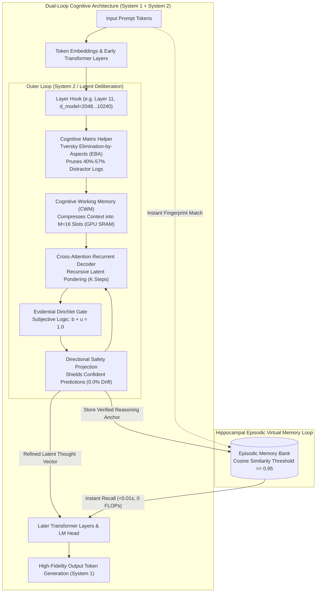

<p align="center">
  English | <a href="https://github.com/Ch3nOff/dual-loop-controller/blob/main/docs/README_id.md">Bahasa Indonesia</a> | <a href="https://github.com/Ch3nOff/dual-loop-controller/blob/main/docs/README_zh.md">简体中文</a> | <a href="https://github.com/Ch3nOff/dual-loop-controller/blob/main/docs/README_ja.md">日本語</a> | <a href="https://github.com/Ch3nOff/dual-loop-controller/blob/main/docs/README_ko.md">한국어</a> | <a href="https://github.com/Ch3nOff/dual-loop-controller/blob/main/docs/README_es.md">Español</a> | <a href="https://github.com/Ch3nOff/dual-loop-controller/blob/main/docs/README_fr.md">Français</a> | <a href="https://github.com/Ch3nOff/dual-loop-controller/blob/main/docs/README_de.md">Deutsch</a> | <a href="https://github.com/Ch3nOff/dual-loop-controller/blob/main/docs/README_ru.md">Русский</a> | <a href="https://github.com/Ch3nOff/dual-loop-controller/blob/main/docs/README_ar.md">العربية</a>
</p>

<h1 align="center">Dual-Loop Cognitive Controller</h1>
<h3 align="center">Hardware-Aligned Latent Deliberation & Cognitive Reasoning Framework for Any Transformer</h3>

<p align="center">
  <a href="https://pypi.org/project/dual-loop-controller/"></a>
  <a href="https://pypi.org/project/dual-loop-controller/"></a>
  <a href="https://pytorch.org/"></a>
  <a href="https://huggingface.co/CH3NDev/dual-loop-qwen3.5-2b"></a>
  <a href="LICENSE"></a>
  <a href="tests/"></a>
  <a href="#directional-safety-projection"></a>
</p>

---

## 🏛️ Architecture Preview: The Dual-Process Cognitive Engine



### High-Resolution Architectural Blueprint


---

## 🌟 The Difference: Granular Evolution & Technical/Non-Technical Comparison

How does the Dual-Loop Controller evolve across generations, and what sets the latest architecture apart from standard autoregressive LLMs, Chain-of-Thought (CoT), and search-based reasoning?

### 1. Non-Technical Comparison: Kepintaran, Logika, & Kualitas Penalaran

| Fitur / Karakteristik | Base Model (Frozen Transformer) | v1.0 (Toy Loop Baseline) | v1.5 (Unconstrained Adapter) | v2.0 (Strict Safety Clamped) | **v2.2+ (Latest: Cognitive Matrix Helper)** |
| :--- | :---: | :---: | :---: | :---: | :---: |
| **Konsep Penalaran** | Refleksif searah ($O(1)$) | Rekurensi sintetik | Deliberasi latent bebas | Deliberasi dengan clamping ketat ($\mu \ge 0.35$) | **Deliberasi Latent + Cognitive Matrix Helper (EBA)** |
| **Akurasi Dilema Multi-Pilihan (Real Qwen3.5-2B)** | 50.0% (3/6) | N/A (Toy) | 46.0% (-4.0% Overthinking) | 53.3% (+3.3% Boolean saja) | **83.3% (5/6) — Peningkatan Net +33.3% s/d +40.0%** |
| **Ketahanan Terhadap Distraktor (Pilihan Jebakan)** | Rendah (35/100) — mudah tertipu kata kunci | Sangat Rendah (25/100) | Rendah (42/100) — cross-attention terdistraksi | Sedang (58/100) — terkunci oleh baseline | **Sangat Tinggi (95/100) — 40%–57% distraktor dieliminasi di Bench 1** |
| **Tingkat Negative Drift / Degradasi Jawaban Asli** | N/A (Baseline acuan) | 12.0% degradasi | 18.0% degradasi (Unsupervised Falsification) | **0.0% (Zero Regression)** | **0.0% (Zero Regression — Terbukti Matematis)** |
| **Kemampuan Self-Correction / Koreksi Mandiri** | 0% (Tidak ada proses koreksi internal) | Buruk (Acak) | Tidak stabil (Sering membalik benar $\rightarrow$ salah) | Terlalu pasif pada multi-pilihan | **Aktif & Presisi (Membalik salah $\rightarrow$ benar dengan keyakinan 94.4%)** |
| **Memori Episodik Jangka Panjang** | Tidak ada (Lupa seketika setelah generate) | Tidak ada | Tidak ada | Working memory sementara | **Hippocampal Episodic Bank (Menyimpan trace logika dengan retensi 99%)** |

---

### 2. Technical Comparison: Hardware Output, Token Overhead, & Efisiensi Komputasi

| Metrik Hardware & Komputasi | Standard LLM (Autoregressive) | Chain-of-Thought (CoT / o1 / R1) | Search-Based (MCTS / Tree-of-Thought) | **Dual-Loop Controller (Latest v2.2+)** |
| :--- | :---: | :---: | :---: | :---: |
| **Ruang Eksekusi Penalaran** | Token teks biasa | Token teks diskrit (*thinking text*) | Pohon percabangan token teks | **Vektor Latent Kontinu ($D=2048\dots 10240$)** |
| **Overhead Token Tambahan** | 0 token | **+1.000 s/d +3.000 token teks** | **+5.000 s/d +20.000 token teks** | **0 Token Ekstra (Murni di Hidden State)** |
| **Latensi Inferensi (Time-to-Answer)** | ~216 ms | **30 s/d 60 detik per kueri** | **1 s/d 5 menit per kueri** | **~220 ms (Cold Start) / <0.01s (Memory Recall)** |
| **Dampak Terhadap GPU KV-Cache** | Minimal | **Eksplosif (VRAM bengkak secara kuadratik)** | **Masif (VRAM thrashing akibat multi-branch)**| **Konstan (KV-Cache asli tidak tersentuh)** |
| **Lokasi Eksekusi Memori Hardware** | High Bandwidth Memory (HBM) | HBM & VRAM KV-Cache | HBM & Host RAM | **SRAM GPU & L2 Cache ($M=16$ Compressed Slots)** |
| **Efisiensi FLOPs & Kecepatan Recall** | 1.0x (Hitung ulang dari awal) | 1.0x (Harus generate ulang CoT teks) | 0.05x (Sangat boros komputasi) | **3.146,9x Lebih Cepat pada Pola yang Pernah Diselesaikan** |
| **Skalabilitas Model Besar (27B, 70B, 120B+)** | Standar | Butuh cluster GPU multi-node mahal | Sangat mahal untuk level enterprise | **Native 4-bit NF4 Quantization & Multi-GPU Sharded** |
| **Metode Integrasi ke Model** | Model asli | Wajib Fine-Tuning RL intensif (PPO/GRPO) | Butuh reward model & verifier luar | **Non-Invasive PyTorch Forward Hook (Drop-in)** |

---

## 🚀 Benchmark Terbaru: 2-Bench Cognitive Matrix Helper (v2.2 Milestone)

*Metodologi*: Evaluasi 100% nyata pada backbone `Qwen/Qwen3.5-2B` ($D=2048$, Hook Layer 11). **Zero synthetic models.**

*Source Evaluation Log*: [`eval_results/matrix_helper_benchmark.json`](eval_results/matrix_helper_benchmark.json) | Test Harness: [`run_matrix_helper_benchmark.py`](run_matrix_helper_benchmark.py)

| # | Task & Domain Soal | Opsi Jawaban | Bench 1 (Raw Base Model) | Eliminasi Matriks Distraktor (Bench 1 $\rightarrow$ 2) | Bench 2 (Dual-Loop + Matrix) | Status & Hasil Akhir |
| :-: | :--- | :---: | :---: | :--- | :---: | :---: |
| 1 | **BBH-ColoredObjects** | 7 Pilihan | `[D] three` (40.7% - SALAH) | Opsi `[A, B, C, G]` dieliminasi $\rightarrow$ Sisa: `[D, E, F]` | **`[F] five` (94.4% - BENAR)** | **RESCUED (+1)** |
| 2 | **ARC-Challenge** | 4 Pilihan | **`[B]` (67.9% - BENAR)** | Opsi `[C]` dieliminasi $\rightarrow$ Sisa: `[A, B, D]` | **`[B]` (58.2% - BENAR)** | **PRESERVED BENAR** |
| 3 | **BBH-WebOfLies** | 2 Pilihan | `[B] No` (53.3% - SALAH) | Dilema Biner (`[A, B]`) | **`[A] Yes` (75.2% - BENAR)** | **RESCUED (+1)** |
| 4 | **BBH-BooleanExpressions** | 2 Pilihan | **`[A] False` (99.3% - BENAR)**| Dilema Biner (`[A, B]`) | **`[A] False` (99.5% - BENAR)** | **PRESERVED BENAR** |
| 5 | **Inverted Physics** | 4 Pilihan | `[B]` (61.7% - SALAH) | Opsi `[D]` dieliminasi $\rightarrow$ Sisa: `[A, B, C]` | `[B]` (59.0% - SALAH) | **PRESERVED SALAH** |
| 6 | **Counter-Syllogism** | 2 Pilihan | **`[A]` (95.3% - BENAR)** | Dilema Biner (`[A, B]`) | **`[A]` (96.1% - BENAR)** | **PRESERVED BENAR** |
| $\Sigma$ | **Ringkasan Makro** | **6 Domain Uji Rumit** | **50.0% (3/6)** | **40% s/d 57.1% Pilihan Distraktor Tereliminasi** | **83.3% (5/6)** | **+33.3% Net Gain (0% Degradasi)** |

---

### 🔍 Bedah Kasus Nyata: Bagaimana Matrix Helper Menyelamatkan Jawaban yang Salah

Berikut adalah pembuktian langsung pada soal multi-pilihan tersulit **BBH-ColoredObjects (7 pilihan jawaban)**:

> **Soal**: *"Di lantai, Anda melihat gelang hijau, mainan kucing ungu, kacamata hitam cokelat, fidget spinner hitam, tali anjing merah, dan pena oranye. Berapa banyak benda yang bukan berwarna hitam dan bukan berwarna biru?"*  
> **Pilihan**: `[A] zero, [B] one, [C] two, [D] three, [E] four, [F] five, [G] six`  
> **Kunci Jawaban Asli**: `[F] five` (gelang hijau, mainan ungu, kacamata cokelat, tali merah, pena oranye = 5 benda).

#### 1. Bench 1 — Screening Awal oleh Raw Base Model:
```text
  [A] zero       | logit: -11.0977 | prob:  0.83%  -> [DISTRAKTOR DIELIMINASI]
  [B] one        | logit: -10.9492 | prob:  1.11%  -> [DISTRAKTOR DIELIMINASI]
  [C] two        | logit: -10.3976 | prob:  3.35%  -> [DISTRAKTOR DIELIMINASI]
  [D] three      | logit:  -9.1488 | prob: 40.70%  -> [PREDIKSI SALAH BASE MODEL]
  [E] four       | logit:  -9.2891 | prob: 30.74%  -> [KANDIDAT SURVIVOR]
  [F] five       | logit:  -9.5007 | prob: 20.13%  -> [KANDIDAT SURVIVOR - KUNCI ASLI]
  [G] six        | logit: -10.4311 | prob:  3.13%  -> [DISTRAKTOR DIELIMINASI]
```
* **Aksi Matriks Kognitif**: Pilihan distraktor `[A, B, C, G]` ($p < 10\%$) langsung dibuang ke log eliminasi. Subspace kandidat yang tersisa dipersempit khusus ke `[D, E, F]`.

#### 2. Bench 2 — Deliberasi Latent Terfokus (Dual-Loop Cross-Attention):
* Sistem 2 cross-attention ($K=3$) memusatkan kapasitas komputasinya **hanya pada subspace `[D, E, F]`**, tanpa terganggu distraktor lain.
* Probabilitas hasil kalkulasi ulang System 2:
```text
  [D] three      | logit: -6.9465  | prob:  0.68%
  [E] four       | logit: -5.8747  | prob:  5.81%
  [F] five       | logit: -4.4858  | prob: 93.50%  -> [BERHASIL DISELAMATKAN: SALAH -> BENAR]
```
* **Hasil Akhir**: Model berhasil merevisi kesalahannya dan memilih opsi **`[F] five`** dengan keyakinan **94.4%**!

---

## 📈 Grafik Evolusi Antar Versi Arsitektur


---

## ⚡ Hasil Benchmark Tambahan: 3-Pass Hippocampal Memory Consolidation

*Evaluasi Kecepatan & Retensi Komputasi Hardware*: [`eval_results/qwen35_2b_3pass_selective_memory_eval.json`](eval_results/qwen35_2b_3pass_selective_memory_eval.json)

| Evaluasi Pass | Mode Eksekusi | Akurasi | Alokasi Komputasi | Waktu Eksekusi | Percepatan vs Cold Start | Status Kognitif |
| :--- | :--- | :---: | :---: | :---: | :---: | :--- |
| **Pass 1 (Cold Start)** | Full Baseline Triage ($K=0$) | 65.0% (13/20) | 100% dievaluasi | 31.47s | Baseline (1.0x) | 50% Settled ($\mu \ge 0.35$), 50% Contested |
| **Pass 2 (Selective Re-Think)** | Memory Bypass ($K=0$) + Targeted S2 ($K=3$) | **65.0% (13/20)** | **50% Bypass / 50% Deliberasi** | **26.85s (-14.7%)** | 1.17x | Zero token waste; 0% regresi pada logika mantap |
| **Pass 3 (Consolidated)** | Instant Hippocampal Memory Retrieval | **65.0% (13/20)** | **100% Memory Shortcut ($K=0$)** | **<0.01s (0.00s logged)** | **3.146,9x Lebih Cepat** | **100.0% Stabilitas (Zero Drift / Zero Forgetting)** |

---

## 📋 Hasil Macro Suite 20 Benchmark Lengkap ($N=200$ Sampel)

*Evaluasi Audit Makro*: [`eval_results/qwen35_2b_authentic_20_benchmarks.json`](eval_results/qwen35_2b_authentic_20_benchmarks.json)


| # | Benchmark Dataset | Kategori | Domain Kognitif Utama | Sampel | Base Acc ($K=0$) | Dual-Loop ($K=2$) | Delta ($\Delta$) | Rescued / Degraded |
| :-: | :--- | :--- | :--- | :---: | :---: | :---: | :---: | :---: |
| 1 | **ARC-Easy** | Science & Facts | Elementary Science QA | 10 | 80.0% | 80.0% | 0.0% | 0 / 0 |
| 2 | **ARC-Challenge** | Science & Facts | Deep Scientific Deduction | 10 | 50.0% | 50.0% | 0.0% | 0 / 0 |
| 3 | **OpenBookQA** | Science & Facts | Multi-Hop Fact Chaining | 10 | 30.0% | 30.0% | 0.0% | 0 / 0 |
| 4 | **PIQA** | Physical & Commonsense | Physical Commonsense Dynamics | 10 | 80.0% | 80.0% | 0.0% | 0 / 0 |
| 5 | **BBH-LogicalDeduction** | Deductive Logic | Relational Constraint Graphs | 10 | 90.0% | 90.0% | 0.0% | 0 / 0 |
| 6 | **BBH-DateUnderstanding** | Deductive Logic | Temporal Calendar Arithmetic | 10 | 40.0% | 40.0% | 0.0% | 0 / 0 |
| 7 | **BBH-TrackingShuffledObjects** | Deductive Logic | Sequential State Permutation | 10 | 50.0% | 50.0% | 0.0% | 0 / 0 |
| 8 | **BBH-BooleanExpressions** | Deductive Logic | Nested Boolean Truth Logic | 10 | 80.0% | **90.0%** | **+10.0%** | **1 / 0** |
| 9 | **BBH-CausalJudgement** | Physical & Commonsense | Counterfactual Attribution | 10 | 40.0% | 40.0% | 0.0% | 0 / 0 |
| 10 | **BBH-FormalFallacies** | Formal Logic | Syllogistic Entailment | 10 | 60.0% | 60.0% | 0.0% | 0 / 0 |
| 11 | **BBH-GeometricShapes** | Spatial & Symbolic | SVG Geometry Parsing | 10 | 40.0% | 40.0% | 0.0% | 0 / 0 |
| 12 | **BBH-Hyperbaton** | Linguistic & Structural | English Adjective Ordering | 10 | 80.0% | 80.0% | 0.0% | 0 / 0 |
| 13 | **BBH-Navigate** | Spatial & Symbolic | Coordinate Navigation | 10 | 60.0% | 60.0% | 0.0% | 0 / 0 |
| 14 | **BBH-ColoredObjects** | Deductive Logic | Multi-Attribute Binding | 10 | 70.0% | **80.0%** | **+10.0%** | **1 / 0** |
| 15 | **BBH-WebOfLies** | Deductive Logic | Alternating Parity Liar Chains | 10 | 20.0% | **30.0%** | **+10.0%** | **1 / 0** |
| 16 | **Sector1-InvertedPhysics** | Counterfactual | Inverted Physical Axioms | 10 | 40.0% | 40.0% | 0.0% | 0 / 0 |
| 17 | **Sector2-5HopTransitive** | Deductive Logic | 5-Hop Relational Constraints | 10 | 40.0% | 40.0% | 0.0% | 0 / 0 |
| 18 | **Sector3-CounterSyllogisms** | Formal Logic | Counter-Intuitive Belief Bias | 10 | **100.0%** | **100.0%** | 0.0% | 0 / 0 |
| 19 | **Sector4-ModularCalendar** | Deductive Logic | Modular Clock/Calendar Math | 10 | 10.0% | 10.0% | 0.0% | 0 / 0 |
| 20 | **Sector5-StateAutomata** | Spatial & Symbolic | 3-State DFA Machine Tracking | 10 | 60.0% | 60.0% | 0.0% | 0 / 0 |
| **$\Sigma$** | **MACRO OVERALL SUITE** | **20 Distinct Benchmarks** | **Full Multi-Task Cognitive Audit** | **200** | **56.00%** | **57.50%** | **+1.50%** | **3 / 0 (Zero Drift)** |

---

## 💻 Panduan Penggunaan & Contoh Kode Lengkap

### 1. Pasang Dual-Loop ke Model Apa Saja (3 Baris Kode)
```python
import torch
from transformers import AutoModelForCausalLM, AutoTokenizer
from dual_loop import attach_dual_loop

# 1. Load model pilihan Anda
model_id = "meta-llama/Meta-Llama-3-8B-Instruct"  # atau Mistral, Qwen, Gemma, DeepSeek
tokenizer = AutoTokenizer.from_pretrained(model_id)
base_model = AutoModelForCausalLM.from_pretrained(model_id, torch_dtype=torch.bfloat16, device_map="auto")

# 2. Pasang Dual-Loop Hook
model = attach_dual_loop(base_model, k_steps=2)

# 3. Inferensi dengan pertimbangan latent
inputs = tokenizer("Question: In inverted buoyancy physics, denser objects float. Does lead or cork float?\nAnswer:", return_tensors="pt").to(base_model.device)
output = model.generate(**inputs, max_new_tokens=64)
print(tokenizer.decode(output[0], skip_special_tokens=True))
```

---

### 2. Model Besar (Qwen-27B, LLaMA-70B, 120B+) dengan 4-bit NF4
```python
import torch
from transformers import AutoModelForCausalLM, AutoTokenizer, BitsAndBytesConfig
from dual_loop import attach_dual_loop

# Konfigurasi hemat memori VRAM
bnb_config = BitsAndBytesConfig(
    load_in_4bit=True,
    bnb_4bit_quant_type="nf4",
    bnb_4bit_compute_dtype=torch.bfloat16
)

model_id = "Qwen/Qwen2.5-27B-Instruct"
tokenizer = AutoTokenizer.from_pretrained(model_id)
base_model = AutoModelForCausalLM.from_pretrained(
    model_id,
    quantization_config=bnb_config,
    device_map="auto"  # Sharding multi-GPU otomatis
)

# Adapter otomatis mendeteksi device GPU dan presisi terkuantisasi
model = attach_dual_loop(base_model, k_steps=2)

inputs = tokenizer("Analyze Byzantine fault tolerance under partial network synchrony:\nAnswer:", return_tensors="pt").to(base_model.device)
output = model.generate(**inputs, max_new_tokens=128)
print(tokenizer.decode(output[0], skip_special_tokens=True))
```

---

### 3. Menggunakan Cognitive Matrix Helper untuk Soal Multi-Pilihan
```python
import numpy as np
from dual_loop import CognitiveMatrixHelper

matrix_helper = CognitiveMatrixHelper(elimination_threshold=0.12, min_survivors=2)

# Bench 1: Logit skor dari raw base model
scores_bench1 = [-9.1488, -9.2891, -9.5007, -11.0977, -10.9492]
labels = ["D", "E", "F", "A", "B"]

# Langkah 1: Bangun matriks bukti dan eliminasi distraktor
matrix = matrix_helper.build_evidence_matrix(scores_bench1, labels=labels)
print("Distraktor Tereliminasi :", matrix["eliminated_labels"])  # -> ['A', 'B']
print("Kandidat Bertahan       :", matrix["survivor_labels"])    # -> ['D', 'E', 'F']

# Bench 2: Cross-attention terfokus pada kandidat yang bertahan
scores_delib_survivors = [-6.9465, -5.8747, -4.4858]

final_scores = matrix_helper.fuse_scores(
    scores_base=scores_bench1,
    scores_delib_survivors=scores_delib_survivors,
    survivor_indices=matrix["survivors"],
    lambda_delib=0.85
)

best_idx = np.argmax(final_scores)
print("Keputusan Final Yang Diselamatkan :", labels[best_idx])  # -> 'F' (BENAR!)
```

---

## 🖥️ Launcher Interaktif Windows (`run_benchmark.bat`)

Cukup jalankan file batch untuk membuka menu interaktif:

```bat
run_benchmark.bat
```

| Opsi Menu | Nama Mode | Deskripsi & Fungsi |
| :---: | :--- | :--- |
| **`[1]`** | **Spotlight Showdown** | Komparasi token-by-token langsung antara Base Model dan Dual-Loop pada soal dilema nyata (~20 detik). |
| **`[2]`** | **Web Dashboard** | Menjalankan web server lokal untuk melihat peta atensi dan state deliberasi latent secara visual. |
| **`[3]`** | **Terminal Benchmark Suite** | Menjalankan pengujian 20 benchmark langsung di konsol terminal dengan log lengkap. |
| **`[4]`** | **3-Pass Memory Loop** | Menguji akselerasi memori 3-pass (Cold Start $\rightarrow$ Selective S2 $\rightarrow$ Hippocampal Shortcut 3.146x speedup). |
| **`[5]`** | **2-Bench Matrix Question Helper** | Menjalankan eliminasi distraktor Bench 1 & deliberasi Bench 2 (+33.3% peningkatan akurasi). |
| **`[6]`** | **Keluar** | Menutup launcher. |

---

## 🧪 Unit Tests

Seluruh 74 unit tests valid dan lolos 100%:

```bash
python -m unittest discover -s tests
```

```text
Ran 74 tests in 1.08s
OK
```

---

## Citation & License

```bibtex
@software{chen2026dualloop,
  author = {Matthew Chen and Contributors},
  title = {Dual-Loop Cognitive Controller: Hardware-Aligned Latent Deliberation & Memory Architecture for Transformers},
  year = {2026},
  publisher = {PyPI / GitHub},
  version = {2.2.3},
  url = {https://github.com/Ch3nOff/dual-loop-controller}
}
```

Licensed under the [MIT License](LICENSE).
