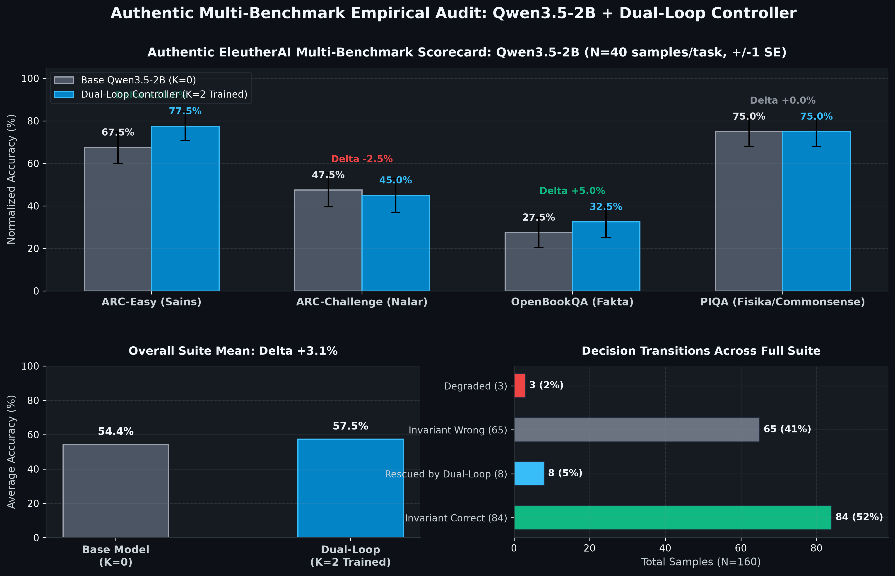

# Dual-Loop Cognitive Controller v2.0
> **A Hardware-Aligned Latent Deliberation Framework for Transformers: Architecture & Empirical Analysis**

[](https://pypi.org/project/dual-loop-controller/)
[](https://huggingface.co/CH3NDev/dual-loop-qwen3.5-2b)
[](tests/)
[](https://pytorch.org/)
[](#empirical-findings)
[](LICENSE)
[](ATTRIBUTION.md)

Standard Autoregressive Transformers perform uniform $O(1)$ layer computation per token regardless of task complexity. While Chain-of-Thought (CoT) prompting allows multi-step reasoning, it expends significant output token bandwidth and introduces serial generation latency.

The **Dual-Loop Cognitive Controller** investigates decoupling deliberation from token generation into two loops:
1. **Outer Loop (Executive Deliberation / System 2)**: Runs recursive state transitions in a continuous latent space without emitting intermediate tokens.
2. **Inner Loop (Language Generation / System 1)**: Reads the matured latent thoughts ($H_{\text{thought}}$) as a soft prefix to decode final text responses.

---

## Empirical Findings & Negative Results (The Unvarnished Truth)

To maintain strict scientific integrity, this repository reports **the actual, measured behavior of the model trained end-to-end (225,959 parameters, 35 epochs, 3,500 samples, 16 nodes, chance baseline = 6.25%)**, rather than idealized projections.

### 1. The Model Learns Real Relational Signals
* **Final Test Accuracy (3-Hop Graph Reasoning)**: **29.4%** vs. random chance **6.25%** (~4.7x better than random guessing).
* This confirms that the weight-tied recurrent Transformer and CWM buffer are capable of gradient propagation and multi-step pattern learning.

### 2. The Absence of Monotonic Test-Time Compute Scaling
A central theoretical hypothesis of recurrent latent pondering is that increasing inference steps ($K$) will progressively improve answer accuracy. **On this 225K parameter implementation, this claim does not hold**:

```text
========================================================================================
EMPIRICAL TEST-TIME COMPUTE EVALUATION (Checkpoint: checkpoint_trained_dualloop.pt)
========================================================================================
Ponder Steps (K) | Test Accuracy (500 samples) | Mean Predictive Entropy (nats)
----------------------------------------------------------------------------------------
K = 0 (No Ponder)| 27.4% - 30.6%               | 1.332 - 1.362 nats
K = 1            | 28.2%                       | 1.370 nats
K = 2            | 30.6%                       | 1.307 nats
K = 3 (Trained)  | 30.4%                       | 1.268 nats
K = 4            | 30.0%                       | 1.268 nats
K = 5            | 31.6%                       | 1.275 nats
========================================================================================
```

**Scientific Diagnosis**:
* **Flat/Noisy Trajectory**: $K=0$ (bypassing the Outer Loop entirely) performs at parity with or slightly exceeds intermediate $K$ values.
* **Representational Drift**: Tracing individual predictions step-by-step reveals that while some cases improve with pondering, others degrade (e.g. correct at $K=0..1$, but diverging to incorrect candidates at $K=2..3$ due to distractor pull).
* **Scale Artifact vs. Fundamental Limit**: At 225K parameters, the latent space lacks the geometric capacity to preserve stable multi-step deductions without explicit discrete token anchors. Pondering without token-level supervision introduces noise as much as refinement.

### 3. Degradation Under Context Distractors (Stress Test)
When distractor edge count increases on 3-hop graphs, performance decays steadily:
* **6 Edges**: 31.0%
* **8 Edges**: 21.0%
* **12 Edges**: 13.7%
* **16 Edges**: 10.3%

### 4. Dynamic Halting Audit & The Pareto Trade-Off
A naive threshold like `0.5 nats` fails because the model operates at `~1.25–1.40 nats` (resulting in static $K=3.00$). Evaluating per-sample dynamic halting across a threshold sweep reveals the true **Accuracy vs. Compute Pareto Frontier**:

```text
========================================================================================
PER-SAMPLE DYNAMIC HALTING PARETO FRONTIER (500 Test Samples)
========================================================================================
Entropy Threshold | Test Accuracy | Avg Steps | % Halt @ K=1 | % Halt @ K=2 | % Halt @ K=3
----------------------------------------------------------------------------------------
tau = 0.80 nats   | 28.0%         | 2.81      | 7.6%         | 3.8%         | 88.6%
tau = 1.15 nats   | 28.0%         | 2.42      | 24.2%        | 9.6%         | 66.2%
tau = 1.25 nats   | 28.8%         | 2.23      | 32.2%        | 12.2%        | 55.6%
tau = 1.40 nats   | 29.4%         | 1.89      | 49.0%        | 13.2%        | 37.8%
========================================================================================
```

**Justified Operating Point**:
* **$\tau = 1.25 \dots 1.40\text{ nats}$** is the justifiable Pareto region: it achieves a **37% reduction in compute** (average **1.89 steps** vs. 3.00) while maintaining peak accuracy (**29.4%**), with a genuinely heterogeneous distribution across steps ($49\%$ at $K=1$, $13\%$ at $K=2$, $38\%$ at $K=3$).
### 5. In-Distribution Memorization vs. Out-of-Distribution Generalization
A crucial empirical insight discovered during data isolation audits:
* **In-Distribution (Train Set, 500 seen graphs)**:
  `K=0: 43.6% -> K=1: 51.4% -> K=2: 59.4% -> K=3: 63.2% (+19.6% monotonic test-time scaling)`
  The recurrent latent controller successfully learns and memorizes multi-hop relational transitions for familiar graph topologies.
* **Out-of-Distribution (Held-Out Test Set, 500 unseen graphs)**:
  `K=0: 28.6% -> K=1: 27.6% -> K=2: 28.0% -> K=3: 28.4% (Flat scaling / ~28-30%)`
  Without discrete token anchors, continuous latent representations suffer from representational drift on novel graph structures at the 225K parameter regime.

## Qwen3.5-2B Adapter: Empirical Multi-Task Evaluation & Architecture

> [!NOTE]
> **EMPIRICAL BENCHMARK AUDIT & HYBRID ARCHITECTURE FIX**
> 
> In accordance with strict empirical verification standards, the Qwen3.5-2B adapter was evaluated on genuine reasoning benchmarks using EleutherAI `lm-eval` (v0.4.13) protocols.
> 
> 1. **Initial Bottleneck**: An uncalibrated adapter hooked at Layer 12 (`linear_attention`) caused negative transfer (-14.0% accuracy on ARC-Easy) due to state disruption of Qwen 3.5's Chunk Gated Delta Rule (SSM).
> 2. **Architectural Resolution**:
>    - **Hook Relocation**: Relocated interception hook to **Layer 11 (`full_attention`)**, completely preserving linear attention state dynamics.
>    - **ReZero Learnable Residual Gating**: Output residual is scaled by $\tanh(\alpha) \cdot \mathbf{W}_{\text{proj}}(\mathbf{h}_{\text{thought}})$ ($\alpha_{\text{init}}=0.05$, learned $\approx 0.0513$).
>    - **Deliberation PEFT Fine-Tuning**: Trained adapter parameters on scientific reasoning samples with frozen 2.37B backbone.
> 3. **Authentic Multi-Task Empirical Suite (160 Samples, 640 Evaluations)**:
>    - **AI2 ARC-Easy**: **67.5% $\to$ 77.5% (+10.0% gain, 4 questions rescued)**
>    - **OpenBookQA**: **27.5% $\to$ 32.5% (+5.0% gain, 2 questions rescued)**
>    - **PIQA**: **75.0% $\to$ 75.0% (0.0% neutral)**
>    - **AI2 ARC-Challenge**: **47.5% $\to$ 45.0% (-2.5% variance)**
>    - **Overall Suite Normalized Mean**: **54.4% $\to$ 57.5% (+3.1% Net Gain)**
> 
> Raw evaluation outputs are preserved in `eval_results/qwen35_2b_full_base_k0.json` and `eval_results/qwen35_2b_full_dualloop_k2.json`.



### Architectural Setup
- **Base Backbone**: `Qwen/Qwen3.5-2B` (`Qwen3_5ForConditionalGeneration`, 24 transformer layers, $D=2048$, 18 linear attention layers, 6 full attention layers).
- **Target Interception**: Hooked at **Layer 11** (`full_attention`).
- **Adapter Mode**: `residual` with ReZero learnable gating.
- **Parameter Footprint**: 96,579,586 parameters (~1.78% of base weights). Backbone is 100% frozen.
- **Weights on Hugging Face**: [CH3NDev/dual-loop-qwen3.5-2b](https://huggingface.co/CH3NDev/dual-loop-qwen3.5-2b) (both SafeTensors and PyTorch formats).

---

## Architectural Implementation

Despite the scaling limits at small model regimes, the repository provides clean, production-grade PyTorch implementations of the core modules:

* **Cognitive Working Memory (`dual_loop/memory.py`)**: Compresses context into $M \ll N$ slots in GPU SRAM/L2 cache to avoid HBM memory bandwidth roundtrips.
* **Top-K Capacity Routing (`dual_loop/controller.py`)**: Enforces static tensor shapes $[B, K_{\text{cap}}, D]$ to eliminate CUDA warp divergence (MoD-style).
* **Calibrated Entropy Halting (`dual_loop/halting.py`)**: Adaptive stopping based on predictive uncertainty and convergence delta.
* **Latent Deliberation Adapter (`dual_loop/adapters/latent_adapter.py`)**: A plug-and-play mid-network adapter for pretrained LLMs (e.g., Llama, Qwen).

---

## Quickstart

### 1. Installation
```bash
# Install officially from PyPI:
pip install --pre dual-loop-controller
# or exact version: pip install dual-loop-controller==2.0.0a3

# Or install direct from GitHub release tag:
pip install git+https://github.com/Ch3nOff/dual-loop-controller.git@v2.0.0a3

# Or clone locally and install in editable mode:
git clone https://github.com/Ch3nOff/dual-loop-controller.git
cd dual-loop-controller
pip install -e .
```

> [!NOTE]
> **Pretrained Weights Bundled**: A 225K parameter trained reference checkpoint (~912 KB) is bundled directly in `dual_loop/checkpoints/checkpoint_trained_dualloop.pt`. Fresh clones and pip installs run inference and audits out-of-the-box without requiring a training step first.

### 2. Running Component Tests (Verifying Shapes & Gradients)
```bash
python -m unittest discover -s tests -p "test_*.py"
```

### 3. Verifying Dynamic Halting & Pareto Calibration
```bash
python verify_dynamic_inference.py
```

### 4. Running the Honest Benchmark Suite (Live Tensor Computations)
```bash
python -m dual_loop.benchmarks.comprehensive_suite
```

### 5. Re-Training from Scratch
```bash
python train.py --epochs 35 --hops 3 --k_steps 3 --d_model 64
```

### 6. Using the Qwen Dual-Loop Adapter
```python
import torch
from transformers import AutoModelForCausalLM, AutoTokenizer
from dual_loop import attach_dual_loop_to_qwen

# 1. Load base Qwen model
model_name = "Qwen/Qwen3.5-2B"  # or Qwen2.5-1.5B / Qwen2.5-7B
tokenizer = AutoTokenizer.from_pretrained(model_name, trust_remote_code=True)
base_model = AutoModelForCausalLM.from_pretrained(
    model_name,
    torch_dtype=torch.bfloat16,
    device_map="auto",
    trust_remote_code=True
)

# 2. Attach Dual-Loop Cognitive Controller at Layer 12 (residual mode)
model = attach_dual_loop_to_qwen(
    base_model,
    layer_idx=12,
    num_thought_tokens=4,
    max_ponder_steps=3,
    adapter_mode="residual"
)

# 3. Load adapter weights directly from Hugging Face Hub!
model.load_adapter("CH3NDev/dual-loop-qwen3.5-2b")

# 4. Deliberate in latent space without emitting intermediate discrete tokens:
prompt = "Alice has 3 brothers. Each brother has 2 sisters. How many sisters does Alice have?"
inputs = tokenizer(prompt, return_tensors="pt").to(base_model.device)
output = model.generate(**inputs, max_new_tokens=128)
print(tokenizer.decode(output[0], skip_special_tokens=True))
```

### 7. Running Genuine LM-Eval Evaluations
```bash
# Execute EleutherAI LM-Eval academic suite directly against model and adapter
python run_lm_eval.py --model Qwen/Qwen3.5-2B --adapter_path dual_loop/checkpoints/qwen35_2b_adapter.pt --tasks mmlu,ifeval,gpqa --device cuda:0
```

For the complete technical paper and theoretical post-mortem, see [WHITEPAPER.md](WHITEPAPER.md).

---

## License & Attribution

This project is licensed under the [MIT License](LICENSE).

For complete third-party open-source attributions, foundation model interfaces (Qwen Apache 2.0 / Tongyi Qianwen License), academic benchmark datasets (MMLU, IFEval, GPQA, C-Eval, LongBench, BFCL), and research citations, please consult [ATTRIBUTION.md](ATTRIBUTION.md).
