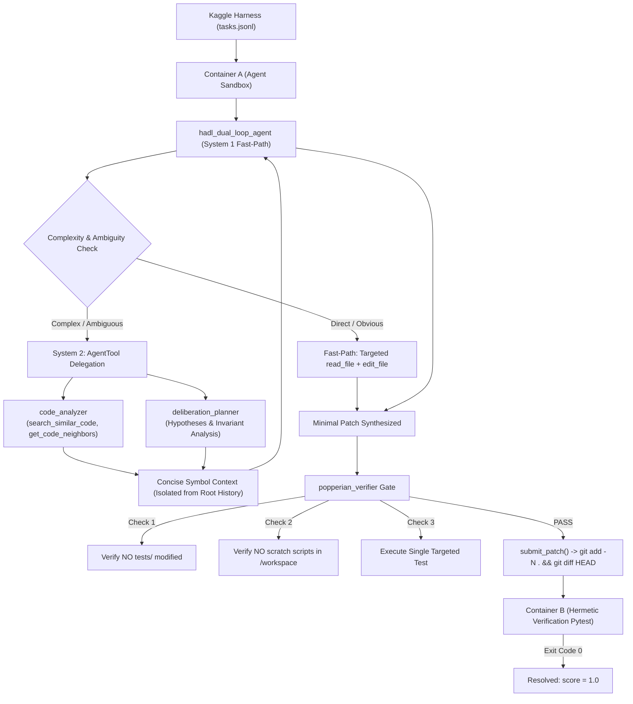

# Gemma 4 Developer Agent Competition: HADL Architecture & Competitor Guide

> **Author**: Matthew Chen (Ch3nOff)  
> **System**: Hardware-Aligned Autopoietic Latent Deliberation (HADL v2.5.0)  
> **Target**: Google - The Gemma 4 Developer Agent Competition (Kaggle)

---

## 1. Executive Summary

This workspace now contains the complete, production-ready implementation of the **HADL Dual-Loop Autonomous Software Engineering Agent** tailored specifically for Google's **Gemma 4 Developer Agent Competition** on Kaggle.

The implementation complies with all official constraints from Google DeepMind's `swegemma`, `adk-submission`, and `adk-eval-core` evaluation harnesses:
- **Declarative Google ADK Architecture**: Zero arbitrary unvetted Python entrypoints; full declarative configuration with sub-agents and tool bindings.
- **Strict Single Base Model Rule**: Shared base model alias (`gemma-4-31b-it-qat-w4a16-ct`) across all sub-agents.
- **Multi-LoRA Serving**: Specialized adapters for code synthesis (`main_lora`) and deep cognitive reasoning (`deliberation_lora`).
- **Resilient Context Management**: `AgentTool` encapsulation prevents context overflow during complex AST symbol navigation.
- **Hermetic Invariant Verification**: The Popperian Verifier ensures that `tests/` are never touched and temporary scripts never leak into `git diff`.

---

## 2. Workspace Directory Structure

```text
X-Star/
├── gemma4_hadl_agent/                    # Validated Submission Package (< 3 GiB)
│   ├── agent.yaml                        # Master Google ADK declarative configuration
│   ├── eval_config.yaml                  # Evaluation timeouts and tool call budgets
│   ├── configs/
│   │   └── sampling.yaml                 # Decoding params & thinking budget (4096 tokens)
│   ├── prompts/
│   │   ├── system.md                     # System 1 / System 2 root instructions
│   │   ├── analyzer.md                   # Fast AST & symbol localization
│   │   ├── deliberation.md               # Latent deliberation & invariant analysis
│   │   └── popperian.md                  # Red-team verification & test safety gate
│   ├── sub_agents/
│   │   ├── code_analyzer.yaml            # Sub-agent: Read-only symbol search
│   │   ├── deliberation_planner.yaml     # Sub-agent: System 2 reasoning planner
│   │   └── popperian_verifier.yaml       # Sub-agent: Pre-submission invariant check
│   └── adapters/
│       ├── main_lora/                    # PEFT LoRA weights for minimal code edits
│       └── deliberation_lora/            # PEFT LoRA weights for hypothesis generation
├── scripts/
│   ├── validate_adk_submission.py        # Strict pre-submission linter & packager
│   ├── train_gemma4_hadl_adapter.py      # Post-training pipeline for Gemma 4 LoRA
│   └── run_local_swe_benchmark.py        # Local benchmark runner & task inspector
├── competition/
│   ├── tasks.jsonl                       # 129 SWE-bench benchmark tasks
│   ├── docker/                           # Evaluation sandbox Dockerfiles
│   └── sandbox/                          # Container setup & dependency discovery
├── docs/
│   ├── GEMMA4_COMPETITION_GUIDE.md       # This comprehensive handbook
│   └── RESEARCH_PAPER_GEMMA4_HADL.md     # Official Paper Track submission
└── submission.zip                        # Ready-to-upload archive for Kaggle
```

---

## 3. HADL Dual-Loop Operational Pipeline



---

## 4. How to Use the Pipeline

### 4.1. Validate & Package `submission.zip`
Before uploading to Kaggle, run the automated validator:
```bash
.venv\Scripts\python.exe scripts/validate_adk_submission.py --dir gemma4_hadl_agent --output submission.zip
```
This checks:
1. Root configuration discovery (`agent.yaml`).
2. Maximum unpacked size constraint (`< 3 GiB`).
3. Permitted file extensions only (`.yaml`, `.yml`, `.md`, `.txt`, `.py`, `.json`, `.safetensors`).
4. Single Base Model Rule across all agents.
5. Path traversal security in all `!include` directives.

### 4.2. Inspect Benchmark Tasks Locally
To explore the 129 tasks from FastAPI, Rich, Requests, and HTTPX:
```bash
# View task distribution across repositories
.venv\Scripts\python.exe scripts/run_local_swe_benchmark.py --inspect

# Inspect a specific task and its ground-truth patch
.venv\Scripts\python.exe scripts/run_local_swe_benchmark.py --inspect --task-id fastapi_15661
```

### 4.3. Post-Train LoRA Adapters for Gemma 4
To fine-tune or re-train the LoRA weights on GPU:
```bash
# Train main coder adapter
.venv\Scripts\python.exe scripts/train_gemma4_hadl_adapter.py --base-model gemma-4-31b-it-qat-w4a16-ct --adapter-name main_lora --epochs 3

# Train deliberation hypothesis planner adapter
.venv\Scripts\python.exe scripts/train_gemma4_hadl_adapter.py --base-model gemma-4-31b-it-qat-w4a16-ct --adapter-name deliberation_lora --epochs 3
```

---

## 5. Critical Competition Gotchas & Best Practices

1. **Never Touch `tests/`**:
   The verification harness explicitly resets all test files modified by `task.test_patch` (`git checkout HEAD -- <target_test_files>`). Modifying tests is discarded and causes evaluation failure.
2. **Never Put Scratch Scripts in `/workspace`**:
   Because `submit_patch()` runs `git add -N . && git diff HEAD`, untracked files in `/workspace` are included in the patch. Always put temporary reproduction scripts in `/tmp/repro.py`!
3. **Never Run Full-Repo Pytest**:
   Running bare `pytest` takes several minutes, times out the sandbox, and exhausts your turn budget. Always run targeted tests with `-k` or specific file paths (e.g. `pytest tests/test_routing.py -k test_custom_route`).
4. **Isolate Token Usage via `AgentTool`**:
   Using `agent_tool` with `skip_summarization: true` allows sub-agents to read large files and perform graph searches without dumping thousands of tokens into the root agent's conversation history.
5. **Always Finish with `submit_patch()`**:
   `submit_patch()` is free (does not count toward the `tool_calls` budget). Once submitted and the turn completes, the harness proceeds directly to verification.
