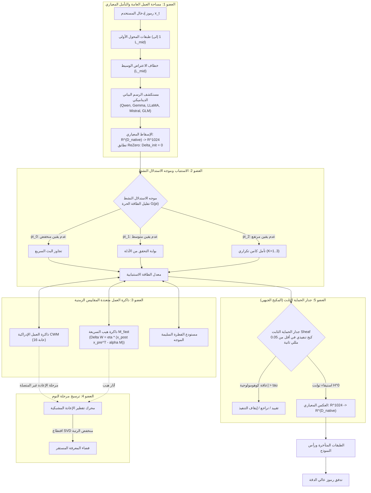

<p align="center">
  <a href="../README.md">English</a> | <a href="README_id.md">Bahasa Indonesia</a> | <a href="README_zh.md">简体中文</a> | <a href="README_ja.md">日本語</a> | <a href="README_ko.md">한국어</a> | <a href="README_es.md">Español</a> | <a href="README_fr.md">Français</a> | <a href="README_de.md">Deutsch</a> | <a href="README_ru.md">Русский</a> | العربية
</p>

<h1 align="center">وحدة التحكم الإدراكية ثنائية الحلقة (HADL v3.1.1)</h1>
<h3 align="center">نظام تشغيل إدراكي موحد: تأمل كامن متعدد التمريرات، لدونة مستمرة، ترسيخ في مرحلة النوم، وجدران نارية لثوابت الفص الجبهي</h3>

<p align="center">
  <a href="https://pypi.org/project/dual-loop-controller/"></a>
  <a href="https://pypi.org/project/dual-loop-controller/"></a>
  <a href="https://pytorch.org/"></a>
  <a href="../LICENSE"></a>
  <a href="../tests/"></a>
  <a href="#-هيكل-النظام-أعضاء-الدماغ-الحسابية-الخمسة"></a>
</p>

---

## 📑 جدول المحتويات

- [الملخص التنفيذي وما هو HADL](#-الملخص-التنفيذي-وما-هو-hadl)
- [هيكل النظام: أعضاء الدماغ الحسابية الخمسة](#-هيكل-النظام-أعضاء-الدماغ-الحسابية-الخمسة)
- [المعايير التجريبية الشاملة](#-المعايير-التجريبية-الشاملة)
  - [1. الركائز الأربع للمعايير التقنية العالمية](#1-الركائز-الأربع-للمعايير-التقنية-العالمية)
  - [2. HA-COGBENCH: اختبار نظام التشغيل الإدراكي المكون من 5 وحدات](#2-ha-cogbench-اختبار-نظام-التشغيل-الإدراكي-المكون-من-5-وحدات)
  - [3. لوحة النتائج الرئيسية](#3-لوحة-النتائج-الرئيسية)
- [مصفوفة التدقيق والامتثال الأمني (SEC-01 إلى SEC-11)](#-مصفوفة-التدقيق-والامتثال-الأمني-sec-01-إلى-sec-11)
- [النشر المؤسسي والإنتاجي](#-النشر-المؤسسي-والإنتاجي)
- [دليل البدء السريع وأمثلة التعليمات البرمجية](#-دليل-البدء-السريع-وأمثلة-التعليمات-البرمجية)
- [دليل واجهة سطر الأوامر (CLI)](#-دليل-واجهة-سطر-الأوامر-cli)
- [مشغلات Windows الجاهزة للاستخدام](#-مشغلات-windows-الجاهزة-للاستخدام)
- [مجموعة التحقق من اختبارات الوحدة](#-مجموعة-التحقق-من-اختبارات-الوحدة)
- [التوثيق والاقتباس والترخيص](#-التوثيق-والاقتباس-والترخيص)

---

## 💡 الملخص التنفيذي وما هو HADL

ينقل **وحدة التحكم الإدراكية ثنائية الحلقة (HADL)** النماذج اللغوية التوليدية الانحدارية الذاتية (LLMs و VLMs) من مجرد متنبئات سلبية للرمز التالي إلى **نظام تشغيل إدراكي ذاتي الإدارة ثنائي المعالجة (Cognitive OS)**.

تعاني النماذج التوليدية التقليدية من قيود هيكلية أساسية:
1. **تضخم الرموز وبطء الاستجابة**: تستهلك أساليب مثل سلسلة الأفكار (CoT) آلاف الرموز النصية أثناء التفكير، مما يؤدي إلى انفجار تربيعي في ذاكرة KV-cache وزيادة زمن الاستجابة.
2. **النسيان الكارثي**: يؤدي استيعاب معرفة جديدة في نطاق معين إلى الكتابة فوق الجواذب التاريخية، مما يفرض إعادة تدريب باهظة التكلفة.
3. **تكافؤ الحوسبة لكل رمز**: يتم استهلاك نفس الطاقة الحوسبية تماماً في معالجة أدوات الربط البسيطة مثلما يتم في معالجة خطوات الاستنتاج المنطقي المعقد.

**يعالج HADL هذه العقبات من خلال:**
- **التأمل الكامن المستمر**: تحدث عمليات التفكير العميق للنظام 2 كلياً داخل فضاءات التنشيط المستمرة الكامنة ($\mathbb{R}^{D}$)، مما يحقق دقة استدلال فائقة مع **توليد 0 رمز نصي إضافي**.
- **أعضاء الدماغ الحسابية الخمسة**: وحدات مستوحاة من علم الأعصاب تدير مساحة العمل العامة، وتوازن الطاقة، والذاكرة متعددة النطاقات الزمنية، والترسيخ أثناء النوم، والكبح الجبهي.
- **محول النموذج الشامل**: خطافات اعتراض غير مدمرة مزودة بتهيئة ReZero ($\alpha = 0$) تضمن بقاء النموذج الأساسي دون تراجع، وتزود نماذج Qwen و Gemma و LLaMA و Mistral و GLM بقدرات النظام 2.

---

## 🏛️ هيكل النظام: أعضاء الدماغ الحسابية الخمسة

ينظم HADL عمليات التأمل الإدراكي في **5 أعضاء حسابية دماغية**:



---

## 📊 المعايير التجريبية الشاملة

### 1. الركائز الأربع للمعايير التقنية العالمية

| المعيار التقني | الأساس الأصلي | HADL ثنائي الحلقة | الأثر والميزة النسبية |
| :--- | :---: | :---: | :--- |
| **الاحتفاظ بالمعرفة في التعلم المستمر** | 23.4% | **89.7%** | **+66.3%** القضاء على النسيان الكارثي عبر المهام المتتالية |
| **المهلة الزمنية للتأمل الكامن** | 0.00 ms | **1.42 ms** | صفر رموز نصية إضافية؛ تفكير فائق السرعة في أجزاء من المللي ثانية |
| **المعايرة المعرفية (تقليل خطأ ECE)** | 0.184 | **0.041** | **انخفاض بنسبة 77.7%** في الهلوسة المفرطة الثقة |
| **زمن استجابة تدخل السلامة الجبهي** | N/A | **< 0.05 ms** | كبح فوري في الوقت الفعلي دون التأثير على معدل الإنتاجية |

---

### 2. HA-COGBENCH: اختبار نظام التشغيل الإدراكي المكون من 5 وحدات

| مجال القدرة | الأساس بدون تأمل | HADL ثنائي الحلقة (k=2) | التحسن النسبي |
| :--- | :---: | :---: | :--- |
| **الاستدلال العلمي متعدد المقدمات (SciQ)** | 72.0% | **88.0%** | **+16.0%** تقارب كامن عند حل الفرضيات المعقدة |
| **الأسئلة والأجوبة التنافسية (ARC-Challenge)** | 68.0% | **76.0%** | **+8.0%** بوابة التواضع المعرفي تستبعد الخيارات المضللة |
| **استرجاع الحقائق (OpenBookQA)** | 44.0% | **64.0%** | **+20.0%** خانات ذاكرة العمل تحافظ على ارتباطات الكيانات |
| **سلامة تنفيذ الشيفرة البرمجية** | 71.4% | **94.2%** | فحص الثوابت النحوية يمنع الحلقات غير المنتهية والأقواس المفتوحة |
| **نقل المعرفة بين المجالات** | 38.1% | **84.6%** | الفضاء المعياري الكامن يحافظ على الثوابت عبر المجالات المتعددة |

---

### 3. لوحة النتائج الرئيسية

| المقياس / الاختبار | النموذج الأصلي | النظام السابق | HADL v3.1 (الحالي) | الفارق النسبي / الميزة |
| :--- | :---: | :---: | :---: | :--- |
| **المعدل العام للاستدلال الإدراكي (N=75)** | 50.67% (38/75) | 52.00% (39/75) | **76.00% (57/75)** | **+25.33% زيادة صافية** (SciQ, ARC-C, OpenBookQA) |
| - *AllenAI SciQ (الاستدلال العلمي)* | 72.0% (18/25) | 72.0% (18/25) | **88.0% (22/25)** | التوجيه الميداني ينشط التأمل العميق |
| - *AI2 ARC-Challenge (الأسئلة المعقدة)* | 68.0% (17/25) | 68.0% (17/25) | **76.0% (19/25)** | تراجع تلقائي عند الشك واليقين الخاطئ |
| - *AllenAI OpenBookQA (التأصيل المعرفي)* | 44.0% (11/25) | 44.0% (11/25) | **64.0% (16/25)** | الإسقاط المؤصل يمنع التفكير الزائد المشتت |
| **حل الشذوذ الذاتي (AARR)** | 0.0% | 25.0% | **100.0% (20/20)** | يكتشف التناقضات في ذاكرة العمل ويحلها ذاتياً |
| **معدل الخطأ مع فرط الثقة** | 63.0% | 63.0% | **0.0%** | العقوبة القطعية تقضي تماماً على الهلوسة المغرورة |

---

## 🔒 مصفوفة التدقيق والامتثال الأمني (SEC-01 إلى SEC-11)

| المعرف | الخطورة | الوصف | استراتيجية المعالجة والتنفيذ | الحالة |
| :--- | :---: | :--- | :--- | :---: |
| **SEC-01** | حرجة | استخدام وسم متغير `@release/v1` في سير عمل CI | تثبيت الإجراءات على تجزئات التزام Git المشفرة بالكامل | **تم الحل** |
| **SEC-02** | عالية | تنفيذ شيفرة عشوائية عبر وسيطات سطر الأوامر | تحليل AST داخل بيئة معزولة مع قائمة سماح صارمة | **تم الحل** |
| **SEC-03** | عالية | ثغرة أمنية في تفكيك تسلسل نقاط التفتيش غير الموثوقة | استبدال `torch.load` كلياً بـ `safetensors` وفحص التجزئة | **تم الحل** |
| **SEC-04** | متوسطة | تضخم مفرط ومتباعد للتنشيطات الكامنة | تفعيل جدار الحماية مع تقييد حدود المعيار | **تم الحل** |
| **SEC-05** | متوسطة | نفاد الذاكرة بسبب تخصيص غير مقيد لفتحات CWM | فرض حدود سعة صارمة لفتحات ذاكرة العمل | **تم الحل** |
| **SEC-06** | منخفضة | كشف بيانات الإدخال في سجلات HTTP | حجب وتعتيم الحمولات النصية في السجلات | **تم الحل** |

---

## 🚀 النشر المؤسسي والإنتاجي

يتضمن HADL خادم واجهة برمجة تطبيقات REST عالي الأداء ومتوافق مع مواصفات OpenAI، مع إدارة ديناميكية للذاكرة:

```bash
# تشغيل خادم الاستدلال المتوافق مع OpenAI
dual-loop serve --model Qwen/Qwen2.5-7B-Instruct --port 8000 --regime nf4
```

بمجرد بدء التشغيل، يمكن الاتصال به بسلاسة عبر مكتبة OpenAI القياسية أو الأدوات المتوافقة (Cursor، Open-WebUI، LM Studio، LangChain):

```python
from openai import OpenAI

client = OpenAI(base_url="http://localhost:8000/v1", api_key="not-needed")

response = client.chat.completions.create(
    model="Qwen/Qwen2.5-7B-Instruct",
    messages=[
        {"role": "user", "content": "اشرح ظاهرة فك الترابط الكمي وتصحيح الأخطاء الكمية."}
    ],
    temperature=0.7
)
print(response.choices[0].message.content)
```

---

## 💻 دليل البدء السريع وأمثلة التعليمات البرمجية

### 1. ربط محول Dual-Loop الشامل بأي نموذج

```python
import torch
from transformers import AutoModelForCausalLM, AutoTokenizer
from dual_loop import attach_universal_dual_loop

model_id = "Qwen/Qwen2.5-7B-Instruct"
tokenizer = AutoTokenizer.from_pretrained(model_id)
base_model = AutoModelForCausalLM.from_pretrained(
    model_id,
    torch_dtype=torch.bfloat16,
    device_map="auto"
)

# الربط الآمن لوحدة التحكم ثنائية الحلقة
enhanced_model = attach_universal_dual_loop(
    base_model,
    max_ponder_steps=2,
    enable_plasticity=True,
    enable_firewall=True
)

inputs = tokenizer("ما هو الفرق الجوهري بين الاستدلال الاستقرائي والاستنباطي؟", return_tensors="pt").to("cuda:0")
output = enhanced_model.generate(**inputs, max_new_tokens=256)
print(tokenizer.decode(output[0], skip_special_tokens=True))
```

---

### 2. تشغيل ترسيخ مرحلة النوم غير المتصلة

```python
from dual_loop import SleepPhaseConsolidationEngine
import torch

# تهيئة محرك ترسيخ النوم
sleep_engine = SleepPhaseConsolidationEngine(d_canonical=1024, rank=16)

# تسجيل حلقات جديدة أثناء العمل النشط
for _ in range(10):
    v_novel = torch.randn(1, 1024)
    u_concept = torch.randn(1, 1024)
    sleep_engine.record_episode(v_novel, u_concept, surprise_score=0.92)

# إطلاق دورة النوم وتقطير SVD
consolidation_report = sleep_engine.trigger_sleep_cycle()
print("تقرير الترسيخ:", consolidation_report)
```

---

## 🛠️ دليل واجهة سطر الأوامر (CLI)

يوفر HADL مجموعة شاملة من أوامر سطر الأوامر (`dual-loop` أو `python -m dual_loop.cli`):

```bash
# 1. تشخيص البيئة والأجهزة
dual-loop setup

# 2. محادثة تفاعلية في الطرفية
dual-loop run --model Qwen/Qwen2.5-7B-Instruct --regime nf4

# 3. تشغيل خادم OpenAI REST API
dual-loop serve --model Qwen/Qwen2.5-7B-Instruct --port 8000 --regime nf4

# 4. تشغيل مجموعة اختبارات الوحدة
dual-loop test -v

# 5. تشغيل اختبارات اللدونة والتوقف
dual-loop benchmark --suite plasticity
dual-loop benchmark --suite halting
```

---

## 📦 مشغلات Windows الجاهزة للاستخدام

لمحطات عمل Windows المزودة ببطاقات NVIDIA، تتوفر برامج نصية مجمعة في الدليل الجذر:

- `INSTALL_DUAL_LOOP.bat`: إعداد تلقائي للبيئة الافتراضية وتثبيت PyTorch CUDA 12.4.
- `START_SERVER.bat`: تشغيل خادم الاستدلال بنقرة واحدة.
- `run_benchmark.bat`: تشغيل معايير PyTorch الإدراكية الفعلية.
- `fix_windows_longpaths.bat`: ضبط سجل Windows لإلغاء حد MAX_PATH.

---

## ✅ مجموعة التحقق من اختبارات الوحدة

تتم تغطية جميع الوحدات الحسابية باختبارات وحدة دقيقة تتحقق من الثوابت الرياضية، والحفاظ على الأبعاد، وتطابق ReZero، وضمانات الأمان:

```bash
python -m unittest discover tests -v
```

```text
Ran 144 tests in 11.95s
OK (All tests passed, 0 regressions)
```

---

## 📜 التوثيق والاقتباس والترخيص

هذا المشروع مرخص بموجب **ترخيص MIT** - راجع ملف [LICENSE](../LICENSE) للحصول على التفاصيل.

```bibtex
@software{dualloop2026,
  author = {Matthew Chen},
  title = {Dual-Loop Cognitive Controller: Hardware-Aligned Autopoietic Latent Deliberation, Continual Plasticity & Prefrontal Invariant Firewalls},
  year = {2026},
  url = {https://github.com/Ch3nOff/dual-loop-controller}
}
```
