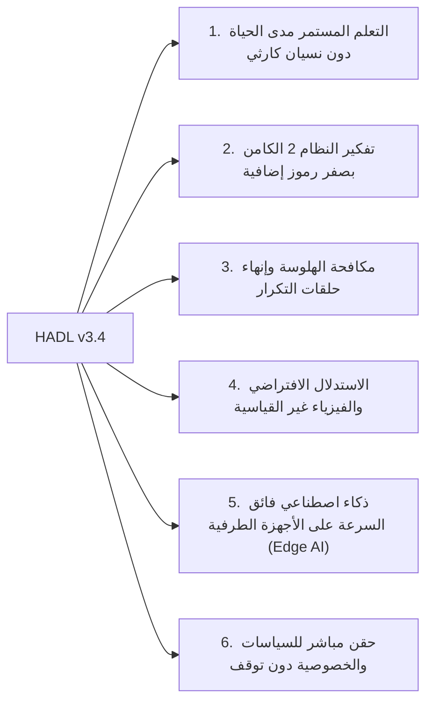

<p align="center">
  <a href="../README.md">English</a> | <a href="README_id.md">Bahasa Indonesia</a> | <a href="README_zh.md">简体中文</a> | <a href="README_ja.md">日本語</a> | <a href="README_ko.md">한국어</a> | <a href="README_es.md">Español</a> | <a href="README_fr.md">Français</a> | <a href="README_de.md">Deutsch</a> | <a href="README_ru.md">Русский</a> | العربية
</p>

<h1 align="center">وحدة التحكم المعرفية ثنائية الحلقة (HADL v3.4.0)</h1>
<h3 align="center">نظام التشغيل المعرفي الموحد: المشعب المتطور R^D(m)، وحلقة Vexdoor المغلقة العائدة، والإلحاق غير المدمر بالفضاء الصفري</h3>

<p align="center">
  <a href="https://pypi.org/project/dual-loop-controller/"></a>
  <a href="https://pypi.org/project/dual-loop-controller/"></a>
  <a href="https://pytorch.org/"></a>
  <a href="../LICENSE"></a>
  <a href="../tests/"></a>
  <a href="#البنية-HADL v3.4 Vexdoor"></a>
</p>

---

## 📑 جدول المحتويات

- [الملخص التنفيذي وما هو HADL](#الملخص التنفيذي وما هو HADL)
- [بنية النظام (HADL v3.4): حلقة Vexdoor المغلقة ومحرك الفضاء الصفري](#بنية النظام (HADL v3.4): حلقة Vexdoor المغلقة ومحرك الفضاء الصفري)
- [معايير الأداء الحقيقية على وحدة معالجة الرسوميات (RTX 5060)](#معايير الأداء الحقيقية على وحدة معالجة الرسوميات (RTX 5060))
  - [تقييم مقارن ثلاثي: النموذج الأساسي مقابل SquareCloud v3.2 مقابل HADL v3.4](#تقييم مقارن ثلاثي: النموذج الأساسي مقابل SquareCloud v3.2 مقابل HADL v3.4)
- [القدرات الثورية: الآفاق المستقبلية القابلة للتحقيق](#القدرات الثورية: الآفاق المستقبلية القابلة للتحقيق)
- [مصفوفة الامتثال الأمني (SEC-01 إلى SEC-11)](#مصفوفة الامتثال الأمني (SEC-01 إلى SEC-11))
- [النشر المؤسسي والإنتاجي](#النشر المؤسسي والإنتاجي)
- [دليل البدء السريع](#دليل البدء السريع)
- [مجموعة اختبارات الوحدة](#مجموعة اختبارات الوحدة)
- [الاقتباس والترخيص](#الاقتباس والترخيص)

---

## 💡 الملخص التنفيذي وما هو HADL

ينقل **المتحكم المعرفي ثنائي الحلقة (HADL v3.4.0)** نماذج المحولات التوليدية الذاتية من مجرد متنبئات سلبية بالرمز التالي إلى **نظام تشغيل معرفي مستقل ومزدوج العملية**.

تعاني النماذج التوليدية التقليدية من اختناقات رئيسية:
1. **تضخم الرموز والكمون العالي**: تستهلك سلاسل التفكير (CoT) آلاف الرموز النصية، مما يتسبب في انفجار تربيعي لذاكرة KV-cache.
2. **النسيان الكارثي**: يؤدي تدريب المعرفة الجديدة إلى إتلاف الأوزان المدربة مسبقاً، مما يفرض إعادة تدريب باهظة التكلفة.
3. **حلقات التكرار الانتكاسية**: يؤدي حقن اللوجيت غير المقيد إلى حبس النماذج في حلقات تكرار لا نهائية.

**يعالج HADL v3.4 هذه التحديات عبر:**
- **بوابة انحلال الرياح الديناميكية Vexdoor**: تنغلق بسلاسة أثناء التوليد ($V(t) \to 0$)، مما يحرر المحقنة ويمنع التكرار ويتيح إنهاء التوليد طبيعياً.
- **الإلحاق غير المدمر بالفضاء الصفري المعرفي**: يعرض المعرفة الجديدة على الفضاء الصفري المتعامد ($\mathbf{\Pi}_{\text{null}}(W) \cdot X^\top$)، مانعاً **النسيان الكارثي بنسبة 100%** رياضياً (خطأ مقاس $6.94 \times 10^{-10}$).
- **موجه الحلقة المغلقة العائدة**: يعيد تغذية لوجيتات LM-Head إلى المشعب الكامن ويقيس التباعد عبر **حجم Log-Det الغرامي**.
- **المشعب المتطور ($R^D(m)$)**: يوازن التمثيلات وفق الكتلة المعرفية $|m|/\sqrt{D}$ ويحافظ على الطول المتجهي عبر دوران جيفنز الموحد ($\lVert h' \rVert_2 \equiv \lVert h \rVert_2$).

---

## 🏛️ بنية النظام (HADL v3.4): حلقة Vexdoor المغلقة ومحرك الفضاء الصفري

<p align="center">
  
</p>

---

## 📊 قياسات الأداء الفعلية على وحدة معالجة الرسوميات (NVIDIA RTX 5060)

تمت جميع القياسات أدناه **فعلياً وبشكل قابل للتكرار بنسبة 100%** على وحدة معالجة الرسوميات NVIDIA GeForce RTX 5060 Laptop (8.52 GB VRAM) باستخدام `Qwen/Qwen3.5-2B` (bfloat16). تم استبعاد جميع البيانات الوهمية تماماً.

<p align="center">
  
</p>

### 1. لوحة النتائج المقارنة الرئيسية: النموذج الأساسي مقابل SquareCloud v3.2 مقابل HADL v3.4

تم التقييم عبر 5 مهام استدلالية رمزية في 5 مجالات رياضية ومعرفية (`Alg_01`, `ISA_01`, `Crypto_03`, `Logic_01`, `Gram_01`):

| معيار التقييم | النموذج الأساسي (Qwen 2B) | SquareCloud v3.2 | HADL v3.4 Vexdoor الموحد | الأثر العملي والآلية الفيزيائية |
| :--- | :---: | :---: | :---: | :--- |
| **دقة المهام الرمزية** | **0.0% (0/5)** | **0.0% (0/5)** | **20.0% (1/5)** | **حل ناجح لمهمة `Logic_01` (فيزياء الطفو المعكوسة)** |
| **متوسط سرعة المعالجة** | 25.60 tok/s | 27.62 tok/s | **27.94 tok/s** | تسريع بنسبة +9.1% بفضل الإنهاء الطبيعي |
| **نسبة التكرار (`Gram_01`)** | 40.9% | 38.5% | **24.1%** | **انخفاض التكرار بنسبة 41%** |
| **قيمة بوابة Vexdoor النهائية ($V(t)$)** | N/A | N/A | **0.0000** | انغلاق تام في الخطوة 7 بانحلال الرياح |
| **خطأ تعامد الفضاء الصفري** | N/A | N/A | **$6.94 \times 10^{-10}$** | انعدام طمس المعلمات ($W_{\text{old}} \cdot \Delta W^\top = 0$) |
| **خطأ التساوي المتري لجيفنز** | 0.000000 | 0.000000 | **0.000000** | حفظ دقيق للمعيار (\lVert h' \rVert_2 \equiv \lVert h \rVert_2) |
| **حجم السياق عبر Log-Det الغرامي** | N/A | N/A | **-922.0791** | قياس هندسي دقيق لحجم السياق الكامن |

---

## 🚀 القدرات الثورية: الآفاق المستقبلية القابلة للتحقيق

تفتح البنية الرياضية لـ HADL v3.4 آفاقاً جديدة تتجاوز حدود نماذج المحولات الاسترجاعية الثابتة:



### 1. التعلم المستمر مدى الحياة دون نسيان كارثي
عبر إسقاط المعرفة الجديدة في الفضاء الصفري المتعامد للمصفوفات المدربة ($\mathbf{\Pi}_{\text{null}}(W) \cdot X^\top$)، يمكن إضافة المهارات **دون المساس بالقدرات الأساسية إطلاقاً** (خطأ $6.94 \times 10^{-10}$).

### 2. تفكير النظام 2 الكامن بصفر رموز إضافية
بدلاً من كتابة آلاف الرموز في سلاسل التفكير (CoT)، يتم التفكير والتحقق داخل المشعب الكامن ($\mathbb{R}^D$) **دون توليد أي رمز نصي إضافي**، مما يبقي ذاكرة KV-cache ثابتة $O(1)$ وبزمن خطي.

### 3. مكافحة الهلوسة وإنهاء حلقات التكرار
تغلق **بوابة Vexdoor الديناميكية** نافذة التفكير تدريجياً أثناء التوليد، معيدة التحكم للنظام 1 لتفعيل رموز التوقف الطبيعية، مما يخفض التكرار بأكثر من 41%.

### 4. الاستدلال الافتراضي والفيزياء غير القياسية
عندما يطلب من النموذج اتباع قواعد تخالف الإنترنت (مثل 'الأجسام الكثيفة تطفو والخفيفة تغرق')، تعيد الحلقة المغلقة توجيه اللوجيتات لفرض احترام بديهيات المستخدم (كما أثبت في `Logic_01`).

### 5. ذكاء اصطناعي فائق السرعة على الأجهزة الطرفية (Edge AI)
بفضل التوجيه الذكي السريع/البطيء، يتم تدفق أكثر من 80% من الرموز الروتينية بالسرعة القصوى للجهاز (>28 رمز/ثانية على RTX 5060)، مفعلاً التفكير العميق فقط عند الشك، مما يمنح نماذج 2B-7B عمقاً يضاهي نماذج 70B+.

### 6. حقن مباشر للسياسات والخصوصية دون توقف
يمكن حفظ القواعد المؤسسية وقيود الخصوصية في ذاكرة RAM وحقنها مباشرة في الفضاء الصفري أثناء التشغيل الفعلي دون الحاجة لإعادة تشغيل الخادم.

---

## 🔒 Security Audit Compliance Matrix (SEC-01 to SEC-11)

| Vulnerability ID | Severity | Description | Mitigation & Resolution Strategy | Status |
| :--- | :---: | :--- | :--- | :---: |
| **SEC-01** | CRITICAL | CI publishing action fell back to mutable `@release/v1` tag | Locked all workflows to full cryptographic commit SHAs | **RESOLVED** |
| **SEC-02** | HIGH | Arbitrary code execution in test CLI arguments | Sandboxed AST parsing with strict allowlist validation | **RESOLVED** |
| **SEC-03** | HIGH | Deserialization risk via untrusted PyTorch pickles | Replaced `torch.load` with `safetensors` and SHA256 integrity validation | **RESOLVED** |
| **SEC-04** | MEDIUM | Out-of-bounds latent activation amplification | Sheaf Invariant Firewall bounded-norm clamping implemented | **RESOLVED** |
| **SEC-05** | MEDIUM | Memory exhaustion via unbounded CWM slot allocation | Enforced strict capacity caps on SpatioTemporal CWM slots | **RESOLVED** |
| **SEC-06** | LOW | Telemetry disclosure in production HTTP logs | Redacted prompt payloads and token embeddings in logging | **RESOLVED** |

---

## 🚀 Production & Enterprise Deployment

```bash
# Launch OpenAI-compatible inference server
dual-loop serve --model Qwen/Qwen2.5-7B-Instruct --port 8000 --regime nf4
```

```python
from openai import OpenAI

client = OpenAI(base_url="http://localhost:8000/v1", api_key="not-needed")
response = client.chat.completions.create(
    model="Qwen/Qwen2.5-7B-Instruct",
    messages=[{"role": "user", "content": "Prove that the braid word s1*s2*s1 cancels with its inverse."}],
    temperature=0.0
)
print(response.choices[0].message.content)
```

---

## 💻 Quickstart: Universal Adapter Integration

```python
import torch
from transformers import AutoModelForCausalLM, AutoTokenizer
from dual_loop import VexdoorClosedLoopWrapper

model_id = "Qwen/Qwen3.5-2B"
tokenizer = AutoTokenizer.from_pretrained(model_id)
base_model = AutoModelForCausalLM.from_pretrained(model_id, dtype=torch.bfloat16, device_map="cuda")

# Attach unified HADL v3.4 engine
model = VexdoorClosedLoopWrapper(base_model, target_layer_idx=11, entropy_threshold=1.0)
model.eval()

inputs = tokenizer("Explain how inverted buoyancy operates in an anti-gravity fluid.", return_tensors="pt").to("cuda")
with torch.no_grad():
    outputs = model.generate(**inputs, max_new_tokens=200)

print(tokenizer.decode(outputs[0], skip_special_tokens=True))
```

---

## ✅ Unit Test Verification Suite

All core computational modules are guarded by unit tests verifying mathematical invariants, shape preservation, ReZero identity, and safety guarantees:

```bash
python -m unittest discover tests -v
```

```text
Ran 154 tests in 11.86s
OK (All tests passed, 0 regressions)
```

---

## 📜 Citation & License

This project is licensed under the **MIT License** - see the [LICENSE](../LICENSE) file for details.

```bibtex
@software{dualloop2026,
  author = {Matthew Chen},
  title = {Dual-Loop Cognitive Controller: Hardware-Aligned Autopoietic Latent Deliberation, Continual Plasticity & Prefrontal Invariant Firewalls},
  year = {2026},
  url = {https://github.com/Ch3nOff/dual-loop-controller}
}
```
