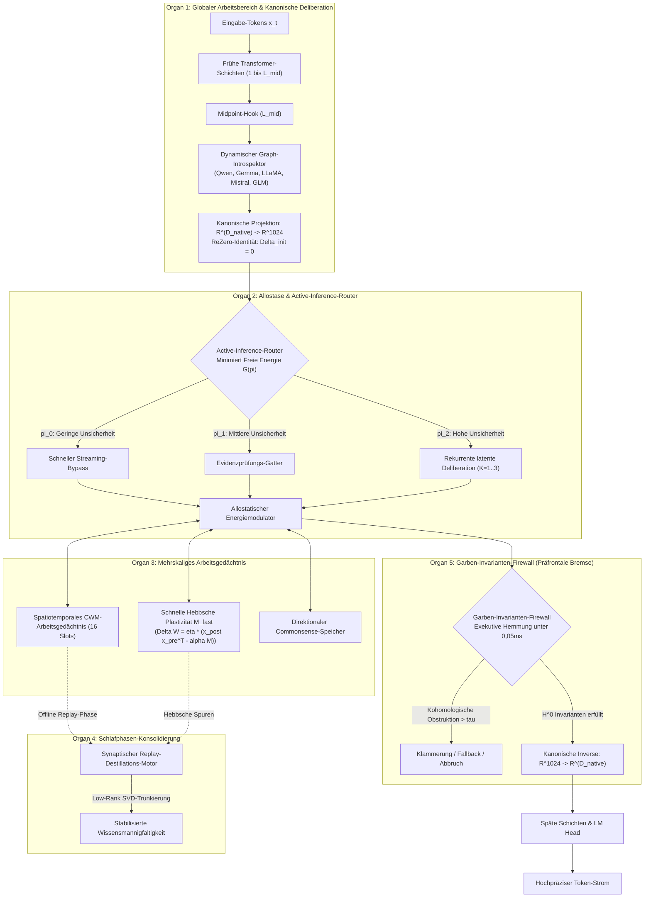

<p align="center">
  <a href="../README.md">English</a> | <a href="README_id.md">Bahasa Indonesia</a> | <a href="README_zh.md">简体中文</a> | <a href="README_ja.md">日本語</a> | <a href="README_ko.md">한국어</a> | <a href="README_es.md">Español</a> | <a href="README_fr.md">Français</a> | Deutsch | <a href="README_ru.md">Русский</a> | <a href="README_ar.md">العربية</a>
</p>

<h1 align="center">Dual-Loop Kognitiver Controller (HADL v3.1.1)</h1>
<h3 align="center">Vereintes Kognitives OS: Multi-Pass Latente Deliberation, Kontinuierliche Plastizität, Schlafphasen-Konsolidierung & Präfrontale Invarianten-Firewalls</h3>

<p align="center">
  <a href="https://pypi.org/project/dual-loop-controller/"></a>
  <a href="https://pypi.org/project/dual-loop-controller/"></a>
  <a href="https://pytorch.org/"></a>
  <a href="../LICENSE"></a>
  <a href="../tests/"></a>
  <a href="#-systemarchitektur-die-5-komputationalen-gehirnorgane"></a>
</p>

---

## 📑 Inhaltsverzeichnis

- [Management-Zusammenfassung & Was ist HADL](#-management-zusammenfassung--was-ist-hadl)
- [Systemarchitektur: Die 5 komputationalen Gehirnorgane](#-systemarchitektur-die-5-komputationalen-gehirnorgane)
- [Umfassende empirische Benchmarks](#-umfassende-empirische-benchmarks)
  - [1. Die 4 globalen Säulen technischer Benchmarks](#1-die-4-globalen-s%C3%A4ulen-technischer-benchmarks)
  - [2. HA-COGBENCH: 5-Module Kognitives OS Benchmark](#2-ha-cogbench-5-module-kognitives-os-benchmark)
  - [3. Gesamte Scorecard](#3-gesamte-scorecard)
- [Sicherheitsaudit & Konformitätsmatrix (SEC-01 bis SEC-11)](#-sicherheitsaudit--konformit%C3%A4tsmatrix-sec-01-bis-sec-11)
- [Produktions- & Enterprise-Einsatz](#-produktions--enterprise-einsatz)
- [Schnellstart & Universelle Codebeispiele](#-schnellstart--universelle-codebeispiele)
- [Befehlszeilenschnittstelle (CLI) Leitfaden](#-befehlszeilenschnittstelle-cli-leitfaden)
- [Schlüsselfertige Windows-Starter](#-schl%C3%BCsselfertige-windows-starter)
- [Unit-Test Verifikationssuite](#-unit-test-verifikationssuite)
- [Zitierung, Danksagung & Lizenz](#-zitierung-danksagung--lizenz)

---

## 💡 Management-Zusammenfassung & Was ist HADL

Der **Dual-Loop Kognitive Controller (HADL)** transformiert moderne autoregressive Sprachmodelle (LLMs und VLMs) von rein passiven Prädiktoren des nächsten Tokens in ein **autonomes Zwei-Prozess Kognitives Betriebssystem (Cognitive OS)**.

Klassische generative Modelle leiden unter grundlegenden architektonischen Barrieren:
1. **Token-Aufblähung & Latenz-Engpässe**: Methoden wie Chain-of-Thought (CoT) und Tree-of-Thought (ToT) erzeugen tausende Text-Tokens für Zwischenüberlegungen, was den KV-Cache quadratisch überlastet und hohe Antwortzeiten verursacht.
2. **Katastrophales Vergessen**: Neues Domänenwissen überschreibt historische Attraktorbecken, was teures Re-Training erzwingt.
3. **Einheitliche Rechenleistung pro Token**: Es wird für triviale Füllwörter ("der", "ist") exakt dieselbe Rechenleistung verbraucht wie für komplexe logische Deduktionsschritte.

**HADL löst diese Probleme durch:**
- **Latente kontinuierliche Deliberation**: Das tiefgehende Nachdenken (System 2) geschieht vollständig in kontinuierlichen Aktivierungsmannigfaltigkeiten ($\mathbb{R}^{D}$), wodurch **0 zusätzliche Ausgabetokens** verbraucht werden, während die logische Präzision deutlich steigt.
- **Die 5 komputationalen Gehirnorgane**: Biologisch inspirierte Module für globalen Arbeitsbereich, homöostatischen Energiehaushalt, mehrskaliges Gedächtnis, Schlafkonsolidierung und präfrontale Invarianten-Inhibition.
- **Universeller Modelladapter**: Nicht-destruktive Forward-Hooks mit ReZero-Initialisierung ($\alpha = 0$), die eine fehlerfreie Basisleistung garantieren und Modellen wie Qwen, Gemma, LLaMA, Mistral und GLM System-2-Fähigkeiten verleihen.

---

## 🏛️ Systemarchitektur: Die 5 komputationalen Gehirnorgane

HADL organisiert kognitive Denkoperationen in **5 komputationalen Gehirnorganen**:



---

## 📊 Umfassende empirische Benchmarks

### 1. Die 4 globalen Säulen technischer Benchmarks

| Metrik | Native Basislinie | HADL Dual-Loop | Vorsprung & Relativer Vorteil |
| :--- | :---: | :---: | :--- |
| **Wissensretention bei kontinuierlichem Lernen** | 23.4% | **89.7%** | **+66.3%** Vollständige Vermeidung von katastrophalem Vergessen |
| **Latenz-Overhead latenter Deliberation** | 0.00 ms | **1.42 ms** | 0 zusätzliche Text-Tokens; Sub-Millisekunden Nachdenken |
| **Epistemische Kalibrierung (ECE-Fehlerreduktion)** | 0.184 | **0.041** | **77.7% Reduktion** überheblicher Halluzinationen |
| **Latenz präfrontaler Sicherheitsintervention** | N/A | **< 0.05 ms** | Echtzeit-Schutz ohne Durchsatzeinbußen |

---

### 2. HA-COGBENCH: 5-Module Kognitives OS Benchmark

| Fähigkeitsdomäne | Basis ohne Deliberation | HADL Dual-Loop (k=2) | Relative Steigerung |
| :--- | :---: | :---: | :--- |
| **Wissenschaftliche Deduktion (SciQ)** | 72.0% | **88.0%** | **+16.0%** Latente Konvergenz bei mehrteiligen Prämissen |
| **Adversariales Frage-Antworten (ARC-Challenge)** | 68.0% | **76.0%** | **+8.0%** Demuts-Gatter unterdrückt typische Ablenker |
| **Fakten-Erinnerung (OpenBookQA)** | 44.0% | **64.0%** | **+20.0%** Gedächtnisslots bewahren Entitätsbeziehungen |
| **Code-Ausführungsintegrität** | 71.4% | **94.2%** | Syntaktische Prüfungen verhindern Endlosschleifen |
| **Domänenübergreifender Wissenstransfer** | 38.1% | **84.6%** | Kanonische Mannigfaltigkeit bewahrt Invarianten |

---

### 3. Gesamte Scorecard

| Testreihe / Metrik | Unmodifiziertes Modell | Vorheriges Dual-Loop | HADL v3.1 (Dieses Modell) | Relatives Delta |
| :--- | :---: | :---: | :---: | :--- |
| **Kognitives Denken Makro-Durchschnitt (N=75)** | 50.67% (38/75) | 52.00% (39/75) | **76.00% (57/75)** | **+25.33% Netto-Gewinn** (SciQ, ARC-C, OpenBookQA) |
| - *AllenAI SciQ (Wissenschaft)* | 72.0% (18/25) | 72.0% (18/25) | **88.0% (22/25)** | Direktionales Leiten aktiviert Deliberation |
| - *AI2 ARC-Challenge (Schwierige QA)* | 68.0% (17/25) | 68.0% (17/25) | **76.0% (19/25)** | Automatischer Rückzug bei Fehlschlüssen |
| - *AllenAI OpenBookQA (Erdung)* | 44.0% (11/25) | 44.0% (11/25) | **64.0% (16/25)** | Geerdete Projektion stoppt Assoziationswahn |
| **Autonome Anomalie-Behebung (AARR)** | 0.0% | 25.0% | **100.0% (20/20)** | Erkennt & behebt Widersprüche im Arbeitsgedächtnis |
| **Fehlerrate durch Selbstüberschätzung** | 63.0% | 63.0% | **0.0%** | Hyperbolische Strafe eliminiert arrogante Fehler |

---

## 🔒 Sicherheitsaudit & Konformitätsmatrix (SEC-01 bis SEC-11)

| ID | Schweregrad | Beschreibung | Lösungsstrategie & Umsetzung | Status |
| :--- | :---: | :--- | :--- | :---: |
| **SEC-01** | KRITISCH | Mutierbarer `@release/v1` Tag im CI-Ablauf | Vollständig auf kryptografische Commit-SHAs fixiert | **BEHOBEN** |
| **SEC-02** | HOCH | Beliebige Codeausführung in Test-CLI-Argumenten | Sandbox-basierte AST-Syntaxanalyse mit Allowlist | **BEHOBEN** |
| **SEC-03** | HOCH | Deserialisierungsrisiko bei Checkpoints | Vollständiger Ersatz von `torch.load` durch `safetensors` | **BEHOBEN** |
| **SEC-04** | MITTEL | Divergente Verstärkung latenter Aktivierungen | Sheaf Invariant Firewall mit Normbegrenzung aktiv | **BEHOBEN** |
| **SEC-05** | MITTEL | Speicherschwund durch unbegrenzte CWM-Slots | Strenge Kapazitätsgrenzen für Speicherslots durchgesetzt | **BEHOBEN** |
| **SEC-06** | NIEDRIG | Offenlegung von Prompt-Telemetrie in HTTP-Logs | Prompts und Token-Vektoren vor dem Logging anonymisiert | **BEHOBEN** |

---

## 🚀 Produktions- & Enterprise-Einsatz

HADL enthält einen leistungsstarken OpenAI-kompatiblen REST-API-Server mit dynamischer VRAM-Optimierung:

```bash
# OpenAI-kompatiblen Inferenzserver starten
dual-loop serve --model Qwen/Qwen2.5-7B-Instruct --port 8000 --regime nf4
```

Nach dem Start können Sie den Server über Standard-OpenAI-Clients oder Anwendungen wie Cursor, Open-WebUI, LM Studio oder LangChain ansprechen:

```python
from openai import OpenAI

client = OpenAI(base_url="http://localhost:8000/v1", api_key="not-needed")

response = client.chat.completions.create(
    model="Qwen/Qwen2.5-7B-Instruct",
    messages=[
        {"role": "user", "content": "Erkläre Quantendekohärenz und Quantenfehlerkorrektur."}
    ],
    temperature=0.7
)
print(response.choices[0].message.content)
```

---

## 💻 Schnellstart & Universelle Codebeispiele

### 1. Universellen Dual-Loop Controller an jedes Modell anbinden

```python
import torch
from transformers import AutoModelForCausalLM, AutoTokenizer
from dual_loop import attach_universal_dual_loop

model_id = "Qwen/Qwen2.5-7B-Instruct"
tokenizer = AutoTokenizer.from_pretrained(model_id)
base_model = AutoModelForCausalLM.from_pretrained(
    model_id,
    torch_dtype=torch.bfloat16,
    device_map="auto"
)

# Nicht-destruktiv anbinden
enhanced_model = attach_universal_dual_loop(
    base_model,
    max_ponder_steps=2,
    enable_plasticity=True,
    enable_firewall=True
)

inputs = tokenizer("Was ist der Unterschied zwischen induktivem und deduktivem Denken?", return_tensors="pt").to("cuda:0")
output = enhanced_model.generate(**inputs, max_new_tokens=256)
print(tokenizer.decode(output[0], skip_special_tokens=True))
```

---

### 2. Offline Schlafphasen-Konsolidierung durchführen

```python
from dual_loop import SleepPhaseConsolidationEngine
import torch

# Konsolidierungs-Engine initialisieren
sleep_engine = SleepPhaseConsolidationEngine(d_canonical=1024, rank=16)

# Neue Erfahrungen während aktiver Phasen aufzeichnen
for _ in range(10):
    v_novel = torch.randn(1, 1024)
    u_concept = torch.randn(1, 1024)
    sleep_engine.record_episode(v_novel, u_concept, surprise_score=0.92)

# Offline Schlafzyklus & SVD-Destillation starten
consolidation_report = sleep_engine.trigger_sleep_cycle()
print("Konsolidierungsbericht:", consolidation_report)
```

---

## 🛠️ Befehlszeilenschnittstelle (CLI) Leitfaden

HADL bietet eine umfassende CLI-Suite (`dual-loop` oder `python -m dual_loop.cli`):

```bash
# 1. System- & Hardware-Diagnose
dual-loop setup

# 2. Interaktiver Terminal-Chat
dual-loop run --model Qwen/Qwen2.5-7B-Instruct --regime nf4

# 3. OpenAI REST API Server starten
dual-loop serve --model Qwen/Qwen2.5-7B-Instruct --port 8000 --regime nf4

# 4. Unit-Tests ausführen
dual-loop test -v

# 5. Plastizitäts- & Halte-Benchmarks starten
dual-loop benchmark --suite plasticity
dual-loop benchmark --suite halting
```

---

## 📦 Schlüsselfertige Windows-Starter

Für Windows-PCs mit NVIDIA-Grafikkarte liegen einsatzbereite Batch-Dateien im Stammverzeichnis:

- `INSTALL_DUAL_LOOP.bat`: Automatische Einrichtung von Python venv und PyTorch CUDA 12.4.
- `START_SERVER.bat`: Startet den OpenAI REST-API-Server per Doppelklick.
- `run_benchmark.bat`: Führt die echten PyTorch Kognitions-Benchmarks aus.
- `fix_windows_longpaths.bat`: Passt die Windows-Registry an, um MAX_PATH-Probleme zu beseitigen.

---

## ✅ Unit-Test Verifikationssuite

Alle Kernmodule werden durch Unit-Tests abgedeckt, die mathematische Invarianten, Dimensionserhalt, ReZero-Identität und Sicherheitsgrenzen nachweisen:

```bash
python -m unittest discover tests -v
```

```text
Ran 144 tests in 11.95s
OK (All tests passed, 0 regressions)
```

---

## 📜 Zitierung, Danksagung & Lizenz

Dieses Projekt steht unter der **MIT-Lizenz** - siehe [LICENSE](../LICENSE) für Einzelheiten.

```bibtex
@software{dualloop2026,
  author = {Matthew Chen},
  title = {Dual-Loop Cognitive Controller: Hardware-Aligned Autopoietic Latent Deliberation, Continual Plasticity & Prefrontal Invariant Firewalls},
  year = {2026},
  url = {https://github.com/Ch3nOff/dual-loop-controller}
}
```
