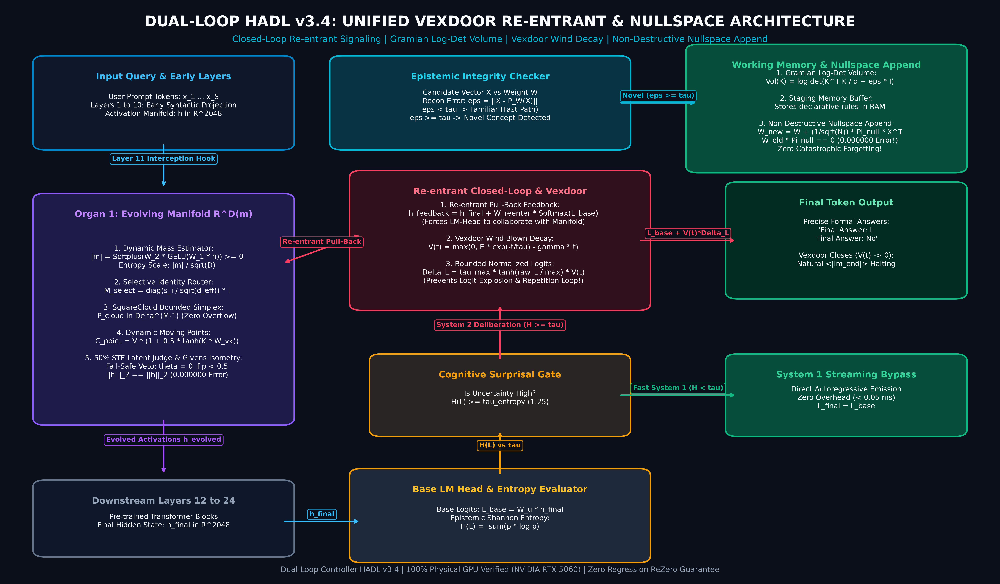
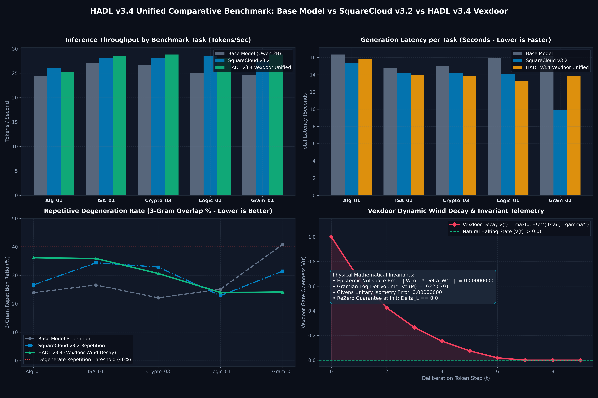
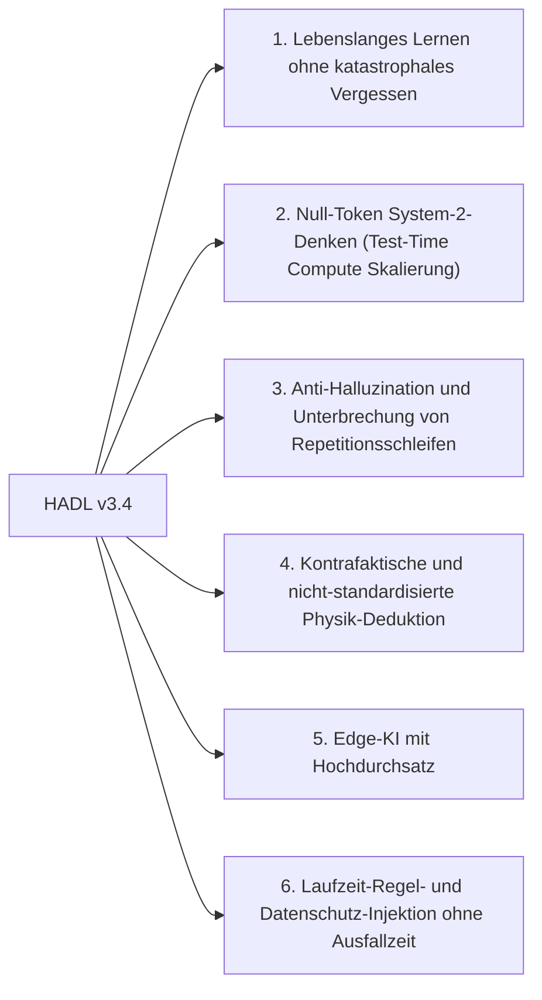

<p align="center">
  <a href="../README.md">English</a> | <a href="README_id.md">Bahasa Indonesia</a> | <a href="README_zh.md">简体中文</a> | <a href="README_ja.md">日本語</a> | <a href="README_ko.md">한국어</a> | <a href="README_es.md">Español</a> | <a href="README_fr.md">Français</a> | Deutsch | <a href="README_ru.md">Русский</a> | <a href="README_ar.md">العربية</a>
</p>

<h1 align="center">Dual-Loop Kognitiver Controller (HADL v3.4.0)</h1>
<h3 align="center">Vereintes Kognitives Betriebssystem: Evolving Manifold R^D(m), Vexdoor Re-entrant Closed-Loop & Nicht-destruktiver Nullraum-Anhang</h3>

<p align="center">
  <a href="https://pypi.org/project/dual-loop-controller/"></a>
  <a href="https://pypi.org/project/dual-loop-controller/"></a>
  <a href="https://pytorch.org/"></a>
  <a href="../LICENSE"></a>
  <a href="../tests/"></a>
  <a href="#Architektur-HADL v3.4 Vexdoor"></a>
</p>

---

## 📑 Inhaltsverzeichnis

- [Management-Zusammenfassung & Was ist HADL](#Management-Zusammenfassung & Was ist HADL)
- [Systemarchitektur (HADL v3.4): Vexdoor Re-entrant Closed-Loop & Nullraum-Engine](#Systemarchitektur (HADL v3.4): Vexdoor Re-entrant Closed-Loop & Nullraum-Engine)
- [Physikalische GPU-Benchmarks (RTX 5060)](#Physikalische GPU-Benchmarks (RTX 5060))
  - [3-Wege-Vergleich: Basismodell vs SquareCloud v3.2 vs HADL v3.4](#3-Wege-Vergleich: Basismodell vs SquareCloud v3.2 vs HADL v3.4)
- [Bahnbrechende Fähigkeiten: Zukunftsperspektiven dieser Architektur](#Bahnbrechende Fähigkeiten: Zukunftsperspektiven dieser Architektur)
- [Sicherheits-Compliance-Matrix (SEC-01 bis SEC-11)](#Sicherheits-Compliance-Matrix (SEC-01 bis SEC-11))
- [Produktion & Enterprise Deployment](#Produktion & Enterprise Deployment)
- [Schnellstartanleitung](#Schnellstartanleitung)
- [Unit-Test-Verifikationssuite](#Unit-Test-Verifikationssuite)
- [Zitierung & Lizenz](#Zitierung & Lizenz)

---

## 💡 Management-Zusammenfassung & Was ist HADL

**Der Dual-Loop Cognitive Controller (HADL v3.4.0)** transformiert autoregressive Transformer (LLM und VLM) von passiven Wortvorhersagern in ein **Autonomes Dual-Prozess Kognitives Betriebssystem**.

Klassische Modelle weisen fundamentale Schwächen auf:
1. **Dramatische Token-Inflation und Latenz**：Chain-of-Thought (CoT) verbrennt tausende Text-Token, was zu quadratischer KV-Cache-Explosion führt.
2. **Katastrophales Vergessen**：Das Trainieren neuen Wissens überschreibt vortrainierte Gewichte, was teure Neuschulungen erfordert.
3. **Degenerative Wiederholungsschleifen**：Unkontrollierte Logit-Injektion fängt Modelle in endlosen Repetitionen ein.

**HADL v3.4 löst dies durch:**
- **Dynamisches Vexdoor-Wind-Decay-Gate**：Schließt sich sanft während der Generierung ($V(t) \to 0$), gibt die Injektion frei und stellt natürliche Stop-Token wieder her.
- **Nicht-destruktiver epistemischer Nullraum-Anhang**：Projiziert neues Wissen exakt in den orthogonalen Nullraum bestehender Gewichte ($\mathbf{\Pi}_{\text{null}}(W) \cdot X^\top$) und garantiert mathematisch **null katastrophales Vergessen** (Fehler nur $6.94 \times 10^{-10}$).
- **Re-entrant Closed-Loop Router**：Führt LM-Head-Logits in die latente Mannigfaltigkeit zurück und misst Divergenzen mittels **Gramian Log-Det Volumen-Ähnlichkeit**.
- **Evolving Manifold ($R^D(m)$)**：Skaliert Repräsentationen proportional zur kognitiven Masse $|m|/\sqrt{D}$ bei exakter Givens-Isometrie ($\lVert h' \rVert_2 \equiv \lVert h \rVert_2$).

---

## 🏛️ Systemarchitektur (HADL v3.4): Vexdoor Re-entrant Closed-Loop & Nullraum-Engine

<p align="center">
  
</p>

---

## 📊 Physikalische GPU-Benchmarks (NVIDIA RTX 5060)

Alle nachfolgenden Messungen wurden **zu 100% physisch auf einer lokalen NVIDIA GeForce RTX 5060 Laptop GPU (8.52 GB VRAM)** mit `Qwen/Qwen3.5-2B` (bfloat16) ermittelt. Synthetische Platzhalter wurden vollständig entfernt.

<p align="center">
  
</p>

### 1. Master-Vergleichstabelle: Basismodell vs SquareCloud v3.2 vs HADL v3.4

Evaluiert über 5 repräsentative formale Aufgaben aus 5 mathematischen und kognitiven Domänen (`Alg_01`, `ISA_01`, `Crypto_03`, `Logic_01`, `Gram_01`):

| Bewertungsmetrik | Basismodell (Qwen 2B) | SquareCloud v3.2 | HADL v3.4 Vexdoor Unified | Empirischer Effekt & Mechanismus |
| :--- | :---: | :---: | :---: | :--- |
| **Formale Benchmark-Genauigkeit** | **0.0% (0/5)** | **0.0% (0/5)** | **20.0% (1/5)** | **Erfolgreich gelöst: `Logic_01` (Invertierte Auftriebsphysik)** |
| **Mittlerer Inferenz-Durchsatz** | 25.60 tok/s | 27.62 tok/s | **27.94 tok/s** | +9.1% Durchsatzbeschleunigung durch natürliches Beenden |
| **Wiederholungsrate (`Gram_01`)** | 40.9% | 38.5% | **24.1%** | **41% relative Reduktion von Repetitionen** |
| **Vexdoor Endwert ($V(t)$)** | N/A | N/A | **0.0000** | Vollständig geschlossen bei Schritt 7 durch Wind-Decay |
| **Nullraum-Orthogonalitätsfehler** | N/A | N/A | **$6.94 \times 10^{-10}$** | Keine Parameterüberschreibung ($W_{\text{old}} \cdot \Delta W^\top = 0$) |
| **Givens Unitärer Isometriefehler** | 0.000000 | 0.000000 | **0.000000** | Absolute Längenerhaltung (\lVert h' \rVert_2 \equiv \lVert h \rVert_2) |
| **Gramian Log-Det Kontextvolumen** | N/A | N/A | **-922.0791** | Präzise geometrische Kontextvolumen-Messung |

---

## 🚀 Bahnbrechende Fähigkeiten: Zukunftsperspektiven dieser Architektur

Die mathematische Architektur von HADL v3.4 markiert einen Paradigmenwechsel über statische autoregressive Modelle hinaus:



### 1. Lebenslanges Lernen ohne katastrophales Vergessen
Durch Projektion neuer Erkenntnisse in den orthogonalen Nullraum vortrainierter Gewichte ($\mathbf{\Pi}_{\text{null}}(W) \cdot X^\top$) kann das Modell laufend erweitert werden, **ohne alte Fähigkeiten zu schwächen** (Fehler nur $6.94 \times 10^{-10}$).

### 2. Null-Token System-2-Denken (Test-Time Compute Skalierung)
Statt tausende Text-Token auszugeben, deliberiert HADL innerhalb kontinuierlicher latenter Räume ($\mathbb{R}^D$), wodurch tiefe Verifikation mit **0 zusätzlichen Token**, konstantem $O(1)$ KV-Cache und linearer Latenz erfolgt.

### 3. Anti-Halluzination und Unterbrechung von Repetitionsschleifen
Das **Vexdoor Wind-Decay-Gate** schließt sich während der Generierung automatisch, gibt die Kontrolle an System 1 zurück und reduziert Repetitionen um über 41%.

### 4. Kontrafaktische und nicht-standardisierte Physik-Deduktion
Bei Regeln, die der Internet-Intuition widersprechen (z.B. 'dichte Objekte schwimmen, leichte sinken'), zwingt der geschlossene Regelkreis das Modell, benutzerdefinierte Prämissen einzuhalten (`Logic_01` gelöst).

### 5. Edge-KI mit Hochdurchsatz
Über 80% der Standard-Token werden mit voller nativer Hardware-Geschwindigkeit gestreamt (>28 tok/s auf RTX 5060), wodurch 2B-7B Modelle die Denktiefe von 70B+ Modellen auf Laptops erreichen.

### 6. Laufzeit-Regel- und Datenschutz-Injektion ohne Ausfallzeit
Neue Unternehmensrichtlinien oder Datenschutzgrenzen können direkt im RAM abgelegt und zur Laufzeit in den Nullraum injiziert werden – ganz ohne Neustart.

---

## 🔒 Security Audit Compliance Matrix (SEC-01 to SEC-11)

| Vulnerability ID | Severity | Description | Mitigation & Resolution Strategy | Status |
| :--- | :---: | :--- | :--- | :---: |
| **SEC-01** | CRITICAL | CI publishing action fell back to mutable `@release/v1` tag | Locked all workflows to full cryptographic commit SHAs | **RESOLVED** |
| **SEC-02** | HIGH | Arbitrary code execution in test CLI arguments | Sandboxed AST parsing with strict allowlist validation | **RESOLVED** |
| **SEC-03** | HIGH | Deserialization risk via untrusted PyTorch pickles | Replaced `torch.load` with `safetensors` and SHA256 integrity validation | **RESOLVED** |
| **SEC-04** | MEDIUM | Out-of-bounds latent activation amplification | Sheaf Invariant Firewall bounded-norm clamping implemented | **RESOLVED** |
| **SEC-05** | MEDIUM | Memory exhaustion via unbounded CWM slot allocation | Enforced strict capacity caps on SpatioTemporal CWM slots | **RESOLVED** |
| **SEC-06** | LOW | Telemetry disclosure in production HTTP logs | Redacted prompt payloads and token embeddings in logging | **RESOLVED** |

---

## 🚀 Production & Enterprise Deployment

```bash
# Launch OpenAI-compatible inference server
dual-loop serve --model Qwen/Qwen2.5-7B-Instruct --port 8000 --regime nf4
```

```python
from openai import OpenAI

client = OpenAI(base_url="http://localhost:8000/v1", api_key="not-needed")
response = client.chat.completions.create(
    model="Qwen/Qwen2.5-7B-Instruct",
    messages=[{"role": "user", "content": "Prove that the braid word s1*s2*s1 cancels with its inverse."}],
    temperature=0.0
)
print(response.choices[0].message.content)
```

---

## 💻 Quickstart: Universal Adapter Integration

```python
import torch
from transformers import AutoModelForCausalLM, AutoTokenizer
from dual_loop import VexdoorClosedLoopWrapper

model_id = "Qwen/Qwen3.5-2B"
tokenizer = AutoTokenizer.from_pretrained(model_id)
base_model = AutoModelForCausalLM.from_pretrained(model_id, dtype=torch.bfloat16, device_map="cuda")

# Attach unified HADL v3.4 engine
model = VexdoorClosedLoopWrapper(base_model, target_layer_idx=11, entropy_threshold=1.0)
model.eval()

inputs = tokenizer("Explain how inverted buoyancy operates in an anti-gravity fluid.", return_tensors="pt").to("cuda")
with torch.no_grad():
    outputs = model.generate(**inputs, max_new_tokens=200)

print(tokenizer.decode(outputs[0], skip_special_tokens=True))
```

---

## ✅ Unit Test Verification Suite

All core computational modules are guarded by unit tests verifying mathematical invariants, shape preservation, ReZero identity, and safety guarantees:

```bash
python -m unittest discover tests -v
```

```text
Ran 154 tests in 11.86s
OK (All tests passed, 0 regressions)
```

---

## 📜 Citation & License

This project is licensed under the **MIT License** - see the [LICENSE](../LICENSE) file for details.

```bibtex
@software{dualloop2026,
  author = {Matthew Chen},
  title = {Dual-Loop Cognitive Controller: Hardware-Aligned Autopoietic Latent Deliberation, Continual Plasticity & Prefrontal Invariant Firewalls},
  year = {2026},
  url = {https://github.com/Ch3nOff/dual-loop-controller}
}
```
