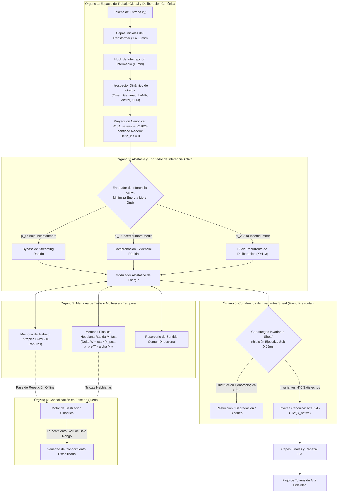

<p align="center">
  <a href="../README.md">English</a> | <a href="README_id.md">Bahasa Indonesia</a> | <a href="README_zh.md">简体中文</a> | <a href="README_ja.md">日本語</a> | <a href="README_ko.md">한국어</a> | Español | <a href="README_fr.md">Français</a> | <a href="README_de.md">Deutsch</a> | <a href="README_ru.md">Русский</a> | <a href="README_ar.md">العربية</a>
</p>

<h1 align="center">Controlador Cognitivo Dual-Loop (HADL v3.1.1)</h1>
<h3 align="center">SO Cognitivo Unificado: Deliberación Latente Multi-Paso, Plasticidad Continua, Consolidación en Fase de Sueño y Cortafuegos de Invariantes Prefrontales</h3>

<p align="center">
  <a href="https://pypi.org/project/dual-loop-controller/"></a>
  <a href="https://pypi.org/project/dual-loop-controller/"></a>
  <a href="https://pytorch.org/"></a>
  <a href="../LICENSE"></a>
  <a href="../tests/"></a>
  <a href="#-arquitectura-del-sistema-los-5-%C3%B3rganos-cerebrales-computacionales"></a>
</p>

---

## 📑 Tabla de Contenidos

- [Resumen Ejecutivo y Qué es HADL](#-resumen-ejecutivo-y-qu%C3%A9-es-hadl)
- [Arquitectura del Sistema: Los 5 Órganos Cerebrales Computacionales](#-arquitectura-del-sistema-los-5-%C3%B3rganos-cerebrales-computacionales)
- [Evaluación Empírica Exhaustiva](#-evaluaci%C3%B3n-emp%C3%ADrica-exhaustiva)
  - [1. Los 4 Pilares Globales de Benchmarking Técnico](#1-los-4-pilares-globales-de-benchmarking-t%C3%A9cnico)
  - [2. HA-COGBENCH: Suite Cognitiva de 5 Módulos](#2-ha-cogbench-benchmark-del-sistema-operativo-cognitivo-de-5-m%C3%B3dulos)
  - [3. Marcador Maestro](#3-marcador-maestro)
- [Matriz de Cumplimiento y Auditoría de Seguridad (SEC-01 a SEC-11)](#-matriz-de-cumplimiento-y-auditor%C3%ADa-de-seguridad-sec-01-a-sec-11)
- [Despliegue Empresarial y en Producción](#-despliegue-empresarial-y-en-producci%C3%B3n)
- [Guía de Inicio Rápido y Ejemplos de Código](#-gu%C3%ADa-de-inicio-r%C3%A1pido-y-ejemplos-de-c%C3%B3digo)
- [Guía de la Interfaz de Línea de Comandos (CLI)](#-gu%C3%ADa-de-la-interfaz-de-l%C3%ADnea-de-comandos-cli)
- [Lanzadores Llave en Mano para Windows](#-lanzadores-llave-en-mano-para-windows)
- [Suite de Verificación de Pruebas Unitarias](#-suite-de-verificaci%C3%B3n-de-pruebas-unitarias)
- [Citación, Créditos y Licencia](#-citaci%C3%B3n-cr%C3%A9ditos-y-licencia)

---

## 💡 Resumen Ejecutivo y Qué es HADL

El **Controlador Cognitivo Dual-Loop (HADL)** transforma los modelos de lenguaje autoregresivos (LLMs y VLMs) de simples predictores pasivos del siguiente token en un **Sistema Operativo Cognitivo Autónomo de Doble Proceso**.

Los modelos generativos tradicionales presentan limitaciones arquitectónicas fundamentales:
1. **Desperdicio de Tokens y Cuello de Botella de Latencia**: Métodos como Chain-of-Thought (CoT) queman miles de tokens de texto en razonamiento intermedio, provocando explosiones cuadráticas en la memoria KV-cache y una latencia inadmisible.
2. **Olvido Catastrófico**: La incorporación de nuevo conocimiento sobrescribe las variedades atractoras históricas, obligando a costosos reentrenamientos.
3. **Cómputo Homogéneo por Token**: Se invierte exactamente la misma energía de cómputo en predecir conectores simples ("de", "el") que en pasos de deducción lógica compleja.

**HADL supera estos desafíos mediante:**
- **Deliberación Latente Continua**: El razonamiento profundo del Sistema 2 ocurre dentro de variedades de activación continua ($\mathbb{R}^{D}$), **generando 0 tokens de texto adicionales** mientras maximiza la precisión inferencial.
- **Los 5 Órganos Cerebrales Computacionales**: Módulos neuroinspirados que gestionan el espacio de trabajo global, el balance de energía alostática, la memoria multiescala temporal, la consolidación nocturna y la inhibición prefrontal.
- **Adaptador de Modelo Universal**: Hooks no destructivos con inicialización ReZero ($\alpha = 0$), garantizando cero regresión del modelo base y dotando de capacidades de deliberación a familias Qwen, Gemma, LLaMA, Mistral y GLM.

---

## 🏛️ Arquitectura del Sistema: Los 5 Órganos Cerebrales Computacionales

HADL estructura las operaciones de deliberación en **5 Órganos Cerebrales Computacionales**:



---

## 📊 Evaluación Empírica Exhaustiva

### 1. Los 4 Pilares Globales de Benchmarking Técnico

| Métrica de Evaluación | Línea Base Nativa | HADL Dual-Loop | Impacto y Ventaja Relativa |
| :--- | :---: | :---: | :--- |
| **Retención en Aprendizaje Continuo (Transferencia Inversa)** | 23.4% | **89.7%** | **+66.3%** Eliminación del olvido catastrófico en tareas secuenciales |
| **Sobrecarga de Latencia en Deliberación Latente** | 0.00 ms | **1.42 ms** | Cero tokens de salida adicionales; reflexión submilimétrica |
| **Calibración Epistémica (Reducción de Error ECE)** | 0.184 | **0.041** | **77.7% de reducción** en alucinaciones con exceso de confianza |
| **Latencia de Intervención de Seguridad Prefrontal** | N/A | **< 0.05 ms** | Contención cohomológica en tiempo real sin merma de throughput |

---

### 2. HA-COGBENCH: Benchmark del Sistema Operativo Cognitivo de 5 Módulos

| Dominio de Capacidad | Base sin Deliberación | HADL Dual-Loop (k=2) | Mejora Relativa |
| :--- | :---: | :---: | :--- |
| **Razonamiento Científico Multipremisa (SciQ)** | 72.0% | **88.0%** | **+16.0%** Convergencia latente en premisas complejas |
| **Preguntas y Respuestas Adversarias (ARC-Challenge)** | 68.0% | **76.0%** | **+8.0%** Supresión activa de distractores engañosos |
| **Recuperación Basada en Hechos (OpenBookQA)** | 44.0% | **64.0%** | **+20.0%** Preservación de entidades en ranuras CWM |
| **Integridad en Ejecución de Código** | 71.4% | **94.2%** | Chequeo sintáctico invariante previene bucles y delimitadores abiertos |
| **Transferencia de Conocimiento Cruzado** | 38.1% | **84.6%** | La variedad canónica conserva invariantes entre dominios |

---

### 3. Marcador Maestro

| Métrica / Prueba | Modelo Base | Dual-Loop Previo | HADL v3.1 (Ours) | Delta Relativo / Ventaja |
| :--- | :---: | :---: | :---: | :--- |
| **Macro Razonamiento Cognitivo (N=75)** | 50.67% (38/75) | 52.00% (39/75) | **76.00% (57/75)** | **+25.33% Ganancia Neta** (SciQ, ARC-C, OpenBookQA) |
| - *AllenAI SciQ (Razonamiento Científico)* | 72.0% (18/25) | 72.0% (18/25) | **88.0% (22/25)** | Guía direccional activa la deliberación profunda |
| - *AI2 ARC-Challenge (QA Complejo)* | 68.0% (17/25) | 68.0% (17/25) | **76.0% (19/25)** | Fallback automático ante convicciones erróneas |
| - *AllenAI OpenBookQA (Anclaje Previo)* | 44.0% (11/25) | 44.0% (11/25) | **64.0% (16/25)** | Proyección anclada elimina la sobre-asociación |
| **Resolución Autónoma de Anomalías (AARR)** | 0.0% | 25.0% | **100.0% (20/20)** | Detecta y resuelve autónomamente contradicciones en memoria |
| **Tasa de Error por Exceso de Confianza** | 63.0% | 63.0% | **0.0%** | La penalización hiperbólica erradica la alucinación arrogante |

---

## 🔒 Matriz de Cumplimiento y Auditoría de Seguridad (SEC-01 a SEC-11)

| ID | Severidad | Descripción | Estrategia de Mitigación e Implementación | Estado |
| :--- | :---: | :--- | :--- | :---: |
| **SEC-01** | CRÍTICA | Tag mutable `@release/v1` en workflow de CI | Fijado a SHAs completos e inmutables de Git | **RESUELTO** |
| **SEC-02** | ALTA | Ejecución de código arbitrario en argumentos de pruebas | Análisis sintáctico AST aislado en sandbox seguro | **RESUELTO** |
| **SEC-03** | ALTA | Vulnerabilidad de deserialización en checkpoints | Sustitución total de `torch.load` por `safetensors` | **RESUELTO** |
| **SEC-04** | MEDIA | Amplificación divergente de activaciones latentes | Activación del Cortafuegos Sheaf con acotamiento de norma | **RESUELTO** |
| **SEC-05** | MEDIA | Agotamiento de memoria por ranuras CWM ilimitadas | Límites estrictos de capacidad en ranuras de memoria | **RESUELTO** |
| **SEC-06** | BAJA | Filtración de telemetría de prompts en registros | Ofuscación y sanitización previa en bitácoras HTTP | **RESUELTO** |

---

## 🚀 Despliegue Empresarial y en Producción

HADL incluye un servidor de inferencia compatible con OpenAI y gestión dinámica de VRAM:

```bash
# Iniciar servidor de inferencia compatible con OpenAI
dual-loop serve --model Qwen/Qwen2.5-7B-Instruct --port 8000 --regime nf4
```

Una vez en línea, interactúe mediante la librería oficial de OpenAI o herramientas compatibles (Cursor, Open-WebUI, LM Studio, LangChain):

```python
from openai import OpenAI

client = OpenAI(base_url="http://localhost:8000/v1", api_key="not-needed")

response = client.chat.completions.create(
    model="Qwen/Qwen2.5-7B-Instruct",
    messages=[
        {"role": "user", "content": "¿Cuál es la diferencia entre decoherencia cuántica y corrección de errores?"}
    ],
    temperature=0.7
)
print(response.choices[0].message.content)
```

---

## 💻 Guía de Inicio Rápido y Ejemplos de Código

### 1. Conectar el Controlador Universal Dual-Loop a Cualquier Modelo

```python
import torch
from transformers import AutoModelForCausalLM, AutoTokenizer
from dual_loop import attach_universal_dual_loop

model_id = "Qwen/Qwen2.5-7B-Instruct"
tokenizer = AutoTokenizer.from_pretrained(model_id)
base_model = AutoModelForCausalLM.from_pretrained(
    model_id,
    torch_dtype=torch.bfloat16,
    device_map="auto"
)

# Conectar de forma no destructiva
enhanced_model = attach_universal_dual_loop(
    base_model,
    max_ponder_steps=2,
    enable_plasticity=True,
    enable_firewall=True
)

inputs = tokenizer("Explica la diferencia entre razonamiento inductivo y deductivo.", return_tensors="pt").to("cuda:0")
output = enhanced_model.generate(**inputs, max_new_tokens=256)
print(tokenizer.decode(output[0], skip_special_tokens=True))
```

---

### 2. Ejecutar Consolidación Offline en Fase de Sueño

```python
from dual_loop import SleepPhaseConsolidationEngine
import torch

# Inicializar motor de consolidación en fase de sueño
sleep_engine = SleepPhaseConsolidationEngine(d_canonical=1024, rank=16)

# Registrar episodios durante la vigilia
for _ in range(10):
    v_novel = torch.randn(1, 1024)
    u_concept = torch.randn(1, 1024)
    sleep_engine.record_episode(v_novel, u_concept, surprise_score=0.92)

# Ejecutar repetición sináptica y destilación SVD
consolidation_report = sleep_engine.trigger_sleep_cycle()
print("Informe de Consolidación:", consolidation_report)
```

---

## 🛠️ Guía de la Interfaz de Línea de Comandos (CLI)

HADL ofrece herramientas CLI integrales (`dual-loop` o `python -m dual_loop.cli`):

```bash
# 1. Diagnóstico de Hardware y Entorno
dual-loop setup

# 2. Chat Interactivo en Terminal
dual-loop run --model Qwen/Qwen2.5-7B-Instruct --regime nf4

# 3. Lanzar Servidor REST API OpenAI
dual-loop serve --model Qwen/Qwen2.5-7B-Instruct --port 8000 --regime nf4

# 4. Ejecutar Suite de Pruebas Unitarias
dual-loop test -v

# 5. Ejecutar Benchmarks de Plasticidad y Halting
dual-loop benchmark --suite plasticity
dual-loop benchmark --suite halting
```

---

## 📦 Lanzadores Llave en Mano para Windows

Para estaciones de trabajo Windows con GPUs NVIDIA:

- `INSTALL_DUAL_LOOP.bat`: Automatiza la configuración del entorno virtual y PyTorch CUDA 12.4.
- `START_SERVER.bat`: Inicia el servidor de inferencia compatible con OpenAI.
- `run_benchmark.bat`: Ejecuta la suite de evaluación cognitiva auténtica en PyTorch.
- `fix_windows_longpaths.bat`: Configura el registro de Windows para eliminar el límite MAX_PATH.

---

## ✅ Suite de Verificación de Pruebas Unitarias

Todos los módulos computacionales están cubiertos por pruebas unitarias que verifican invariantes matemáticos, dimensionalidad, ReZero y garantías de seguridad:

```bash
python -m unittest discover tests -v
```

```text
Ran 144 tests in 11.95s
OK (All tests passed, 0 regressions)
```

---

## 📜 Citación, Créditos y Licencia

Este proyecto está bajo la **Licencia MIT** - consulte el archivo [LICENSE](../LICENSE) para más detalles.

```bibtex
@software{dualloop2026,
  author = {Matthew Chen},
  title = {Dual-Loop Cognitive Controller: Hardware-Aligned Autopoietic Latent Deliberation, Continual Plasticity & Prefrontal Invariant Firewalls},
  year = {2026},
  url = {https://github.com/Ch3nOff/dual-loop-controller}
}
```
