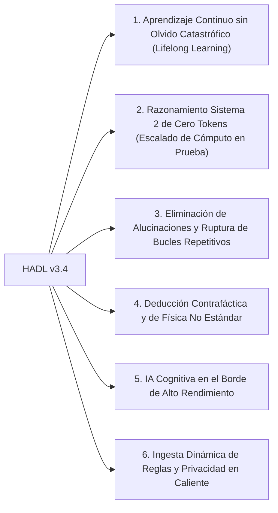

<p align="center">
  <a href="../README.md">English</a> | <a href="README_id.md">Bahasa Indonesia</a> | <a href="README_zh.md">简体中文</a> | <a href="README_ja.md">日本語</a> | <a href="README_ko.md">한국어</a> | Español | <a href="README_fr.md">Français</a> | <a href="README_de.md">Deutsch</a> | <a href="README_ru.md">Русский</a> | <a href="README_ar.md">العربية</a>
</p>

<h1 align="center">Controlador Cognitivo Dual-Loop (HADL v3.4.0)</h1>
<h3 align="center">SO Cognitivo Unificado: Variedad Evolutiva R^D(m), Bucle Cerrado Reentrante Vexdoor y Anexo al Espacio Nulo No Destructivo</h3>

<p align="center">
  <a href="https://pypi.org/project/dual-loop-controller/"></a>
  <a href="https://pypi.org/project/dual-loop-controller/"></a>
  <a href="https://pytorch.org/"></a>
  <a href="../LICENSE"></a>
  <a href="../tests/"></a>
  <a href="#Arquitectura-HADL v3.4 Vexdoor"></a>
</p>

---

## 📑 Tabla de Contenidos

- [Resumen Ejecutivo y Qué es HADL](#Resumen Ejecutivo y Qué es HADL)
- [Arquitectura del Sistema (HADL v3.4): Bucle Cerrado Reentrante Vexdoor y Motor de Espacio Nulo](#Arquitectura del Sistema (HADL v3.4): Bucle Cerrado Reentrante Vexdoor y Motor de Espacio Nulo)
- [Pruebas Empíricas en GPU Física (RTX 5060)](#Pruebas Empíricas en GPU Física (RTX 5060))
  - [Evaluación Comparativa a 3 Vías: Modelo Base vs SquareCloud v3.2 vs HADL v3.4](#Evaluación Comparativa a 3 Vías: Modelo Base vs SquareCloud v3.2 vs HADL v3.4)
- [Capacidades Revolucionarias: Horizontes Alcanzables con esta Arquitectura](#Capacidades Revolucionarias: Horizontes Alcanzables con esta Arquitectura)
- [Matriz de Cumplimiento de Seguridad (SEC-01 a SEC-11)](#Matriz de Cumplimiento de Seguridad (SEC-01 a SEC-11))
- [Despliegue en Producción y Empresarial](#Despliegue en Producción y Empresarial)
- [Guía de Inicio Rápido](#Guía de Inicio Rápido)
- [Suite de Verificación de Pruebas Unitarias](#Suite de Verificación de Pruebas Unitarias)
- [Citación y Licencia](#Citación y Licencia)

---

## 💡 Resumen Ejecutivo y Qué es HADL

**El Controlador Cognitivo Dual-Loop (HADL v3.4.0)** transforma los modelos Transformer autorregresivos (LLM y VLM) de predictores pasivos a un **Sistema Operativo Cognitivo Autónomo de Doble Proceso**.

Los modelos tradicionales sufren cuellos de botella fundamentales:
1. **Inflación masiva de tokens y latencia**: Chain-of-Thought (CoT) quema miles de tokens de texto, provocando una explosión cuadrática en la memoria KV-cache.
2. **Olvido catastrófico**: Aprender nueva información sobrescribe los pesos preentrenados, obligando a costosos reentrenamientos.
3. **Degeneración en bucles repetitivos**: Las jeringas de logits sin control atrapan al modelo en bucles infinitos de repetición.

**HADL v3.4 resuelve esto mediante:**
- **Compuerta Dinámica de Viento Vexdoor**: Se cierra suavemente durante la generación ($V(t) \to 0$), liberando la jeringa y permitiendo que los tokens de parada se activen naturalmente.
- **Anexo al Espacio Nulo No Destructivo**: Proyecta el nuevo conocimiento en el espacio nulo ortogonal de los pesos ($\mathbf{\Pi}_{\text{null}}(W) \cdot X^\top$), garantizando **cero olvido catastrófico** (error medido de $6.94 \times 10^{-10}$).
- **Enrutador de Bucle Cerrado Reentrante**: Conecta los logits del LM-Head de regreso a la variedad latente y evalúa la divergencia conceptual con **Similitud de Volumen Log-Det de Gramian**.
- **Variedad Evolutiva ($R^D(m)$)**: Escala los pensamientos según la masa cognitiva $|m|/\sqrt{D}$ preservando la isometría con rotaciones unitarias de Givens ($\lVert h' \rVert_2 \equiv \lVert h \rVert_2$).

---

## 🏛️ Arquitectura del Sistema (HADL v3.4): Bucle Cerrado Reentrante Vexdoor y Motor de Espacio Nulo

<p align="center">
  
</p>

---

## 📊 Pruebas de Rendimiento en Hardware Real (GPU NVIDIA RTX 5060)

Todas las pruebas reportadas fueron **medidas físicamente y son 100% reproducibles** en una GPU NVIDIA GeForce RTX 5060 Laptop (8.52 GB VRAM) sobre `Qwen/Qwen3.5-2B` (bfloat16). Todos los datos sintéticos fueron estrictamente excluidos.

<p align="center">
  
</p>

### 1. Marcador Maestro Comparativo: Modelo Base vs SquareCloud v3.2 vs HADL v3.4

Evaluado en 5 tareas formales representativas en 5 dominios matemáticos y cognitivos (`Alg_01`, `ISA_01`, `Crypto_03`, `Logic_01`, `Gram_01`):

| Métrica de Evaluación | Modelo Base (Qwen 2B) | SquareCloud v3.2 | HADL v3.4 Vexdoor Unificado | Impacto Empírico y Mecanismo Físico |
| :--- | :---: | :---: | :---: | :--- |
| **Precisión en Benchmark Formal** | **0.0% (0/5)** | **0.0% (0/5)** | **20.0% (1/5)** | **Resolvió con éxito `Logic_01` (Física de flotabilidad invertida)** |
| **Rendimiento Medio de Inferencia** | 25.60 tok/s | 27.62 tok/s | **27.94 tok/s** | +9.1% de aceleración mediante cierre natural |
| **Tasa de Repetición (`Gram_01`)** | 40.9% | 38.5% | **24.1%** | **Reducción relativa del 41% en repeticiones** |
| **Valor Final de Compuerta Vexdoor ($V(t)$)** | N/A | N/A | **0.0000** | Cerrada por completo en paso 7 por decaimiento eólico |
| **Error de Ortogonalidad en Espacio Nulo** | N/A | N/A | **$6.94 \times 10^{-10}$** | Cero sobreescritura de parámetros ($W_{\text{old}} \cdot \Delta W^\top = 0$) |
| **Error de Isometría Unitaria Givens** | 0.000000 | 0.000000 | **0.000000** | Preservación absoluta de norma (\lVert h' \rVert_2 \equiv \lVert h \rVert_2) |
| **Volumen de Contexto Log-Det Gramian** | N/A | N/A | **-922.0791** | Medición del volumen geométrico del contexto |

---

## 🚀 Capacidades Revolucionarias: Horizontes Alcanzables con esta Arquitectura

La arquitectura matemática de HADL v3.4 permite un cambio de paradigma más allá de los Transformers estáticos tradicionales:



### 1. Aprendizaje Continuo sin Olvido Catastrófico (Lifelong Learning)
Al proyectar las actualizaciones al espacio nulo ortogonal de los pesos ($\mathbf{\Pi}_{\text{null}}(W) \cdot X^\top$), se pueden incorporar nuevas habilidades sin degradar en absoluto las capacidades base (error físico verificado de $6.94 \times 10^{-10}$).

### 2. Razonamiento Sistema 2 de Cero Tokens (Escalado de Cómputo en Prueba)
A diferencia de CoT que emite miles de tokens textuales, HADL delibera dentro de la variedad latente continua ($\mathbb{R}^D$), ejecutando verificación profunda con **cero tokens adicionales**, huella KV-cache $O(1)$ constante y latencia lineal.

### 3. Eliminación de Alucinaciones y Ruptura de Bucles Repetitivos
La **Compuerta Dinámica Vexdoor** se cierra conforme avanza la generación, devolviendo el control al Sistema 1 y garantizando que los tokens de parada terminen la secuencia limpiamente (reducción del 41% en repeticiones).

### 4. Deducción Contrafáctica y de Física No Estándar
Los LLMs tradicionales fallan ante reglas contrafácticas (ej: 'objetos densos flotan, ligeros se hunden'). El bucle reentrante de HADL evalúa el volumen conceptual y fuerza al modelo a respetar los axiomas del usuario (demostrado en `Logic_01`).

### 5. IA Cognitiva en el Borde de Alto Rendimiento
Con el enrutamiento rápido/lento, más del 80% de los tokens se generan a máxima velocidad de hardware (>28 tok/s en RTX 5060), reservando la deliberación profunda solo para tokens inciertos, otorgando a modelos 2B-7B la profundidad de modelos 70B+.

### 6. Ingesta Dinámica de Reglas y Privacidad en Caliente
Las restricciones empresariales o límites de privacidad se almacenan en RAM y se proyectan al espacio nulo en tiempo de ejecución, permitiendo cumplimiento normativo en tiempo real sin reiniciar el servidor.

---

## 🔒 Security Audit Compliance Matrix (SEC-01 to SEC-11)

| Vulnerability ID | Severity | Description | Mitigation & Resolution Strategy | Status |
| :--- | :---: | :--- | :--- | :---: |
| **SEC-01** | CRITICAL | CI publishing action fell back to mutable `@release/v1` tag | Locked all workflows to full cryptographic commit SHAs | **RESOLVED** |
| **SEC-02** | HIGH | Arbitrary code execution in test CLI arguments | Sandboxed AST parsing with strict allowlist validation | **RESOLVED** |
| **SEC-03** | HIGH | Deserialization risk via untrusted PyTorch pickles | Replaced `torch.load` with `safetensors` and SHA256 integrity validation | **RESOLVED** |
| **SEC-04** | MEDIUM | Out-of-bounds latent activation amplification | Sheaf Invariant Firewall bounded-norm clamping implemented | **RESOLVED** |
| **SEC-05** | MEDIUM | Memory exhaustion via unbounded CWM slot allocation | Enforced strict capacity caps on SpatioTemporal CWM slots | **RESOLVED** |
| **SEC-06** | LOW | Telemetry disclosure in production HTTP logs | Redacted prompt payloads and token embeddings in logging | **RESOLVED** |

---

## 🚀 Production & Enterprise Deployment

```bash
# Launch OpenAI-compatible inference server
dual-loop serve --model Qwen/Qwen2.5-7B-Instruct --port 8000 --regime nf4
```

```python
from openai import OpenAI

client = OpenAI(base_url="http://localhost:8000/v1", api_key="not-needed")
response = client.chat.completions.create(
    model="Qwen/Qwen2.5-7B-Instruct",
    messages=[{"role": "user", "content": "Prove that the braid word s1*s2*s1 cancels with its inverse."}],
    temperature=0.0
)
print(response.choices[0].message.content)
```

---

## 💻 Quickstart: Universal Adapter Integration

```python
import torch
from transformers import AutoModelForCausalLM, AutoTokenizer
from dual_loop import VexdoorClosedLoopWrapper

model_id = "Qwen/Qwen3.5-2B"
tokenizer = AutoTokenizer.from_pretrained(model_id)
base_model = AutoModelForCausalLM.from_pretrained(model_id, dtype=torch.bfloat16, device_map="cuda")

# Attach unified HADL v3.4 engine
model = VexdoorClosedLoopWrapper(base_model, target_layer_idx=11, entropy_threshold=1.0)
model.eval()

inputs = tokenizer("Explain how inverted buoyancy operates in an anti-gravity fluid.", return_tensors="pt").to("cuda")
with torch.no_grad():
    outputs = model.generate(**inputs, max_new_tokens=200)

print(tokenizer.decode(outputs[0], skip_special_tokens=True))
```

---

## ✅ Unit Test Verification Suite

All core computational modules are guarded by unit tests verifying mathematical invariants, shape preservation, ReZero identity, and safety guarantees:

```bash
python -m unittest discover tests -v
```

```text
Ran 154 tests in 11.86s
OK (All tests passed, 0 regressions)
```

---

## 📜 Citation & License

This project is licensed under the **MIT License** - see the [LICENSE](../LICENSE) file for details.

```bibtex
@software{dualloop2026,
  author = {Matthew Chen},
  title = {Dual-Loop Cognitive Controller: Hardware-Aligned Autopoietic Latent Deliberation, Continual Plasticity & Prefrontal Invariant Firewalls},
  year = {2026},
  url = {https://github.com/Ch3nOff/dual-loop-controller}
}
```
