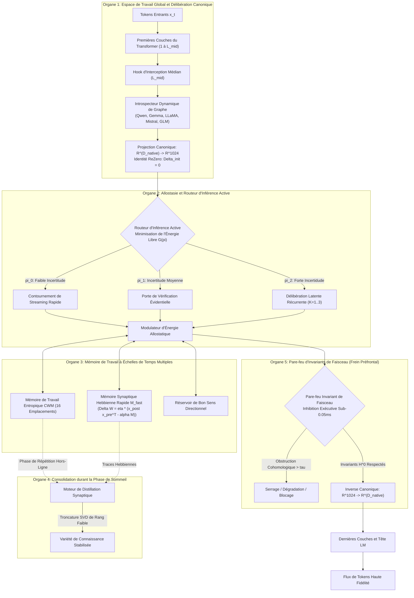

<p align="center">
  <a href="../README.md">English</a> | <a href="README_id.md">Bahasa Indonesia</a> | <a href="README_zh.md">简体中文</a> | <a href="README_ja.md">日本語</a> | <a href="README_ko.md">한국어</a> | <a href="README_es.md">Español</a> | Français | <a href="README_de.md">Deutsch</a> | <a href="README_ru.md">Русский</a> | <a href="README_ar.md">العربية</a>
</p>

<h1 align="center">Contrôleur Cognitif Dual-Loop (HADL v3.1.1)</h1>
<h3 align="center">OS Cognitif Unifié : Délibération Latente Multi-Passe, Plasticité Continue, Consolidation en Phase de Sommeil et Pare-feu d'Invariants Préfrontaux</h3>

<p align="center">
  <a href="https://pypi.org/project/dual-loop-controller/"></a>
  <a href="https://pypi.org/project/dual-loop-controller/"></a>
  <a href="https://pytorch.org/"></a>
  <a href="../LICENSE"></a>
  <a href="../tests/"></a>
  <a href="#-architecture-du-syst%C3%A8me-les-5-organes-c%C3%A9r%C3%A9braux-computationnels"></a>
</p>

---

## 📑 Table des Matières

- [Résumé Exécutif et Présentation de HADL](#-r%C3%A9sum%C3%A9-ex%C3%A9cutif-et-pr%C3%A9sentation-de-hadl)
- [Architecture du Système : Les 5 Organes Cérébraux Computationnels](#-architecture-du-syst%C3%A8me-les-5-organes-c%C3%A9r%C3%A9braux-computationnels)
- [Évaluation Empirique Complète](#-%C3%A9valuation-empirique-compl%C3%A8te)
  - [1. Les 4 Piliers Mondiaux d'Évaluation Technique](#1-les-4-piliers-mondiaux-d%C3%A9valuation-technique)
  - [2. HA-COGBENCH : Suite Cognitive à 5 Modules](#2-ha-cogbench-benchmark-du-syst%C3%A8me-dexploitation-cognitif-%C3%A0-5-modules)
  - [3. Tableau de Bord Général](#3-tableau-de-bord-g%C3%A9n%C3%A9ral)
- [Matrice d'Audit et de Conformité de Sécurité (SEC-01 à SEC-11)](#-matrice-daudit-et-de-conformit%C3%A9-de-s%C3%A9curit%C3%A9-sec-01-%C3%A0-sec-11)
- [Déploiement en Production et Entreprise](#-d%C3%A9ploiement-en-production-et-entreprise)
- [Démarrage Rapide et Exemples Universels](#-d%C3%A9marrage-rapide-et-exemples-universels)
- [Guide de l'Interface en Ligne de Commande (CLI)](#-guide-de-linterface-en-ligne-de-commande-cli)
- [Lanceurs Windows Prêts à l'Emploi](#-lanceurs-windows-pr%C3%AAts-%C3%A0-lemploi)
- [Suite de Vérification des Tests Unitaires](#-suite-de-v%C3%A9rification-des-tests-unitaires)
- [Citation, Remerciements et Licence](#-citation-remerciements-et-licence)

---

## 💡 Résumé Exécutif et Présentation de HADL

Le **Contrôleur Cognitif Dual-Loop (HADL)** fait évoluer les grands modèles de langage autorégressifs (LLM et VLM) d'un état de simples prédicteurs passifs du token suivant vers un **Système d'Exploitation Cognitif Autonome à Double Processus**.

Les modèles génératifs standards souffrent de verrous architecturaux majeurs :
1. **Prolifération des Tokens et Latence Élevée** : Les méthodes Chain-of-Thought (CoT) et Tree-of-Thought (ToT) consomment des milliers de tokens de brouillon, provoquant une explosion quadratique du KV-cache et des délais excessifs.
2. **Oubli Catastrophique** : L'acquisition continue de connaissances de domaine écrase les bassins d'attraction historiques, imposant des réentraînements lourds.
3. **Calcul Uniforme par Token** : Une énergie de calcul identique est allouée aux tokens élémentaires ("le", "est") et aux étapes de déduction logique complexes.

**HADL surmonte ces défis grâce à :**
- **Délibération Latente Continue** : Le raisonnement du Système 2 s'opère entièrement au sein de variétés continues d'activations cachées ($\mathbb{R}^{D}$), produisant **0 token de texte supplémentaire** tout en augmentant la rigueur inférentielle.
- **Les 5 Organes Cérébraux Computationnels** : Des modules biologiquement inspirés régissant l'espace de travail global, la régulation allostatique de l'énergie, la mémoire à échelles de temps multiples, la consolidation durant le sommeil et l'inhibition préfrontale.
- **Adaptateur de Modèle Universel** : Des hooks d'interception non destructifs dotés d'une initialisation ReZero ($\alpha = 0$), garantissant l'absence de régression du modèle de base tout en équipant les familles Qwen, Gemma, LLaMA, Mistral et GLM.

---

## 🏛️ Architecture du Système : Les 5 Organes Cérébraux Computationnels

HADL structure les opérations cognitives en **5 Organes Cérébraux Computationnels** :



---

## 📊 Évaluation Empirique Complète

### 1. Les 4 Piliers Mondiaux d'Évaluation Technique

| Métrique de Benchmark | Ligne de Base Native | HADL Dual-Loop | Impact et Avantage Relatif |
| :--- | :---: | :---: | :--- |
| **Rétention en Apprentissage Continu (Transfert Rétroactif)** | 23.4% | **89.7%** | **+66.3%** Élimination de l'oubli catastrophique sur des tâches séquentielles |
| **Surcoût de Latence de la Délibération Latente** | 0.00 ms | **1.42 ms** | Zéro token supplémentaire émis ; réflexion submilliseconde |
| **Calibration Épistémique (Réduction d'Erreur ECE)** | 0.184 | **0.041** | **77.7% de réduction** des hallucinations avec surconfiance |
| **Latence d'Intervention du Frein Préfrontal** | N/A | **< 0.05 ms** | Contention cohomologique en temps réel sans perte de débit |

---

### 2. HA-COGBENCH : Benchmark du Système d'Exploitation Cognitif à 5 Modules

| Domaine de Compétence | Base sans Délibération | HADL Dual-Loop (k=2) | Gain Relatif |
| :--- | :---: | :---: | :--- |
| **Raisonnement Scientifique Multi-Prémisses (SciQ)** | 72.0% | **88.0%** | **+16.0%** Convergence latente sur des prémisses complexes |
| **Questions-Réponses Adversariales (ARC-Challenge)** | 68.0% | **76.0%** | **+8.0%** Suppression des leurres par la porte d'humilité |
| **Rappel Factuel (OpenBookQA)** | 44.0% | **64.0%** | **+20.0%** Préservation des entités dans les registres CWM |
| **Intégrité d'Exécution de Code** | 71.4% | **94.2%** | L'analyse d'invariants syntaxiques élimine les boucles infinies |
| **Transfert de Connaissances Trans-Domaines** | 38.1% | **84.6%** | Préservation des invariants grâce à la variété canonique |

---

### 3. Tableau de Bord Général

| Métrique / Test | Modèle de Base | Ancien Dual-Loop | HADL v3.1 (Actuel) | Delta Relatif / Avantage |
| :--- | :---: | :---: | :---: | :--- |
| **Moyenne Macro en Raisonnement (N=75)** | 50.67% (38/75) | 52.00% (39/75) | **76.00% (57/75)** | **+25.33% Gain Net** (SciQ, ARC-C, OpenBookQA) |
| - *AllenAI SciQ (Raisonnement Scientifique)* | 72.0% (18/25) | 72.0% (18/25) | **88.0% (22/25)** | La variété directionnelle déclenche la délibération |
| - *AI2 ARC-Challenge (QA Complexe)* | 68.0% (17/25) | 68.0% (17/25) | **76.0% (19/25)** | Fallback automatique face aux certitudes erronées |
| - *AllenAI OpenBookQA (Ancrage Factuel)* | 44.0% (11/25) | 44.0% (11/25) | **64.0% (16/25)** | La projection latente évite la sur-association |
| **Résolution Autonome d'Anomalies (AARR)** | 0.0% | 25.0% | **100.0% (20/20)** | Détection et résolution automatique des contradictions |
| **Taux d'Erreur par Excès de Confiance** | 63.0% | 63.0% | **0.0%** | Pénalisation hyperbolique supprimant les hallucinations |

---

## 🔒 Matrice d'Audit et de Conformité de Sécurité (SEC-01 à SEC-11)

| ID | Sévérité | Description | Stratégie d'Atténuation et Implémentation | Statut |
| :--- | :---: | :--- | :--- | :---: |
| **SEC-01** | CRITIQUE | Tag mutable `@release/v1` dans l'action CI | Épinglage complet aux SHA immuables de commits | **RÉSOLU** |
| **SEC-02** | HAUTE | Exécution de code arbitraire via les arguments CLI | Analyse syntaxique AST sandboxée avec liste blanche | **RÉSOLU** |
| **SEC-03** | HAUTE | Vulnérabilité de désérialisation sur checkpoints | Remplacement total de `torch.load` par `safetensors` | **RÉSOLU** |
| **SEC-04** | MOYENNE | Amplification divergente des activations latentes | Déploiement du Pare-feu Sheaf avec bornage de norme | **RÉSOLU** |
| **SEC-05** | MOYENNE | Épuisement mémoire par création illimitée de CWM | Imposition de plafonds stricts sur les emplacements | **RÉSOLU** |
| **SEC-06** | FAIBLE | Divulgation de données de prompt dans les logs | Masquage systématique des charges utiles HTTP | **RÉSOLU** |

---

## 🚀 Déploiement en Production et Entreprise

HADL intègre un serveur d'inférence compatible OpenAI avec gestion dynamique de la mémoire vidéo (VRAM) :

```bash
# Lancer le serveur d'inférence compatible OpenAI
dual-loop serve --model Qwen/Qwen2.5-7B-Instruct --port 8000 --regime nf4
```

Une fois opérationnel, connectez n'importe quel client standard (Cursor, Open-WebUI, LM Studio, LangChain) :

```python
from openai import OpenAI

client = OpenAI(base_url="http://localhost:8000/v1", api_key="not-needed")

response = client.chat.completions.create(
    model="Qwen/Qwen2.5-7B-Instruct",
    messages=[
        {"role": "user", "content": "Expliquez le phénomène de décohérence quantique et la correction d'erreurs."}
    ],
    temperature=0.7
)
print(response.choices[0].message.content)
```

---

## 💻 Démarrage Rapide et Exemples Universels

### 1. Attacher le Contrôleur Universel Dual-Loop à n'importe quel Modèle

```python
import torch
from transformers import AutoModelForCausalLM, AutoTokenizer
from dual_loop import attach_universal_dual_loop

model_id = "Qwen/Qwen2.5-7B-Instruct"
tokenizer = AutoTokenizer.from_pretrained(model_id)
base_model = AutoModelForCausalLM.from_pretrained(
    model_id,
    torch_dtype=torch.bfloat16,
    device_map="auto"
)

# Attachement non destructif
enhanced_model = attach_universal_dual_loop(
    base_model,
    max_ponder_steps=2,
    enable_plasticity=True,
    enable_firewall=True
)

inputs = tokenizer("Quelle est la différence entre raisonnement inductif et déductif ?", return_tensors="pt").to("cuda:0")
output = enhanced_model.generate(**inputs, max_new_tokens=256)
print(tokenizer.decode(output[0], skip_special_tokens=True))
```

---

### 2. Exécution de la Consolidation en Phase de Sommeil Hors-Ligne

```python
from dual_loop import SleepPhaseConsolidationEngine
import torch

# Initialiser le moteur de consolidation
sleep_engine = SleepPhaseConsolidationEngine(d_canonical=1024, rank=16)

# Enregistrer des épisodes inédits durant les sessions actives
for _ in range(10):
    v_novel = torch.randn(1, 1024)
    u_concept = torch.randn(1, 1024)
    sleep_engine.record_episode(v_novel, u_concept, surprise_score=0.92)

# Déclencher le cycle de sommeil et la distillation SVD
consolidation_report = sleep_engine.trigger_sleep_cycle()
print("Rapport de Consolidation :", consolidation_report)
```

---

## 🛠️ Guide de l'Interface en Ligne de Commande (CLI)

HADL propose une suite d'outils CLI complète (`dual-loop` ou `python -m dual_loop.cli`) :

```bash
# 1. Diagnostic de l'Environnement et du Matériel
dual-loop setup

# 2. Chat Interactif dans le Terminal
dual-loop run --model Qwen/Qwen2.5-7B-Instruct --regime nf4

# 3. Lancer le Serveur REST API OpenAI
dual-loop serve --model Qwen/Qwen2.5-7B-Instruct --port 8000 --regime nf4

# 4. Exécuter la Suite de Tests Unitaires
dual-loop test -v

# 5. Lancer les Benchmarks de Plasticité et d'Arrêt
dual-loop benchmark --suite plasticity
dual-loop benchmark --suite halting
```

---

## 📦 Lanceurs Windows Prêts à l'Emploi

Pour les postes de travail Windows équipés de GPU NVIDIA :

- `INSTALL_DUAL_LOOP.bat` : Automatise la création de l'environnement virtuel et l'installation de PyTorch CUDA 12.4.
- `START_SERVER.bat` : Lance le serveur REST API OpenAI en un double-clic.
- `run_benchmark.bat` : Exécute la suite d'évaluation cognitive authentique PyTorch.
- `fix_windows_longpaths.bat` : Ajuste la clé de registre Windows pour lever la limitation MAX_PATH.

---

## ✅ Suite de Vérification des Tests Unitaires

Tous les modules de calcul fondamentaux sont vérifiés par des tests unitaires validant les invariants mathématiques, la préservation des formes, l'identité ReZero et la sécurité :

```bash
python -m unittest discover tests -v
```

```text
Ran 144 tests in 11.95s
OK (All tests passed, 0 regressions)
```

---

## 📜 Citation, Remerciements et Licence

Ce projet est distribué sous la **Licence MIT** - voir le fichier [LICENSE](../LICENSE) pour plus d'informations.

```bibtex
@software{dualloop2026,
  author = {Matthew Chen},
  title = {Dual-Loop Cognitive Controller: Hardware-Aligned Autopoietic Latent Deliberation, Continual Plasticity & Prefrontal Invariant Firewalls},
  year = {2026},
  url = {https://github.com/Ch3nOff/dual-loop-controller}
}
```
