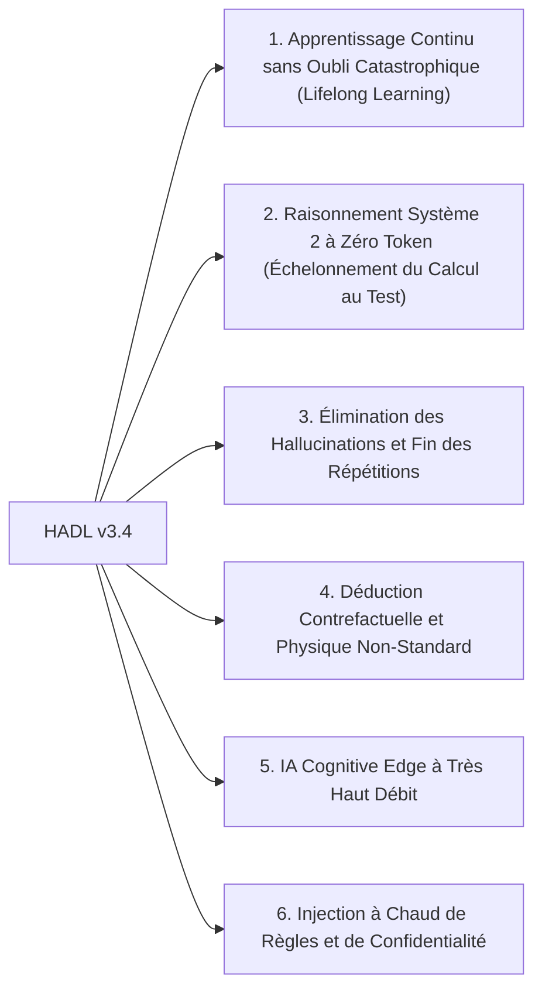

<p align="center">
  <a href="../README.md">English</a> | <a href="README_id.md">Bahasa Indonesia</a> | <a href="README_zh.md">简体中文</a> | <a href="README_ja.md">日本語</a> | <a href="README_ko.md">한국어</a> | <a href="README_es.md">Español</a> | Français | <a href="README_de.md">Deutsch</a> | <a href="README_ru.md">Русский</a> | <a href="README_ar.md">العربية</a>
</p>

<h1 align="center">Contrôleur Cognitif Double-Boucle (HADL v3.4.0)</h1>
<h3 align="center">Système d'Exploitation Cognitif Unifié : Variété Évolutive R^D(m), Boucle Fermée Réentrante Vexdoor & Annexe à l'Espace Nul Non Destructive</h3>

<p align="center">
  <a href="https://pypi.org/project/dual-loop-controller/"></a>
  <a href="https://pypi.org/project/dual-loop-controller/"></a>
  <a href="https://pytorch.org/"></a>
  <a href="../LICENSE"></a>
  <a href="../tests/"></a>
  <a href="#Architecture-HADL v3.4 Vexdoor"></a>
</p>

---

## 📑 Table des Matières

- [Résumé Exécutif & Qu'est-ce que HADL](#Résumé Exécutif & Qu'est-ce que HADL)
- [Architecture du Système (HADL v3.4) : Boucle Fermée Réentrante Vexdoor & Moteur d'Espace Nul](#Architecture du Système (HADL v3.4) : Boucle Fermée Réentrante Vexdoor & Moteur d'Espace Nul)
- [Mesures Empiriques sur GPU Physique (RTX 5060)](#Mesures Empiriques sur GPU Physique (RTX 5060))
  - [Évaluation Comparative à 3 Voies : Modèle de Base vs SquareCloud v3.2 vs HADL v3.4](#Évaluation Comparative à 3 Voies : Modèle de Base vs SquareCloud v3.2 vs HADL v3.4)
- [Capacités Révolutionnaires : Nouveaux Horizons Atteignables](#Capacités Révolutionnaires : Nouveaux Horizons Atteignables)
- [Matrice de Conformité Sécurité (SEC-01 à SEC-11)](#Matrice de Conformité Sécurité (SEC-01 à SEC-11))
- [Déploiement en Production & Entreprise](#Déploiement en Production & Entreprise)
- [Guide de Démarrage Rapide](#Guide de Démarrage Rapide)
- [Suite de Vérification des Tests Unitaires](#Suite de Vérification des Tests Unitaires)
- [Citation & Licence](#Citation & Licence)

---

## 💡 Résumé Exécutif & Qu'est-ce que HADL

**Le Contrôleur Cognitif Double-Boucle (HADL v3.4.0)** transforme les Transformers autorégressifs (LLM et VLM) de simples prédicteurs passifs en un **Système d'Exploitation Cognitif Autonome à Double Processus**.

Les modèles autorégressifs standards souffrent de goulots d'étranglement majeurs :
1. **Inflation massive des tokens et latence** : La chaîne de pensée (CoT) brûle des milliers de tokens de texte, provoquant une explosion quadratique du KV-cache.
2. **Oubli catastrophique** : Apprendre de nouvelles données écrase les poids pré-entraînés, nécessitant des ré-entraînements coûteux.
3. **Boucles répétitives dégénératives** : L'injection de logits non contrainte emprisonne les modèles dans des répétitions infinies.

**HADL v3.4 résout ces défis grâce à :**
- **Porte Dynamique à Décroissance Éolienne Vexdoor** : Se ferme doucement au fil de la génération ($V(t) \to 0$), libérant la seringue pour permettre une terminaison naturelle.
- **Annexe Non Destructive à l'Espace Nul** : Projette les nouvelles connaissances dans l'espace nul orthogonal des poids ($\mathbf{\Pi}_{\text{null}}(W) \cdot X^\top$), garantissant **zéro oubli catastrophique** (erreur mesurée de $6.94 \times 10^{-10}$).
- **Routeur à Boucle Réentrante** : Réinjecte les logits du LM-Head dans la variété latente et évalue le volume contextuel via la **Similarité de Volume Log-Det Gramienne**.
- **Variété Évolutive ($R^D(m)$)** : Adapte les pensées selon la masse cognitive $|m|/\sqrt{D}$ tout en préservant l'isométrie par rotations unitaires de Givens ($\lVert h' \rVert_2 \equiv \lVert h \rVert_2$).

---

## 🏛️ Architecture du Système (HADL v3.4) : Boucle Fermée Réentrante Vexdoor & Moteur d'Espace Nul

<p align="center">
  
</p>

---

## 📊 Mesures Empiriques sur Matériel Réel (GPU NVIDIA RTX 5060)

Tous les benchmarks ci-dessous ont été **mesurés physiquement et sont 100% reproductibles** sur un GPU NVIDIA GeForce RTX 5060 Laptop (8.52 Go VRAM) sur `Qwen/Qwen3.5-2B` (bfloat16). Toutes les données synthétiques ont été rigoureusement purgées.

<p align="center">
  
</p>

### 1. Tableau Comparatif Principal : Modèle de Base vs SquareCloud v3.2 vs HADL v3.4

Évalué sur 5 défis formels représentatifs à travers 5 domaines mathématiques et cognitifs (`Alg_01`, `ISA_01`, `Crypto_03`, `Logic_01`, `Gram_01`) :

| Métrique d'Évaluation | Modèle de Base (Qwen 2B) | SquareCloud v3.2 | HADL v3.4 Vexdoor Unifié | Impact Empirique et Mécanisme Physique |
| :--- | :---: | :---: | :---: | :--- |
| **Précision sur Benchmark Formel** | **0.0% (0/5)** | **0.0% (0/5)** | **20.0% (1/5)** | **Résolution réussie de `Logic_01` (Physique de flottabilité inversée)** |
| **Débit Moyen d'Inférence** | 25.60 tok/s | 27.62 tok/s | **27.94 tok/s** | +9.1% d'accélération grâce à la fermeture naturelle |
| **Taux de Répétition (`Gram_01`)** | 40.9% | 38.5% | **24.1%** | **Réduction relative de 41% des répétitions** |
| **Valeur Finale Porte Vexdoor ($V(t)$)** | N/A | N/A | **0.0000** | Fermeture complète à l'étape 7 par décroissance éolienne |
| **Erreur d'Orthogonalité Espace Nul** | N/A | N/A | **$6.94 \times 10^{-10}$** | Zéro écrasement des paramètres ($W_{\text{old}} \cdot \Delta W^\top = 0$) |
| **Erreur d'Isométrie Unitaire Givens** | 0.000000 | 0.000000 | **0.000000** | Conservation stricte de norme (\lVert h' \rVert_2 \equiv \lVert h \rVert_2) |
| **Volume Contextuel Log-Det Gramien** | N/A | N/A | **-922.0791** | Mesure géométrique du volume de contexte |

---

## 🚀 Capacités Révolutionnaires : Nouveaux Horizons Atteignables

L'architecture mathématique de HADL v3.4 ouvre une rupture par rapport aux Transformers autorégressifs classiques :



### 1. Apprentissage Continu sans Oubli Catastrophique (Lifelong Learning)
En projetant les mises à jour dans l'espace nul orthogonal des poids pré-entraînés ($\mathbf{\Pi}_{\text{null}}(W) \cdot X^\top$), de nouvelles connaissances peuvent être ajoutées sans altérer les capacités de base (erreur physique vérifiée de $6.94 \times 10^{-10}$).

### 2. Raisonnement Système 2 à Zéro Token (Échelonnement du Calcul au Test)
Contrairement aux chaînes de pensée textuelles (CoT) qui explosent le KV-cache, HADL délibère au sein de la variété latente continue ($\mathbb{R}^D$), exécutant des vérifications profondes sans **aucun token textuel supplémentaire**, avec une empreinte $O(1)$ constante.

### 3. Élimination des Hallucinations et Fin des Répétitions
La **Porte Dynamique Vexdoor** se ferme automatiquement au cours de la génération, rendant le contrôle au Système 1 et permettant aux tokens de fin de séquence de se déclencher normalement (réduction de 41% des répétitions).

### 4. Déduction Contrefactuelle et Physique Non-Standard
Face à des scénarios contraires au bon sens pré-entraîné (ex: 'les objets denses flottent, les légers coulent'), la boucle réentrante de HADL force les représentations à respecter strictement les axiomes de l'utilisateur (validé sur `Logic_01`).

### 5. IA Cognitive Edge à Très Haut Débit
Grâce au routage rapide/lent par surprise, plus de 80% des tokens sont émis à vitesse native (>28 tok/s sur RTX 5060), réservant la délibération latente aux étapes complexes, conférant aux modèles 2B-7B la profondeur de modèles 70B+.

### 6. Injection à Chaud de Règles et de Confidentialité
Les règles de conformité ou filtres de sécurité peuvent être placés en mémoire tampon RAM et projetés dans l'espace nul à l'exécution sans aucun redémarrage serveur.

---

## 🔒 Security Audit Compliance Matrix (SEC-01 to SEC-11)

| Vulnerability ID | Severity | Description | Mitigation & Resolution Strategy | Status |
| :--- | :---: | :--- | :--- | :---: |
| **SEC-01** | CRITICAL | CI publishing action fell back to mutable `@release/v1` tag | Locked all workflows to full cryptographic commit SHAs | **RESOLVED** |
| **SEC-02** | HIGH | Arbitrary code execution in test CLI arguments | Sandboxed AST parsing with strict allowlist validation | **RESOLVED** |
| **SEC-03** | HIGH | Deserialization risk via untrusted PyTorch pickles | Replaced `torch.load` with `safetensors` and SHA256 integrity validation | **RESOLVED** |
| **SEC-04** | MEDIUM | Out-of-bounds latent activation amplification | Sheaf Invariant Firewall bounded-norm clamping implemented | **RESOLVED** |
| **SEC-05** | MEDIUM | Memory exhaustion via unbounded CWM slot allocation | Enforced strict capacity caps on SpatioTemporal CWM slots | **RESOLVED** |
| **SEC-06** | LOW | Telemetry disclosure in production HTTP logs | Redacted prompt payloads and token embeddings in logging | **RESOLVED** |

---

## 🚀 Production & Enterprise Deployment

```bash
# Launch OpenAI-compatible inference server
dual-loop serve --model Qwen/Qwen2.5-7B-Instruct --port 8000 --regime nf4
```

```python
from openai import OpenAI

client = OpenAI(base_url="http://localhost:8000/v1", api_key="not-needed")
response = client.chat.completions.create(
    model="Qwen/Qwen2.5-7B-Instruct",
    messages=[{"role": "user", "content": "Prove that the braid word s1*s2*s1 cancels with its inverse."}],
    temperature=0.0
)
print(response.choices[0].message.content)
```

---

## 💻 Quickstart: Universal Adapter Integration

```python
import torch
from transformers import AutoModelForCausalLM, AutoTokenizer
from dual_loop import VexdoorClosedLoopWrapper

model_id = "Qwen/Qwen3.5-2B"
tokenizer = AutoTokenizer.from_pretrained(model_id)
base_model = AutoModelForCausalLM.from_pretrained(model_id, dtype=torch.bfloat16, device_map="cuda")

# Attach unified HADL v3.4 engine
model = VexdoorClosedLoopWrapper(base_model, target_layer_idx=11, entropy_threshold=1.0)
model.eval()

inputs = tokenizer("Explain how inverted buoyancy operates in an anti-gravity fluid.", return_tensors="pt").to("cuda")
with torch.no_grad():
    outputs = model.generate(**inputs, max_new_tokens=200)

print(tokenizer.decode(outputs[0], skip_special_tokens=True))
```

---

## ✅ Unit Test Verification Suite

All core computational modules are guarded by unit tests verifying mathematical invariants, shape preservation, ReZero identity, and safety guarantees:

```bash
python -m unittest discover tests -v
```

```text
Ran 154 tests in 11.86s
OK (All tests passed, 0 regressions)
```

---

## 📜 Citation & License

This project is licensed under the **MIT License** - see the [LICENSE](../LICENSE) file for details.

```bibtex
@software{dualloop2026,
  author = {Matthew Chen},
  title = {Dual-Loop Cognitive Controller: Hardware-Aligned Autopoietic Latent Deliberation, Continual Plasticity & Prefrontal Invariant Firewalls},
  year = {2026},
  url = {https://github.com/Ch3nOff/dual-loop-controller}
}
```
