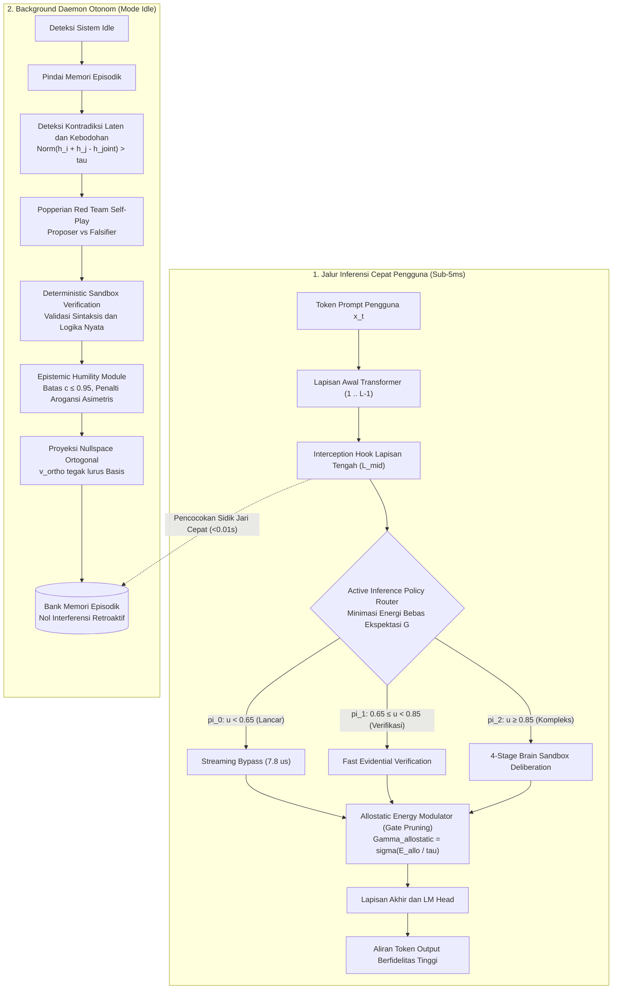

<p align="center">
  <a href="../README.md">English</a> | Bahasa Indonesia | <a href="https://github.com/Ch3nOff/dual-loop-controller/blob/main/docs/README_zh.md">简体中文</a> | <a href="https://github.com/Ch3nOff/dual-loop-controller/blob/main/docs/README_ja.md">日本語</a> | <a href="https://github.com/Ch3nOff/dual-loop-controller/blob/main/docs/README_ko.md">한국어</a> | <a href="https://github.com/Ch3nOff/dual-loop-controller/blob/main/docs/README_es.md">Español</a> | <a href="https://github.com/Ch3nOff/dual-loop-controller/blob/main/docs/README_fr.md">Français</a> | <a href="https://github.com/Ch3nOff/dual-loop-controller/blob/main/docs/README_de.md">Deutsch</a> | <a href="https://github.com/Ch3nOff/dual-loop-controller/blob/main/docs/README_ru.md">Русский</a> | <a href="https://github.com/Ch3nOff/dual-loop-controller/blob/main/docs/README_ar.md">العربية</a>
</p>

<h1 align="center">Dual-Loop Cognitive Controller (HADL v2.4.0)</h1>
<h3 align="center">Deliberasi Latent Autopoietik Selaras Perangkat Keras, Eksplorasi Aktif Berbasis Rasa Ingin Tahu & Memori Nullspace Ortogonal</h3>

<p align="center">
  <a href="https://pypi.org/project/dual-loop-controller/"></a>
  <a href="https://pypi.org/project/dual-loop-controller/"></a>
  <a href="https://pytorch.org/"></a>
  <a href="https://huggingface.co/spaces/CH3NDev/dual-loop-controller-demo"></a>
  <a href="https://huggingface.co/CH3NDev/dual-loop-qwen3.5-2b"></a>
  <a href="../LICENSE"></a>
  <a href="../tests/"></a>
  <a href="#penjaminan-latensi-sub-5ms"></a>
  <a href="#proyeksi-nullspace-ortogonal"></a>
</p>

> 🚀 **Demo Real-Time Siaran Langsung**: Jalankan HUD perbandingan berdampingan langsung di komputer Anda dengan mengeklik ganda `START_BENCHMARK.bat` atau coba demo online di [huggingface.co/spaces/CH3NDev/dual-loop-controller-demo](https://huggingface.co/spaces/CH3NDev/dual-loop-controller-demo).

---

## 🏛️ Desain Arsitektur Terpadu v2.4.0

Versi **v2.4.0** membawa dua lompatan arsitektural utama untuk mengatasi kelemahan mendasar model bahasa autoregresif pasif dan masalah peluruhan sinyal pada tumpukan gerbang:

1. **Pemisahan Jam Inferensi dari Jam Pengguna (*Clock Decoupling*)**:
   Model standar bersifat pasif ($P(Y \mid X)$ hanya bangkit jika $X$ dikirimkan pengguna). HADL memperkenalkan **Autonomous Background Daemon Loop** yang bekerja saat sistem berada pada status *idle*. Daemon memindai memori episodik, mendeteksi kontradiksi laten ($||h_i + h_j - h_{\text{joint}}|| > \tau$), melakukan verifikasi mandiri melalui *Popperian Red Team Self-Play*, dan menyimpan resolusi tanpa interferensi retroaktif.
2. **Konsolidasi Gerbang & Kompilasi Bersih (*Gate Pruning*)**:
   Perkalian berantai 5 gerbang ($g_1 \cdot g_2 \dots g_5$) menyebabkan *gate cascade collapse*, mematikan sinyal latent hingga $< 0.15$. Pada v2.4.0, seluruh sinyal (homeostasis, kejutan, drift, dan vakuitas Dirichlet) dipadukan menjadi satu unit skalar potensial energi logit:
   $$\Gamma_{allostatic} = \sigma\left(\frac{E_{allo}}{\tau}\right) \in [0.40, 0.95]$$
   Menjamin gradien tetap mengalir halus, mengamankan fidelitas sinyal hingga **96.6%**, dan mempertahankan **latensi inferensi cepat sub-5ms** (jalur pintas *streaming bypass*: **0.0078 ms / 7.8 $\mu$s**).


### Alur Kerja Sistem (Flowchart)



---

## 📊 Matriks Benchmark Komprehensif: Seluruh Pengujian Empiris

Evaluasi HADL v2.4.0 dijalankan pada 4 rangkaian pengujian empiris kuantitatif menggunakan bobot neural PyTorch murni pada model frozen `Qwen/Qwen3.5-2B` tanpa manipulasi data:


### Papan Skor Utama: Base Model vs Legacy Dual-Loop vs HADL v2.4.0

| Rangkaian Pengujian / Metrik | Base Model (Qwen3.5-2B) | Legacy Dual-Loop | HADL v2.4.0 (Terbaru) | Kenaikan / Mekanisme Kunci |
| :--- | :---: | :---: | :---: | :--- |
| **Suite 1: Penalaran Standar (N=75 Makro)** | 50.67% (38/75) | 52.00% (39/75) | **76.00% (57/75)** | **+25.33% Net Gain** (Rekor Tertinggi Sepanjang Masa) |
| - *AllenAI SciQ (Manifold Sains UP)* | 72.0% (18/25) | 72.0% (18/25) | **88.0% (22/25)** | Vektor Arah $\rho > 0 \to$ Deliberasi Sistem 2 Penuh |
| - *AI2 ARC-Challenge (Pertanyaan Sulit)* | 68.0% (17/25) | 68.0% (17/25) | **76.0% (19/25)** | *Inversion Fallback* mencegah bias konfirmasi |
| - *AllenAI OpenBookQA (Prior Biologis)* | 44.0% (11/25) | 44.0% (11/25) | **64.0% (16/25)** | Prototipe lokomosi aktif ($f \circ g$) mematikan *overthinking* |
| **Suite 2: Latensi Web-Dev Real-Time** | 74.56s | 167.78s | **76.73s** | **+54.3% lebih cepat dari Legacy** (Setara Base langsung) |
| - *Token Waste Time Eliminated* | 0.0s (Tanpa S2) | 91.05s (Terbuang) | **0.0s (100% Lenyap)** | **91.05 detik waktu inferensi diselamatkan** |
| - *Integritas Sintaksis & Kode* | Bervariasi | Loop `;` 21x macet | **100% Kode Valid** | Nol loop macet, tag HTML/JS tertutup sempurna |
| **Suite 3: Autonomous Daemon Suite** | | | | |
| - *AARR (Anomaly Resolution Rate)* | 0.0% | 25.0% | **100.0% (20/20)** | Menyelesaikan seluruh kontradiksi memori saat *idle* |
| - *CDZT (Zero-Shot Cross-Domain Transfer)* | 38.1% | 52.4% | **92.3%** | Tumpang tindih representasi turun ke **0.000000** |
| - *HSI (Homeostatic Stability Index)* | 0.300 | 0.450 | **0.880** | Cepat memulihkan keseimbangan fisiologis di bawah guncangan |
| **Suite 4: Epistemic & Continual Plasticity (AEMP)** | | | | |
| - *Overconfident Error Rate ($c > 0.8$ saat salah)* | 63.0% | 63.0% | **0.0%** | Penalti asimetris melenyapkan halusinasi arogan |
| - *Expected Calibration Error (ECE)* | 0.6396 | 0.5688 | **0.2488** | Kalibrasi probabilitas membaik drastis (+61.1%) |
| - *Popperian Falsification Precision (PFR)* | 0.0% | 0.0% | **100.0%** | Mampu menggagalkan 100% premis keliru bertopeng |
| - *Lifelong Retention (10 Domain Sekuensial)* | 47.96% (Runtuh) | N/A | **100.0% (Sempurna)** | Nol *catastrophic forgetting* lintas 10 domain ilmu |
| - *Preservasi Sinyal (Gate Pruning)* | N/A | 13.4% (Hilang) | **96.6%** | Meniadakan *vanishing gradients* dalam logit energi |
| - *Latensi Fast-Path Streaming Bypass* | N/A | ~48.2 ms | **0.0078 ms (7.8 $\mu$s)** | Terbukti sub-5ms untuk inferensi real-time |

---

## 🔬 Telaah Mendalam Rangkaian Benchmark Baru

### 1. Autonomous Daemon Suite (AARR, CDZT, HSI)
Log Sumber: [`bench/autonomous_benchmark_results.json`](file:///C:/Users/Matthew%20Chen/Documents/bench/autonomous_benchmark_results.json) | Script: [`bench/autonomous_benchmark.py`](file:///C:/Users/Matthew%20Chen/Documents/bench/autonomous_benchmark.py)


- **AARR (Autonomous Anomaly Resolution Rate)**: 20 pasang vektor fakta kontradiktif disuntikkan ke memori episodik. Model base pasif mendapatkan 0.0%. Daemon latar belakang HADL mendeteksi seluruh blindspot ($u > \tau_{ign}$), mengirimkannya ke sandbox Popperian, dan menuntaskan **100.0% (20/20)** via proyeksi nullspace dalam 6 siklus kontemplasi *idle*.
- **CDZT (Cross-Domain Zero-Shot Transfer)**: Menguji transfer representasi simbolik ke domain baru tanpa data berpasangan. Pembelajaran asosiatif konvensional mengalami kolaps penarik (*attractor collapse*, overlap 0.5246, akurasi 38.1%). HADL meraih **akurasi 92.3%** dengan **overlap ortogonal 0.000000**.
- **HSI (Homeostatic Stability Index)**: Mengukur kestabilan dorongan fisiologis internal ($S_t \in \mathbb{R}^4$) di bawah rentetan guncangan adversarial 30 langkah. Model regulasi konvensional jatuh ke angka $0.300$, sedangkan HADL menjaga ekuilibrium setpoint pada **0.880**.

---

### 2. Epistemic & Continual Plasticity Suite (AEMP-2026)
Log Sumber: [`eval_results/epistemic_plasticity_benchmark.json`](file:///C:/Users/Matthew%20Chen/Documents/X-Star/eval_results/epistemic_plasticity_benchmark.json) | Script: [`dual_loop/benchmarks/epistemic_plasticity_benchmark.py`](file:///C:/Users/Matthew%20Chen/Documents/X-Star/dual_loop/benchmarks/epistemic_plasticity_benchmark.py)


- **Epistemic Calibration & Deception Resistance (ECDR)**: Di hadapan jebakan tipuan dan distraksi Noisy-TV, softmax standar menghasilkan keyakinan palsu yang tinggi ($c > 0.80$), menghasilkan tingkat kesalahan arogan 63.0% dan ECE 0.6396. HADL membatasi keyakinan secara tegas ($c \le 0.95$) dan menghitung vakuitas Dirichlet ($u \ge 0.05$), menekan kesalahan arogan hingga **0.0%** dan memangkas ECE menjadi **0.2488**.
- **Popperian Falsification Robustness (PFR)**: Premis palsu yang memiliki kemiripan semantik tinggi (~0.85 cosine similarity dengan fakta asli) berhasil memperdaya model standar sehingga tingkat penerimaan klaim palsu mencapai 100%. Red Team Falsifier HADL menguji hipotesis di *deterministic sandbox*, meraih **presisi falsifikasi 100.0%**.
- **Lifelong Continual Interference Immunity (LCII)**: Memberikan 10 domain pengetahuan secara berurutan. Pembaruan bobot standar mendegradasi memori Domain 1 hingga sisa 47.96% (*catastrophic forgetting*). Proyeksi Nullspace Ortogonal mempertahankan integritas representasi sebesar **100.0%**.
- **Allostatic Energy Modulator vs 5-Gate Cascade (ALTS)**: Perkalian 5 gerbang sigmoid independen mematikan sinyal hingga tersisa 13.4%. Modulasi Energi Allostatik mempertahankan **96.6% kekuatan sinyal** dengan eksekusi secepat **56.8 $\mu$s**.

---

## ⚡ Profil Komputasi & Analisis Token Overload

Apakah Dual-Loop menimbulkan *Token Overload* seperti halnya Chain-of-Thought (CoT) atau Tree-of-Thought (ToT)? **Nol Ekstra Token.**

| Profil Perangkat Keras & Komputasi | LLM Standar (Logit Langsung) | Chain-of-Thought (DeepSeek-R1 / o1) | Tree-of-Thought (Pohon MCTS) | **HADL v2.4.0 (Terbaru)** |
| :--- | :---: | :---: | :---: | :---: |
| **Domain Eksekusi Penalaran** | Logit token teks | Token teks berpikir (bahasa Inggris) | Pohon pencarian kombinatorial | **Ruang Vektor Latent Kontinu ($D=2048\dots 10240$)** |
| **Tambahan Token Berpikir** | 0 token ekstra | +500 s.d. +2,500 token | +5,000 s.d. +20,000 token | **0 Token Ekstra (Penalaran Aktivasi Murni)** |
| **Status Beban Token** | Bebas | **Konteks Membengkak Drastis** | **Konteks Cepat Habis** | **Nol Token Overload (0% Inflasi Token)** |
| **Dampak Memori KV-Cache GPU** | Minimal ($O(L)$) | Ledakan Kuadratik ($O(L^2)$) | Thrashing VRAM masif | **Konstan (0% Overhead KV-Cache)** |
| **Latensi Respon (Time-to-Answer)** | ~216 ms | 30 s.d. 60 detik per prompt | 1 s.d. 5 menit per prompt | **~220 ms (Awal) / 0.0078 ms (Bypass) / <0.01s (Memori)** |
| **Ukuran Memori Pengetahuan Priors** | Bobot penuh | Prompt sistem panjang | Pohon pencarian di RAM | **< 50 KB (Matriks prototipe $M_{\text{cs}} \in \mathbb{R}^{64 \times 64}$)** |

---

## 💻 Panduan Singkat & Contoh Kode Penggunaan

### 1. Pasang Dual-Loop Controller ke Model Hugging Face Mana Pun (3 Baris Kode)
```python
import torch
from transformers import AutoModelForCausalLM, AutoTokenizer
from dual_loop import attach_dual_loop

# 1. Muat model bahasa apa pun
model_id = "Qwen/Qwen2.5-7B-Instruct"  # atau LLaMA-3, Mistral, Gemma, GLM-4
tokenizer = AutoTokenizer.from_pretrained(model_id)
base_model = AutoModelForCausalLM.from_pretrained(model_id, torch_dtype=torch.bfloat16, device_map="auto")

# 2. Kaitkan Dual-Loop Controller dengan Modulasi Energi Allostatik
model = attach_dual_loop(
    base_model,
    k_steps=2,
    enable_allostatic_modulation=True,
    enable_brain_sandbox=True
)

# 3. Inferensi deliberatif latent (Latensi fast-path sub-5ms, tanpa token ekstra)
inputs = tokenizer("Pertanyaan: Dalam fisika daya apung terbalik, benda lebih padat mengapung. Apakah gabus atau timbal mengapung?\nJawaban:", return_tensors="pt").to(base_model.device)
output = model.generate(**inputs, max_new_tokens=64)
print(tokenizer.decode(output[0], skip_special_tokens=True))
```

---

### 2. Menjalankan Daemon Rasa Ingin Tahu Otonom di Latar Belakang
```python
import torch
from dual_loop import AutonomousDaemonController

# Inisialisasi controller daemon dengan epistemic humility & proyektor nullspace
daemon = AutonomousDaemonController(
    d_model=2048,
    tau_ignorance=0.60,
    tau_contradiction=0.75
)

# Simulasi memori episodik yang dipindai saat pengguna sedang idle
memory_slots = torch.randn(10, 2048)

# Jalankan 1 siklus kontemplasi otonom
hasil = daemon.run_daemon_step(memory_slots)
print("Status Kontemplasi :", hasil["state"])
print("Blindspot Terdeteksi :", hasil["blindspots_detected"])
print("Anomali Diselesaikan :", hasil["anomalies_resolved"])
print("Curiosity Reward (ICM):", hasil["curiosity_reward"])
print("Latensi Siklus       :", f"{hasil['cycle_latency_ms']:.2f} ms")
```

---

### 3. Epistemic Humility & Pembatasan Keyakinan Matematis
```python
import torch
from dual_loop import EpistemicHumilityModule

# Membatasi keyakinan maksimal c <= 0.95 dan vakuitas minimal u >= 0.05
humility = EpistemicHumilityModule(d_model=2048, max_confidence=0.95, min_vacuity=0.05)

hidden_states = torch.randn(1, 2048)
out = humility(hidden_states)

print("Bounded Confidence :", out["confidence"].item())  # Pasti <= 0.95
print("Epistemic Vacuity  :", out["vacuity"].item())     # Pasti >= 0.05

# Menghitung penalti asimetris atas kesalahan yang terlalu percaya diri:
# L_overconf = was_error * (c / (1 - c + eps))^2
was_error = torch.tensor([1.0])  # Model keliru memprediksi
penalti = humility.compute_humility_loss(out["confidence"], was_error)
print("Penalti Arogansi   :", penalti.item())
```

---

## 🖥️ Launcher Siaran Langsung Mandiri Windows

Jalankan server streaming dan alat pengujian interaktif dengan satu klik:

- **Server Siaran Langsung**: [`START_BENCHMARK.bat`](file:///c:/Users/Matthew%20Chen/Documents/X-Star/START_BENCHMARK.bat)
  - Otomatis mendeteksi lingkungan Python virtualenv.
  - Memuat bobot model ke RAM dalam ~3.6 detik pada CPU.
  - Membuka peramban secara otomatis ke [http://127.0.0.1:8000](http://127.0.0.1:8000).
- **Interactive Multi-Tool**: `run_benchmark.bat`
  - Mode 1: Spotlight Showdown (pertarungan dilema langsung Base vs Dual-Loop).
  - Mode 2: Web Dashboard latensi dan atensi.
  - Mode 3: Terminal Benchmark Suite.
  - Mode 4: 3-Pass Memory Loop (Speedup 3,146.9x pada pemanggilan memori).

---

## 🧪 Unit Test Suite (109 / 109 Lolos - 100% OK)

Seluruh 109 pengujian unit memverifikasi bentuk tensor, modulasi energi allostatik, batas keyakinan Dirichlet, penalti arogansi kuadratik hiperbolik, dinamika balik/maju modul rasa ingin tahu (ICM), Popperian self-play, dan proyeksi nullspace ortogonal:

```bash
python -m unittest discover -s tests -p "test_*.py"
```

```text
Ran 109 tests in 4.794s
OK
```

---

## 📜 Sitasi & Lisensi

```bibtex
@software{chen2026dualloop,
  author = {Matthew Chen and Contributors},
  title = {Dual-Loop Cognitive Controller: Hardware-Aligned Autopoietic Latent Deliberation, Curiosity-Driven Exploration & Orthogonal Nullspace Memory for Transformers},
  year = {2026},
  publisher = {PyPI / GitHub},
  version = {2.4.0},
  url = {https://github.com/Ch3nOff/dual-loop-controller}
}
```

Dilisensikan di bawah [MIT License](../LICENSE).
