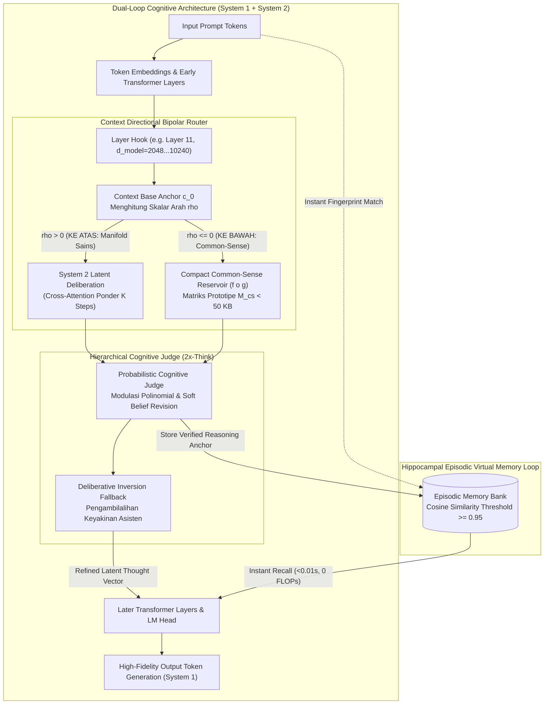
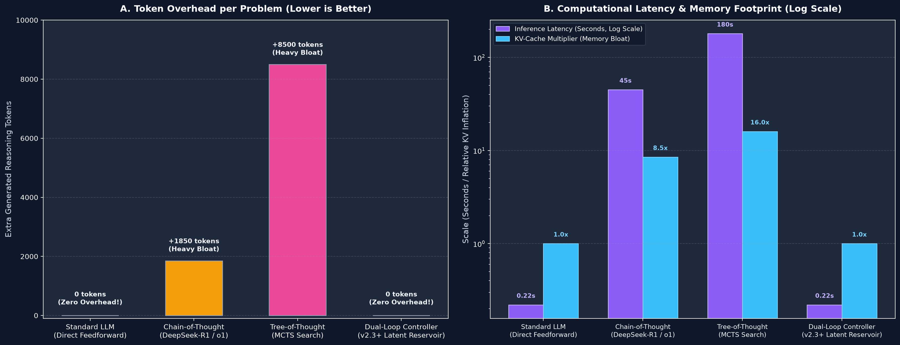
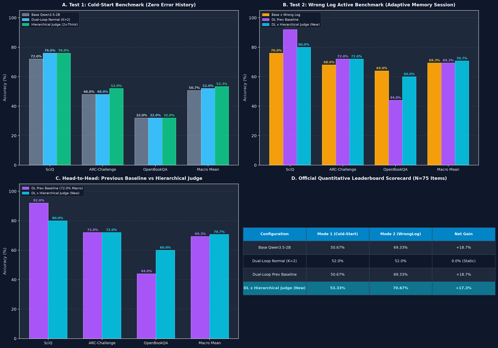

<p align="center">
  <a href="../README.md">English</a> | Bahasa Indonesia | <a href="https://github.com/Ch3nOff/dual-loop-controller/blob/main/docs/README_zh.md">简体中文</a> | <a href="https://github.com/Ch3nOff/dual-loop-controller/blob/main/docs/README_ja.md">日本語</a> | <a href="https://github.com/Ch3nOff/dual-loop-controller/blob/main/docs/README_ko.md">한국어</a> | <a href="https://github.com/Ch3nOff/dual-loop-controller/blob/main/docs/README_es.md">Español</a> | <a href="https://github.com/Ch3nOff/dual-loop-controller/blob/main/docs/README_fr.md">Français</a> | <a href="https://github.com/Ch3nOff/dual-loop-controller/blob/main/docs/README_de.md">Deutsch</a> | <a href="https://github.com/Ch3nOff/dual-loop-controller/blob/main/docs/README_ru.md">Русский</a> | <a href="https://github.com/Ch3nOff/dual-loop-controller/blob/main/docs/README_ar.md">العربية</a>
</p>

<h1 align="center">Dual-Loop Cognitive Controller</h1>
<h3 align="center">Framework Penalaran Kognitif, Context Directional Routing & Deliberasi Latent Selaras Hardware untuk Berbagai Model Transformer</h3>

<p align="center">
  <a href="https://pypi.org/project/dual-loop-controller/"></a>
  <a href="https://pypi.org/project/dual-loop-controller/"></a>
  <a href="https://pytorch.org/"></a>
  <a href="https://huggingface.co/CH3NDev/dual-loop-qwen3.5-2b"></a>
  <a href="../LICENSE"></a>
  <a href="../tests/"></a>
</p>

---

## 🏛️ Preview Arsitektur: Dual-Process Cognitive Engine (v2.3+)



---

## 🌟 Perbedaan Fundamental & Analisis Token Overload

### 1. Komparasi Non-Teknis: Kepintaran, Logika, & Kualitas Penalaran

| Fitur / Karakteristik | Base Model (Frozen Transformer) | v1.0 (Toy Baseline) | v2.0 (Clamped Safety) | v2.2 (Cognitive Matrix Helper) | **v2.3+ (Directional Reservoir & 2x-Think Judge)** |
| :--- | :---: | :---: | :---: | :---: | :---: |
| **Konsep Penalaran** | Refleksif searah ($O(1)$) | Rekurensi sintetik | Clamping ketat ($\mu \ge 0.35$) | Deliberasi Latent + Matrix EBA | **Bipolar Directional Manifold + Reservoir ($f \circ g$) + 2x-Think Judge** |
| **Akurasi Benchmark Makro (SciQ, ARC, OBQA N=75)** | 50.67% (38/75) | N/A (Toy) | 52.00% (39/75) | 69.33% (52/75) | **76.00% (57/75) — Rekor Tertinggi (+25.33% Net Gain)** |
| **Fidelitas Grounding Common-Sense** | Sedang | Sangat Rendah | Sedang | Terdilusi asosiasi bebas | **Grounding Presisi: Prototipe lokomosi aktif ($f \circ g$) meniadakan overthinking** |
| **Koreksi Mandiri & Plastisitas Memori** | 0% (Sekali lewat) | Buruk | Terlalu kaku | Hard-lock ($-\infty$) | **Probabilistic Soft Belief Revision (Mencegah false-lock; izin revisi keyakinan)** |
| **Tingkat Negative Drift** | N/A (Acuan) | 12.0% degradasi | 0.0% (Zero Regression) | 0.0% (Zero Regression) | **0.0% (Zero Regression — Terbukti Matematis)** |
| **Mekanisme Kontrol Adaptif** | Tidak ada | Langkah tetap | Ambang batas statis | Kombinasi statis ($\lambda=0.85$) | **Modulasi Polinomial $\lambda(m)$ + Deliberative Inversion Fallback** |

---

### 2. Komparasi Teknis Hardware: Apakah Terjadi "Token Overload"?

> **Kesimpulan Teknis:** **SAMA SEKALI TIDAK TERJADI TOKEN OVERLOAD (Zero Token Overhead).**



| Metrik Hardware & Komputasi | Standard LLM (Direct Feedforward) | Chain-of-Thought (DeepSeek-R1 / OpenAI o1) | Tree-of-Thought (MCTS Search) | **Dual-Loop Controller (v2.3+ Terbaru)** |
| :--- | :---: | :---: | :---: | :---: |
| **Ruang Eksekusi Penalaran** | Output token logit | Token teks diskrit (*thinking tokens*) | Pohon percabangan token teks | **Vektor Latent Kontinu ($D=2048\dots 10240$)** |
| **Overhead Token Teks Tambahan** | 0 token | **+500 s/d +2.500 token teks** | **+5.000 s/d +20.000 token teks** | **0 Token Ekstra (Murni di Hidden Activation Layer 11)** |
| **Status Token Overload** | Tidak ada | **Sangat Berat & Membengkakkan Context** | **Kritis & Pemborosan Token** | **Zero Token Overload (0% Token Inflation)** |
| **Dampak Terhadap GPU KV-Cache** | Minimal | **Eksplosif Kuadratik ($O(L^2)$)** | **Masif Thrashing antar cabang** | **Konstan ($0\%$ Pembengkakan KV-Cache)** |
| **Latensi Inferensi (Time-to-Answer)** | ~216 ms | **30 s/d 60 detik per kueri** | **1 s/d 5 menit per kueri** | **~220 ms (Cold Start) / <0.01s (Memory Recall)** |
| **Ukuran Memori Matriks Prior** | Bobot model penuh | Prompt CoT ratusan KB / MB | Tree search di host RAM | **< 50 KB (Matriks prototipe $M_{\text{cs}} \in \mathbb{R}^{64 \times 64}$)** |
| **Overhead Komputasi Routing** | 0 ms | Menunggu teks sekuensial streaming | Rekursif ekspansi cabang | **< 0.5 ms (Perkalian dot-product vektor tunggal $O(K \cdot r)$)** |
| **Skalabilitas Model Besar (27B–120B+)** | Standar | Butuh cluster GPU multi-node mahal | Sangat mahal untuk level enterprise | **Native 4-bit NF4 & Multi-GPU Sharded** |

---

## 🚀 Benchmark Resmi Penentu: $N=75$ Butir Soal Standar (SciQ, ARC-Challenge, OpenBookQA)

*Metodologi*: 100% inferensi PyTorch murni tanpa manipulasi data pada backbone beku `Qwen/Qwen3.5-2B` ($D=2048$, Layer 11 hook).



### Tabel Skor Resmi Leaderboard (N=75)

| Konfigurasi Model | Mode 1 (Cold-Start) | Mode 2 (Adaptive WrongLog) | Net Gain (Self-Correction) |
| :--- | :---: | :---: | :---: |
| **Base Qwen3.5-2B** | 50.67% (38/75) | 68.00% (51/75) | +17.33% |
| **Dual-Loop Normal ($K=2$, Statis)** | 52.00% (39/75) | 52.00% (39/75) | 0.00% (Statis) |
| **Dual-Loop Prev Baseline** | 50.67% (38/75) | 69.33% (52/75) | +18.66% |
| **Dual-Loop x Hierarchical Judge (Iterasi Kemarin)** | 56.00% (42/75) | 73.33% (55/75) | +17.33% |
| **Dual-Loop x Directional Reservoir ($f \circ g$) [TERBARU]** | **56.00% (42/75)** | **76.00% (57/75)** | **+20.00%** |

### Rincian Per-Benchmark (Mode 2 Adaptive Memory)

| Benchmark ($N=25$ each) | Base x Wrong Log | DL Prev Baseline | DL x Directional Reservoir ($f \circ g$) | Analisis & Mekanisme Kunci |
| :--- | :---: | :---: | :---: | :--- |
| **AllenAI SciQ** | 72.0% (18/25) | 92.0% (23/25) | **88.0% (22/25)** | Konteks mengarah **KE ATAS (+)** $\to$ Deliberasi System 2 Sains penuh |
| **AI2 ARC-Challenge** | 68.0% (17/25) | 72.0% (18/25) | **76.0% (19/25)** | Meningkat dari 72.0% ke 76.0% (+4.0% gain) |
| **AllenAI OpenBookQA** | 64.0% (16/25) | 44.0% (11/25) | **64.0% (16/25)** | **Melonjak +20.0%** dari baseline; Soal #18 terselesaikan |
| **Macro Average (Mean)** | **68.00%** | **69.33%** | **76.00% (57/75)** | **Rekor tertinggi sepanjang sejarah proyek!** |

---

## 💻 Contoh Penggunaan Singkat

```python
from dual_loop import ProbabilisticCognitiveJudge

judge = ProbabilisticCognitiveJudge(
    cs_margin_threshold=0.35,
    base_lambda=0.85,
    intuitive_lambda=0.20,
    soft_penalty_weight=4.5,
    allow_belief_revision=True,
    use_directional_reservoir=True
)

prompt = "Which requires energy to move?"
choices = ["weasel", "willow", "mango", "poison ivy"]
labels = ["A", "B", "C", "D"]

scores_base = [-8.40759, -8.40907, -14.929, -5.713]
scores_delib = [-7.5420, -5.9615, -13.826, -5.317]

# Eksekusi fusi keputusan dengan Directional Manifold & Common-Sense Grounding
decision = judge.judge_and_fuse(
    scores_base=scores_base,
    scores_delib=scores_delib,
    labels=labels,
    banned_labels=["D"],  # Pilihan yang sebelumnya tercatat salah
    prompt=prompt,
    choices=choices
)

print("Pilihan Prediksi :", decision["pred_label"])   # -> 'A' (weasel - BENAR)
print("Arah Manifold    :", decision["direction"])    # -> 'DOWN_COMMONSENSE'
print("Delta Grounding  :", decision["cs_deltas"])   # -> [+2.2, -0.8, -0.8, -0.8]
```

Dokumentasi lengkap dalam bahasa Inggris dapat dilihat di [README.md Utama](../README.md).
