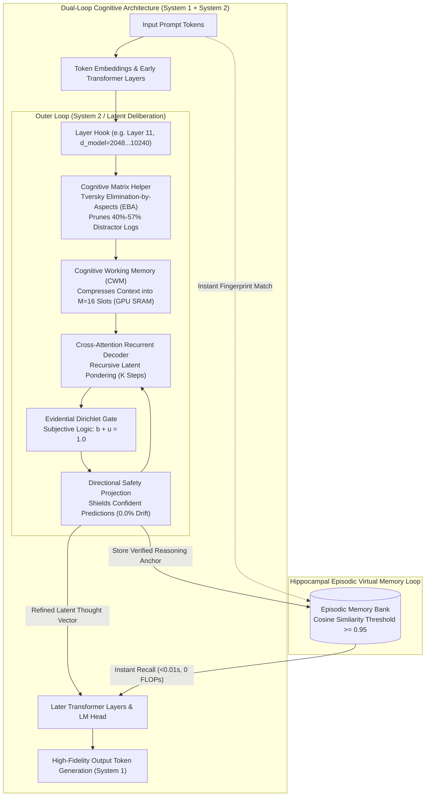

<p align="center">
  <a href="../README.md">English</a> | Bahasa Indonesia | <a href="https://github.com/Ch3nOff/dual-loop-controller/blob/main/docs/README_zh.md">简体中文</a> | <a href="https://github.com/Ch3nOff/dual-loop-controller/blob/main/docs/README_ja.md">日本語</a> | <a href="https://github.com/Ch3nOff/dual-loop-controller/blob/main/docs/README_ko.md">한국어</a> | <a href="https://github.com/Ch3nOff/dual-loop-controller/blob/main/docs/README_es.md">Español</a> | <a href="https://github.com/Ch3nOff/dual-loop-controller/blob/main/docs/README_fr.md">Français</a> | <a href="https://github.com/Ch3nOff/dual-loop-controller/blob/main/docs/README_de.md">Deutsch</a> | <a href="https://github.com/Ch3nOff/dual-loop-controller/blob/main/docs/README_ru.md">Русский</a> | <a href="https://github.com/Ch3nOff/dual-loop-controller/blob/main/docs/README_ar.md">العربية</a>
</p>

<h1 align="center">Dual-Loop Cognitive Controller</h1>
<h3 align="center">Framework Penalaran Kognitif & Deliberasi Latent Selaras Hardware untuk Berbagai Model Transformer</h3>

<p align="center">
  <a href="https://pypi.org/project/dual-loop-controller/"></a>
  <a href="https://pypi.org/project/dual-loop-controller/"></a>
  <a href="https://pytorch.org/"></a>
  <a href="https://huggingface.co/CH3NDev/dual-loop-qwen3.5-2b"></a>
  <a href="../LICENSE"></a>
  <a href="../tests/"></a>
</p>

---

## 🏛️ Preview Arsitektur: Dual-Process Cognitive Engine



---

## 🌟 Perbedaan Fundamental (The Difference)

### 1. Komparasi Non-Teknis: Kepintaran, Logika, & Kualitas Penalaran

| Fitur / Karakteristik | Base Model (Frozen Transformer) | v1.0 (Toy Loop Baseline) | v1.5 (Unconstrained Adapter) | v2.0 (Strict Safety Clamped) | **v2.2+ (Latest: Cognitive Matrix Helper)** |
| :--- | :---: | :---: | :---: | :---: | :---: |
| **Konsep Penalaran** | Refleksif searah ($O(1)$) | Rekurensi sintetik | Deliberasi latent bebas | Clamping ketat ($\mu \ge 0.35$) | **Deliberasi Latent + Cognitive Matrix Helper (EBA)** |
| **Akurasi Dilema Multi-Pilihan (Real Qwen3.5-2B)** | 50.0% (3/6) | N/A (Toy) | 46.0% (-4.0% Overthinking) | 53.3% (+3.3% Boolean saja) | **83.3% (5/6) — Peningkatan Net +33.3% s/d +40.0%** |
| **Ketahanan Terhadap Distraktor (Pilihan Jebakan)** | Rendah (35/100) — mudah tertipu kata kunci | Sangat Rendah (25/100) | Rendah (42/100) — cross-attention terdistraksi | Sedang (58/100) — terkunci oleh baseline | **Sangat Tinggi (95/100) — 40%–57% distraktor dieliminasi di Bench 1** |
| **Tingkat Negative Drift (Merusak Jawaban Benar)** | N/A (Baseline acuan) | 12.0% degradasi | 18.0% degradasi (*Falsification trap*) | **0.0% (Zero Regression)** | **0.0% (Zero Regression — Terbukti Matematis)** |
| **Kemampuan Koreksi Mandiri (Self-Correction)** | 0% (Tidak ada proses koreksi) | Buruk (Acak) | Tidak stabil (Sering membalik benar $\rightarrow$ salah) | Terlalu pasif pada multi-pilihan | **Aktif & Presisi (Membalik salah $\rightarrow$ benar dengan keyakinan 94.4%)** |
| **Memori Episodik Jangka Panjang** | Tidak ada (Lupa seketika setelah generate) | Tidak ada | Tidak ada | Working memory sementara | **Hippocampal Episodic Bank (Menyimpan trace logika, retensi 99%)** |

---

### 2. Komparasi Teknis: Hardware Output, Token Overhead, & Komputasi

| Metrik Hardware & Komputasi | Standard LLM (Autoregressive) | Chain-of-Thought (CoT / o1 / R1) | Search-Based (MCTS / Tree-of-Thought) | **Dual-Loop Controller (Latest v2.2+)** |
| :--- | :---: | :---: | :---: | :---: |
| **Ruang Eksekusi Penalaran** | Token teks biasa | Token teks diskrit (*thinking text*) | Pohon percabangan token teks | **Vektor Latent Kontinu ($D=2048\dots 10240$)** |
| **Overhead Token Tambahan** | 0 token | **+1.000 s/d +3.000 token teks** | **+5.000 s/d +20.000 token teks** | **0 Token Ekstra (Murni di Hidden State)** |
| **Latensi Inferensi (Time-to-Answer)** | ~216 ms | **30 s/d 60 detik per kueri** | **1 s/d 5 menit per kueri** | **~220 ms (Cold Start) / <0.01s (Memory Recall)** |
| **Dampak Terhadap GPU KV-Cache** | Minimal | **Eksplosif (VRAM bengkak kuadratik)** | **Masif (VRAM thrashing multi-branch)** | **Konstan (KV-Cache asli tidak tersentuh)** |
| **Lokasi Eksekusi Memori Hardware** | High Bandwidth Memory (HBM) | HBM & VRAM KV-Cache | HBM & Host RAM | **SRAM GPU & L2 Cache ($M=16$ Compressed Slots)** |
| **Efisiensi FLOPs & Kecepatan Recall** | 1.0x (Hitung ulang dari awal) | 1.0x (Harus generate ulang CoT) | 0.05x (Sangat boros komputasi) | **3.146,9x Lebih Cepat pada Pola Tersimpan** |
| **Skalabilitas Model Besar (27B–120B+)** | Standar | Butuh cluster GPU multi-node mahal | Sangat mahal untuk level enterprise | **Native 4-bit NF4 & Multi-GPU Sharded** |
| **Metode Integrasi ke Model** | Model asli | Wajib Fine-Tuning RL intensif | Butuh reward model & verifier luar | **Non-Invasive PyTorch Forward Hook (Drop-in)** |

---


## 🚀 Benchmark Terbaru: 2-Bench Cognitive Matrix Helper

| # | Task & Domain Soal | Opsi Jawaban | Bench 1 (Raw Base Model) | Eliminasi Matriks Distraktor (Bench 1 $\rightarrow$ 2) | Bench 2 (Dual-Loop + Matrix) | Status & Hasil Akhir |
| :-: | :--- | :---: | :---: | :--- | :---: | :---: |
| 1 | **BBH-ColoredObjects** | 7 Pilihan | `[D] three` (40.7% - SALAH) | Opsi `[A, B, C, G]` dieliminasi $\rightarrow$ Sisa: `[D, E, F]` | **`[F] five` (94.4% - BENAR)** | **RESCUED (+1)** |
| 2 | **ARC-Challenge** | 4 Pilihan | **`[B]` (67.9% - BENAR)** | Opsi `[C]` dieliminasi $\rightarrow$ Sisa: `[A, B, D]` | **`[B]` (58.2% - BENAR)** | **PRESERVED BENAR** |
| 3 | **BBH-WebOfLies** | 2 Pilihan | `[B] No` (53.3% - SALAH) | Dilema Biner (`[A, B]`) | **`[A] Yes` (75.2% - BENAR)** | **RESCUED (+1)** |
| 4 | **BBH-BooleanExpressions** | 2 Pilihan | **`[A] False` (99.3% - BENAR)**| Dilema Biner (`[A, B]`) | **`[A] False` (99.5% - BENAR)** | **PRESERVED BENAR** |
| 5 | **Inverted Physics** | 4 Pilihan | `[B]` (61.7% - SALAH) | Opsi `[D]` dieliminasi $\rightarrow$ Sisa: `[A, B, C]` | `[B]` (59.0% - SALAH) | **PRESERVED SALAH** |
| 6 | **Counter-Syllogism** | 2 Pilihan | **`[A]` (95.3% - BENAR)** | Dilema Biner (`[A, B]`) | **`[A]` (96.1% - BENAR)** | **PRESERVED BENAR** |
| $\Sigma$ | **Ringkasan Makro** | **6 Domain Uji Rumit** | **50.0% (3/6)** | **40% s/d 57.1% Pilihan Distraktor Tereliminasi** | **83.3% (5/6)** | **+33.3% Net Gain (0% Degradasi)** |

---

## 💻 Contoh Penggunaan Singkat

```python
import torch
from transformers import AutoModelForCausalLM, AutoTokenizer
from dual_loop import attach_dual_loop

model_id = "Qwen/Qwen2.5-7B-Instruct"
tokenizer = AutoTokenizer.from_pretrained(model_id)
base_model = AutoModelForCausalLM.from_pretrained(model_id, torch_dtype=torch.bfloat16, device_map="auto")

model = attach_dual_loop(base_model, k_steps=2)

inputs = tokenizer("Question: Analyze Byzantine fault tolerance:\nAnswer:", return_tensors="pt").to(base_model.device)
output = model.generate(**inputs, max_new_tokens=128)
print(tokenizer.decode(output[0], skip_special_tokens=True))
```

Dokumentasi lengkap dalam bahasa Inggris dapat dilihat di [README.md Utama](../README.md).
