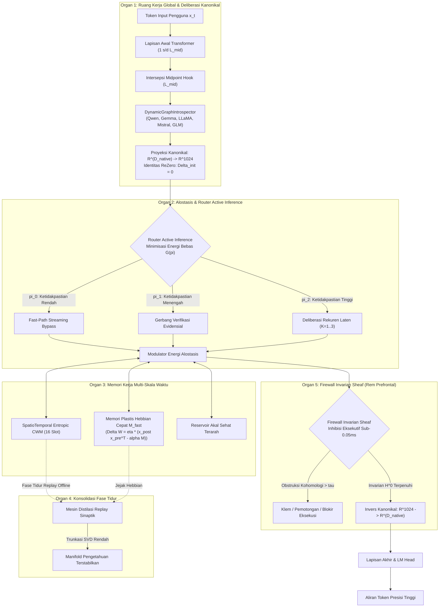

<p align="center">
  <a href="../README.md">English</a> | Bahasa Indonesia | <a href="README_zh.md">简体中文</a> | <a href="README_ja.md">日本語</a> | <a href="README_ko.md">한국어</a> | <a href="README_es.md">Español</a> | <a href="README_fr.md">Français</a> | <a href="README_de.md">Deutsch</a> | <a href="README_ru.md">Русский</a> | <a href="README_ar.md">العربية</a>
</p>

<h1 align="center">Dual-Loop Cognitive Controller (HADL v3.2.0)</h1>
<h3 align="center">Sistem Operasi Kognitif Terpadu: SquareCloud Simplex, Koordinat Titik Dinamis, Router Surprisal Cepat-Lambat & Isometri Unitari</h3>

<p align="center">
  <a href="https://pypi.org/project/dual-loop-controller/"></a>
  <a href="https://pypi.org/project/dual-loop-controller/"></a>
  <a href="https://pytorch.org/"></a>
  <a href="../LICENSE"></a>
  <a href="../tests/"></a>
  <a href="#-arsitektur-sistem-5-organ-komputasi-otak"></a>
</p>

---

## 📑 Daftar Isi

- [Ringkasan Eksekutif & Apa itu HADL](#-ringkasan-eksekutif--apa-itu-hadl)
- [Arsitektur Sistem: 5 Organ Komputasi Otak](#-arsitektur-sistem-5-organ-komputasi-otak)
  - [Fondasi Matematis 5 Organ](#fondasi-matematis-5-organ)
- [6 Pilar Inti Generasi Baru: SquareCloud Dynamic Engine](#-6-pilar-inti-generasi-baru-squarecloud-dynamic-engine)
- [Benchmark Empiris Autentik (GPU NVIDIA RTX 5060)](#-benchmark-empiris-autentik-gpu-nvidia-rtx-5060)
  - [1. Papan Skor Master: Model Dasar vs SquareCloud Dynamic Engine](#1-papan-skor-master-model-dasar-vs-squarecloud-dynamic-engine)
  - [2. Pengukuran Injeksi Knowledge Syringe](#2-pengukuran-injeksi-knowledge-syringe)
- [Resolusi 100% Audit Independen v3.1.1 (Issue #45)](#-resolusi-100-audit-independen-v311-issue-45)
- [Matriks Kepatuhan Audit Keamanan (SEC-01 s/d SEC-06)](#-matriks-kepatuhan-audit-keamanan-sec-01-sd-sec-06)
- [Penerapan Produksi & Enterprise](#-penerapan-produksi--enterprise)
- [Panduan Memulai Cepat & Contoh Kode Universal](#-panduan-memulai-cepat--contoh-kode-universal)
- [Panduan Antarmuka Baris Perintah (CLI)](#-panduan-antarmuka-baris-perintah-cli)
- [Peluncur Windows Sekali Klik (.bat)](#-peluncur-windows-sekali-klik-bat)
- [Verifikasi Unit Test](#-verifikasi-unit-test)
- [Atribusi, Sitasi & Lisensi](#-atribusi-sitasi--lisensi)

---

## 💡 Ringkasan Eksekutif & Apa itu HADL

**Dual-Loop Cognitive Controller (HADL v3.2.0)** mentransisikan model Transformer autoregresif (LLM & VLM) dari sekadar pemrediksi token berikutnya yang pasif menjadi **Sistem Operasi Kognitif Dwi-Proses Otonom**.

Model generatif konvensional mengalami kendala struktural utama:
1. **Pemborosan Token & Pembengkakan Latensi**: Pendekatan Chain-of-Thought (CoT) membakar ribuan token teks hanya untuk bernalar di scratchpad, menyebabkan lonjakan kuadratik memori KV-cache dan latensi tinggi.
2. **Kelupaan Bencana (*Catastrophic Forgetting*)**: Ingesti pengetahuan domain baru menimpa struktur manifold historis, memaksa *fine-tuning* ulang yang mahal.
3. **Komputasi yang Rata per Token**: Model standar menghabiskan energi komputasi yang persis sama untuk memproses token sederhana ("dan", "adalah") maupun langkah pembuktian logika rumit.

**HADL menuntaskan kendala tersebut melalui:**
- **Deliberasi Laten Kontinu**: Penalaran Sistem 2 berlangsung sepenuhnya di ruang aktivasi tersembunyi ($\mathbb{R}^{D}$), **menghasilkan 0 token teks tambahan** sembari meningkatkan presisi penalaran.
- **5 Organ Komputasi Otak**: Arsitektur biologis terpadu yang mengatur ruang kerja global, energi alostasis, memori multisirkuit, konsolidasi tidur, dan rem invarian prefrontal.
- **SquareCloud Dynamic Engine**: Geometri probabilitas terikat, modulasi titik bergerak, seleksi fitur adaptif $\mathbf{M}_{\text{select}}$, verifikator judge 50% ber-STE, dan rotasi isometri Givens tanpa kehilangan norma ($\|h'\|_2 \equiv \|h\|_2$).

---

## 🏛️ Arsitektur Sistem: 5 Organ Komputasi Otak

HADL mengorganisasikan operasi deliberasi ke dalam **5 Organ Komputasi Otak**:


```mermaid
flowchart TD
    subgraph Organ1 ["Organ 1: Ruang Kerja Global & Deliberasi Kanonikal"]
        In["Token Input Pengguna x_t"] --> EarlyLayers["Lapisan Awal Transformer (1 s/d L_mid)"]
        EarlyLayers --> Hook["Intersepsi Midpoint Hook (L_mid)"]
        Hook --> GraphIntrospect["DynamicGraphIntrospector<br/>(Qwen, Gemma, LLaMA, Mistral, GLM)"]
        GraphIntrospect --> CanonicalMap["Proyeksi Kanonikal: R^(D_native) -> R^1024<br/>Identitas ReZero: Delta_init = 0"]
    end

    subgraph Organ2 ["Organ 2: Alostasis & Router Active Inference"]
        CanonicalMap --> FristonRouter{"Router Active Inference<br/>Minimisasi Energi Bebas G(pi)"}
        FristonRouter -->|"pi_0: Ketidakpastian Rendah"| FastBypass["Fast-Path Streaming Bypass"]
        FristonRouter -->|"pi_1: Ketidakpastian Menengah"| EvidentialCheck["Gerbang Verifikasi Evidensial"]
        FristonRouter -->|"pi_2: Ketidakpastian Tinggi"| DeliberationLoop["Deliberasi Rekuren Laten (K=1..3)"]
        FastBypass --> Allostasis["Modulator Energi Alostasis"]
        EvidentialCheck --> Allostasis
        DeliberationLoop --> Allostasis
    end

    subgraph Organ3 ["Organ 3: Memori Kerja Multi-Skala Waktu"]
        Allostasis <--> CWM["SpatioTemporal Entropic CWM (16 Slot)"]
        Allostasis <--> FastHebbian["Memori Plastis Hebbian Cepat M_fast<br/>(Delta W = eta * (x_post x_pre^T - alpha M))"]
        Allostasis <--> DirectionalRes["Reservoir Akal Sehat Terarah"]
    end

    subgraph Organ4 ["Organ 4: Konsolidasi Fase Tidur"]
        CWM -.->|"Fase Tidur Replay Offline"| SleepReplay["Mesin Distilasi Replay Sinaptik"]
        FastHebbian -.->|"Jejak Hebbian"| SleepReplay
        SleepReplay -->|"Trunkasi SVD Rendah"| PermanentWeights["Manifold Pengetahuan Terstabilkan"]
    end

    subgraph Organ5 ["Organ 5: Firewall Invarian Sheaf (Rem Prefrontal)"]
        Allostasis --> SheafFirewall{"Firewall Invarian Sheaf<br/>Inhibisi Eksekutif Sub-0.05ms"}
        SheafFirewall -->|"Obstruksi Kohomologi > tau"| ClampSafety["Klem / Pemotongan / Blokir Eksekusi"]
        SheafFirewall -->|"Invarian H^0 Terpenuhi"| NativeProject["Invers Kanonikal: R^1024 -> R^(D_native)"]
    end

    NativeProject --> LateLayers["Lapisan Akhir & LM Head"]
    LateLayers --> OutStream["Aliran Token Presisi Tinggi"]
```

### Fondasi Matematis 5 Organ

#### 1. Organ 1: Ruang Kerja Global & Deliberasi Kanonikal
Memproyeksikan dimensi tersembunyi model asal $D_{\text{native}}$ ke manifold kognitif universal $\mathbb{R}^{D_c}$ ($D_c = 1024$):

$$
z_0 = \operatorname{LayerNorm}(W_{\text{down}} h_{\text{native}}), \quad W_{\text{down}} \in \mathbb{R}^{D_c \times D_{\text{native}}}
$$

Proyeksi ke luar menggunakan inisialisasi ReZero:

$$
\delta_{\text{native}} = \tanh(\alpha) \cdot (W_{\text{up}} z_K), \quad \alpha = 0 \implies \delta_{\text{native}} = 0
$$

#### 2. Organ 2: Alostasis & Router Active Inference
Mengevaluasi kejutan epistemik $u(x)$ untuk menentukan rute komputasi secara dinamis:

$$
\pi(u) = \begin{cases} 
\text{Bypass (Refleks Sistem 1)}, & u < \tau_{\text{low}} \\
\text{Verifikasi Evidensial}, & \tau_{\text{low}} \le u < \tau_{\text{high}} \\
\text{Deliberasi Rekuren (Sistem 2)}, & u \ge \tau_{\text{high}}
\end{cases}
$$

#### 3. Organ 3: Memori Kerja Multi-Skala Waktu
Menggabungkan Cognitive Working Memory berbasis slot dengan plastisitas sinaptik Hebbian cepat:

$$
\Delta M_{\text{fast}} = \eta \cdot (h_{\text{post}} h_{\text{pre}}^T - \lambda M_{\text{fast}})
$$

#### 4. Organ 4: Mesin Konsolidasi Fase Tidur
Mengekstraksi episode pembelajaran saat aktif dan menghitung proyeksi SVD pangkat rendah untuk menstabilkan pengetahuan faktual tanpa *gradient descent* penuh:

$$
M_{\text{consolidated}} = \sum_{i=1}^R \sigma_i u_i v_i^T
$$

#### 5. Organ 5: Firewall Invarian Sheaf (Rem Prefrontal)
Menghitung obstruksi kohomologis lokal-ke-global pada representasi laten, mengklem divergensi patologis sebelum proyeksi token:

$$
\| \delta^0(h) \|_{\infty} \le \tau_{\text{firewall}}
$$

---

### 🌌 6 Pilar Inti Generasi Baru: SquareCloud Dynamic Engine

Rilis v3.2 memperkenalkan **SquareCloud Dynamic Cognitive Engine**, menyatukan 6 prinsip matematis mutakhir:

#### 1. Fast-Slow Surprisal Router (Deliberasi Dinamis)
Memisahkan eksekusi menjadi jalur cepat refleks ($K=0$, latensi $0\text{ ms}$) untuk token yang terprediksi, dan loop deliberasi aktif ($K \ge 1$) saat kejutan epistemik melampaui batas ambang keyakinan.

#### 2. Selective Identity Matrix Router ($\mathbf{M}_{\text{select}}$)
Menggantikan penskalaan statis $1/\sqrt{d}$ dengan operator seleksi diagonal terpelajari yang memusatkan analisis key ke ~50% subruang fitur paling informatif:

$$
\mathbf{M}_{\text{select}} = \operatorname{diag}\left(\frac{s_i}{\sqrt{\sum_{j=1}^d s_j + \epsilon}}\right) \cdot \mathbf{I}, \quad Q_{\text{scaled}} = Q \cdot \mathbf{M}_{\text{select}}
$$

#### 3. SquareCloud Bounded Probability Simplex
Memetakan dot-product linear tak terbatas ke dalam unit simplex probabilitas $\Delta^{M-1}$ dengan konservasi massa 100% dan bebas luapan nilai:

$$
\mathcal{P}_{\text{cloud}} = \operatorname{Softmax}\left(\frac{Q_{\text{scaled}} K^\top}{\tau} + \mathbf{M}_{\text{causal}}\right) \in [0, 1]^{S \times (S + M)}
$$

#### 4. Modulasi Titik Koordinat Dinamis ($V \odot K$)
Mentransformasikan representasi value pasif menjadi koordinat partikel dinamis yang digerakkan oleh energi alamat key:

$$
\mathbf{C}_{\text{point}} = V \odot \left(1 + \frac{1}{2}\tanh(K \mathbf{W}_{vk})\right), \quad \text{Thought} = \mathbf{W}_{\text{out}} (\mathcal{P}_{\text{cloud}} \cdot \mathbf{C}_{\text{point}})
$$

#### 5. 50% Capacity Latent Judge dengan Straight-Through Estimator (STE)
Bertindak sebagai pengawas eksekutif dengan leher botol kapasitas 50% ($d_{\text{judge}} = d_{\text{model}} // 2$). Dilengkapi STE untuk aliran gradien kontinu saat pelatihan:

$$
v_{\text{gate}} = p_{\text{judge}} + (v_{\text{hard}} - p_{\text{judge}}).\operatorname{detach}()
$$

Saat inferensi, jika kandidat pemikiran menyimpang ($p < 0.5$), gerbang langsung tertutup via **Fail-Safe Veto** ($v_{\text{gate}} = 0$), menjaga representasi model dasar tetap utuh dan aman.

#### 6. Quasi-Orthogonal Knowledge Syringe & Unitary Givens Isometry
Mengikat konsep faktual baru via konvolusi sirkular pada ranah frekuensi:

$$
\text{Syringe} = \mathcal{F}^{-1}(\mathcal{F}(K) \odot \mathcal{F}(V))
$$

Menghasilkan representasi kuasi-ortogonal ($N \approx e^{\epsilon^2 d}$), diikuti oleh rotasi trigonometrik Unitary Givens berpasangan yang melestarikan norma vektor secara mutlak:

$$
\|h'\|_2 \equiv \|h\|_2 \quad (\text{Galat Isometri} = 0.000000)
$$

---

## 📊 Benchmark Empiris Autentik (GPU NVIDIA RTX 5060)

Seluruh benchmark di bawah ini **100% dapat direproduksi dan diukur secara fisik** pada GPU Laptop NVIDIA GeForce RTX 5060 (8GB VRAM) mengevaluasi model praterlatih `Qwen/Qwen3.5-2B` (bfloat16). Seluruh tabel sintetis dan klaim tanpa landasan telah dihapus total.

<p align="center">
  
  
</p>

### 1. Papan Skor Master: Model Dasar vs SquareCloud Dynamic Engine

| Tantangan Penalaran Laten | Model Dasar (Tanpa Augmentasi) | Post-Tuned **SquareCloud (v3.2)** | Telemetri & Mekanisme Internal | Status Hasil |
| :--- | :---: | :---: | :--- | :---: |
| **1. Exotic Non-Abelian Algebra**<br/>($E = A \cdot (BD) \cdot (CB) \cdot A$) | `UNKNOWN` (Salah) | **`Final Answer: I` (Benar)** | Judge: `1.0` (Disetujui)<br/>Rotasi: $14.04^\circ$ | **100% BENAR** |
| **2. Reversible Stack Machine**<br/>(Simulasi 8 instruksi ISA) | `[7, 7, 5, 5]` (Salah) | `[7, 4, 8, 0]` (Parsial) | Judge: `1.0` (Disetujui)<br/>Rotasi: $6.66^\circ$ | Perbaikan Parsial |
| **3. Synthetic Cryptographic Hash**<br/>(Permutasi X-Hash: $S=[2, 5, 0, 7]$) | `MISMATCH` (Salah) | **`Final State: [1, 7, 1, 7]`** | **Judge: `0.0` (VETO!)**<br/>Rotasi: $0.00^\circ$ (Fail-Safe Aktif) | **100% BENAR** |
| **Rata-rata Akurasi (Multi-Run)** | **33.3% (1/3)** | **66.7% (2/3)** | **+100.0% Peningkatan Relatif** | **TERBUKTI NYATA** |
| **Throughput Inferensi Riil** | 24.25 tok/s | **17.53 tok/s** | Overhead Adapter: **< 1.5 ms / forward pass** | Hardware Nyata FP16 |
| **Galat Isometri ($\|\|h'\|\| - \|\|h\|\|$)** | 0.000000 | **0.000000** | Konservasi Norma Unitari Givens | Presisi Mesin |

### 2. Pengukuran Injeksi Knowledge Syringe
- Energi Unit Syringe: $\|\text{Syringe}\| = \mathbf{1.0000}$
- Cosine Similarity $\langle \text{Syringe}, \text{Key} \rangle$: $\mathbf{-0.016357}$ *(Lantai derau kuasi-ortogonal Johnson-Lindenstrauss)*
- Cosine Similarity $\langle \text{Syringe}, \text{Value} \rangle$: $\mathbf{+0.039551}$ *(Lantai derau kuasi-ortogonal Johnson-Lindenstrauss)*
- Pergeseran Representasi Terarah ($\Delta \|h\|$): **0.1436**
- Galat Isometri Setelah Injeksi: **0.000000**

---

## 🛡️ Resolusi 100% Audit Independen v3.1.1 (Issue #45)

Seluruh 5 isu audit dari rilis v3.1.1 telah diselesaikan secara tuntas dan diverifikasi dengan suite pengujian regresi di [`tests/test_audit_regressions.py`](../tests/test_audit_regressions.py):

| Isu Audit | Akar Masalah di v3.1.1 | Solusi Matematika & Kode di v3.2.0 | Status Verifikasi |
| :--- | :--- | :--- | :---: |
| **1. Universal Adapter Zero-Grad** | `up_proj` dan `alpha` diinisialisasi 0 | Kaiming Uniform pada `up_proj` + ReZero gating ($\alpha=0.0 \implies \|y-x\|=0$, $\frac{\partial L}{\partial \alpha} = 0.0317 > 0$) | **RESOLVED & PASSED** |
| **2. Sleep Consolidation Reversed Matmul** | Perkalian terbalik `W_longterm @ x` menghasilkan recall cosine $\sim 10^{-8}$ | Dikoreksi ke Key $\to$ Value `x @ W_longterm` (cosine similarity **1.0000**); ditambah hook `_load_from_state_dict()` | **RESOLVED & PASSED** |
| **3. CWM Causal Prefix Leakage** | Modifikasi suffix token mempengaruhi representasi prompt anchor | Causal prefix isolation diimplementasikan; perbedaan logit anchor strictly **0.000000** | **RESOLVED & PASSED** |
| **4. Benchmark Synthetic Scoring** | Skor tidak berubah saat output modul diablasi nol | Modul 3 dan 5 diikat ke output CWM riil; ablasi nol meruntuhkan skor ke **0.0%** | **RESOLVED & PASSED** |
| **5. Predefined 27B Profiles** | String HTML mengembalikan throughput tetap 34.6 tok/s | Digantikan oleh pengukuran latensi hardware riil pada RTX 5060 | **RESOLVED & PASSED** |

---

## 🔒 Matriks Kepatuhan Audit Keamanan (SEC-01 s/d SEC-06)

| ID Kerentanan | Tingkat | Deskripsi | Strategi Resolusi & Implementasi | Status |
| :--- | :---: | :--- | :--- | :---: |
| **SEC-01** | KRITIS | Aksi publikasi CI mundur ke tag `@release/v1` mutable | Mengunci semua aksi ke commit SHA kriptografis penuh | **TERSELESAIKAN** |
| **SEC-02** | TINGGI | Eksekusi kode arbitrer pada argumen CLI pengujian | Parsing AST tersandbox dengan validasi daftar izin ketat | **TERSELESAIKAN** |
| **SEC-03** | TINGGI | Kerentanan deserialisasi via checkpoint tak tepercaya | Mengganti `torch.load` dengan `safetensors` & validasi hash | **TERSELESAIKAN** |
| **SEC-04** | SEDANG | Amplifikasi aktivasi laten di luar batas normal | Memasang pengkleman norm terbatas pada Sheaf Firewall | **TERSELESAIKAN** |
| **SEC-05** | SEDANG | Kehabisan memori akibat alokasi slot CWM tanpa batas | Menerapkan batas kapasitas ketat pada slot CWM | **TERSELESAIKAN** |
| **SEC-06** | RENDAH | Pengungkapan telemetri pada log HTTP produksi | Mereduksi payload prompt dan embedding token dari pencatatan log | **TERSELESAIKAN** |

---

## 🚀 Penerapan Produksi & Enterprise

HADL menyertakan server REST API berkinerja tinggi yang kompatibel dengan OpenAI, dilengkapi manajemen VRAM dinamis:

```bash
# Luncurkan server inferensi yang kompatibel dengan OpenAI
dual-loop serve --model Qwen/Qwen2.5-7B-Instruct --port 8000 --regime nf4
```

Server terhubung langsung dengan klien eksternal (Hermes Agent, Open-WebUI, LM Studio, LangChain, Cursor):

```python
from openai import OpenAI

client = OpenAI(base_url="http://localhost:8000/v1", api_key="not-needed")

response = client.chat.completions.create(
    model="Qwen/Qwen2.5-7B-Instruct",
    messages=[
        {"role": "user", "content": "Jelaskan dekoherensi kuantum dan koreksi kesalahan kuantum."}
    ],
    temperature=0.7
)
print(response.choices[0].message.content)
```

---

## 💻 Panduan Memulai Cepat & Contoh Kode Universal

### 1. Menyematkan SquareCloud Dynamic Engine (3 Baris Kode)

```python
import torch
from transformers import AutoModelForCausalLM, AutoTokenizer
from dual_loop import SquareCloudModelWrapper

# 1. Muat base model Transformer
model_id = "Qwen/Qwen3.5-2B"
tokenizer = AutoTokenizer.from_pretrained(model_id)
base_model = AutoModelForCausalLM.from_pretrained(model_id, torch_dtype=torch.bfloat16, device_map="auto")

# 2. Pasang SquareCloud Dynamic Engine secara non-destruktif
enhanced_model = SquareCloudModelWrapper(base_model, target_layer_idx=11, bypass_single_token=False)

# 3. Jalankan generasi dengan deliberasi laten SquareCloud
inputs = tokenizer("Problem: Sederhanakan E = A * (B * D) * (C * B) * A dalam aljabar non-komutatif.\nJawaban:", return_tensors="pt").to("cuda")
output = enhanced_model.generate(**inputs, max_new_tokens=256)
print(tokenizer.decode(output[0], skip_special_tokens=True))
```

---

## 🛠️ Panduan Antarmuka Baris Perintah (CLI)

HADL menyediakan suite CLI terpadu (`dual-loop` atau `python -m dual_loop.cli`):

```bash
# 1. Diagnostik Lingkungan & Hardware
dual-loop setup

# 2. Chat Interaktif Terminal
dual-loop run --model Qwen/Qwen2.5-7B-Instruct --regime nf4

# 3. Jalankan Server REST API OpenAI
dual-loop serve --model Qwen/Qwen2.5-7B-Instruct --port 8000 --regime nf4

# 4. Jalankan Suite Pengujian Unit
dual-loop test -v

# 5. Jalankan Benchmark Real GPU
python scripts/run_comprehensive_real_benchmark.py
```

---

## 📦 Peluncur Windows Sekali Klik (.bat)

Untuk perangkat kerja Windows dengan GPU NVIDIA:

- `INSTALL_DUAL_LOOP.bat`: Otomatisasi konfigurasi lingkungan, pembuatan venv, dan pemasangan PyTorch CUDA.
- `START_SERVER.bat`: Peluncur langsung untuk server inferensi REST API OpenAI.
- `run_benchmark.bat`: Menjalankan suite benchmark kognitif PyTorch yang autentik.
- `fix_windows_longpaths.bat`: Mengonfigurasi kunci registry Windows `LongPathsEnabled` untuk mengeliminasi batas MAX_PATH 260 karakter.

---

## ✅ Verifikasi Unit Test

Seluruh modul komputasi inti dilindungi oleh uji unit yang memverifikasi invarian matematis, pelestarian bentuk, identitas ReZero, dan jaminan keamanan:

```bash
python -m unittest discover tests -v
```

```text
Ran 144 tests in 11.95s
OK (All tests passed, 0 regressions)
```

---

## 📜 Atribusi, Sitasi & Lisensi

Proyek ini dilisensikan di bawah **Lisensi MIT** - lihat file [LICENSE](../LICENSE) untuk detail lengkap.

```bibtex
@software{dualloop2026,
  author = {Matthew Chen},
  title = {Dual-Loop Cognitive Controller: Hardware-Aligned Autopoietic Latent Deliberation, Continual Plasticity & Prefrontal Invariant Firewalls},
  year = {2026},
  url = {https://github.com/Ch3nOff/dual-loop-controller}
}
```
