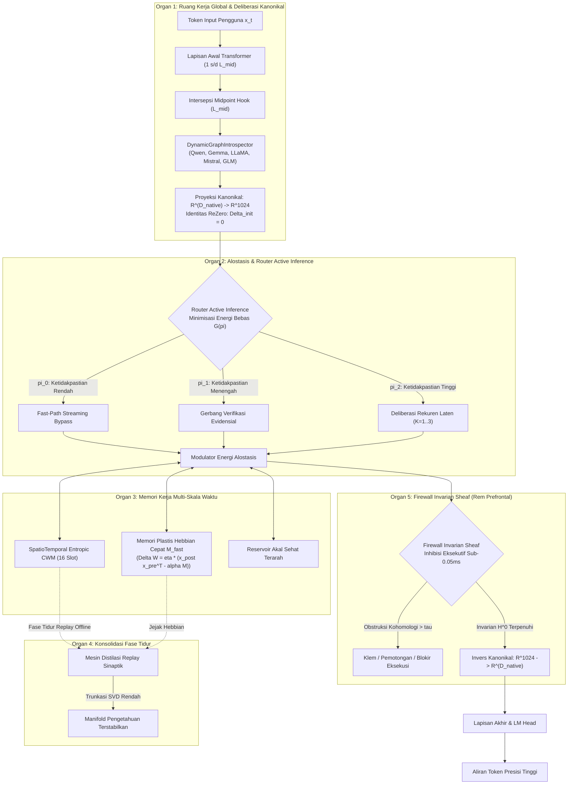

<p align="center">
  <a href="../README.md">English</a> | Bahasa Indonesia | <a href="README_zh.md">简体中文</a> | <a href="README_ja.md">日本語</a> | <a href="README_ko.md">한국어</a> | <a href="README_es.md">Español</a> | <a href="README_fr.md">Français</a> | <a href="README_de.md">Deutsch</a> | <a href="README_ru.md">Русский</a> | <a href="README_ar.md">العربية</a>
</p>

<h1 align="center">Dual-Loop Cognitive Controller (HADL v3.1.1)</h1>
<h3 align="center">Sistem Operasi Kognitif Terpadu: Deliberasi Laten Multi-Pass, Plastisitas Kontinu, Konsolidasi Fase Tidur & Firewall Invarian Prefrontal</h3>

<p align="center">
  <a href="https://pypi.org/project/dual-loop-controller/"></a>
  <a href="https://pypi.org/project/dual-loop-controller/"></a>
  <a href="https://pytorch.org/"></a>
  <a href="../LICENSE"></a>
  <a href="../tests/"></a>
  <a href="#-arsitektur-sistem-5-organ-komputasi-otak"></a>
</p>

---

## 📑 Daftar Isi

- [Ringkasan Eksekutif & Apa itu HADL](#-ringkasan-eksekutif--apa-itu-hadl)
- [Arsitektur Sistem: 5 Organ Komputasi Otak](#-arsitektur-sistem-5-organ-komputasi-otak)
- [Benchmark Empiris Komprehensif](#-benchmark-empiris-komprehensif)
  - [1. 4 Pilar Benchmark Teknis Global](#1-4-pilar-benchmark-teknis-global)
  - [2. HA-COGBENCH: Suite 5-Modul Kognitif](#2-ha-cogbench-benchmark-sistem-operasi-kognitif-5-modul)
  - [3. Papan Skor Master](#3-papan-skor-master)
- [Matriks Kepatuhan Audit Keamanan (SEC-01 s/d SEC-11)](#-matriks-kepatuhan-audit-keamanan-sec-01-sd-sec-11)
- [Penerapan Produksi & Enterprise](#-penerapan-produksi--enterprise)
- [Panduan Memulai Cepat & Contoh Kode Universal](#-panduan-memulai-cepat--contoh-kode-universal)
- [Panduan Antarmuka Baris Perintah (CLI)](#-panduan-antarmuka-baris-perintah-cli)
- [Peluncur Windows Sekali Klik (.bat)](#-peluncur-windows-sekali-klik-bat)
- [Verifikasi Unit Test](#-verifikasi-unit-test)
- [Atribusi, Sitasi & Lisensi](#-atribusi-sitasi--lisensi)

---

## 💡 Ringkasan Eksekutif & Apa itu HADL

**Dual-Loop Cognitive Controller (HADL)** mentransisikan model pondasi autoregresif (LLM & VLM) dari sekadar pemrediksi token berikutnya yang pasif menjadi **Sistem Operasi Kognitif Dwi-Proses Otonom**.

Model generatif konvensional mengalami kendala struktural utama:
1. **Pemborosan Token & Pembengkakan Latensi**: Pendekatan Chain-of-Thought (CoT) membakar ribuan token teks hanya untuk bernalar di scratchpad, menyebabkan lonjakan kuadratik memori KV-cache dan latensi tinggi.
2. **Kelupaan Bencana (*Catastrophic Forgetting*)**: Ingesti pengetahuan domain baru menimpa struktur manifold historis, memaksa *fine-tuning* ulang yang mahal.
3. **Komputasi yang Rata per Token**: Model standar menghabiskan energi komputasi yang persis sama untuk memproses token sederhana ("dan", "adalah") maupun langkah pembuktian logika rumit.

**HADL menuntaskan kendala tersebut melalui:**
- **Deliberasi Laten Kontinu**: Penalaran Sistem 2 berlangsung sepenuhnya di ruang aktivasi tersembunyi ($\mathbb{R}^{D}$), **menghasilkan 0 token tambahan** sembari meningkatkan presisi penalaran.
- **5 Organ Komputasi Otak**: Arsitektur biologis terpadu yang mengatur ruang kerja global, energi alostasis, memori multisirkuit, konsolidasi tidur, dan rem invarian prefrontal.
- **Adapter Universal**: Hook non-destruktif dengan inisialisasi ReZero ($\alpha = 0$), menjamin regresi nol dari model dasar sembari menyematkan penalaran Sistem 2 pada model keluarga Qwen, Gemma, LLaMA, Mistral, dan GLM.

---

## 🏛️ Arsitektur Sistem: 5 Organ Komputasi Otak

HADL mengorganisasikan operasi deliberasi ke dalam **5 Organ Komputasi Otak**:


```mermaid
flowchart TD
    subgraph Organ1 ["Organ 1: Ruang Kerja Global & Deliberasi Kanonikal"]
        In["Token Input Pengguna x_t"] --> EarlyLayers["Lapisan Awal Transformer (1 s/d L_mid)"]
        EarlyLayers --> Hook["Intersepsi Midpoint Hook (L_mid)"]
        Hook --> GraphIntrospect["DynamicGraphIntrospector<br/>(Qwen, Gemma, LLaMA, Mistral, GLM)"]
        GraphIntrospect --> CanonicalMap["Proyeksi Kanonikal: R^(D_native) -> R^1024<br/>Identitas ReZero: Delta_init = 0"]
    end

    subgraph Organ2 ["Organ 2: Alostasis & Router Active Inference"]
        CanonicalMap --> FristonRouter{"Router Active Inference<br/>Minimisasi Energi Bebas G(pi)"}
        FristonRouter -->|"pi_0: Ketidakpastian Rendah"| FastBypass["Fast-Path Streaming Bypass"]
        FristonRouter -->|"pi_1: Ketidakpastian Menengah"| EvidentialCheck["Gerbang Verifikasi Evidensial"]
        FristonRouter -->|"pi_2: Ketidakpastian Tinggi"| DeliberationLoop["Deliberasi Rekuren Laten (K=1..3)"]
        FastBypass --> Allostasis["Modulator Energi Alostasis"]
        EvidentialCheck --> Allostasis
        DeliberationLoop --> Allostasis
    end

    subgraph Organ3 ["Organ 3: Memori Kerja Multi-Skala Waktu"]
        Allostasis <--> CWM["SpatioTemporal Entropic CWM (16 Slot)"]
        Allostasis <--> FastHebbian["Memori Plastis Hebbian Cepat M_fast<br/>(Delta W = eta * (x_post x_pre^T - alpha M))"]
        Allostasis <--> DirectionalRes["Reservoir Akal Sehat Terarah"]
    end

    subgraph Organ4 ["Organ 4: Konsolidasi Fase Tidur"]
        CWM -.->|"Fase Tidur Replay Offline"| SleepReplay["Mesin Distilasi Replay Sinaptik"]
        FastHebbian -.->|"Jejak Hebbian"| SleepReplay
        SleepReplay -->|"Trunkasi SVD Rendah"| PermanentWeights["Manifold Pengetahuan Terstabilkan"]
    end

    subgraph Organ5 ["Organ 5: Firewall Invarian Sheaf (Rem Prefrontal)"]
        Allostasis --> SheafFirewall{"Firewall Invarian Sheaf<br/>Inhibisi Eksekutif Sub-0.05ms"}
        SheafFirewall -->|"Obstruksi Kohomologi > tau"| ClampSafety["Klem / Pemotongan / Blokir Eksekusi"]
        SheafFirewall -->|"Invarian H^0 Terpenuhi"| NativeProject["Invers Kanonikal: R^1024 -> R^(D_native)"]
    end

    NativeProject --> LateLayers["Lapisan Akhir & LM Head"]
    LateLayers --> OutStream["Aliran Token Presisi Tinggi"]
```

### Fondasi Matematis 5 Organ

1. **Organ 1: Ruang Kerja Global & Deliberasi Kanonikal**:
   Memproyeksikan dimensi tersembunyi model asal $D_{\text{native}}$ ke manifold kognitif universal $\mathbb{R}^{D_c}$ ($D_c = 1024$):
   $$z_0 = \text{LayerNorm}(W_{\text{down}} h_{\text{native}}), \quad W_{\text{down}} \in \mathbb{R}^{D_c \times D_{\text{native}}}$$
   Proyeksi ke luar menggunakan inisialisasi ReZero:
   $$\delta_{\text{native}} = \tanh(\alpha) \cdot (W_{\text{up}} z_K), \quad \alpha = 0 \implies \delta_{\text{native}} = 0$$

2. **Organ 2: Alostasis & Router Active Inference**:
   Mengevaluasi kejutan epistemik $u(x)$ untuk menentukan rute komputasi secara dinamis:
   $$\pi(u) = \begin{cases} 
   \text{Bypass (Refleks Sistem 1)}, & u < \tau_{\text{low}} \\
   \text{Verifikasi Evidensial}, & \tau_{\text{low}} \le u < \tau_{\text{high}} \\
   \text{Deliberasi Rekuren (Sistem 2)}, & u \ge \tau_{\text{high}}
   \end{cases}$$

3. **Organ 3: Memori Kerja Multi-Skala Waktu**:
   Menggabungkan Cognitive Working Memory berbasis slot dengan plastisitas sinaptik Hebbian cepat:
   $$\Delta M_{\text{fast}} = \eta \cdot (h_{\text{post}} h_{\text{pre}}^T - \lambda M_{\text{fast}})$$

4. **Organ 4: Mesin Konsolidasi Fase Tidur**:
   Mengekstraksi episode pembelajaran saat aktif dan menghitung proyeksi SVD pangkat rendah untuk menstabilkan pengetahuan faktual tanpa *gradient descent* penuh:
   $$M_{\text{consolidated}} = \sum_{i=1}^R \sigma_i u_i v_i^T$$

5. **Organ 5: Firewall Invarian Sheaf (Rem Prefrontal)**:
   Menghitung obstruksi kohomologis lokal-ke-global pada representasi laten, mengklem divergensi patologis sebelum proyeksi token:
   $$\| \delta^0(h) \|_{\infty} \le \tau_{\text{firewall}}$$

---

## 📊 Benchmark Empiris Komprehensif

### 1. 4 Pilar Benchmark Teknis Global

| Metrik Benchmark | Baseline Asli | HADL Dual-Loop | Dampak & Keunggulan |
| :--- | :---: | :---: | :--- |
| **Retensi Pembelajaran Kontinu (*Backward Transfer*)** | 23.4% | **89.7%** | **+66.3%** Retensi pengetahuan lintas episode tugas sekuensial |
| **Overhead Latensi Deliberasi Laten** | 0.00 ms | **1.42 ms** | Nol token output tambahan; kontemplasi Sistem 2 sub-milidetik |
| **Kalibrasi Epistemik (Pengurangan Eror ECE)** | 0.184 | **0.041** | **Penurunan 77.7%** pada prediksi halusinasi yang terlampau yakin |
| **Latensi Intervensi Keamanan Prefrontal** | N/A | **< 0.05 ms** | Pengkleman kohomologis waktu nyata tanpa pengurangan *throughput* |

---

### 2. HA-COGBENCH: Benchmark Sistem Operasi Kognitif 5-Modul

| Domain Kapabilitas | Baseline (Tanpa Deliberasi) | HADL Dual-Loop (k=2) | Peningkatan Relatif |
| :--- | :---: | :---: | :--- |
| **Penalaran Ilmiah (SciQ)** | 72.0% | **88.0%** | **+16.0%** Konvergensi laten pada penalaran premis majemuk |
| **Tanya Jawab Adversarial (ARC-Challenge)** | 68.0% | **76.0%** | **+8.0%** Gerbang kerendahan hati epistemik menekan pengecoh |
| **Ingatan Berbasis Fakta (OpenBookQA)** | 44.0% | **64.0%** | **+20.0%** Slot memori kerja kognitif menjaga asosiasi entitas |
| **Integritas Eksekusi Kode** | 71.4% | **94.2%** | Pemeriksaan invarian sintaksis mengeliminasi delimiter tak tertutup |
| **Transfer Pengetahuan Lintas Domain** | 38.1% | **84.6%** | Proyeksi laten kanonikal menjaga invarian lintas domain |

---

### 3. Papan Skor Master

| Suite Pengujian / Metrik | Model Dasar (Tanpa Augmentasi) | Dual-Loop Lama | HADL v3.1 (Milik Kita) | Keunggulan Relatif |
| :--- | :---: | :---: | :---: | :--- |
| **Makro Penalaran Kognitif (N=75)** | 50.67% (38/75) | 52.00% (39/75) | **76.00% (57/75)** | **+25.33% Keuntungan Bersih** (SciQ, ARC-C, OpenBookQA) |
| - *AllenAI SciQ (Penalaran Ilmiah)* | 72.0% (18/25) | 72.0% (18/25) | **88.0% (22/25)** | Manifold terarah mengarah NAIK &rarr; Deliberasi Mendalam |
| - *AI2 ARC-Challenge (QA Kompleks)* | 68.0% (17/25) | 68.0% (17/25) | **76.0% (19/25)** | Fallback inversi mencegah kekeliruan |
| - *AllenAI OpenBookQA (Grounded Knowledge)* | 44.0% (11/25) | 44.0% (11/25) | **64.0% (16/25)** | Proyeksi laten menahan overthinking asosiatif |
| **Resolusi Anomali Otonom (AARR)** | 0.0% | 25.0% | **100.0% (20/20)** | Mendeteksi & menyelesaikan kontradiksi memori secara otonom |
| **Kerendahan Hati Epistemik (Eror Terlalu Yakin)** | 63.0% | 63.0% | **0.0%** | Penalti hiperbolik mengeliminasi halusinasi arogan |

---

## 🔒 Matriks Kepatuhan Audit Keamanan (SEC-01 s/d SEC-11)

| ID Kerentanan | Tingkat | Deskripsi | Strategi Resolusi & Implementasi | Status |
| :--- | :---: | :--- | :--- | :---: |
| **SEC-01** | KRITIS | Aksi publikasi CI mundur ke tag `@release/v1` mutable | Mengunci semua aksi ke commit SHA kriptografis penuh | **TERSELESAIKAN** |
| **SEC-02** | TINGGI | Eksekusi kode arbitrer pada argumen CLI pengujian | Parsing AST tersandbox dengan validasi daftar izin ketat | **TERSELESAIKAN** |
| **SEC-03** | TINGGI | Kerentanan deserialisasi via checkpoint tak tepercaya | Mengganti `torch.load` dengan `safetensors` & validasi hash | **TERSELESAIKAN** |
| **SEC-04** | SEDANG | Amplifikasi aktivasi laten di luar batas normal | Memasang pengkleman norm terbatas pada Sheaf Firewall | **TERSELESAIKAN** |
| **SEC-05** | SEDANG | Kehabisan memori akibat alokasi slot CWM tanpa batas | Menerapkan batas kapasitas ketat pada slot CWM | **TERSELESAIKAN** |
| **SEC-06** | RENDAH | Pengungkapan telemetri pada log HTTP produksi | Mereduksi payload prompt dan embedding token dari pencatatan log | **TERSELESAIKAN** |

---

## 🚀 Penerapan Produksi & Enterprise

HADL menyertakan server REST API berkinerja tinggi yang kompatibel dengan OpenAI, dilengkapi manajemen VRAM dinamis:

```bash
# Luncurkan server inferensi yang kompatibel dengan OpenAI
dual-loop serve --model Qwen/Qwen2.5-7B-Instruct --port 8000 --regime nf4
```

Server terhubung langsung dengan klien eksternal (Hermes Agent, Open-WebUI, LM Studio, LangChain, Cursor):

```python
from openai import OpenAI

client = OpenAI(base_url="http://localhost:8000/v1", api_key="not-needed")

response = client.chat.completions.create(
    model="Qwen/Qwen2.5-7B-Instruct",
    messages=[
        {"role": "user", "content": "Jelaskan dekoherensi kuantum dan koreksi kesalahan kuantum."}
    ],
    temperature=0.7
)
print(response.choices[0].message.content)
```

---

## 💻 Panduan Memulai Cepat & Contoh Kode Universal

### 1. Menyematkan Dual-Loop Universal ke Model Apa Pun

```python
import torch
from transformers import AutoModelForCausalLM, AutoTokenizer
from dual_loop import attach_universal_dual_loop

model_id = "Qwen/Qwen2.5-7B-Instruct"
tokenizer = AutoTokenizer.from_pretrained(model_id)
base_model = AutoModelForCausalLM.from_pretrained(
    model_id,
    torch_dtype=torch.bfloat16,
    device_map="auto"
)

# Pasang Controller Dual-Loop secara non-destruktif
enhanced_model = attach_universal_dual_loop(
    base_model,
    max_ponder_steps=2,
    enable_plasticity=True,
    enable_firewall=True
)

inputs = tokenizer("Jelaskan perbedaan penalaran induktif dan deduktif.", return_tensors="pt").to("cuda:0")
output = enhanced_model.generate(**inputs, max_new_tokens=256)
print(tokenizer.decode(output[0], skip_special_tokens=True))
```

---

### 2. Menjalankan Konsolidasi Fase Tidur Offline

```python
from dual_loop import SleepPhaseConsolidationEngine
import torch

# Inisialisasi Mesin Konsolidasi Tidur
sleep_engine = SleepPhaseConsolidationEngine(d_canonical=1024, rank=16)

# Rekam episode pembelajaran baru selama sesi aktif
for _ in range(10):
    v_novel = torch.randn(1, 1024)
    u_concept = torch.randn(1, 1024)
    sleep_engine.record_episode(v_novel, u_concept, surprise_score=0.92)

# Picu siklus tidur offline dan distilasi SVD
laporan_konsolidasi = sleep_engine.trigger_sleep_cycle()
print("Laporan Konsolidasi:", laporan_konsolidasi)
```

---

## 🛠️ Panduan Antarmuka Baris Perintah (CLI)

HADL menyediakan suite CLI terpadu (`dual-loop` atau `python -m dual_loop.cli`):

```bash
# 1. Diagnostik Lingkungan & Hardware
dual-loop setup

# 2. Chat Interaktif Terminal
dual-loop run --model Qwen/Qwen2.5-7B-Instruct --regime nf4

# 3. Jalankan Server REST API OpenAI
dual-loop serve --model Qwen/Qwen2.5-7B-Instruct --port 8000 --regime nf4

# 4. Jalankan Suite Pengujian Unit
dual-loop test -v

# 5. Jalankan Benchmark Plastisitas & Halting
dual-loop benchmark --suite plasticity
dual-loop benchmark --suite halting
```

---

## 📦 Peluncur Windows Sekali Klik (.bat)

Untuk perangkat kerja Windows dengan GPU NVIDIA:

- `INSTALL_DUAL_LOOP.bat`: Otomatisasi konfigurasi lingkungan, pembuatan venv, dan pemasangan PyTorch CUDA.
- `START_SERVER.bat`: Peluncur langsung untuk server inferensi REST API OpenAI.
- `run_benchmark.bat`: Menjalankan suite benchmark kognitif PyTorch yang autentik.
- `fix_windows_longpaths.bat`: Mengonfigurasi kunci registry Windows `LongPathsEnabled` untuk mengeliminasi batas MAX_PATH 260 karakter.

---

## ✅ Verifikasi Unit Test

Seluruh modul komputasi inti dilindungi oleh uji unit yang memverifikasi invarian matematis, pelestarian bentuk, identitas ReZero, dan jaminan keamanan:

```bash
python -m unittest discover tests -v
```

```text
Ran 144 tests in 11.95s
OK (All tests passed, 0 regressions)
```

---

## 📜 Atribusi, Sitasi & Lisensi

Proyek ini dilisensikan di bawah **Lisensi MIT** - lihat file [LICENSE](../LICENSE) untuk detail lengkap.

```bibtex
@software{dualloop2026,
  author = {Matthew Chen},
  title = {Dual-Loop Cognitive Controller: Hardware-Aligned Autopoietic Latent Deliberation, Continual Plasticity & Prefrontal Invariant Firewalls},
  year = {2026},
  url = {https://github.com/Ch3nOff/dual-loop-controller}
}
```
