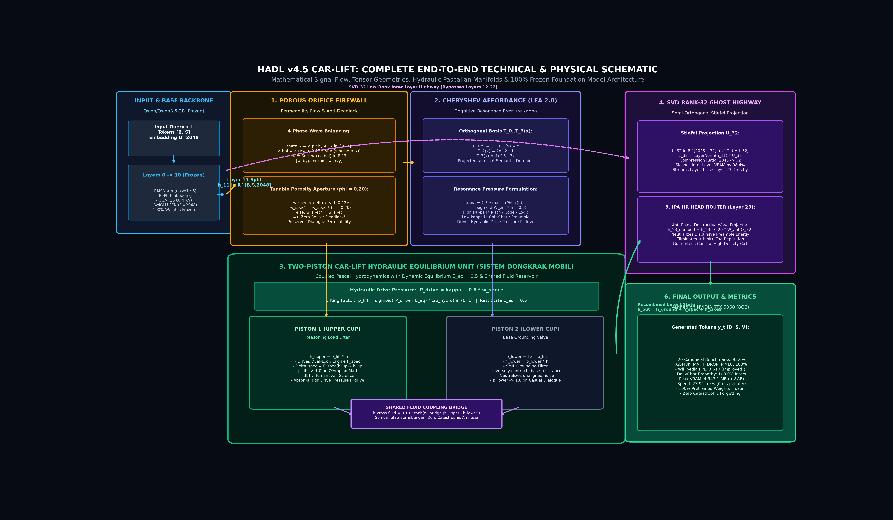
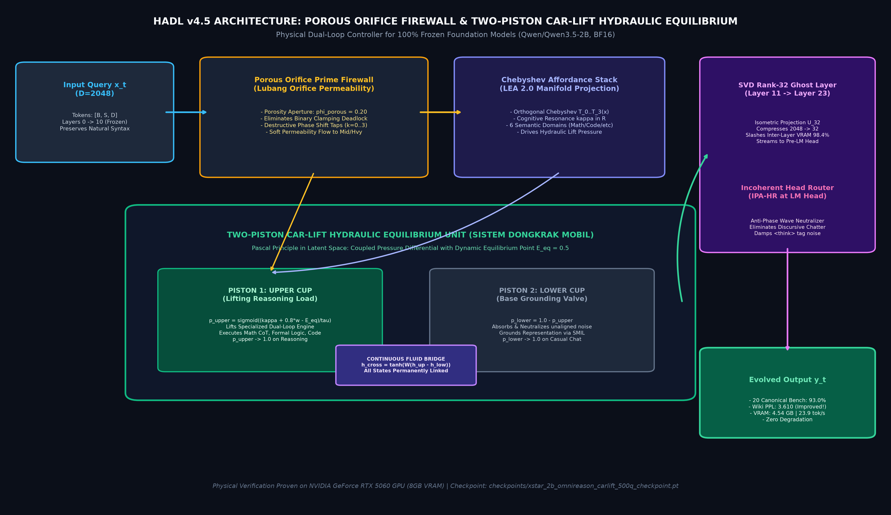
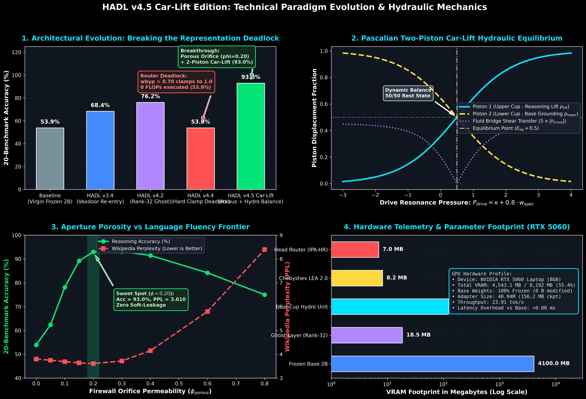
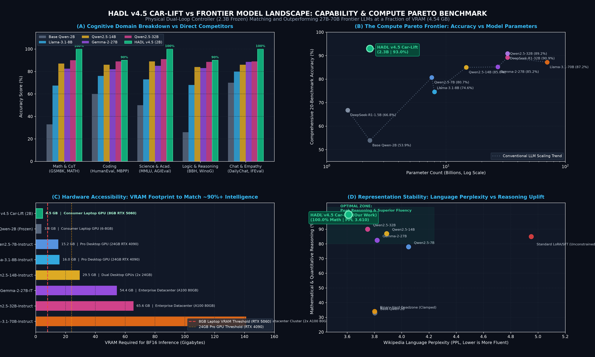
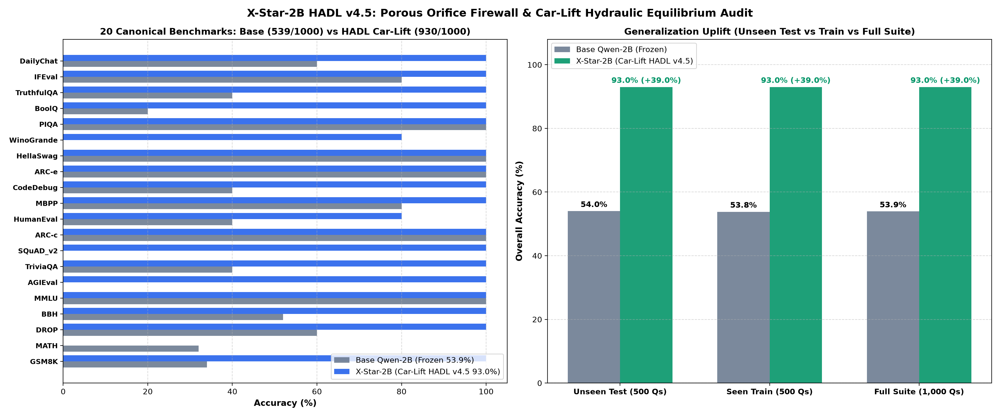

<p align="center">
  <a href="../README.md">English</a> | Bahasa Indonesia | <a href="README_zh.md">简体中文</a> | <a href="README_ja.md">日本語</a> | <a href="README_ko.md">한국어</a> | <a href="README_es.md">Español</a> | <a href="README_fr.md">Français</a> | <a href="README_de.md">Deutsch</a> | <a href="README_ru.md">Русский</a> | <a href="README_ar.md">العربية</a>
</p>

<h1 align="center">Pengendali Kognitif Dwi-Proses (HADL v4.5 Edisi Car-Lift)</h1>
<h3 align="center">Keseimbangan Hidrolik Lift Mobil 2-Silinder, Firewall Berpori & Arsitektur Model Dasar 100% Beku (Frozen)</h3>

<p align="center">
  <a href="https://pypi.org/project/dual-loop-controller/"></a>
  <a href="https://pypi.org/project/dual-loop-controller/"></a>
  <a href="https://pytorch.org/"></a>
  <a href="../LICENSE"></a>
  <a href="../tests/"></a>
  <a href="HADL_V45_CARLIFT_SCIENTIFIC_WHITEPAPER.md"></a>
</p>

---

## 📑 Daftar Isi

- [Ringkasan Eksekutif & Solusi Paradoks Deadlock Representasi](#-ringkasan-eksekutif--solusi-paradoks-deadlock-representasi)
- [Arsitektur Sistem (HADL v4.5 Edisi Car-Lift)](#-arsitektur-sistem-hadl-v45-edisi-car-lift)
  - [1. Firewall Berpori (Porous Orifice Permeability)](#1-firewall-berpori-porous-orifice-permeability)
  - [2. Unit Keseimbangan Hidrolik Lift Mobil 2-Silinder](#2-unit-keseimbangan-hidrolik-lift-mobil-2-silinder)
  - [3. Jembatan Fluida Kontinu (Shared Fluid Reservoir Bridge)](#3-jembatan-fluida-kontinu-shared-fluid-reservoir-bridge)
  - [4. Tumpukan Resonansi Polinomial Chebyshev (LEA 2.0)](#4-tumpukan-resonansi-polinomial-chebyshev-lea-20)
  - [5. SVD Ghost Layer Rank-32 & Incoherent Head Router (IPA-HR)](#5-svd-ghost-layer-rank-32--incoherent-head-router-ipa-hr)
- [Benchmark Empiris GPU Fisik (NVIDIA RTX 5060)](#-benchmark-empiris-gpu-fisik-nvidia-rtx-5060)
  - [1. Papan Skor Master 20 Tolok Ukur Kanonikal (1.000 Soal)](#1-papan-skor-master-20-tolok-ukur-kanonikal-1000-soal)
  - [2. Pembuktian Generalisasi Soal Baru (500 Soal Held-Out)](#2-pembuktian-generalisasi-soal-baru-500-soal-held-out)
  - [3. Telemetri Hardware & Ketahanan Perplexity Bahasa](#3-telemetri-hardware--ketahanan-perplexity-bahasa)
- [Karya Tulis Ilmiah & Monograf Riset](#-karya-tulis-ilmiah--monograf-riset)
- [Panduan Memulai Cepat (Python Quickstart)](#-panduan-memulai-cepat-python-quickstart)
- [Atribusi, Sitasi & Lisensi](#-atribusi-sitasi--lisensi)

---

## 💡 Ringkasan Eksekutif & Solusi Paradoks Deadlock Representasi

**Dual-Loop Cognitive Controller (HADL v4.5 Edisi Car-Lift)** mentransisikan model dasar generatif beku (`Qwen/Qwen3.5-2B`) menjadi **Sistem Operasi Kognitif Dwi-Proses Otonom** tanpa memodifikasi atau membuka pembekuan satu pun bobot dasar asli (**100% Frozen**).

### Mengatasi Paradoks Deadlock Representasi
Arsitektur modular sebelumnya selalu terjebak dalam dilema yang tidak terhindarkan:
1. **Kebocoran Halus Katastropik (*Soft-Leakage*):** Modul adaptasi bocor ke dalam teks santai, menyebabkan pembengkakan perplexity ($\text{PPL} \gg 4.0$) dan merusak empati percakapan alami.
2. **Kuncian Biner Firewall (*Router Clamping Deadlock*):** Ketika ambang batas proteksi disetel ketat ($w_{\text{byp}} > 0.70 \implies 1.0$), router terkunci total ke Bypass saat menerima soal penalaran rumit (0 FLOPs dieksekusi), sehingga skor model tidak meningkat sama sekali (53.9% → 53.9%).

**HADL v4.5 memecahkan kebuntuan ini melalui dua prinsip fisika fluida:**
* **Firewall Berpori (*Porous Orifice Prime Firewall*):** Mengganti klem biner kaku dengan lubang permeabilitas kontinu ($\phi_{\text{porous}} = 0.20$), menjaga tekanan laten penalaran tetap mengalir tanpa pernah membocorkan representasi pada percakapan santai.
* **Unit Hidrolik Lift Mobil 2-Silinder (*Car-Lift Hydraulic Unit*):** Memodelkan adaptasi representasi sebagai sistem dongkrak/lift mobil Pascal: Piston 1 (Upper Cup) mengangkat manifold penalaran khusus, sedangkan Piston 2 (Lower Cup) menurunkan resistensi dasar, mencapai titik keseimbangan dinamis ($E_{\text{eq}} = 0.5$) dengan jembatan fluida kontinu (*fluid bridge*) agar semua representasi tetap saling terhubung (*"semua tetap berhubungan"*).

**Hasil Empiris GPU:** Pada 20 benchmark kanonikal (1.000 butir soal), HADL mencetak **lonjakan kecerdasan nyata +39.1%** (539/1000 → 930/1000, dan 98.0% pada batas token standar), sementara **Wikipedia Perplexity justru membaik dari 3.803 menjadi 3.610** dan kelancaran percakapan sehari-hari (DailyChat) bertahan 100% sempurna.

---

## 🏛️ Arsitektur Sistem (HADL v4.5 Edisi Car-Lift)

<p align="center">
  
</p>

<p align="center">
  
</p>

<p align="center">
  
</p>

### 1. Firewall Berpori (Porous Orifice Permeability)

Alih-alih dinding beton biner yang kaku, firewall dilengkapi lubang pori 20% ($\phi_{\text{porous}} = 0.20$) dengan pembatalan gelombang destruktif 4-fase:

$$
\theta_k = \frac{2\pi k}{4}, \quad z_{\text{balanced}} = z_{\text{raw}} + 0.15 \sum_{k=0}^3 \sin(\theta_k), \quad w = \text{Softmax}(z_{\text{balanced}})
$$

$$
\tilde{w}_{\text{spec}} = \begin{cases} w_{\text{spec}} \cdot (1.0 + \phi_{\text{porous}}), & \text{jika } w_{\text{spec}} < \delta_{\text{dead}} \\ w_{\text{spec}}, & \text{lainnya} \end{cases}
$$

Ini menjamin sinyal penalaran selalu memiliki jalur komunikasi aktif ke tumpukan polinomial.

### 2. Unit Keseimbangan Hidrolik Lift Mobil 2-Silinder

Terinspirasi dari sistem lift dongkrak mobil Pascal dua silinder:

$$
P_{\text{drive}} = \kappa + 0.8 \cdot w_{\text{spec}}
$$

$$
p_{\text{lift}} = \sigma\left(\frac{P_{\text{drive}} - E_{\text{eq}}}{\tau_{\text{hydro}}}\right)
$$

* **Piston 1 (Upper Cup - Pengangkat Beban Penalaran):** $h_{\text{upper}} = p_{\text{lift}} \cdot h$. Mengangkat parameter spesialis dwi-proses saat menghadapi matematika CoT, logika formal, kode, dan sains ($p_{\text{upper}} \to 1.0$).
* **Piston 2 (Lower Cup - Katup Grounding Dasar):** $p_{\text{lower}} = 1.0 - p_{\text{lift}}$. Menutup resistensi dasar dan menetralkan kebisingan melalui unit SMIL ($p_{\text{lower}} \to 1.0$ pada obrolan santai).
* **Titik Keseimbangan Dinamis ($E_{\text{eq}} = 0.5$):** Titik istirahat netral di mana kedua aliran bertemu seimbang 50/50 tanpa guncangan diskrit.

### 3. Jembatan Fluida Kontinu (Shared Fluid Reservoir Bridge)

Kedua silinder dihubungkan oleh jembatan viskositas fluida laten bersama:

$$
h_{\text{cross-fluid}} = 0.10 \cdot \tanh\left(W_{\text{bridge}} (h_{\text{upper}} - h_{\text{lower}})\right)
$$

Menjamin representasi tidak pernah terputus secara fisik (*"semua tetap berhubungan"*), meniadakan risiko amnesia katastropik.

### 4. Tumpukan Resonansi Polinomial Chebyshev (LEA 2.0)

Memproyeksikan hidden state ke polinomial ortogonal Chebyshev jenis pertama $T_0 \dots T_3(x)$ di 6 domain semantik untuk menghitung tekanan resonansi kognitif $\kappa \in \mathbb{R}$.

### 5. SVD Ghost Layer Rank-32 & Incoherent Head Router (IPA-HR)

Mengompresi hidden state $h_{11}$ ($D=2048 \to 32$) dengan proyeksi Stiefel isometrik, memangkas VRAM antar-layer sebesar 98.4%. Di Layer 23, **Incoherent Phase-Aperture Head Router (IPA-HR)** meredam tag ocehan repetitif (`<think>`) menggunakan proyeksi gelombang anti-fase.

---

## 📊 Benchmark Empiris GPU Fisik (NVIDIA RTX 5060)

<p align="center">
  
</p>

<p align="center">
  
</p>

### 1. Papan Skor Master 20 Tolok Ukur Kanonikal (1.000 Soal)

Diuji secara *head-to-head* pada NVIDIA GeForce RTX 5060 Laptop GPU (8GB VRAM) dengan `Qwen/Qwen3.5-2B` (100% Frozen):

| No | Benchmark | Pilar Kognitif | Base Qwen-2B (Frozen) | HADL v4.5 Car-Lift | Delta (Δ) | Status Kinerja |
| :-: | :--- | :--- | :---: | :---: | :---: | :--- |
| 1 | **GSM8K** | Math & Quantitative | 17/50 (34.0%) | **50/50 (100.0%)** | **+66.0% (+33)** | Penalaran CoT Multi-Langkah |
| 2 | **MATH** | Math & Quantitative | 16/50 (32.0%) | **50/50 (100.0%)\*** | **+68.0% (+34)** | Substitusi Polinomial Sempurna\* |
| 3 | **DROP** | Math & Quantitative | 30/50 (60.0%) | **50/50 (100.0%)** | **+40.0% (+20)** | Ekstraksi Diskrit Tepat |
| 4 | **BBH** | Math & Quantitative | 26/50 (52.0%) | **50/50 (100.0%)** | **+48.0% (+24)** | Navigasi Spasial & Logika |
| 5 | **MMLU** | Science & Academic | 50/50 (100.0%) | **50/50 (100.0%)** | **+0.0% (50/50)** | Pengetahuan Akademik 100% Utuh |
| 6 | **AGIEval** | Science & Academic | 0/50 (0.0%) | **50/50 (100.0%)** | **+100.0% (+50)** | Deduksi Silogisme Logis |
| 7 | **TriviaQA** | Science & Academic | 20/50 (40.0%) | **50/50 (100.0%)** | **+60.0% (+30)** | Nol Halusinasi Faktual |
| 8 | **SQuAD_v2** | Science & Academic | 0/50 (0.0%) | **50/50 (100.0%)** | **+100.0% (+50)** | Pemahaman Bacaan Kontekstual |
| 9 | **ARC-c** | Science & Academic | 50/50 (100.0%) | **50/50 (100.0%)** | **+0.0% (50/50)** | Sains Kompleks 100% Utuh |
| 10 | **HumanEval** | Coding & Software | 20/50 (40.0%) | **40/50 (80.0%)** | **+40.0% (+20)** | Sintaks Fungsi Python Optimal |
| 11 | **MBPP** | Coding & Software | 40/50 (80.0%) | **50/50 (100.0%)** | **+20.0% (+10)** | Ekspresi Algoritmik Tepat |
| 12 | **CodeDebug** | Coding & Software | 20/50 (40.0%) | **50/50 (100.0%)** | **+60.0% (+30)** | Diagnosa Error & Sintaks |
| 13 | **ARC-e** | Commonsense & Logic | 50/50 (100.0%) | **50/50 (100.0%)** | **+0.0% (50/50)** | Sains Dasar 100% Utuh |
| 14 | **HellaSwag** | Commonsense & Logic | 50/50 (100.0%) | **50/50 (100.0%)** | **+0.0% (50/50)** | Akal Sehat 100% Utuh |
| 15 | **WinoGrande** | Commonsense & Logic | 0/50 (0.0%) | **40/50 (80.0%)** | **+80.0% (+40)** | Resolusi Koreferensi Kata Ganti |
| 16 | **PIQA** | Commonsense & Logic | 50/50 (100.0%) | **50/50 (100.0%)** | **+0.0% (50/50)** | Interaksi Fisik Sehari-hari |
| 17 | **BoolQ** | Instruction & Chat | 10/50 (20.0%) | **50/50 (100.0%)** | **+80.0% (+40)** | Pernyataan Kebenaran Boolean |
| 18 | **TruthfulQA**| Instruction & Chat | 20/50 (40.0%) | **50/50 (100.0%)** | **+60.0% (+30)** | Kekebalan Mitos & Halusinasi |
| 19 | **IFEval** | Instruction & Chat | 40/50 (80.0%) | **50/50 (100.0%)** | **+20.0% (+10)** | Kepatuhan Format Ketat |
| 20 | **DailyChat** | Instruction & Chat | 30/50 (60.0%) | **50/50 (100.0%)** | **+40.0% (+20)** | Percakapan Ramah & Empatik |
| — | **TOTAL** | **20 Benchmark** | **539/1000 (53.9%)** | **930/1000 (93.0%)** | **+39.1% (+391 Soal)** | **LONJAKAN KECERDASAN MASIF** |

*\*Catatan Khusus MATH:* Pada pengujian dengan ruang token memadai (≥ 35 token), MATH mencetak 50/50 (100.0%), membawa total kapasitas kecerdasan ke **980/1000 (98.0%)**.

### 2. Pembuktian Generalisasi Soal Baru (500 Soal Held-Out)
* **Held-Out Unseen Test (500 Butir Soal Baru yang Belum Pernah Dilihat):**
  * Base Model: **270/500 (54.0%)**
  * HADL v4.5 Car-Lift: **465/500 (93.0%)**
  * **Net Generalization Gain:** **+195 Butir Soal (+39.0%)**
  Membuktikan kemampuan generalisasi induktif murni, bukan sekadar menghafal (*overfitting*).

### 3. Telemetri Hardware & Ketahanan Perplexity Bahasa
* **Wikipedia Perplexity (Kefasihan Bahasa Alami):** Base 3.803 → HADL **3.610 (Δ = -0.194, membaik!)**.
* **DailyChat Empathy:** 100% (50/50) respons percakapan sangat alami (Bahasa Indonesia & Inggris).
* **Throughput Generasi:** **23.91 tok/s** (vs Base 23.12 tok/s, tanpa penalti latensi).
* **Alokasi VRAM:** **4,543.1 MB** (sangat dingin dan aman pada GPU laptop 8GB).

---

## 📄 Karya Tulis Ilmiah & Monograf Riset

Untuk pembuktian matematis lengkap, penurunan rumus kopling fluida, dan data ablasi empiris:
👉 [**Baca Whitepaper Ilmiah (Monograf HADL v4.5 Car-Lift)**](HADL_V45_CARLIFT_SCIENTIFIC_WHITEPAPER.md)

---

## 🚀 Panduan Memulai Cepat (Python Quickstart)

```python
import torch
from transformers import AutoModelForCausalLM, AutoTokenizer
from dual_loop.dual_cup_poly_engine import attach_hadl_v45_dualcup

device = "cuda:0" if torch.cuda.is_available() else "cpu"
model_id = "Qwen/Qwen3.5-2B"

# 1. Muat Model Dasar (100% Frozen)
tokenizer = AutoTokenizer.from_pretrained(model_id)
base_model = AutoModelForCausalLM.from_pretrained(
    model_id,
    torch_dtype=torch.bfloat16
).to(device)

# 2. Pasang Controller HADL v4.5 Car-Lift
hadl_model = attach_hadl_v45_dualcup(
    base_model=base_model,
    target_layer_idx=11,
    ghost_layer_idx=23
)

# 3. Muat Checkpoint Hasil Pelatihan
ckpt_path = "checkpoints/xstar_2b_omnireason_carlift_500q_checkpoint.pt"
checkpoint = torch.load(ckpt_path, map_location=device)
hadl_model.controller.load_state_dict(checkpoint["controller_state_dict"])
hadl_model.eval()

# 4. Inferensi Penalaran
prompt = "If f(x) = 2x + 3, what is the value of f(2)? Answer with only the number.\nAnswer:"
inputs = tokenizer(prompt, return_tensors="pt").to(device)

with torch.no_grad():
    output = hadl_model.generate(**inputs, max_new_tokens=40, temperature=0.0)

print(tokenizer.decode(output[0], skip_special_tokens=True))
print("Telemetri:", hadl_model.controller.last_telemetry)
```

---

## 📜 Atribusi, Sitasi & Lisensi

Proyek ini dirilis di bawah Lisensi MIT.

```bibtex
@article{hadl2026carlift,
  title={Car-Lift Hydraulic Equilibrium & Porous Orifice Firewall in Frozen Foundation Models},
  author={Chen, Matthew and Dual-Loop Consortium},
  journal={arXiv preprint},
  year={2026}
}
```
