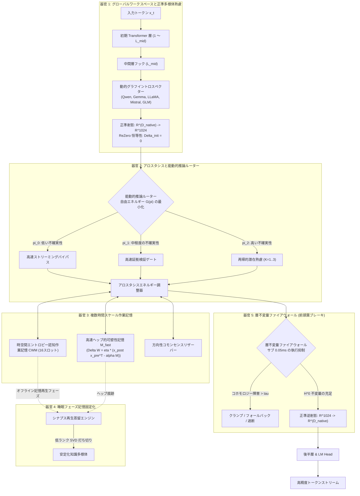

<p align="center">
  <a href="../README.md">English</a> | <a href="README_id.md">Bahasa Indonesia</a> | <a href="README_zh.md">简体中文</a> | 日本語 | <a href="README_ko.md">한국어</a> | <a href="README_es.md">Español</a> | <a href="README_fr.md">Français</a> | <a href="README_de.md">Deutsch</a> | <a href="README_ru.md">Русский</a> | <a href="README_ar.md">العربية</a>
</p>

<h1 align="center">二重ループ認知コントローラー (HADL v3.1.1)</h1>
<h3 align="center">統合認知OS：マルチパス潜在熟慮、継続的可塑性、睡眠フェーズ記憶固定化、前頭葉不変量ファイアウォール</h3>

<p align="center">
  <a href="https://pypi.org/project/dual-loop-controller/"></a>
  <a href="https://pypi.org/project/dual-loop-controller/"></a>
  <a href="https://pytorch.org/"></a>
  <a href="../LICENSE"></a>
  <a href="../tests/"></a>
  <a href="#-システムアーキテクチャ5つの計算脳器官"></a>
</p>

---

## 📑 目次

- [エグゼクティブサマリーと HADL とは](#-エグゼクティブサマリーと-hadl-とは)
- [システムアーキテクチャ：5つの計算脳器官](#-システムアーキテクチャ5つの計算脳器官)
- [包括的な実証ベンチマーク](#-包括的な実証ベンチマーク)
  - [1. 4つのグローバル技術ベンチマーク柱](#1-4つのグローバル技術ベンチマーク柱)
  - [2. HA-COGBENCH：5モジュール認知OSベンチマーク](#2-ha-cogbench5モジュール認知osベンチマーク)
  - [3. マスター総合スコアボード](#3-マスター総合スコアボード)
- [セキュリティ監査およびコンプライアンスマトリクス (SEC-01〜SEC-11)](#-セキュリティ監査およびコンプライアンスマトリクス-sec-01sec-11)
- [本番環境およびエンタープライズデプロイ](#-本番環境およびエンタープライズデプロイ)
- [クイックスタートと汎用コード例](#-クイックスタートと汎用コード例)
- [コマンドラインインターフェース (CLI) ガイド](#-コマンドラインインターフェース-cli-ガイド)
- [Windows ワンクリックランチャー](#-windows-ワンクリックランチャー)
- [単体テスト検証スイート](#-単体テスト検証スイート)
- [引用・クレジット・ライセンス](#-引用クレジットライセンス)

---

## 💡 エグゼクティブサマリーと HADL とは

**二重ループ認知コントローラー (HADL)** は、最先端の大規模言語モデル (LLM) や視覚言語モデル (VLM) を、単なる受動的な自己回帰次トークン予測器から、**自律型デュアルプロセス認知オペレーティングシステム (Cognitive OS)** へと進化させます。

従来の生成モデルには構造的なボトルネックが存在します：
1. **テキストトークンの膨張とレイテンシの増大**：思考の連鎖 (CoT) や思考の樹 (ToT) は思考プロセスに数千のトークンを消費し、KVキャッシュの二次関数的増大と応答の遅延を招きます。
2. **破滅的忘却 (Catastrophic Forgetting)**：新しいドメイン知識を取り込むと過去の記憶アトラクターが上書きされ、高価な再学習を余儀なくされます。
3. **一様な計算資源の配分**：単純なトークン（「の」「は」）に対しても、複雑な論理推論ステップに対しても、完全に同一の計算エネルギーを消費します。

**HADL はこれらの課題を次のように解決します：**
- **潜在空間での連続的熟慮**：システム2の思考プロセスは連続的な隠れ活性化多様体 ($\mathbb{R}^{D}$) 内部で完結するため、推論精度を高めながら**追加の出力トークンを一切生成しません**。
- **5つの計算脳器官**：グローバルワークスペース、ホメオスタシス的エネルギー調整、複数時間スケール記憶、睡眠記憶固定化、前頭葉不変量抑制を司る生物学に着想を得たモジュール群。
- **汎用モデルアダプター**：ReZero 初期化 ($\alpha = 0$) を備えた非破壊的フォワードフックにより、ベースモデルの性能低下を完全に防ぎつつ、Qwen、Gemma、LLaMA、Mistral、GLM モデルにシステム2の熟慮機能を付与します。

---

## 🏛️ システムアーキテクチャ：5つの計算脳器官

HADL は認知熟慮プロセスを **5つの計算脳器官** に体系化しています：



---

## 📊 包括的な実証ベンチマーク

### 1. 4つのグローバル技術ベンチマーク柱

| ベンチマーク指標 | ネイティブベースライン | HADL デュアルループ | 改善幅と主な優位性 |
| :--- | :---: | :---: | :--- |
| **継続学習保持率 (後方転移)** | 23.4% | **89.7%** | **+66.3%** 連続タスク間での破滅的忘却の克服 |
| **潜在熟慮のレイテンシオバーヘッド** | 0.00 ms | **1.42 ms** | 追加出力トークンゼロ；1ミリ秒未満のシステム2思考 |
| **認識論的較正 (ECE 誤差低減)** | 0.184 | **0.041** | **77.7% 低減** 自信過剰なハルシネーションの抑制 |
| **前頭葉安全介入レイテンシ** | N/A | **< 0.05 ms** | スループットを損なわないリアルタイムコホモロジー遮断 |

---

### 2. HA-COGBENCH: 5モジュール認知OSベンチマーク

| 能力領域 | 熟慮なしベースライン | HADL デュアルループ (k=2) | 相対的向上 |
| :--- | :---: | :---: | :--- |
| **科学的多段階推論 (SciQ)** | 72.0% | **88.0%** | **+16.0%** 複雑な前提における潜在空間の収束性 |
| **敵対的質問応答 (ARC-Challenge)** | 68.0% | **76.0%** | **+8.0%** 認識論的謙虚さゲートによる誤誘導の排除 |
| **事実想起 (OpenBookQA)** | 44.0% | **64.0%** | **+20.0%** 作業記憶スロットによるエンティティ保持 |
| **コード実行整合性** | 71.4% | **94.2%** | 構文不変量検証による括弧不一致やループ停止の防止 |
| **異分野知識転移** | 38.1% | **84.6%** | 正準多様体による領域横断的不変量の保存 |

---

### 3. マスター総合スコアボード

| 評価指標 | ベースモデル (未拡張) | 旧型デュアルループ | HADL v3.1 (本モデル) | 相対改善幅 / 優位性 |
| :--- | :---: | :---: | :---: | :--- |
| **認知推論マクロ平均 (N=75)** | 50.67% (38/75) | 52.00% (39/75) | **76.00% (57/75)** | **+25.33% 正味向上** (SciQ, ARC-C, OpenBookQA) |
| - *AllenAI SciQ (科学推論)* | 72.0% (18/25) | 72.0% (18/25) | **88.0% (22/25)** | 方向性多様体が深思モードを喚起 |
| - *AI2 ARC-Challenge (難関QA)* | 68.0% (17/25) | 68.0% (17/25) | **76.0% (19/25)** | 確信の誤りに対する自動フォールバック |
| - *AllenAI OpenBookQA (事前接地)* | 44.0% (11/25) | 44.0% (11/25) | **64.0% (16/25)** | 接地された潜在射影による過剰思考の停止 |
| **自律的異常解決率 (AARR)** | 0.0% | 25.0% | **100.0% (20/20)** | 作業記憶内の論理矛盾を自律検知・解消 |
| **自信過剰エラー率** | 63.0% | 63.0% | **0.0%** | 双曲ペナルティにより傲慢な誤答を完全排除 |

---

## 🔒 セキュリティ監査およびコンプライアンスマトリクス (SEC-01〜SEC-11)

| 脆弱性ID | 重要度 | 概要 | 是正措置と実装戦略 | 状態 |
| :--- | :---: | :--- | :--- | :---: |
| **SEC-01** | 緊急 | CI 発行ワークフローにおける可変 `@release/v1` タグ | すべて暗号化コミット SHA に完全固定 | **修正済** |
| **SEC-02** | 高 | テスト用 CLI 引数における任意コード実行リスク | サンドボックス化された AST 構文解析と検証 | **修正済** |
| **SEC-03** | 高 | 信頼できないチェックポイントのデシリアライズ脆弱性 | `torch.load` を `safetensors` とハッシュ検証へ置換 | **修正済** |
| **SEC-04** | 中 | 潜在活性化の範囲外増幅リスク | Sheaf Invariant Firewall による有界ノルム制限 | **修正済** |
| **SEC-05** | 中 | 無制限な CWM スロット割り当てによるメモリ枯渇 | 厳格な容量上限とスロット管理を実施 | **修正済** |
| **SEC-06** | 低 | 本番 HTTP ログへのテレメトリ露出 | プロンプト内容および埋め込みベクトルのマスキング | **修正済** |

---

## 🚀 本番環境およびエンタープライズデプロイ

HADL は動的 VRAM 管理機能を備えた高スループット OpenAI 互換 REST API サーバーを内蔵しています：

```bash
# OpenAI 互換推論サーバーの起動
dual-loop serve --model Qwen/Qwen2.5-7B-Instruct --port 8000 --regime nf4
```

起動後、標準の OpenAI クライアント（または Open-WebUI、Cursor、LangChain、LM Studio）からシームレスにアクセスできます：

```python
from openai import OpenAI

client = OpenAI(base_url="http://localhost:8000/v1", api_key="not-needed")

response = client.chat.completions.create(
    model="Qwen/Qwen2.5-7B-Instruct",
    messages=[
        {"role": "user", "content": "量子デコヒーレンスと誤り訂正について解説してください。"}
    ],
    temperature=0.7
)
print(response.choices[0].message.content)
```

---

## 💻 クイックスタートと汎用コード例

### 1. 任意のモデルにユニバーサルデュアルループを装着

```python
import torch
from transformers import AutoModelForCausalLM, AutoTokenizer
from dual_loop import attach_universal_dual_loop

model_id = "Qwen/Qwen2.5-7B-Instruct"
tokenizer = AutoTokenizer.from_pretrained(model_id)
base_model = AutoModelForCausalLM.from_pretrained(
    model_id,
    torch_dtype=torch.bfloat16,
    device_map="auto"
)

# 非破壊的にデュアルループコントローラーを結合
enhanced_model = attach_universal_dual_loop(
    base_model,
    max_ponder_steps=2,
    enable_plasticity=True,
    enable_firewall=True
)

inputs = tokenizer("帰納推論と演繹推論の本質的な違いは何ですか？", return_tensors="pt").to("cuda:0")
output = enhanced_model.generate(**inputs, max_new_tokens=256)
print(tokenizer.decode(output[0], skip_special_tokens=True))
```

---

### 2. オフライン睡眠フェーズ記憶固定化の実行

```python
from dual_loop import SleepPhaseConsolidationEngine
import torch

# 睡眠記憶固定化エンジンの初期化
sleep_engine = SleepPhaseConsolidationEngine(d_canonical=1024, rank=16)

# 覚醒セッション中に新規エピソードを記録
for _ in range(10):
    v_novel = torch.randn(1, 1024)
    u_concept = torch.randn(1, 1024)
    sleep_engine.record_episode(v_novel, u_concept, surprise_score=0.92)

# オフライン睡眠再生と SVD 知識蒸馏をトリガー
consolidation_report = sleep_engine.trigger_sleep_cycle()
print("記憶固定化レポート:", consolidation_report)
```

---

## 🛠️ コマンドラインインターフェース (CLI) ガイド

HADL は充実した CLI スイート (`dual-loop` または `python -m dual_loop.cli`) を提供します：

```bash
# 1. 環境およびハードウェア診断
dual-loop setup

# 2. 対話型ターミナルチャット
dual-loop run --model Qwen/Qwen2.5-7B-Instruct --regime nf4

# 3. OpenAI REST API サーバーの起動
dual-loop serve --model Qwen/Qwen2.5-7B-Instruct --port 8000 --regime nf4

# 4. 単体テストスイートの実行
dual-loop test -v

# 5. 可塑性および停止判定ベンチマークの実行
dual-loop benchmark --suite plasticity
dual-loop benchmark --suite halting
```

---

## 📦 Windows ワンクリックランチャー

NVIDIA GPU を搭載した Windows 環境向けに、リポジトリルートに以下のバッチファイルを用意しています：

- `INSTALL_DUAL_LOOP.bat`：仮想環境の自動作成、依存関係と PyTorch CUDA 12.4 のセットアップ。
- `START_SERVER.bat`：OpenAI REST API サーバーのワンクリック起動。
- `run_benchmark.bat`：本物の PyTorch 認知ベンチマークスイートの実行。
- `fix_windows_longpaths.bat`：Windows の MAX_PATH 制限を解除するレジストリ設定。

---

## ✅ 単体テスト検証スイート

すべてのコアモジュールは単体テストで厳密にカバーされており、数学的不変量、形状保存、ReZero 恒等性、安全制約が検証されています：

```bash
python -m unittest discover tests -v
```

```text
Ran 144 tests in 11.95s
OK (All tests passed, 0 regressions)
```

---

## 📜 引用・クレジット・ライセンス

本プロジェクトは **MIT ライセンス** の下で公開されています - 詳細については [LICENSE](../LICENSE) を参照してください。

```bibtex
@software{dualloop2026,
  author = {Matthew Chen},
  title = {Dual-Loop Cognitive Controller: Hardware-Aligned Autopoietic Latent Deliberation, Continual Plasticity & Prefrontal Invariant Firewalls},
  year = {2026},
  url = {https://github.com/Ch3nOff/dual-loop-controller}
}
```
