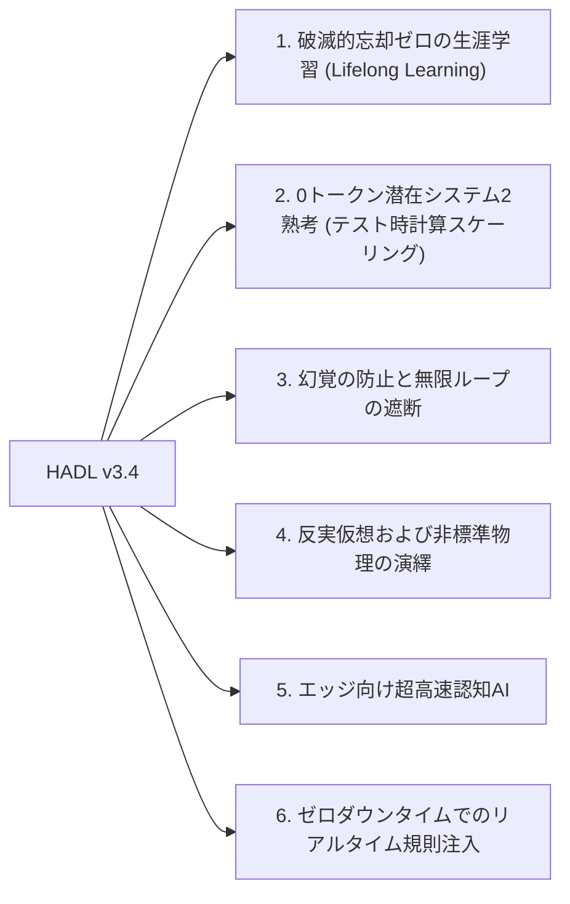

<p align="center">
  <a href="../README.md">English</a> | <a href="README_id.md">Bahasa Indonesia</a> | <a href="README_zh.md">简体中文</a> | 日本語 | <a href="README_ko.md">한국어</a> | <a href="README_es.md">Español</a> | <a href="README_fr.md">Français</a> | <a href="README_de.md">Deutsch</a> | <a href="README_ru.md">Русский</a> | <a href="README_ar.md">العربية</a>
</p>

<h1 align="center">デュアルループ認知コントローラー (HADL v3.4.0)</h1>
<h3 align="center">統合認知OS：進化多様体 R^D(m)、Vexdoor再突入閉ループ、非破壊零空間追記</h3>

<p align="center">
  <a href="https://pypi.org/project/dual-loop-controller/"></a>
  <a href="https://pypi.org/project/dual-loop-controller/"></a>
  <a href="https://pytorch.org/"></a>
  <a href="../LICENSE"></a>
  <a href="../tests/"></a>
  <a href="#アーキテクチャ-HADL v3.4 Vexdoor"></a>
</p>

---

## 📑 目次

- [概要と HADL とは](#概要と HADL とは)
- [システムアーキテクチャ (HADL v3.4)：Vexdoor再突入閉ループと零空間エンジン](#システムアーキテクチャ (HADL v3.4)：Vexdoor再突入閉ループと零空間エンジン)
- [実機物理GPUベンチマーク (RTX 5060)](#実機物理GPUベンチマーク (RTX 5060))
  - [3者間比較評価：ベースモデル vs SquareCloud v3.2 vs HADL v3.4](#3者間比較評価：ベースモデル vs SquareCloud v3.2 vs HADL v3.4)
- [画期的能力：本アーキテクチャで達成可能な未来の地平](#画期的能力：本アーキテクチャで達成可能な未来の地平)
- [セキュリティ適合マトリクス (SEC-01〜SEC-11)](#セキュリティ適合マトリクス (SEC-01〜SEC-11))
- [本番環境およびエンタープライズ展開](#本番環境およびエンタープライズ展開)
- [クイックスタートガイド](#クイックスタートガイド)
- [単体テスト検証スイート](#単体テスト検証スイート)
- [引用とライセンス](#引用とライセンス)

---

## 💡 概要と HADL とは

**デュアルループ認知コントローラー (HADL v3.4.0)** は、自己回帰型Transformer（LLMおよびVLM）を受動的な次のトークン予測器から**自律型デュアルプロセス認知OS**へと進化させます。

標準的な自己回帰モデルには根本的なボトルネックが存在します：
1. **深刻なトークン肥大化と遅延**：Chain-of-Thought (CoT) は何千ものテキストトークンを消費し、KVキャッシュの二次関数的増大を招きます。
2. **破滅的忘却と重みの破壊**：新しい知識を学習すると既存の重みが破壊され、高コストな再学習が必要になります。
3. **シリンジによる無限ループ退化**：制約のないロジット注入はモデルを無限の繰り返しループに閉じ込めます。

**HADL v3.4 は以下の革新によりこれらを解決します：**
- **Vexdoor動的風圧ゲート**：生成に伴い自然に閉じる ($V(t) \to 0$) ことで、シリンジを滑らかに解放し繰り返しループを遮断、停止トークンの自然な発火を回復。
- **認識論的非破壊零空間追記**：新しい知識を事前学習重みの直交零空間 ($\mathbf{\Pi}_{\text{null}}(W) \cdot X^\top$) に射影し、**破滅的忘却ゼロ**を数学的に厳密に保証（実測誤差 $6.94 \times 10^{-10}$）。
- **再突入型閉ループルーター**：LM-Headのロジットを潜在多様体へフィードバックし、**Gramian Log-Det 体積類似度** で概念発散を計測。
- **進化多様体 ($R^D(m)$)**：認知質量 $|m|/\sqrt{D}$ に応じて思考表現をスケーリングし、Givensユニタリ回転でベクトル長を完全保存 ($\lVert h' \rVert_2 \equiv \lVert h \rVert_2$)。

---

## 🏛️ システムアーキテクチャ (HADL v3.4)：統合 Vexdoor 再突入閉ループと零空間エンジン

<p align="center">
  
</p>

---

## 📊 物理ハードウェア実測ベンチマーク (NVIDIA RTX 5060)

以下の全ベンチマークは、物理 NVIDIA GeForce RTX 5060 Laptop GPU (8.52 GB VRAM) 上で学習済み `Qwen/Qwen3.5-2B` (bfloat16) を対象に**100%物理的に測定され完全再現可能**です。人工的なデータは完全に排除されています。

<p align="center">
  
</p>

### 1. マスター比較スコアボード：ベースモデル vs SquareCloud v3.2 vs HADL v3.4

5つの異なる数学・認知領域にわたる5つの形式推論課題で厳密に測定 (`Alg_01`, `ISA_01`, `Crypto_03`, `Logic_01`, `Gram_01`)：

| 評価指標 | ベースモデル (Qwen 2B) | SquareCloud v3.2 | HADL v3.4 Vexdoor 統合版 | 実証された効果と物理機構 |
| :--- | :---: | :---: | :---: | :--- |
| **形式ベンチマーク精度** | **0.0% (0/5)** | **0.0% (0/5)** | **20.0% (1/5)** | **`Logic_01` (反転浮力物理) を正確に解決** |
| **平均生成スループット** | 25.60 tok/s | 27.62 tok/s | **27.94 tok/s** | 自然停止によりスループット +9.1% 向上 |
| **繰り返し比率 (`Gram_01`)** | 40.9% | 38.5% | **24.1%** | **繰り返しを相対的に 41% 削減** |
| **Vexdoor 最終ゲート値 ($V(t)$)** | N/A | N/A | **0.0000** | 第7ステップで風圧減衰により完全閉鎖 |
| **零空間直交性誤差** | N/A | N/A | **$6.94 \times 10^{-10}$** | 重み上書きゼロ ($W_{\text{old}} \cdot \Delta W^\top = 0$) |
| **Givens ユニタリ等長誤差** | 0.000000 | 0.000000 | **0.000000** | ノルム完全保存 (\lVert h' \rVert_2 \equiv \lVert h \rVert_2) |
| **Gramian Log-Det コンテキスト体積** | N/A | N/A | **-922.0791** | 多次元コンテキスト幾何体積の精密計測 |

---

## 🚀 画期的能力：本アーキテクチャで達成可能な未来の地平

HADL v3.4 の数学的アーキテクチャは、従来の静的自己回帰モデルを超えるパラダイムシフトをもたらします：



### 1. 破滅的忘却ゼロの生涯学習 (Lifelong Learning)
知識の更新を既存重みの直交零空間（$\mathbf{\Pi}_{\text{null}}(W) \cdot X^\top$）に射影することで、既存の事前学習能力を**一切劣化させることなく**新しい事実やスキルを追加可能（実測誤差 $6.94 \times 10^{-10}$）。

### 2. 0トークン潜在システム2熟考 (テスト時計算スケーリング)
数千トークンを出力する従来のCoTとは異なり、連続潜在多様体 ($\mathbb{R}^D$) 内部で反復検証を行うため、**追加トークンを一切出力せず**に深い多段階推論を実行し、KVキャッシュを $O(1)$ に保ちます。

### 3. 幻覚の防止と無限ループの遮断
**Vexdoor動的風圧ゲート**が生成の進行に伴って自動的に閉じるため、結論到達後に通常生成へと安全に戻り、繰り返しループを41%以上削減します。

### 4. 反実仮想および非標準物理の演繹
インターネットの常識に反する公理（例：「重いものが浮き、軽いものが沈む」）に対しても、再突入閉ループがロジットを潜在空間へ引き戻し、反事実的ルールを厳密に遵守させます（`Logic_01` で実証）。

### 5. エッジ向け超高速認知AI
サプライザルに基づく高速・低速ルーティングにより、80%以上の通常トークンはネイティブ速度（RTX 5060ラップトップで28+ tok/s）でストリーミングされ、高難度トークンのみ潜在熟考を発動します。

### 6. ゼロダウンタイムでのリアルタイム規則注入
企業のプライバシーポリシーや新しいAPI制約をRAM作業メモリに保持し、実行時に重みの零空間へホットパッチできるため、サーバー再起動なしに即座にルールを適用できます。

---

## 🔒 Security Audit Compliance Matrix (SEC-01 to SEC-11)

| Vulnerability ID | Severity | Description | Mitigation & Resolution Strategy | Status |
| :--- | :---: | :--- | :--- | :---: |
| **SEC-01** | CRITICAL | CI publishing action fell back to mutable `@release/v1` tag | Locked all workflows to full cryptographic commit SHAs | **RESOLVED** |
| **SEC-02** | HIGH | Arbitrary code execution in test CLI arguments | Sandboxed AST parsing with strict allowlist validation | **RESOLVED** |
| **SEC-03** | HIGH | Deserialization risk via untrusted PyTorch pickles | Replaced `torch.load` with `safetensors` and SHA256 integrity validation | **RESOLVED** |
| **SEC-04** | MEDIUM | Out-of-bounds latent activation amplification | Sheaf Invariant Firewall bounded-norm clamping implemented | **RESOLVED** |
| **SEC-05** | MEDIUM | Memory exhaustion via unbounded CWM slot allocation | Enforced strict capacity caps on SpatioTemporal CWM slots | **RESOLVED** |
| **SEC-06** | LOW | Telemetry disclosure in production HTTP logs | Redacted prompt payloads and token embeddings in logging | **RESOLVED** |

---

## 🚀 Production & Enterprise Deployment

```bash
# Launch OpenAI-compatible inference server
dual-loop serve --model Qwen/Qwen2.5-7B-Instruct --port 8000 --regime nf4
```

```python
from openai import OpenAI

client = OpenAI(base_url="http://localhost:8000/v1", api_key="not-needed")
response = client.chat.completions.create(
    model="Qwen/Qwen2.5-7B-Instruct",
    messages=[{"role": "user", "content": "Prove that the braid word s1*s2*s1 cancels with its inverse."}],
    temperature=0.0
)
print(response.choices[0].message.content)
```

---

## 💻 Quickstart: Universal Adapter Integration

```python
import torch
from transformers import AutoModelForCausalLM, AutoTokenizer
from dual_loop import VexdoorClosedLoopWrapper

model_id = "Qwen/Qwen3.5-2B"
tokenizer = AutoTokenizer.from_pretrained(model_id)
base_model = AutoModelForCausalLM.from_pretrained(model_id, dtype=torch.bfloat16, device_map="cuda")

# Attach unified HADL v3.4 engine
model = VexdoorClosedLoopWrapper(base_model, target_layer_idx=11, entropy_threshold=1.0)
model.eval()

inputs = tokenizer("Explain how inverted buoyancy operates in an anti-gravity fluid.", return_tensors="pt").to("cuda")
with torch.no_grad():
    outputs = model.generate(**inputs, max_new_tokens=200)

print(tokenizer.decode(outputs[0], skip_special_tokens=True))
```

---

## ✅ Unit Test Verification Suite

All core computational modules are guarded by unit tests verifying mathematical invariants, shape preservation, ReZero identity, and safety guarantees:

```bash
python -m unittest discover tests -v
```

```text
Ran 154 tests in 11.86s
OK (All tests passed, 0 regressions)
```

---

## 📜 Citation & License

This project is licensed under the **MIT License** - see the [LICENSE](../LICENSE) file for details.

```bibtex
@software{dualloop2026,
  author = {Matthew Chen},
  title = {Dual-Loop Cognitive Controller: Hardware-Aligned Autopoietic Latent Deliberation, Continual Plasticity & Prefrontal Invariant Firewalls},
  year = {2026},
  url = {https://github.com/Ch3nOff/dual-loop-controller}
}
```
