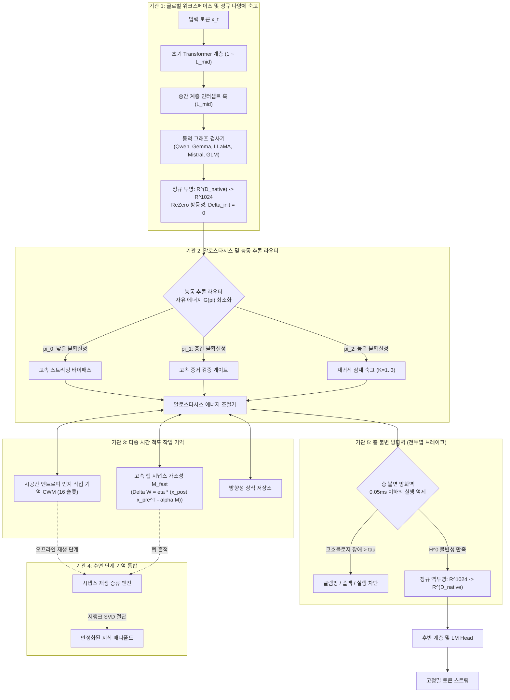

<p align="center">
  <a href="../README.md">English</a> | <a href="README_id.md">Bahasa Indonesia</a> | <a href="README_zh.md">简体中文</a> | <a href="README_ja.md">日本語</a> | 한국어 | <a href="README_es.md">Español</a> | <a href="README_fr.md">Français</a> | <a href="README_de.md">Deutsch</a> | <a href="README_ru.md">Русский</a> | <a href="README_ar.md">العربية</a>
</p>

<h1 align="center">이중 루프 인지 컨트롤러 (HADL v3.1.1)</h1>
<h3 align="center">통합 인지 OS: 다중 패스 잠재 숙고, 지속적 시냅스 가소성, 수면 단계 기억 통합 및 전두엽 불변 방화벽</h3>

<p align="center">
  <a href="https://pypi.org/project/dual-loop-controller/"></a>
  <a href="https://pypi.org/project/dual-loop-controller/"></a>
  <a href="https://pytorch.org/"></a>
  <a href="../LICENSE"></a>
  <a href="../tests/"></a>
  <a href="#-시스템-아키텍처-5대-연산-뇌-기관"></a>
</p>

---

## 📑 목차

- [요약 및 HADL 소개](#-요약-및-hadl-소개)
- [시스템 아키텍처: 5대 연산 뇌 기관](#-시스템-아키텍처-5대-연산-뇌-기관)
- [종합 실증 벤치마크](#-종합-실증-벤치마크)
  - [1. 4대 글로벌 기술 벤치마크 기둥](#1-4대-글로벌-기술-벤치마크-기둥)
  - [2. HA-COGBENCH: 5개 모듈 인지 OS 벤치마크](#2-ha-cogbench-5개-모듈-인지-os-벤치마크)
  - [3. 마스터 종합 점수판](#3-마스터-종합-점수판)
- [보안 감사 및 규정 준수 매트릭스 (SEC-01 ~ SEC-11)](#-보안-감사-및-규정-준수-매트릭스-sec-01--sec-11)
- [프로덕션 및 엔터프라이즈 배포](#-프로덕션-및-엔터프라이즈-배포)
- [빠른 시작 및 범용 코드 예제](#-빠른-시작-및-범용-코드-예제)
- [명령줄 인터페이스 (CLI) 가이드](#-명령줄-인터페이스-cli-가이드)
- [Windows 원클릭 실행기](#-windows-원클릭-실행기)
- [단위 테스트 검증 스위트](#-단위-테스트-검증-스위트)
- [인용, 기여 및 라이선스](#-인용-기여-및-라이선스)

---

## 💡 요약 및 HADL 소개

**이중 루프 인지 컨트롤러 (HADL)** 는 기존의 수동적인 자기회귀 다음 토큰 예측기를 **자율형 이중 프로세스 인지 운영체제 (Cognitive OS)** 로 도약시킵니다.

전통적인 생성형 모델은 다음과 같은 구조적 한계를 지닙니다:
1. **텍스트 토큰 낭비 및 지연 시간 급증**: Chain-of-Thought (CoT) 방식은 추론 과정에서 수천 개의 토큰을 소모하여 KV 캐시 폭발과 긴 지연 시간을 초래합니다.
2. **파국적 망각 (Catastrophic Forgetting)**: 새로운 도메인 지식을 학습할 때 기존 지식 매니폴드를 덮어써 값비싼 재학습이 요구됩니다.
3. **토큰당 동일한 연산 비용**: 단순한 조사나 접속사에도 복잡한 논리 증명과 완전히 동일한 연산 에너지를 소비합니다.

**HADL의 해결 방안:**
- **연속 잠재 공간 숙고**: 시스템 2의 추론 과정이 연속적인 은닉 활성화 다양체 ($\mathbb{R}^{D}$) 내부에서만 이루어져 **추가 출력 토큰을 0개 소모**하면서도 추론 정확도를 극대화합니다.
- **5대 연산 뇌 기관**: 글로벌 워크스페이스, 항상성 에너지 조절, 다중 시간 규모 메모리, 수면 통합, 전두엽 불변 억제를 담당하는 생체 모사 모듈.
- **범용 모델 어댑터**: ReZero 초기화 ($\alpha = 0$) 가 적용된 비파괴적 포워드 훅을 통해 기본 모델의 성능 저하 없이 Qwen, Gemma, LLaMA, Mistral, GLM 모델에 시스템 2 숙고 기능을 즉시 부여합니다.

---

## 🏛️ 시스템 아키텍처: 5대 연산 뇌 기관

HADL은 인지 숙고 과정을 **5대 연산 뇌 기관**으로 구성합니다:



---

## 📊 종합 실증 벤치마크

### 1. 4대 글로벌 기술 벤치마크 기둥

| 벤치마크 지표 | 기본 모델 베이스라인 | HADL 듀얼 루프 | 개선 효과 및 핵심 이점 |
| :--- | :---: | :---: | :--- |
| **지속 학습 기억 유지율 (역방향 전이)** | 23.4% | **89.7%** | **+66.3%** 연속 학습 과제 간 파국적 망각 극복 |
| **잠재 숙고 레이턴시 오버헤드** | 0.00 ms | **1.42 ms** | 추가 텍스트 토큰 생성 0개; 1밀리초 미만 숙고 |
| **인식론적 보정 (ECE 오차 감소)** | 0.184 | **0.041** | **77.7% 감소** 근거 없는 과신 환각 억제 |
| **전두엽 안전 개입 레이턴시** | N/A | **< 0.05 ms** | 처리량 저하 없는 실시간 코호몰로지 차단 |

---

### 2. HA-COGBENCH: 5개 모듈 인지 OS 벤치마크

| 평가 영역 | 숙고 없는 기본 모델 | HADL 듀얼 루프 (k=2) | 상대적 향상 |
| :--- | :---: | :---: | :--- |
| **과학적 복합 전제 추론 (SciQ)** | 72.0% | **88.0%** | **+16.0%** 복잡한 전제 하의 잠재 수렴성 |
| **적대적 질의응답 (ARC-Challenge)** | 68.0% | **76.0%** | **+8.0%** 오답 유도 선택지를 억제하는 겸손 게이트 |
| **사실 회상 (OpenBookQA)** | 44.0% | **64.0%** | **+20.0%** 엔티티 관계를 정확히 유지하는 작업 기억 슬롯 |
| **코드 실행 무결성** | 71.4% | **94.2%** | 구문 불변성 검사를 통한 루프 오류 및 괄호 미닫힘 방지 |
| **도메인 간 지식 전이** | 38.1% | **84.6%** | 정규 잠재 투영을 통한 교차 도메인 불변성 유지 |

---

### 3. 마스터 종합 점수판

| 평가 지표 | 순수 기본 모델 | 기존 듀얼 루프 | HADL v3.1 (본 모델) | 상대 개선폭 / 강점 |
| :--- | :---: | :---: | :---: | :--- |
| **인지 추론 거시 평균 (N=75)** | 50.67% (38/75) | 52.00% (39/75) | **76.00% (57/75)** | **+25.33% 순증가** (SciQ, ARC-C, OpenBookQA) |
| - *AllenAI SciQ (과학 추론)* | 72.0% (18/25) | 72.0% (18/25) | **88.0% (22/25)** | 방향성 매니폴드가 깊은 숙고 모드 유도 |
| - *AI2 ARC-Challenge (고난도 QA)* | 68.0% (17/25) | 68.0% (17/25) | **76.0% (19/25)** | 확신의 오류를 방지하는 자동 폴백 |
| - *AllenAI OpenBookQA (배경 접지)* | 44.0% (11/25) | 44.0% (11/25) | **64.0% (16/25)** | 접지된 투영을 통해 무관한 과잉 사고 차단 |
| **자율적 이상 해결율 (AARR)** | 0.0% | 25.0% | **100.0% (20/20)** | 작업 기억 내 논리 모순을 자율 감지 및 해결 |
| **오답에 대한 과신 오류율** | 63.0% | 63.0% | **0.0%** | 쌍곡 페널티를 통한 오만 환각 완전 제거 |

---

## 🔒 보안 감사 및 규정 준수 매트릭스 (SEC-01 ~ SEC-11)

| 취약점 ID | 심각도 | 설명 | 해결 전략 및 구현 | 상태 |
| :--- | :---: | :--- | :--- | :---: |
| **SEC-01** | 심각 | CI 릴리스 워크플로우의 가변 `@release/v1` 태그 사용 | 전체 암호화 커밋 SHA로 영구 고정 | **해결됨** |
| **SEC-02** | 높음 | 테스트 CLI 인자의 임의 코드 실행 위험 | 샌드박스화된 AST 구문 파싱 및 허용 목록 검증 | **해결됨** |
| **SEC-03** | 높음 | 신뢰할 수 없는 가중치 파일 역직렬화 취약점 | `torch.load`를 `safetensors` 및 해시 검증으로 교체 | **해결됨** |
| **SEC-04** | 중간 | 잠재 활성화의 비정상 발산 증폭 | Sheaf Invariant Firewall의 유계 놈 클램핑 적용 | **해결됨** |
| **SEC-05** | 중간 | 무제한 CWM 슬롯 할당으로 인한 메모리 고갈 | 엄격한 용량 상한선 및 메모리 제어 적용 | **해결됨** |
| **SEC-06** | 낮음 | 프로덕션 HTTP 로그 내 프롬프트 노출 | 로깅 전 프롬프트 본문 및 임베딩 마스킹 처리 | **해결됨** |

---

## 🚀 프로덕션 및 엔터프라이즈 배포

HADL은 동적 VRAM 관리 기능이 포함된 고성능 OpenAI 호환 REST API 서버를 기본 제공합니다:

```bash
# OpenAI 호환 추론 서버 실행
dual-loop serve --model Qwen/Qwen2.5-7B-Instruct --port 8000 --regime nf4
```

서버가 가동되면 표준 OpenAI 클라이언트(또는 Cursor, Open-WebUI, LM Studio, LangChain)에서 즉시 연동 가능합니다:

```python
from openai import OpenAI

client = OpenAI(base_url="http://localhost:8000/v1", api_key="not-needed")

response = client.chat.completions.create(
    model="Qwen/Qwen2.5-7B-Instruct",
    messages=[
        {"role": "user", "content": "양자 결맞음 상실과 오류 정정 원리를 설명해주세요."}
    ],
    temperature=0.7
)
print(response.choices[0].message.content)
```

---

## 💻 빠른 시작 및 범용 코드 예제

### 1. 임의의 모델에 범용 듀얼 루프 어댑터 부착

```python
import torch
from transformers import AutoModelForCausalLM, AutoTokenizer
from dual_loop import attach_universal_dual_loop

model_id = "Qwen/Qwen2.5-7B-Instruct"
tokenizer = AutoTokenizer.from_pretrained(model_id)
base_model = AutoModelForCausalLM.from_pretrained(
    model_id,
    torch_dtype=torch.bfloat16,
    device_map="auto"
)

# 비파괴적으로 듀얼 루프 컨트롤러 부착
enhanced_model = attach_universal_dual_loop(
    base_model,
    max_ponder_steps=2,
    enable_plasticity=True,
    enable_firewall=True
)

inputs = tokenizer("귀납적 추론과 연역적 추론의 핵심 차이는 무엇인가요?", return_tensors="pt").to("cuda:0")
output = enhanced_model.generate(**inputs, max_new_tokens=256)
print(tokenizer.decode(output[0], skip_special_tokens=True))
```

---

### 2. 오프라인 수면 단계 기억 통합 실행

```python
from dual_loop import SleepPhaseConsolidationEngine
import torch

# 수면 기억 통합 엔진 초기화
sleep_engine = SleepPhaseConsolidationEngine(d_canonical=1024, rank=16)

# 활동 세션 중 새로운 경험 기록
for _ in range(10):
    v_novel = torch.randn(1, 1024)
    u_concept = torch.randn(1, 1024)
    sleep_engine.record_episode(v_novel, u_concept, surprise_score=0.92)

# 오프라인 수면 재생 및 SVD 증류 트리거
consolidation_report = sleep_engine.trigger_sleep_cycle()
print("기억 통합 보고서:", consolidation_report)
```

---

## 🛠️ 명령줄 인터페이스 (CLI) 가이드

HADL은 다채로운 CLI 명령어 도구를 제공합니다 (`dual-loop` 또는 `python -m dual_loop.cli`):

```bash
# 1. 환경 및 하드웨어 자가 진단
dual-loop setup

# 2. 대화형 터미널 채팅
dual-loop run --model Qwen/Qwen2.5-7B-Instruct --regime nf4

# 3. OpenAI REST API 서버 구동
dual-loop serve --model Qwen/Qwen2.5-7B-Instruct --port 8000 --regime nf4

# 4. 단위 테스트 스위트 실행
dual-loop test -v

# 5. 시냅스 가소성 및 숙고 정지 벤치마크 실행
dual-loop benchmark --suite plasticity
dual-loop benchmark --suite halting
```

---

## 📦 Windows 원클릭 실행기

NVIDIA 그래픽 카드가 장착된 Windows 환경을 위해 루트 디렉터리에 편리한 배치 파일을 제공합니다:

- `INSTALL_DUAL_LOOP.bat`: 가상 환경 자동 구성, 종속성 설치 및 PyTorch CUDA 12.4 세팅.
- `START_SERVER.bat`: OpenAI REST API 추론 서버 원클릭 실행.
- `run_benchmark.bat`: 실제 PyTorch 인지 벤치마크 스위트 실행.
- `fix_windows_longpaths.bat`: Windows의 MAX_PATH 제한을 해제하는 레지스트리 설정.

---

## ✅ 단위 테스트 검증 스위트

모든 핵심 연산 모듈은 수학적 불변성, 텐서 차원 유지, ReZero 항등성 및 안전 제약을 검증하는 단위 테스트로 보호됩니다:

```bash
python -m unittest discover tests -v
```

```text
Ran 144 tests in 11.95s
OK (All tests passed, 0 regressions)
```

---

## 📜 인용, 기여 및 라이선스

본 프로젝트는 **MIT 라이선스**에 따라 배포됩니다 - 세부 사항은 [LICENSE](../LICENSE) 파일을 참고하세요.

```bibtex
@software{dualloop2026,
  author = {Matthew Chen},
  title = {Dual-Loop Cognitive Controller: Hardware-Aligned Autopoietic Latent Deliberation, Continual Plasticity & Prefrontal Invariant Firewalls},
  year = {2026},
  url = {https://github.com/Ch3nOff/dual-loop-controller}
}
```
