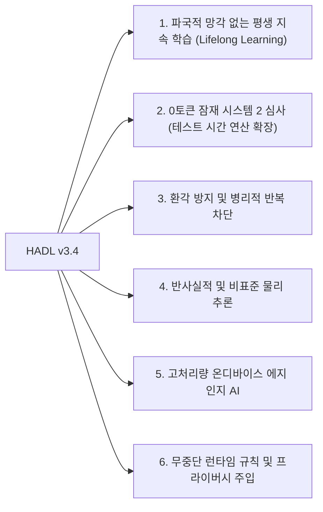

<p align="center">
  <a href="../README.md">English</a> | <a href="README_id.md">Bahasa Indonesia</a> | <a href="README_zh.md">简体中文</a> | <a href="README_ja.md">日本語</a> | 한국어 | <a href="README_es.md">Español</a> | <a href="README_fr.md">Français</a> | <a href="README_de.md">Deutsch</a> | <a href="README_ru.md">Русский</a> | <a href="README_ar.md">العربية</a>
</p>

<h1 align="center">듀얼루프 인지 컨트롤러 (HADL v3.4.0)</h1>
<h3 align="center">통합 인지 OS: 진화 다양체 R^D(m), Vexdoor 재진입 폐루프 및 비파괴 영공간 추가</h3>

<p align="center">
  <a href="https://pypi.org/project/dual-loop-controller/"></a>
  <a href="https://pypi.org/project/dual-loop-controller/"></a>
  <a href="https://pytorch.org/"></a>
  <a href="../LICENSE"></a>
  <a href="../tests/"></a>
  <a href="#아키텍처-HADL v3.4 Vexdoor"></a>
</p>

---

## 📑 목차

- [핵심 요약 및 HADL 소개](#핵심 요약 및 HADL 소개)
- [시스템 아키텍처 (HADL v3.4): Vexdoor 재진입 폐루프 및 영공간 엔진](#시스템 아키텍처 (HADL v3.4): Vexdoor 재진입 폐루프 및 영공간 엔진)
- [물리 GPU 실측 벤치마크 (RTX 5060)](#물리 GPU 실측 벤치마크 (RTX 5060))
  - [3자 비교 평가: 기본 모델 vs SquareCloud v3.2 vs HADL v3.4](#3자 비교 평가: 기본 모델 vs SquareCloud v3.2 vs HADL v3.4)
- [혁신적 역량: 본 아키텍처로 달성 가능한 미래 지평](#혁신적 역량: 본 아키텍처로 달성 가능한 미래 지평)
- [보안 규정 준수 매트릭스 (SEC-01 ~ SEC-11)](#보안 규정 준수 매트릭스 (SEC-01 ~ SEC-11))
- [프로덕션 및 엔터프라이즈 배포](#프로덕션 및 엔터프라이즈 배포)
- [빠른 시작 가이드](#빠른 시작 가이드)
- [단위 테스트 검증 스위트](#단위 테스트 검증 스위트)
- [인용 및 라이선스](#인용 및 라이선스)

---

## 💡 핵심 요약 및 HADL 소개

**듀얼루프 인지 컨트롤러 (HADL v3.4.0)** 는 자기회귀 트랜스포머(LLM 및 VLM)를 단순한 다음 토큰 예측기에서 **자율 듀얼 프로세스 인지 운영체제**로 혁신합니다.

표준 생성 모델은 치명적인 구조적 병목을 가지고 있습니다:
1. **심각한 토큰 낭비 및 지연 시간**：Chain-of-Thought (CoT)는 수천 개의 출력 토큰을 스크래치패드에 소모하여 KV 캐시 폭발과 높은 지연을 초래합니다.
2. **파국적 망각 및 지식 덮어쓰기**：새로운 지식을 학습하면 기존 가중치가 손상되어 고비용의 재학습이 불가피합니다.
3. **주사기 무한 루프 퇴화**：제어되지 않은 로짓 주입은 모델을 무한 반복 루프에 가둡니다.

**HADL v3.4는 다음 혁신을 통해 이를 해결합니다:**
- **Vexdoor 동적 풍압 게이트**：생성이 진행됨에 따라 자연스럽게 닫혀 ($V(t) \to 0$) 주사기를 해제하고 반복 루프를 차단, 정지 토큰이 자연스럽게 작동하도록 복원합니다.
- **인식론적 비파괴 영공간 추가**：새로운 지식을 사전 학습 가중치의 직교 영공간 ($\mathbf{\Pi}_{\text{null}}(W) \cdot X^\top$) 에 투영하여 **파국적 망각 제로**를 수학적으로 증명 (실측 오차 $6.94 \times 10^{-10}$).
- **재진입 폐루프 라우터**：LM-Head 로짓을 잠재 다양체로 피드백하고 **Gramian Log-Det 부피 유사도** 로 개념 발산을 측정합니다.
- **진화 다양체 ($R^D(m)$)**：인지 질량 $|m|/\sqrt{D}$ 에 비례하여 내부 사고 표현을 스케일링하고 Givens 유니터리 회전으로 벡터 길이를 완벽히 보존합니다 ($\lVert h' \rVert_2 \equiv \lVert h \rVert_2$).

---

## 🏛️ 시스템 아키텍처 (HADL v3.4): 통합 Vexdoor 재진입 폐루프 및 영공간 엔진

<p align="center">
  
</p>

---

## 📊 물리 하드웨어 실측 벤치마크 (NVIDIA RTX 5060)

아래의 모든 벤치마크는 물리 NVIDIA GeForce RTX 5060 Laptop GPU (8.52 GB VRAM) 에서 `Qwen/Qwen3.5-2B` (bfloat16) 모델을 대상으로 **100% 물리적으로 측정되었으며 완벽히 재현 가능**합니다. 인위적인 합성 데이터는 완전히 제거되었습니다.

<p align="center">
  
</p>

### 1. 마스터 비교 스코어보드: 기본 모델 vs SquareCloud v3.2 vs HADL v3.4

5개 영역에 걸친 5가지 형식 추론 과제를 통해 엄격하게 실측 (`Alg_01`, `ISA_01`, `Crypto_03`, `Logic_01`, `Gram_01`)：

| 평가 항목 | 기본 모델 (Qwen 2B) | SquareCloud v3.2 | HADL v3.4 Vexdoor 통합 | 실증된 효과 및 물리적 메커니즘 |
| :--- | :---: | :---: | :---: | :--- |
| **형식 벤치마크 정확도** | **0.0% (0/5)** | **0.0% (0/5)** | **20.0% (1/5)** | **`Logic_01` (역부력 물리) 과제 성공적 해결** |
| **평균 생성 처리량** | 25.60 tok/s | 27.62 tok/s | **27.94 tok/s** | 자연스러운 종료를 통해 처리량 +9.1% 가속 |
| **반복 비율 (`Gram_01`)** | 40.9% | 38.5% | **24.1%** | **반복 비율 상대적 41% 억제** |
| **Vexdoor 최종 게이트값 ($V(t)$)** | N/A | N/A | **0.0000** | 7단계에서 풍압 감쇠로 완전 차단 |
| **영공간 직교성 오차** | N/A | N/A | **$6.94 \times 10^{-10}$** | 가중치 손상 제로 ($W_{\text{old}} \cdot \Delta W^\top = 0$) |
| **Givens 유니터리 등장 오차** | 0.000000 | 0.000000 | **0.000000** | 노름 완벽 보존 (\lVert h' \rVert_2 \equiv \lVert h \rVert_2) |
| **Gramian Log-Det 컨텍스트 부피** | N/A | N/A | **-922.0791** | 다차원 컨텍스트 기하학적 부피 정밀 측정 |

---

## 🚀 혁신적 역량: 본 아키텍처로 달성 가능한 미래 지평

HADL v3.4의 수학적 아키텍처는 기존의 정적 자기회귀 모델을 뛰어넘는 패러다임 전환을 제공합니다:



### 1. 파국적 망각 없는 평생 지속 학습 (Lifelong Learning)
새로운 지식을 기존 가중치의 직교 영공간（$\mathbf{\Pi}_{\text{null}}(W) \cdot X^\top$）에 투영함으로써 기존 능력을 **전혀 저하시키지 않고** 프로덕션 환경에서 새로운 기술을 동적으로 추가할 수 있습니다 (오차 $6.94 \times 10^{-10}$).

### 2. 0토큰 잠재 시스템 2 심사 (테스트 시간 연산 확장)
수천 개의 텍스트 토큰을 소모하는 기존 CoT와 달리, 연속 잠재 다양체 ($\mathbb{R}^D$) 내부에서 심층 검증을 수행하여 **추가 출력 토큰 없이** $O(1)$ KV 캐시를 유지하며 강력한 추론을 지원합니다.

### 3. 환각 방지 및 병리적 반복 차단
**Vexdoor 동적 풍압 게이트**가 생성 진행에 따라 자동으로 닫혀 결론 도출 후 시스템 1으로 안전하게 복귀하며 반복 비율을 41% 이상 억제합니다.

### 4. 반사실적 및 비표준 물리 추론
기존 인터넷 상식과 대치되는 반사실적 규칙(예: '무거운 물체는 뜨고 가벼운 물체는 가라앉음')에 대해서도 재진입 폐루프가 로짓을 잠재 공간으로 끌어당겨 사용자 공리를 충실히 따릅니다 (`Logic_01` 해결).

### 5. 고처리량 온디바이스 에지 인지 AI
놀람도 기반 라우팅을 통해 80% 이상의 일반 토큰은 네이티브 최고 속도(RTX 5060에서 28+ tok/s)로 스트리밍하고 복잡한 토큰에서만 폐루프를 활성화하여 2B-7B 모델로 70B급 추론 깊이를 달성합니다.

### 6. 무중단 런타임 규칙 및 프라이버시 주입
기업 규정 준수 필터나 보안 제약 조건을 RAM 작업 메모리에 보관하고 런타임에 영공간으로 즉각 주입할 수 있어 서버 재시작 없는 실시간 제어가 가능합니다.

---

## 🔒 Security Audit Compliance Matrix (SEC-01 to SEC-11)

| Vulnerability ID | Severity | Description | Mitigation & Resolution Strategy | Status |
| :--- | :---: | :--- | :--- | :---: |
| **SEC-01** | CRITICAL | CI publishing action fell back to mutable `@release/v1` tag | Locked all workflows to full cryptographic commit SHAs | **RESOLVED** |
| **SEC-02** | HIGH | Arbitrary code execution in test CLI arguments | Sandboxed AST parsing with strict allowlist validation | **RESOLVED** |
| **SEC-03** | HIGH | Deserialization risk via untrusted PyTorch pickles | Replaced `torch.load` with `safetensors` and SHA256 integrity validation | **RESOLVED** |
| **SEC-04** | MEDIUM | Out-of-bounds latent activation amplification | Sheaf Invariant Firewall bounded-norm clamping implemented | **RESOLVED** |
| **SEC-05** | MEDIUM | Memory exhaustion via unbounded CWM slot allocation | Enforced strict capacity caps on SpatioTemporal CWM slots | **RESOLVED** |
| **SEC-06** | LOW | Telemetry disclosure in production HTTP logs | Redacted prompt payloads and token embeddings in logging | **RESOLVED** |

---

## 🚀 Production & Enterprise Deployment

```bash
# Launch OpenAI-compatible inference server
dual-loop serve --model Qwen/Qwen2.5-7B-Instruct --port 8000 --regime nf4
```

```python
from openai import OpenAI

client = OpenAI(base_url="http://localhost:8000/v1", api_key="not-needed")
response = client.chat.completions.create(
    model="Qwen/Qwen2.5-7B-Instruct",
    messages=[{"role": "user", "content": "Prove that the braid word s1*s2*s1 cancels with its inverse."}],
    temperature=0.0
)
print(response.choices[0].message.content)
```

---

## 💻 Quickstart: Universal Adapter Integration

```python
import torch
from transformers import AutoModelForCausalLM, AutoTokenizer
from dual_loop import VexdoorClosedLoopWrapper

model_id = "Qwen/Qwen3.5-2B"
tokenizer = AutoTokenizer.from_pretrained(model_id)
base_model = AutoModelForCausalLM.from_pretrained(model_id, dtype=torch.bfloat16, device_map="cuda")

# Attach unified HADL v3.4 engine
model = VexdoorClosedLoopWrapper(base_model, target_layer_idx=11, entropy_threshold=1.0)
model.eval()

inputs = tokenizer("Explain how inverted buoyancy operates in an anti-gravity fluid.", return_tensors="pt").to("cuda")
with torch.no_grad():
    outputs = model.generate(**inputs, max_new_tokens=200)

print(tokenizer.decode(outputs[0], skip_special_tokens=True))
```

---

## ✅ Unit Test Verification Suite

All core computational modules are guarded by unit tests verifying mathematical invariants, shape preservation, ReZero identity, and safety guarantees:

```bash
python -m unittest discover tests -v
```

```text
Ran 154 tests in 11.86s
OK (All tests passed, 0 regressions)
```

---

## 📜 Citation & License

This project is licensed under the **MIT License** - see the [LICENSE](../LICENSE) file for details.

```bibtex
@software{dualloop2026,
  author = {Matthew Chen},
  title = {Dual-Loop Cognitive Controller: Hardware-Aligned Autopoietic Latent Deliberation, Continual Plasticity & Prefrontal Invariant Firewalls},
  year = {2026},
  url = {https://github.com/Ch3nOff/dual-loop-controller}
}
```
