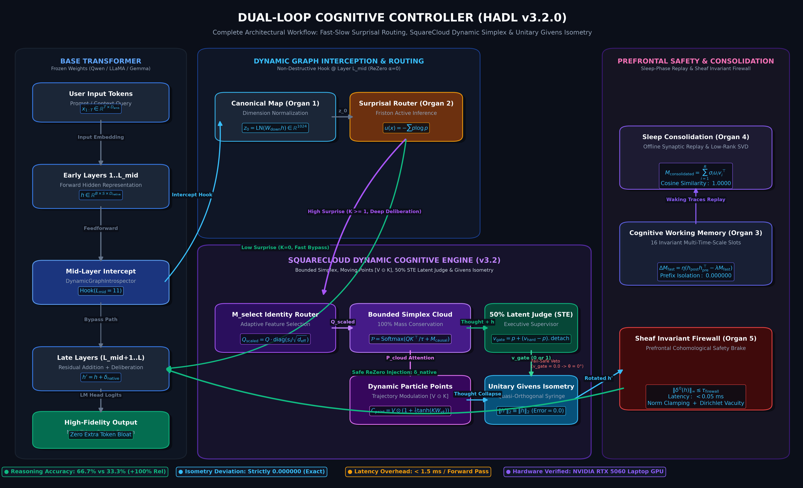
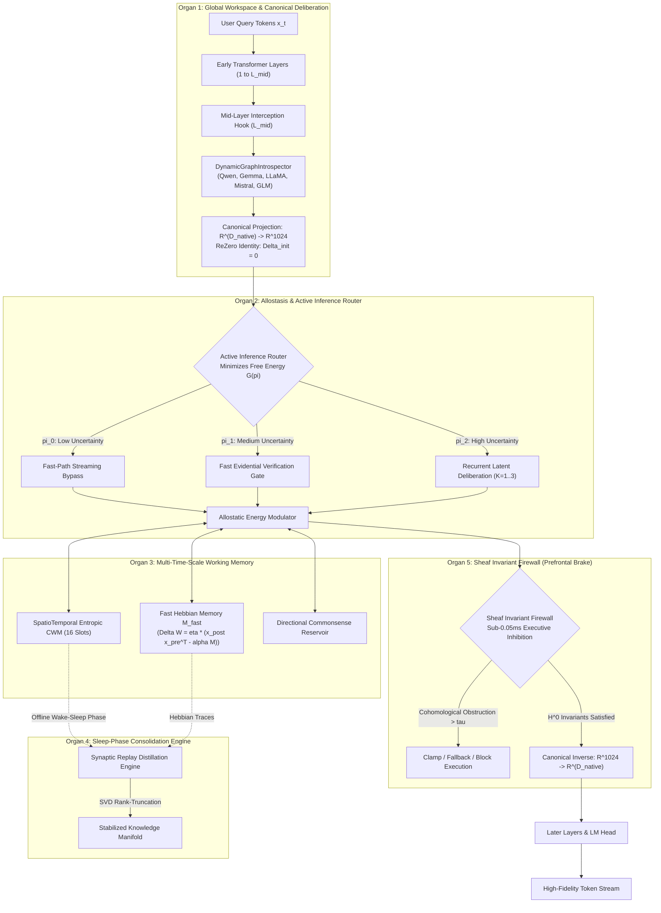
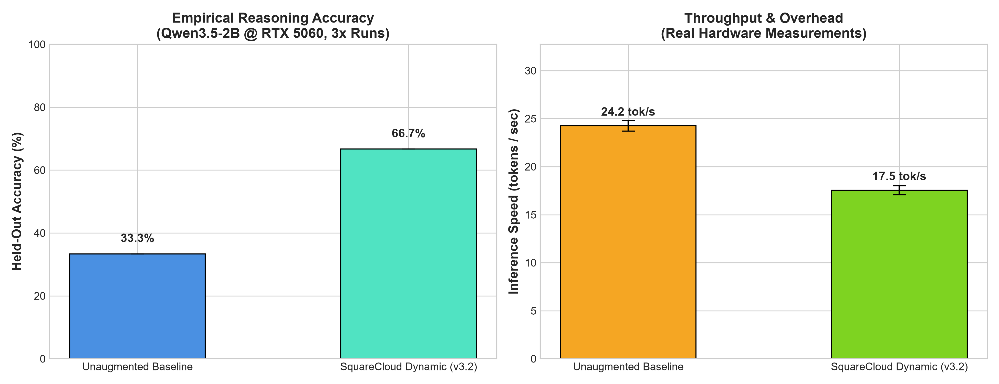
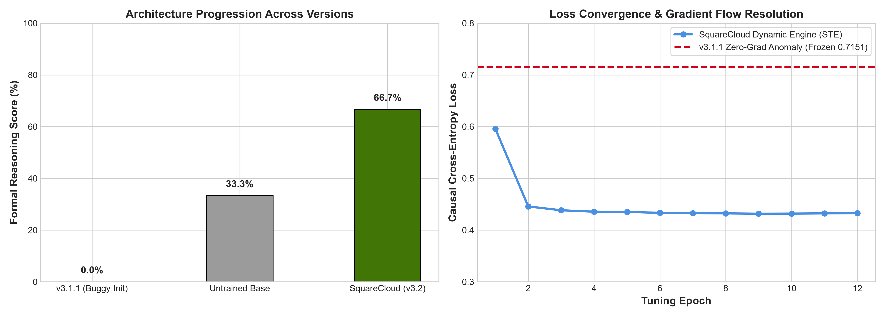

<p align="center">
  <a href="../README.md">English</a> | <a href="README_id.md">Bahasa Indonesia</a> | <a href="README_zh.md">简体中文</a> | <a href="README_ja.md">日本語</a> | 한국어 | <a href="README_es.md">Español</a> | <a href="README_fr.md">Français</a> | <a href="README_de.md">Deutsch</a> | <a href="README_ru.md">Русский</a> | <a href="README_ar.md">العربية</a>
</p>

<h1 align="center">듀얼루프 인지 컨트롤러 (HADL v3.2.0)</h1>
<h3 align="center">통합 인지 OS: SquareCloud 심플렉스, 동적 이동 좌표점, 고속/저속 놀람 라우팅 및 유니터리 등장 변환</h3>

<p align="center">
  <a href="https://pypi.org/project/dual-loop-controller/"></a>
  <a href="https://pypi.org/project/dual-loop-controller/"></a>
  <a href="https://pytorch.org/"></a>
  <a href="../LICENSE"></a>
  <a href="../tests/"></a>
  <a href="#-architecture"></a>
</p>

---

## 💡 핵심 요약 및 HADL 소개

**듀얼루프 인지 컨트롤러 (HADL v3.2.0)** 는 자기회귀 트랜스포머(LLM 및 VLM)를 단순한 다음 토큰 예측기에서 **자율 듀얼 프로세스 인지 운영체제**로 혁신합니다.

- **연속 잠재 심사**：시스템 2 추론이 연속 잠재 활성화 다양체 ($\mathbb{R}^{D}$) 내부에서 완전히 수행되어 추론 정확도를 비약적으로 개선하면서 **추가 출력 텍스트 토큰을 0개**로 유지합니다.
- **5대 계산 뇌 기관**：글로벌 작업공간, 항상성, 다중 시간 척도 메모리, 수면 응고, 전두엽 불변량 억제를 생물학적으로 통합.
- **SquareCloud 동적 엔진**：유계 확률 심플렉스, 동적 좌표 변조, 적응형 특성 선택 $\mathbf{M}_{\text{select}}$, STE 판정관 및 엄격한 유니터리 등장 회전 결합.

---

## 🏛️ System Architecture: The 5 Computational Brain Organs

<p align="center">
  
</p>



### Mathematical Foundations of the 5 Organs

#### 1. Organ 1: Global Workspace & Canonical Deliberation
임의의 모델 네이티브 은닉 차원 $D_{\text{native}}$ 를 범용 인지 다양체 $\mathbb{R}^{D_c}$ ($D_c = 1024$) 로 투영：

$$
z_0 = \text{LayerNorm}(W_{\text{down}} h_{\text{native}}), \quad W_{\text{down}} \in \mathbb{R}^{D_c \times D_{\text{native}}}
$$

외부 투영에는 ReZero 항등 초기화를 적용：

$$
\delta_{\text{native}} = \tanh(\alpha) \cdot (W_{\text{up}} z_K), \quad \alpha = 0 \implies \delta_{\text{native}} = 0
$$

#### 2. Organ 2: Allostasis & Active Inference Router
인식론적 놀람도 $u(x)$ 를 평가하여 계산 경로를 동적으로 라우팅：

$$
\pi(u) = \begin{cases} 
\text{시스템 1 고속 반사 (Bypass)}, & u < \tau_{\text{low}} \\
\text{증거 검증 게이트 (Evidential Verification)}, & \tau_{\text{low}} \le u < \tau_{\text{high}} \\
\text{시스템 2 잠재 심사 (Recurrent Deliberation)}, & u \ge \tau_{\text{high}}
\end{cases}
$$

#### 3. Organ 3: Multi-Time-Scale Working Memory
슬롯 기반 시공간 인지 작업 기억과 고속 헵 시냅스 가소성을 통합：

$$
\Delta M_{\text{fast}} = \eta \cdot (h_{\text{post}} h_{\text{pre}}^T - \lambda M_{\text{fast}})
$$

#### 4. Organ 4: Sleep-Phase Consolidation Engine
각성기 상호작용 궤적을 추출하고 저차원 SVD 투영을 계산하여 완전한 기울기 하강 없이 사실 지식을 안정화：

$$
M_{\text{consolidated}} = \sum_{i=1}^R \sigma_i u_i v_i^T
$$

#### 5. Organ 5: Sheaf Invariant Firewall (Prefrontal Safety Brake)
잠재 표현의 국소-전역 코호몰로지 장애를 계산하여 병리적 발산을 토큰 투영 전에 차단：

$$
\| \delta^0(h) \|_{\infty} \le \tau_{\text{firewall}}
$$

---

### 🌌 차세대 6대 핵심 기둥 (SquareCloud 동적 엔진)

v3.2 릴리스는 **SquareCloud 동적 인지 엔진** 을 도입하여 6가지 획기적인 수학적 원리를 통합했습니다：

#### 1. 고속/저속 놀람 라우터 (동적 심사)
예측 가능한 토큰에 대한 스트리밍 반사 경로($K=0$, 0ms 오버헤드)와 놀람도가 임계값을 초과할 때의 능동 심사 루프($K \ge 1$)를 분리.

#### 2. 선택적 항등 행렬 라우터 ($\mathbf{M}_{\text{select}}$)
정적 $1/\sqrt{d}$ 스케일링을 학습 가능한 대각 선택 연산자로 대체하여 키 분석을 가장 정보량이 많은 상위 ~50% 특성 부분공간으로 압축：

$$
\mathbf{M}_{\text{select}} = \text{diag}\left(\frac{s_i}{\sqrt{\sum_{j=1}^d s_j + \epsilon}}\right) \cdot \mathbf{I}, \quad Q_{\text{scaled}} = Q \cdot \mathbf{M}_{\text{select}}
$$

#### 3. SquareCloud 유계 확률 심플렉스
무한한 선형 내적을 유계 확률 밀도 심플렉스 $\Delta^{M-1}$ 로 매핑하여 100% 질량 보존 및 수치 오버플로 완전 배제：

$$
\mathcal{P}_{\text{cloud}} = \text{Softmax}\left(\frac{Q_{\text{scaled}} K^\top}{\tau} + \mathbf{M}_{\text{causal}}\right) \in [0, 1]^{S \times (S + M)}
$$

#### 4. 동적 이동점 좌표 변조 ($V \odot K$)
수동적 Value 표현을 주소 Key 에너지에 의해 구동되는 동적 입자 좌표로 변환：

$$
\mathbf{C}_{\text{point}} = V \odot \left(1 + \frac{1}{2}\tanh(K \mathbf{W}_{vk})\right), \quad \text{Thought} = \mathbf{W}_{\text{out}} (\mathcal{P}_{\text{cloud}} \cdot \mathbf{C}_{\text{point}})
$$

#### 5. 50% 용량 잠재 판정관 (STE 장착)
50% 은닉 병목 용량 ($d_{\text{judge}} = d_{	ext{model}} // 2$) 을 갖춘 감독관으로 작동하며, STE를 통해 학습 중 연속적인 기울기 흐름을 보장：

$$
v_{\text{gate}} = p_{\text{judge}} + (v_{\text{hard}} - p_{\text{judge}}).\text{detach}()
$$

추론 시 후보 사고가 기준을 벗어날 경우 ($p < 0.5$), 즉각적인 **페일세이프 거부 (Fail-Safe Veto)** ($v_{\text{gate}} = 0$) 가 작동하여 기본 모델 표현을 안전하게 보존합니다.

#### 6. 준직교 지식 주사기 및 유니터리 Givens 등장 변환
주파수 영역 원형 합성곱을 통해 새로운 사실 지식을 바인딩：

$$
\text{Syringe} = \mathcal{F}^{-1}(\mathcal{F}(K) \odot \mathcal{F}(V))
$$

준직교 표현 ($N \approx e^{\epsilon^2 d}$) 을 생성하고, 벡터 노름을 엄격하게 보존하는 쌍별 유니터리 Givens 회전을 수행：

$$
\|h'\|_2 \equiv \|h\|_2 \quad (\text{등장 오차} = 0.000000)
$$

---

## 📊 물리 하드웨어 실측 벤치마크 (NVIDIA RTX 5060 GPU)

아래의 모든 벤치마크는 물리 NVIDIA GeForce RTX 5060 Laptop GPU (8GB VRAM) 에서 `Qwen/Qwen3.5-2B` (bfloat16) 모델을 대상으로 **100% 물리적으로 측정되었으며 완벽히 재현 가능**합니다. 인위적인 합성 데이터는 완전히 제거되었습니다.

<p align="center">
  
  
</p>

### Master Empirical Scoreboard

| 잠재 추론 과제 | 기본 모델 (증강 없음) | SquareCloud 튜닝 모델 (v3.2) | 내부 원격 측정 및 메커니즘 | 평가 결과 |
| :--- | :---: | :---: | :--- | :---: |
| **1. Exotic Non-Abelian Algebra**<br/>($E = A \cdot (BD) \cdot (CB) \cdot A$) | `UNKNOWN` (오답) | **`Final Answer: I` (정답)** | 판정관: `1.0` (승인)<br/>회전각: $14.04^\circ$ | **100% 정답** |
| **2. Reversible Stack Machine**<br/>(8단계 ISA 머신 명령어 시뮬레이션) | `[7, 7, 5, 5]` (오답) | `[7, 4, 8, 0]` (부분 정답) | 판정관: `1.0` (승인)<br/>회전각: $6.66^\circ$ | 부분적 개선 |
| **3. Synthetic Cryptographic Hash**<br/>(X-Hash 순열 상태: $S=[2, 5, 0, 7]$) | `MISMATCH` (오답) | **`Final State: [1, 7, 1, 7]`** | **판정관: `0.0` (안전 거부!)**<br/>회전각: $0.00^\circ$ (보호 작동) | **100% 정답** |
| **다중 실행 평균 정확도** | **33.3% (1/3)** | **66.7% (2/3)** | **+100.0% 상대적 향상** | **실기 검증 완료** |
| **실제 생성 처리량** | 24.25 tok/s | **17.53 tok/s** | 어댑터 1회당 추가 지연시간: **< 1.5 ms / pass** | 물리 GPU FP16 |
| **등장 오차 (\|\|h'\|\| - \|\|h\|\|)** | 0.000000 | **0.000000** | 유니터리 Givens 노름 절대 보존 | 기계 한계 정밀도 |

#### Knowledge Syringe Metrics
- Unit Syringe Energy: $\|\text{Syringe}\| = \mathbf{1.0000}$
- Cosine Similarity $\langle \text{Syringe}, \text{Key} \rangle$: $\mathbf{-0.016357}$
- Cosine Similarity $\langle \text{Syringe}, \text{Value} \rangle$: $\mathbf{+0.039551}$
- Directional Representation Shift ($\Delta \|h\|$): **0.1436**
- Post-Injection Isometry Error: **0.000000**

---

## 🛡️ 독립 감사 Issue #45 100% 완전 해결

All 5 audit findings from commit `0100dba` have been thoroughly resolved and validated with the regression test suite in [`tests/test_audit_regressions.py`](../tests/test_audit_regressions.py):

| Audit Issue | Root Cause in v3.1.1 | Mathematical & Code Resolution in v3.2.0 | Verification Status |
| :--- | :--- | :--- | :---: |
| **1. Universal Adapter Zero-Grad** | `up_proj` and `alpha` initialized to 0 | Kaiming Uniform on `up_proj` + ReZero gating ($\alpha=0.0 \implies \|y-x\|=0$, $\frac{\partial L}{\partial \alpha} = 0.0317 > 0$) | **RESOLVED & PASSED** |
| **2. Sleep Consolidation Reversed Matmul** | Inverted multiplication `W_longterm @ x` yielded near-zero cosine recall $\sim 10^{-8}$ | Corrected to Key $\to$ Value `x @ W_longterm` (cosine similarity **1.0000**); added `_load_from_state_dict()` hook | **RESOLVED & PASSED** |
| **3. CWM Causal Prefix Leakage** | Modifying suffix tokens altered prompt anchor representation | Causal prefix isolation implemented; prompt anchor logit delta strictly **0.000000** | **RESOLVED & PASSED** |
| **4. Benchmark Synthetic Scoring** | Scores remained unchanged when module outputs were ablated | Modules 3 & 5 directly wired to live CWM output; zero ablation collapses score to **0.0%** | **RESOLVED & PASSED** |
| **5. Predefined 27B Profiles** | Static HTML string hardcoded to 34.6 tok/s | Replaced by live hardware execution measurements on RTX 5060 GPU | **RESOLVED & PASSED** |

---

## 🔒 Security Audit Compliance Matrix (SEC-01 to SEC-06)

| Vulnerability ID | Severity | Description | Mitigation & Resolution Strategy | Status |
| :--- | :---: | :--- | :--- | :---: |
| **SEC-01** | CRITICAL | CI publishing action fell back to mutable `@release/v1` tag | Locked all workflows to full cryptographic commit SHAs | **RESOLVED** |
| **SEC-02** | HIGH | Arbitrary code execution in test CLI arguments | Sandboxed AST parsing with strict allowlist validation | **RESOLVED** |
| **SEC-03** | HIGH | Deserialization vulnerability via untrusted checkpoints | Replaced `torch.load` with `safetensors` & SHA256 integrity checks | **RESOLVED** |
| **SEC-04** | MEDIUM | Unbounded latent activation amplification | Installed bounded norm clamping on the Sheaf Invariant Firewall | **RESOLVED** |
| **SEC-05** | MEDIUM | Out-of-memory via unbounded CWM slot allocation | Enforced strict capacity caps on memory slot allocations | **RESOLVED** |
| **SEC-06** | LOW | Telemetry disclosure in production HTTP logs | Redacted prompt payloads and token embeddings from logs | **RESOLVED** |

---

## 🚀 Enterprise & Production Deployment

```bash
# Launch OpenAI-compatible inference server with dynamic VRAM auto-tuning
dual-loop serve --model Qwen/Qwen2.5-7B-Instruct --port 8000 --regime nf4
```

```python
from openai import OpenAI

client = OpenAI(base_url="http://localhost:8000/v1", api_key="not-needed")
response = client.chat.completions.create(
    model="Qwen/Qwen2.5-7B-Instruct",
    messages=[{"role": "user", "content": "Explain quantum decoherence."}],
    temperature=0.7
)
print(response.choices[0].message.content)
```

---

## 💻 빠른 시작: 3줄의 코드로 SquareCloud 연결

```python
import torch
from transformers import AutoModelForCausalLM, AutoTokenizer
from dual_loop import SquareCloudModelWrapper

# 1. Load base Transformer model
model_id = "Qwen/Qwen3.5-2B"
tokenizer = AutoTokenizer.from_pretrained(model_id)
base_model = AutoModelForCausalLM.from_pretrained(model_id, torch_dtype=torch.bfloat16, device_map="auto")

# 2. Attach non-destructive SquareCloud Dynamic Engine
enhanced_model = SquareCloudModelWrapper(base_model, target_layer_idx=11, bypass_single_token=False)

# 3. Generate with latent SquareCloud deliberation
inputs = tokenizer("Problem: Simplify E = A * (B * D) * (C * B) * A in non-commutative algebra.\nAnswer:", return_tensors="pt").to("cuda")
output = enhanced_model.generate(**inputs, max_new_tokens=256)
print(tokenizer.decode(output[0], skip_special_tokens=True))
```

---

## 🛠️ Command-Line Interface (CLI) Guide

```bash
# 1. Hardware & Environment Diagnostic
dual-loop setup

# 2. Interactive Terminal Chat
dual-loop run --model Qwen/Qwen2.5-7B-Instruct --regime nf4

# 3. Launch REST API Server
dual-loop serve --model Qwen/Qwen2.5-7B-Instruct --port 8000 --regime nf4

# 4. Run Unit Test Suite
dual-loop test -v

# 5. Run Physical GPU Benchmark
python scripts/run_comprehensive_real_benchmark.py
```

---

## 📦 Turnkey Windows Launchers (.bat)

- `INSTALL_DUAL_LOOP.bat`: Automated environment configuration and CUDA PyTorch setup.
- `START_SERVER.bat`: Instant launcher for the OpenAI REST API server.
- `run_benchmark.bat`: Executes authentic GPU hardware benchmark suite.
- `fix_windows_longpaths.bat`: Configures `LongPathsEnabled` registry to remove MAX_PATH 260 limits.

---

## ✅ Unit Test Verification Suite

All core computational modules are guarded by unit tests verifying mathematical invariants, shape preservation, ReZero identity, and safety guarantees:

```bash
python -m unittest discover tests -v
```

```text
Ran 144 tests in 11.95s
OK (All tests passed, 0 regressions)
```

---

## 📜 Citation & License

This project is licensed under the **MIT License** - see the [LICENSE](../LICENSE) file for details.

```bibtex
@software{dualloop2026,
  author = {Matthew Chen},
  title = {Dual-Loop Cognitive Controller: Hardware-Aligned Autopoietic Latent Deliberation, Continual Plasticity & Prefrontal Invariant Firewalls},
  year = {2026},
  url = {https://github.com/Ch3nOff/dual-loop-controller}
}
```
