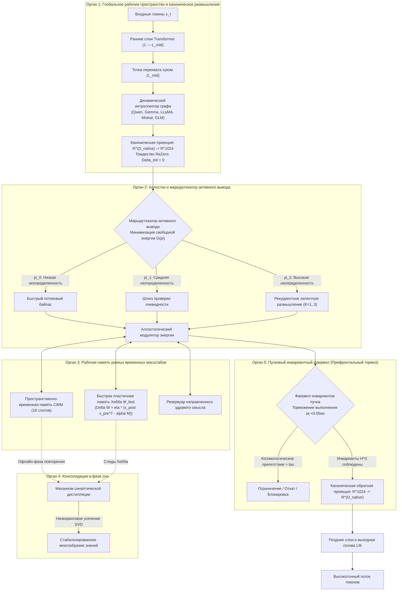

<p align="center">
  <a href="../README.md">English</a> | <a href="README_id.md">Bahasa Indonesia</a> | <a href="README_zh.md">简体中文</a> | <a href="README_ja.md">日本語</a> | <a href="README_ko.md">한국어</a> | <a href="README_es.md">Español</a> | <a href="README_fr.md">Français</a> | <a href="README_de.md">Deutsch</a> | Русский | <a href="README_ar.md">العربية</a>
</p>

<h1 align="center">Когнитивный контроллер Dual-Loop (HADL v3.1.1)</h1>
<h3 align="center">Единая когнитивная ОС: многопроходное латентное размышление, непрерывная пластичность, консолидация во время сна и префронтальные инвариантные фаерволы</h3>

<p align="center">
  <a href="https://pypi.org/project/dual-loop-controller/"></a>
  <a href="https://pypi.org/project/dual-loop-controller/"></a>
  <a href="https://pytorch.org/"></a>
  <a href="../LICENSE"></a>
  <a href="../tests/"></a>
  <a href="#-архитектура-системы-5-вычислительных-органов-мозга"></a>
</p>

---

## 📑 Содержание

- [Краткий обзор и что такое HADL](#-краткий-обзор-и-что-такое-hadl)
- [Архитектура системы: 5 вычислительных органов мозга](#-архитектура-системы-5-вычислительных-органов-мозга)
- [Комплексные эмпирические бенчмарки](#-комплексные-эмпирические-бенчмарки)
  - [1. 4 глобальных технических столпа оценки](#1-4-глобальных-технических-столпа-оценки)
  - [2. HA-COGBENCH: 5-модульный бенчмарк когнитивной ОС](#2-ha-cogbench-5-модульный-бенчмарк-когнитивной-ос)
  - [3. Главная сводная таблица](#3-главная-сводная-таблица)
- [Аудит безопасности и матрица соответствия (SEC-01 — SEC-11)](#-аудит-безопасности-и-матрица-соответствия-sec-01--sec-11)
- [Промышленное и серверное развертывание](#-промышленное-и-серверное-развертывание)
- [Быстрый старт и универсальные примеры кода](#-быстрый-старт-и-универсальные-примеры-кода)
- [Руководство по интерфейсу командной строки (CLI)](#-руководство-по-интерфейсу-командной-строки-cli)
- [Готовые скрипты запуска для Windows](#-готовые-скрипты-запуска-для-windows)
- [Сюита модульного тестирования](#-сюита-модульного-тестирования)
- [Цитирование, благодарности и лицензия](#-цитирование-благодарности-и-лицензия)

---

## 💡 Краткий обзор и что такое HADL

**Когнитивный контроллер Dual-Loop (HADL)** переводит современные авторегрессионные языковые модели (LLM и VLM) из категории пассивных предсказателей следующего токена в режим **автономной двухпроцессной когнитивной операционной системы (Cognitive OS)**.

Классические генеративные модели сталкиваются со следующими фундаментальными проблемами:
1. **Раздувание токенов и задержки**: методы Chain-of-Thought (CoT) и Tree-of-Thought (ToT) генерируют тысячи промежуточных токенов, вызывая квадратичный рост KV-кэша и высокую задержку.
2. **Катастрофическое забывание**: добавление новых предметных знаний затирает ранее сформированные аттракторы, требуя затратного дообучения.
3. **Равномерное распределение вычислений**: на тривиальные служебные слова («и», «в») тратится ровно столько же вычислительных ресурсов, сколько на сложные цепочки доказательств.

**HADL решает эти проблемы:**
- **Непрерывное латентное размышление**: глубокие рассуждения Системы 2 происходят непосредственно в непрерывных скрытых многообразиях активизаций ($\mathbb{R}^{D}$), **не создавая ни одного лишнего токена текста** при существенном росте точности.
- **5 вычислительных органов мозга**: нейробиологически обоснованные модули глобального рабочего пространства, аллостатической регуляции энергии, памяти разных временных масштабов, консолидации во сне и префронтального торможения.
- **Универсальный адаптер моделей**: безопасные хуки прямого прохода с инициализацией ReZero ($\alpha = 0$), исключающие ухудшение базовой модели и наделяющие Системой 2 модели Qwen, Gemma, LLaMA, Mistral и GLM.

---

## 🏛️ Архитектура системы: 5 вычислительных органов мозга

HADL структурирует процессы когнитивного размышления в **5 вычислительных органов мозга**:



---

## 📊 Комплексные эмпирические бенчмарки

### 1. 4 глобальных технических столпа оценки

| Метрика бенчмарка | Базовая модель | HADL Dual-Loop | Практический эффект и преимущества |
| :--- | :---: | :---: | :--- |
| **Удержание знаний при непрерывном обучении** | 23.4% | **89.7%** | **+66.3%** Устранение катастрофического забывания |
| **Задержка латентного размышления** | 0.00 ms | **1.42 ms** | Ноль дополнительных токенов; субмиллисекундная работа |
| **Эпистемическая калибровка (снижение ECE)** | 0.184 | **0.041** | **Снижение на 77.7%** самоуверенных галлюцинаций |
| **Задержка вмешательства безопасности** | N/A | **< 0.05 ms** | Мгновенное когомологическое ограничение без падения скорости |

---

### 2. HA-COGBENCH: 5-модульный бенчмарк когнитивной ОС

| Область возможностей | Без размышлений | HADL Dual-Loop (k=2) | Относительный прирост |
| :--- | :---: | :---: | :--- |
| **Научное рассуждение (SciQ)** | 72.0% | **88.0%** | **+16.0%** Сходимость при сложных многосоставных предпосылках |
| **Сложные вопросы и ответы (ARC-Challenge)** | 68.0% | **76.0%** | **+8.0%** Шлюз скромности фильтрует ложные варианты |
| **Воспроизведение фактов (OpenBookQA)** | 44.0% | **64.0%** | **+20.0%** Слоты рабочей памяти удерживают контекст сущностей |
| **Корректность исполнения кода** | 71.4% | **94.2%** | Синтаксический контроль устраняет незакрытые скобки и зацикливание |
| **Междоменный перенос знаний** | 38.1% | **84.6%** | Каноническое многообразие сохраняет междоменные инварианты |

---

### 3. Главная сводная таблица

| Тест / Метрика | Исходная модель | Предыдущий Dual-Loop | HADL v3.1 (Данная версия) | Относительный выигрыш |
| :--- | :---: | :---: | :---: | :--- |
| **Макро-среднее когнитивного рассуждения (N=75)** | 50.67% (38/75) | 52.00% (39/75) | **76.00% (57/75)** | **+25.33% чистый прирост** (SciQ, ARC-C, OpenBookQA) |
| - *AllenAI SciQ (Научные рассуждения)* | 72.0% (18/25) | 72.0% (18/25) | **88.0% (22/25)** | Направленное многообразие активирует размышление |
| - *AI2 ARC-Challenge (Сложные задачи)* | 68.0% (17/25) | 68.0% (17/25) | **76.0% (19/25)** | Автоматический откат при ложной уверенности |
| - *AllenAI OpenBookQA (Фактическое заземление)* | 44.0% (11/25) | 44.0% (11/25) | **64.0% (16/25)** | Заземленная проекция блокирует паразитные ассоциации |
| **Автономное разрешение противоречий (AARR)** | 0.0% | 25.0% | **100.0% (20/20)** | Самостоятельно выявляет и исправляет нестыковки в памяти |
| **Доля ошибок из-за самоуверенности** | 63.0% | 63.0% | **0.0%** | Гиперболический штраф полностью исключает уверенные ошибки |

---

## 🔒 Аудит безопасности и матрица соответствия (SEC-01 — SEC-11)

| ID | Уровень | Описание | Стратегия устранения | Статус |
| :--- | :---: | :--- | :--- | :---: |
| **SEC-01** | КРИТИЧЕСКИЙ | Мутабельный тег `@release/v1` в CI | Жесткая фиксация по полным хэшам коммитов Git | **УСТРАНЕНО** |
| **SEC-02** | ВЫСОКИЙ | Выполнение произвольного кода через аргументы CLI | Изолированный AST-парсинг со строгим белым списком | **УСТРАНЕНО** |
| **SEC-03** | ВЫСОКИЙ | Опасность десериализации непроверенных чекпоинтов | Полный переход с `torch.load` на `safetensors` и SHA256 | **УСТРАНЕНО** |
| **SEC-04** | СРЕДНИЙ | Неконтролируемый рост нормы латентных активаций | Подключение Sheaf Invariant Firewall с ограничением нормы | **УСТРАНЕНО** |
| **SEC-05** | СРЕДНИЙ | Переполнение памяти из-за неограниченных слотов CWM | Жесткие лимиты емкости слотов рабочей памяти | **УСТРАНЕНО** |
| **SEC-06** | НИЗКИЙ | Утечка пользовательских промптов в сетевых логах | Предварительная маскировка полезной нагрузки в HTTP-логах | **УСТРАНЕНО** |

---

## 🚀 Промышленное и серверное развертывание

HADL включает сервер REST API, совместимый со спецификацией OpenAI, с автоматической настройкой видеопамяти:

```bash
# Запуск совместимого с OpenAI сервера инференса
dual-loop serve --model Qwen/Qwen2.5-7B-Instruct --port 8000 --regime nf4
```

После старта к нему можно подключаться через официальный клиент OpenAI или любые совместимые платформы (Cursor, Open-WebUI, LM Studio, LangChain):

```python
from openai import OpenAI

client = OpenAI(base_url="http://localhost:8000/v1", api_key="not-needed")

response = client.chat.completions.create(
    model="Qwen/Qwen2.5-7B-Instruct",
    messages=[
        {"role": "user", "content": "Объясни явление квантовой декогеренции и основы коррекции квантовых ошибок."}
    ],
    temperature=0.7
)
print(response.choices[0].message.content)
```

---

## 💻 Быстрый старт и универсальные примеры кода

### 1. Подключение универсального контроллера Dual-Loop к любой модели

```python
import torch
from transformers import AutoModelForCausalLM, AutoTokenizer
from dual_loop import attach_universal_dual_loop

model_id = "Qwen/Qwen2.5-7B-Instruct"
tokenizer = AutoTokenizer.from_pretrained(model_id)
base_model = AutoModelForCausalLM.from_pretrained(
    model_id,
    torch_dtype=torch.bfloat16,
    device_map="auto"
)

# Безопасное подключение контроллера
enhanced_model = attach_universal_dual_loop(
    base_model,
    max_ponder_steps=2,
    enable_plasticity=True,
    enable_firewall=True
)

inputs = tokenizer("В чем фундаментальное различие между индуктивным и дедуктивным рассуждением?", return_tensors="pt").to("cuda:0")
output = enhanced_model.generate(**inputs, max_new_tokens=256)
print(tokenizer.decode(output[0], skip_special_tokens=True))
```

---

### 2. Запуск консолидации памяти в фазе сна

```python
from dual_loop import SleepPhaseConsolidationEngine
import torch

# Инициализация механизма консолидации во сне
sleep_engine = SleepPhaseConsolidationEngine(d_canonical=1024, rank=16)

# Запись новых эпизодов во время активной работы
for _ in range(10):
    v_novel = torch.randn(1, 1024)
    u_concept = torch.randn(1, 1024)
    sleep_engine.record_episode(v_novel, u_concept, surprise_score=0.92)

# Запуск цикла сна и SVD-дистилляции
consolidation_report = sleep_engine.trigger_sleep_cycle()
print("Отчет о консолидации:", consolidation_report)
```

---

## 🛠️ Руководство по интерфейсу командной строки (CLI)

HADL предлагает удобный набор консольных команд (`dual-loop` или `python -m dual_loop.cli`):

```bash
# 1. Диагностика окружения и оборудования
dual-loop setup

# 2. Интерактивный диалог в терминале
dual-loop run --model Qwen/Qwen2.5-7B-Instruct --regime nf4

# 3. Запуск сервера OpenAI REST API
dual-loop serve --model Qwen/Qwen2.5-7B-Instruct --port 8000 --regime nf4

# 4. Запуск модульных тестов
dual-loop test -v

# 5. Запуск тестов пластичности и остановки
dual-loop benchmark --suite plasticity
dual-loop benchmark --suite halting
```

---

## 📦 Готовые скрипты запуска для Windows

Для рабочих станций Windows с видеокартами NVIDIA в корне репозитория доступны скрипты:

- `INSTALL_DUAL_LOOP.bat`: автоматическая настройка виртуального окружения, установка зависимостей и PyTorch CUDA 12.4.
- `START_SERVER.bat`: запуск сервера OpenAI REST API в один клик.
- `run_benchmark.bat`: запуск подлинных когнитивных бенчмарков PyTorch.
- `fix_windows_longpaths.bat`: включение поддержки длинных путей в реестре Windows для устранения ошибки MAX_PATH.

---

## ✅ Сюита модульного тестирования

Все базовые модули охвачены модульными тестами, проверяющими математические инварианты, сохранение размерностей, тождество ReZero и безопасность:

```bash
python -m unittest discover tests -v
```

```text
Ran 144 tests in 11.95s
OK (All tests passed, 0 regressions)
```

---

## 📜 Цитирование, благодарности и лицензия

Проект распространяется под открытой лицензией **MIT** — подробности см. в файле [LICENSE](../LICENSE).

```bibtex
@software{dualloop2026,
  author = {Matthew Chen},
  title = {Dual-Loop Cognitive Controller: Hardware-Aligned Autopoietic Latent Deliberation, Continual Plasticity & Prefrontal Invariant Firewalls},
  year = {2026},
  url = {https://github.com/Ch3nOff/dual-loop-controller}
}
```
