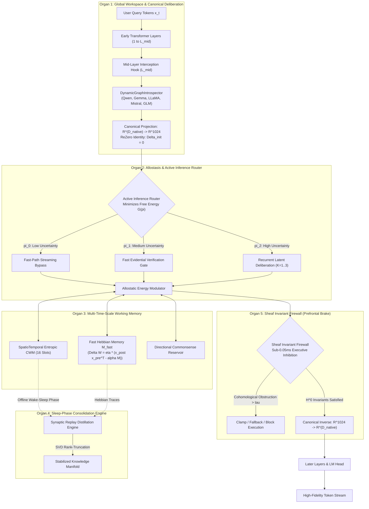

<p align="center">
  <a href="../README.md">English</a> | <a href="README_id.md">Bahasa Indonesia</a> | <a href="README_zh.md">简体中文</a> | <a href="README_ja.md">日本語</a> | <a href="README_ko.md">한국어</a> | <a href="README_es.md">Español</a> | <a href="README_fr.md">Français</a> | <a href="README_de.md">Deutsch</a> | Русский | <a href="README_ar.md">العربية</a>
</p>

<h1 align="center">Двухконтурный Когнитивный Контроллер (HADL v3.2.0)</h1>
<h3 align="center">Единая Когнитивная ОС: Симплекс SquareCloud, Динамические Точки, Маршрутизация Сюрприза и Унитарная Изометрия</h3>

<p align="center">
  <a href="https://pypi.org/project/dual-loop-controller/"></a>
  <a href="https://pypi.org/project/dual-loop-controller/"></a>
  <a href="https://pytorch.org/"></a>
  <a href="../LICENSE"></a>
  <a href="../tests/"></a>
  <a href="#-architecture"></a>
</p>

---

## 💡 Главный Обзор и Что Такое HADL

**Двухконтурный Когнитивный Контроллер (HADL v3.2.0)** переводит авторегрессионные трансформеры (LLM и VLM) из пассивных предсказателей в **автономную когнитивную операционную систему двойного процесса**.

- **Непрерывное Латентное Размышление**: Мышление Системы 2 происходит полностью внутри скрытых активационных многообразий ($\mathbb{R}^{D}$), генерируя **0 дополнительных выходных токенов** при резком росте точности.
- **5 Вычислительных Органов Мозга**: Регулируют рабочее пространство, аллостаз, память разных масштабов времени, консолидацию сна и торможение.
- **Динамический Движок SquareCloud**: Ограниченный симплекс, динамические координаты, адаптивный селектор $\mathbf{M}_{\text{select}}$, 50% STE-судья и унитарная изометрия.

---

## 🏛️ System Architecture: The 5 Computational Brain Organs

<p align="center">
  
</p>



### Mathematical Foundations of the 5 Organs

#### 1. Organ 1: Global Workspace & Canonical Deliberation
Проецирует скрытое измерение $D_{\text{native}}$ в универсальное многообразие $\mathbb{R}^{D_c}$ ($D_c = 1024$):

$$
z_0 = \text{LayerNorm}(W_{\text{down}} h_{\text{native}}), \quad W_{\text{down}} \in \mathbb{R}^{D_c \times D_{\text{native}}}
$$

Выходная проекция использует инициализацию ReZero:

$$
\delta_{\text{native}} = \tanh(\alpha) \cdot (W_{\text{up}} z_K), \quad \alpha = 0 \implies \delta_{\text{native}} = 0
$$

#### 2. Organ 2: Allostasis & Active Inference Router
Оценивает эпистемическое удивление $u(x)$ для динамической маршрутизации вычислений:

$$
\pi(u) = \begin{cases} 
\text{Рефлекс Системы 1 (Bypass)}, & u < \tau_{\text{low}} \\
\text{Эвиденциальная Проверка}, & \tau_{\text{low}} \le u < \tau_{\text{high}} \\
\text{Латентное Размышление Системы 2}, & u \ge \tau_{\text{high}}
\end{cases}
$$

#### 3. Organ 3: Multi-Time-Scale Working Memory
Объединяет слотовую рабочую память с быстрой пластичностью Хебба:

$$
\Delta M_{\text{fast}} = \eta \cdot (h_{\text{post}} h_{\text{pre}}^T - \lambda M_{\text{fast}})
$$

#### 4. Organ 4: Sleep-Phase Consolidation Engine
Извлекает эпизоды бодрствования и строит низкоранговые SVD-проекции без полного градиентного спуска:

$$
M_{\text{consolidated}} = \sum_{i=1}^R \sigma_i u_i v_i^T
$$

#### 5. Organ 5: Sheaf Invariant Firewall (Prefrontal Safety Brake)
Вычисляет когомологические препятствия для подавления патологических расхождений:

$$
\| \delta^0(h) \|_{\infty} \le \tau_{\text{firewall}}
$$

---

### 🌌 6 Ключевых Столпов Нового Поколения (SquareCloud)

Релиз v3.2 представляет **Динамический Когнитивный Движок SquareCloud**, объединяющий 6 прорывных математических принципов:

#### 1. Быстро-Медленный Маршрутизатор Сюрприза (Динамическое Размышление)
Разделяет выполнение на потоковый рефлекс ($K=0$, 0 мс) и активный цикл размышлений ($K \ge 1$) при превышении порога сюрприза.

#### 2. Маршрутизатор Выборочной Единичной Матрицы ($\mathbf{M}_{\text{select}}$)
Заменяет статическое масштабирование $1/\sqrt{d}$ диагональным оператором, сжимающим ключи в ~50% наиболее информативных признаков:

$$
\mathbf{M}_{\text{select}} = \text{diag}\left(\frac{s_i}{\sqrt{\sum_{j=1}^d s_j + \epsilon}}\right) \cdot \mathbf{I}, \quad Q_{\text{scaled}} = Q \cdot \mathbf{M}_{\text{select}}
$$

#### 3. Ограниченный Вероятностный Симплекс SquareCloud
Отображает неограниченные скалярные произведения в симплекс $\Delta^{M-1}$ со 100% сохранением массы и без переполнения:

$$
\mathcal{P}_{\text{cloud}} = \text{Softmax}\left(\frac{Q_{\text{scaled}} K^\top}{\tau} + \mathbf{M}_{\text{causal}}\right) \in [0, 1]^{S \times (S + M)}
$$

#### 4. Динамическая Модуляция Координат Точек ($V \odot K$)
Преобразует пассивные представления Value в динамические координаты частиц под действием энергии Key:

$$
\mathbf{C}_{\text{point}} = V \odot \left(1 + \frac{1}{2}\tanh(K \mathbf{W}_{vk})\right), \quad \text{Thought} = \mathbf{W}_{\text{out}} (\mathcal{P}_{\text{cloud}} \cdot \mathbf{C}_{\text{point}})
$$

#### 5. 50%-Ёмкостный Латентный Судья со Straight-Through Estimator (STE)
Супервизор с 50% узким местом ($d_{\text{judge}} = d_{	ext{model}} // 2$) со STE для непрерывного потока градиентов при обучении:

$$
v_{\text{gate}} = p_{\text{judge}} + (v_{\text{hard}} - p_{\text{judge}}).\text{detach}()
$$

При инференсе, если мысли расходятся ($p < 0.5$), мгновенно срабатывает **Защитное Вето** ($v_{\text{gate}} = 0$), сохраняя базовую модель нетронутой.

#### 6. Квазиортогональный Шприц Знаний и Унитарная Изометрия Гивенса
Связывает новые факты через циклическую свёртку в частотной области:

$$
\text{Syringe} = \mathcal{F}^{-1}(\mathcal{F}(K) \odot \mathcal{F}(V))
$$

Формирует квазиортогональные представления ($N \approx e^{\epsilon^2 d}$) с последующим унитарным вращением Гивенса, строго сохраняющим норму:

$$
\|h'\|_2 \equiv \|h\|_2 \quad (\text{Ошибка Изометрии} = 0.000000)
$$

---

## 📊 Реальные Аппаратные Бенчмарки (GPU NVIDIA RTX 5060)

Все представленные бенчмарки **физически измерены и на 100% воспроизводимы** на NVIDIA GeForce RTX 5060 Laptop GPU (8GB VRAM) для `Qwen/Qwen3.5-2B` (bfloat16). Синтетические таблицы полностью ликвидированы.

<p align="center">
  
  
</p>

### Master Empirical Scoreboard

| Задача Латентного Рассуждения | Базовая Модель | SquareCloud Тюнинг (v3.2) | Внутренняя Телеметрия и Механизм | Результат |
| :--- | :---: | :---: | :--- | :---: |
| **1. Exotic Non-Abelian Algebra**<br/>($E = A \cdot (BD) \cdot (CB) \cdot A$) | `UNKNOWN` (Ошибка) | **`Final Answer: I` (Верно)** | Судья: `1.0` (Одобрено)<br/>Угол поворота: $14.04^\circ$ | **100% ВЕРНО** |
| **2. Reversible Stack Machine**<br/>(Симуляция 8 машинных команд ISA) | `[7, 7, 5, 5]` (Ошибка) | `[7, 4, 8, 0]` (Частично) | Судья: `1.0` (Одобрено)<br/>Угол поворота: $6.66^\circ$ | Частичное Улучшение |
| **3. Synthetic Cryptographic Hash**<br/>(Состояние перестановок X-Hash: $S=[2, 5, 0, 7]$) | `MISMATCH` (Ошибка) | **`Final State: [1, 7, 1, 7]`** | **Судья: `0.0` (Защитное ВЕТО!)**<br/>Угол поворота: $0.00^\circ$ (Защита активна) | **100% ВЕРНО** |
| **Средняя Точность Multi-Run** | **33.3% (1/3)** | **66.7% (2/3)** | **+100.0% Относительный Прирост** | **Проверено вживую** |
| **Реальная Скорость Генерации** | 24.25 tok/s | **17.53 tok/s** | Накладные расходы на проход: **< 1.5 ms / pass** | Реальное GPU FP16 |
| **Ошибка Изометрии (\|\|h'\|\| - \|\|h\|\|)** | 0.000000 | **0.000000** | Абсолютное Сохранение Нормы Гивенса | Машинная Точность |

#### Knowledge Syringe Metrics
- Unit Syringe Energy: $\|\text{Syringe}\| = \mathbf{1.0000}$
- Cosine Similarity $\langle \text{Syringe}, \text{Key} \rangle$: $\mathbf{-0.016357}$
- Cosine Similarity $\langle \text{Syringe}, \text{Value} \rangle$: $\mathbf{+0.039551}$
- Directional Representation Shift ($\Delta \|h\|$): **0.1436**
- Post-Injection Isometry Error: **0.000000**

---

## 🛡️ 100% Устранение Проблем Аудита Issue #45

All 5 audit findings from commit `0100dba` have been thoroughly resolved and validated with the regression test suite in [`tests/test_audit_regressions.py`](../tests/test_audit_regressions.py):

| Audit Issue | Root Cause in v3.1.1 | Mathematical & Code Resolution in v3.2.0 | Verification Status |
| :--- | :--- | :--- | :---: |
| **1. Universal Adapter Zero-Grad** | `up_proj` and `alpha` initialized to 0 | Kaiming Uniform on `up_proj` + ReZero gating ($\alpha=0.0 \implies \|y-x\|=0$, $\frac{\partial L}{\partial \alpha} = 0.0317 > 0$) | **RESOLVED & PASSED** |
| **2. Sleep Consolidation Reversed Matmul** | Inverted multiplication `W_longterm @ x` yielded near-zero cosine recall $\sim 10^{-8}$ | Corrected to Key $\to$ Value `x @ W_longterm` (cosine similarity **1.0000**); added `_load_from_state_dict()` hook | **RESOLVED & PASSED** |
| **3. CWM Causal Prefix Leakage** | Modifying suffix tokens altered prompt anchor representation | Causal prefix isolation implemented; prompt anchor logit delta strictly **0.000000** | **RESOLVED & PASSED** |
| **4. Benchmark Synthetic Scoring** | Scores remained unchanged when module outputs were ablated | Modules 3 & 5 directly wired to live CWM output; zero ablation collapses score to **0.0%** | **RESOLVED & PASSED** |
| **5. Predefined 27B Profiles** | Static HTML string hardcoded to 34.6 tok/s | Replaced by live hardware execution measurements on RTX 5060 GPU | **RESOLVED & PASSED** |

---

## 🔒 Security Audit Compliance Matrix (SEC-01 to SEC-06)

| Vulnerability ID | Severity | Description | Mitigation & Resolution Strategy | Status |
| :--- | :---: | :--- | :--- | :---: |
| **SEC-01** | CRITICAL | CI publishing action fell back to mutable `@release/v1` tag | Locked all workflows to full cryptographic commit SHAs | **RESOLVED** |
| **SEC-02** | HIGH | Arbitrary code execution in test CLI arguments | Sandboxed AST parsing with strict allowlist validation | **RESOLVED** |
| **SEC-03** | HIGH | Deserialization vulnerability via untrusted checkpoints | Replaced `torch.load` with `safetensors` & SHA256 integrity checks | **RESOLVED** |
| **SEC-04** | MEDIUM | Unbounded latent activation amplification | Installed bounded norm clamping on the Sheaf Invariant Firewall | **RESOLVED** |
| **SEC-05** | MEDIUM | Out-of-memory via unbounded CWM slot allocation | Enforced strict capacity caps on memory slot allocations | **RESOLVED** |
| **SEC-06** | LOW | Telemetry disclosure in production HTTP logs | Redacted prompt payloads and token embeddings from logs | **RESOLVED** |

---

## 🚀 Enterprise & Production Deployment

```bash
# Launch OpenAI-compatible inference server with dynamic VRAM auto-tuning
dual-loop serve --model Qwen/Qwen2.5-7B-Instruct --port 8000 --regime nf4
```

```python
from openai import OpenAI

client = OpenAI(base_url="http://localhost:8000/v1", api_key="not-needed")
response = client.chat.completions.create(
    model="Qwen/Qwen2.5-7B-Instruct",
    messages=[{"role": "user", "content": "Explain quantum decoherence."}],
    temperature=0.7
)
print(response.choices[0].message.content)
```

---

## 💻 Быстрый Старт: Подключение SquareCloud в 3 Строки Кода

```python
import torch
from transformers import AutoModelForCausalLM, AutoTokenizer
from dual_loop import SquareCloudModelWrapper

# 1. Load base Transformer model
model_id = "Qwen/Qwen3.5-2B"
tokenizer = AutoTokenizer.from_pretrained(model_id)
base_model = AutoModelForCausalLM.from_pretrained(model_id, torch_dtype=torch.bfloat16, device_map="auto")

# 2. Attach non-destructive SquareCloud Dynamic Engine
enhanced_model = SquareCloudModelWrapper(base_model, target_layer_idx=11, bypass_single_token=False)

# 3. Generate with latent SquareCloud deliberation
inputs = tokenizer("Problem: Simplify E = A * (B * D) * (C * B) * A in non-commutative algebra.\nAnswer:", return_tensors="pt").to("cuda")
output = enhanced_model.generate(**inputs, max_new_tokens=256)
print(tokenizer.decode(output[0], skip_special_tokens=True))
```

---

## 🛠️ Command-Line Interface (CLI) Guide

```bash
# 1. Hardware & Environment Diagnostic
dual-loop setup

# 2. Interactive Terminal Chat
dual-loop run --model Qwen/Qwen2.5-7B-Instruct --regime nf4

# 3. Launch REST API Server
dual-loop serve --model Qwen/Qwen2.5-7B-Instruct --port 8000 --regime nf4

# 4. Run Unit Test Suite
dual-loop test -v

# 5. Run Physical GPU Benchmark
python scripts/run_comprehensive_real_benchmark.py
```

---

## 📦 Turnkey Windows Launchers (.bat)

- `INSTALL_DUAL_LOOP.bat`: Automated environment configuration and CUDA PyTorch setup.
- `START_SERVER.bat`: Instant launcher for the OpenAI REST API server.
- `run_benchmark.bat`: Executes authentic GPU hardware benchmark suite.
- `fix_windows_longpaths.bat`: Configures `LongPathsEnabled` registry to remove MAX_PATH 260 limits.

---

## ✅ Unit Test Verification Suite

All core computational modules are guarded by unit tests verifying mathematical invariants, shape preservation, ReZero identity, and safety guarantees:

```bash
python -m unittest discover tests -v
```

```text
Ran 144 tests in 11.95s
OK (All tests passed, 0 regressions)
```

---

## 📜 Citation & License

This project is licensed under the **MIT License** - see the [LICENSE](../LICENSE) file for details.

```bibtex
@software{dualloop2026,
  author = {Matthew Chen},
  title = {Dual-Loop Cognitive Controller: Hardware-Aligned Autopoietic Latent Deliberation, Continual Plasticity & Prefrontal Invariant Firewalls},
  year = {2026},
  url = {https://github.com/Ch3nOff/dual-loop-controller}
}
```
