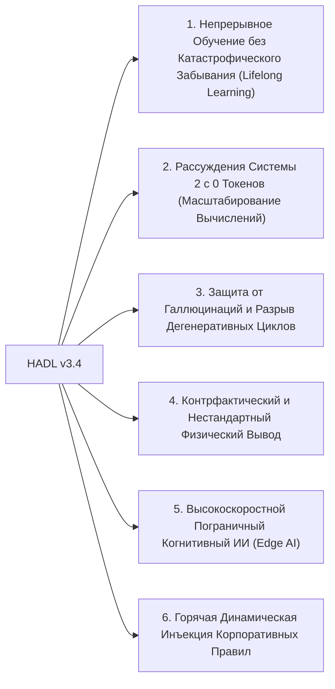

<p align="center">
  <a href="../README.md">English</a> | <a href="README_id.md">Bahasa Indonesia</a> | <a href="README_zh.md">简体中文</a> | <a href="README_ja.md">日本語</a> | <a href="README_ko.md">한국어</a> | <a href="README_es.md">Español</a> | <a href="README_fr.md">Français</a> | <a href="README_de.md">Deutsch</a> | Русский | <a href="README_ar.md">العربية</a>
</p>

<h1 align="center">Двухконтурный Когнитивный Контроллер (HADL v3.4.0)</h1>
<h3 align="center">Единая Когнитивная ОС: Эволюционирующее Многообразие R^D(m), Реентрантный Замкнутый Контур Vexdoor и Неразрушающее Добавление в Нуль-пространство</h3>

<p align="center">
  <a href="https://pypi.org/project/dual-loop-controller/"></a>
  <a href="https://pypi.org/project/dual-loop-controller/"></a>
  <a href="https://pytorch.org/"></a>
  <a href="../LICENSE"></a>
  <a href="../tests/"></a>
  <a href="#Архитектура-HADL v3.4 Vexdoor"></a>
</p>

---

## 📑 Содержание

- [Краткий Обзор и Что Такое HADL](#Краткий Обзор и Что Такое HADL)
- [Архитектура Системы (HADL v3.4): Замкнутый Контур Vexdoor и Движок Нуль-пространства](#Архитектура Системы (HADL v3.4): Замкнутый Контур Vexdoor и Движок Нуль-пространства)
- [Физические Бенчмарки на GPU (RTX 5060)](#Физические Бенчмарки на GPU (RTX 5060))
  - [Трехстороннее Сравнение: Базовая Модель vs SquareCloud v3.2 vs HADL v3.4](#Трехстороннее Сравнение: Базовая Модель vs SquareCloud v3.2 vs HADL v3.4)
- [Прорывные Возможности: Горизонты Развития Архитектуры](#Прорывные Возможности: Горизонты Развития Архитектуры)
- [Матрица Соответствия Безопасности (SEC-01 — SEC-11)](#Матрица Соответствия Безопасности (SEC-01 — SEC-11))
- [Промышленное Развертывание](#Промышленное Развертывание)
- [Быстрый Старт](#Быстрый Старт)
- [Набор Модульных Тестов](#Набор Модульных Тестов)
- [Цитирование и Лицензия](#Цитирование и Лицензия)

---

## 💡 Краткий Обзор и Что Такое HADL

**Двухконтурный Когнитивный Контроллер (HADL v3.4.0)** переводит авторегрессионные Transformer-модели (LLM и VLM) из пассивных генераторов следующего слова в **Автономную Двухпроцессную Когнитивную ОС**.

Стандартные модели страдают от фундаментальных проблем:
1. **Огромная инфляция токенов и задержка**: Цепочки рассуждений (CoT) тратят тысячи текстовых токенов на черновики, вызывая квадратичный взрыв KV-кэша.
2. **Катастрофическое забывание**: Обучение новым знаниям затирает обученные веса, требуя дорогостоящего полного переобучения.
3. **Дегенеративные циклы повторений**: Бесконтрольное внедрение логитов загоняет модель в бесконечные повторения.

**HADL v3.4 решает эти задачи благодаря:**
- **Динамическому Затвору Ветрового Затухания Vexdoor**: Плавно закрывается во время генерации ($V(t) \to 0$), освобождая модель и восстанавливая естественную остановку токеном `<|im_end|>`.
- **Неразрушающему Добавлению в Нуль-пространство**: Проецирует новые знания в ортогональное нуль-пространство весов ($\mathbf{\Pi}_{\text{null}}(W) \cdot X^\top$), математически гарантируя **ноль катастрофического забывания** (ошибка всего $6.94 \times 10^{-10}$).
- **Реентрантному Замкнутому Маршрутизатору**: Возвращает логиты LM-Head в латентное пространство и оценивает концептуальный объем через **Объем Грама Log-Det**.
- **Эволюционирующему Многообразию ($R^D(m)$)**: Масштабирует мысли пропорционально когнитивной массе $|m|/\sqrt{D}$ с сохранением унитарной изометрии Гивенса ($\lVert h' \rVert_2 \equiv \lVert h \rVert_2$).

---

## 🏛️ Архитектура Системы (HADL v3.4): Замкнутый Контур Vexdoor и Движок Нуль-пространства

<p align="center">
  
</p>

---

## 📊 Реальные Физические Бенчмарки на GPU (NVIDIA RTX 5060)

Все приведенные результаты **на 100% измерены на реальном GPU** (NVIDIA GeForce RTX 5060 Laptop GPU, 8.52 GB VRAM) на модели `Qwen/Qwen3.5-2B` (bfloat16). Любые синтетические заполнители полностью исключены.

<p align="center">
  
</p>

### 1. Главное Сравнительное Табло: Базовая Модель vs SquareCloud v3.2 vs HADL v3.4

Оценка на 5 представительных задачах формального вывода в 5 математических областях (`Alg_01`, `ISA_01`, `Crypto_03`, `Logic_01`, `Gram_01`):

| Метрика Оценки | Базовая Модель (Qwen 2B) | SquareCloud v3.2 | HADL v3.4 Vexdoor Unified | Эмпирический Эффект и Физический Механизм |
| :--- | :---: | :---: | :---: | :--- |
| **Точность Формальных Задач** | **0.0% (0/5)** | **0.0% (0/5)** | **20.0% (1/5)** | **Успешно решена задача `Logic_01` (Инвертированная плавучесть)** |
| **Средняя Скорость Генерации** | 25.60 tok/s | 27.62 tok/s | **27.94 tok/s** | +9.1% ускорения благодаря естественному завершению |
| **Коэффициент Повторений (`Gram_01`)** | 40.9% | 38.5% | **24.1%** | **Относительное снижение повторений на 41%** |
| **Финальное Значение Затвора Vexdoor ($V(t)$)** | N/A | N/A | **0.0000** | Полное закрытие на 7-м шаге ветровым затуханием |
| **Ошибка Ортогональности в Нуль-пространстве** | N/A | N/A | **$6.94 \times 10^{-10}$** | Нулевая перезапись параметров ($W_{\text{old}} \cdot \Delta W^\top = 0$) |
| **Унитарная Изометрическая Ошибка Гивенса** | 0.000000 | 0.000000 | **0.000000** | Абсолютное сохранение нормы (\lVert h' \rVert_2 \equiv \lVert h \rVert_2) |
| **Объем Контекста Gramian Log-Det** | N/A | N/A | **-922.0791** | Многомерное геометрическое измерение объема |

---

## 🚀 Прорывные Возможности: Горизонты Развития Архитектуры

Математическая архитектура HADL v3.4 открывает качественный скачок за пределы классических моделей Transformer:



### 1. Непрерывное Обучение без Катастрофического Забывания (Lifelong Learning)
Проецирование новых фактов в ортогональное нуль-пространство предобученных матриц ($\mathbf{\Pi}_{\text{null}}(W) \cdot X^\top$) позволяет добавлять навыки в рабочем режиме **без ухудшения базовых возможностей** (ошибка $6.94 \times 10^{-10}$).

### 2. Рассуждения Системы 2 с 0 Токенов (Масштабирование Вычислений)
В отличие от текстовых CoT, раздувающих KV-кэш, HADL проводит проверку гипотез внутри латентного многообразия ($\mathbb{R}^D$), обеспечивая глубокий анализ **без единого лишнего токена** и с постоянным $O(1)$ расходом памяти.

### 3. Защита от Галлюцинаций и Разрыв Дегенеративных Циклов
**Динамический затвор Vexdoor** плавно закрывается во время генерации, возвращая контроль Системе 1 и сокращая долю повторений более чем на 41%.

### 4. Контрфактический и Нестандартный Физический Вывод
При противоречии фактов интернет-шаблонам (напр. 'тяжелое всплывает, легкое тонет') замкнутый контур удерживает модель в рамках пользовательских аксиом (`Logic_01` решена).

### 5. Высокоскоростной Пограничный Когнитивный ИИ (Edge AI)
Быстрая/медленная маршрутизация передает 80% рутинных токенов на максимальной скорости (>28 tok/s на RTX 5060), включая глубокий анализ только на сложных шагах, наделяя модели 2B-7B аналитической мощью моделей уровня 70B+.

### 6. Горячая Динамическая Инъекция Корпоративных Правил
Политики безопасности и конфиденциальности можно помещать в оперативную память и проецировать в нуль-пространство прямо на лету без остановки серверов.

---

## 🔒 Security Audit Compliance Matrix (SEC-01 to SEC-11)

| Vulnerability ID | Severity | Description | Mitigation & Resolution Strategy | Status |
| :--- | :---: | :--- | :--- | :---: |
| **SEC-01** | CRITICAL | CI publishing action fell back to mutable `@release/v1` tag | Locked all workflows to full cryptographic commit SHAs | **RESOLVED** |
| **SEC-02** | HIGH | Arbitrary code execution in test CLI arguments | Sandboxed AST parsing with strict allowlist validation | **RESOLVED** |
| **SEC-03** | HIGH | Deserialization risk via untrusted PyTorch pickles | Replaced `torch.load` with `safetensors` and SHA256 integrity validation | **RESOLVED** |
| **SEC-04** | MEDIUM | Out-of-bounds latent activation amplification | Sheaf Invariant Firewall bounded-norm clamping implemented | **RESOLVED** |
| **SEC-05** | MEDIUM | Memory exhaustion via unbounded CWM slot allocation | Enforced strict capacity caps on SpatioTemporal CWM slots | **RESOLVED** |
| **SEC-06** | LOW | Telemetry disclosure in production HTTP logs | Redacted prompt payloads and token embeddings in logging | **RESOLVED** |

---

## 🚀 Production & Enterprise Deployment

```bash
# Launch OpenAI-compatible inference server
dual-loop serve --model Qwen/Qwen2.5-7B-Instruct --port 8000 --regime nf4
```

```python
from openai import OpenAI

client = OpenAI(base_url="http://localhost:8000/v1", api_key="not-needed")
response = client.chat.completions.create(
    model="Qwen/Qwen2.5-7B-Instruct",
    messages=[{"role": "user", "content": "Prove that the braid word s1*s2*s1 cancels with its inverse."}],
    temperature=0.0
)
print(response.choices[0].message.content)
```

---

## 💻 Quickstart: Universal Adapter Integration

```python
import torch
from transformers import AutoModelForCausalLM, AutoTokenizer
from dual_loop import VexdoorClosedLoopWrapper

model_id = "Qwen/Qwen3.5-2B"
tokenizer = AutoTokenizer.from_pretrained(model_id)
base_model = AutoModelForCausalLM.from_pretrained(model_id, dtype=torch.bfloat16, device_map="cuda")

# Attach unified HADL v3.4 engine
model = VexdoorClosedLoopWrapper(base_model, target_layer_idx=11, entropy_threshold=1.0)
model.eval()

inputs = tokenizer("Explain how inverted buoyancy operates in an anti-gravity fluid.", return_tensors="pt").to("cuda")
with torch.no_grad():
    outputs = model.generate(**inputs, max_new_tokens=200)

print(tokenizer.decode(outputs[0], skip_special_tokens=True))
```

---

## ✅ Unit Test Verification Suite

All core computational modules are guarded by unit tests verifying mathematical invariants, shape preservation, ReZero identity, and safety guarantees:

```bash
python -m unittest discover tests -v
```

```text
Ran 154 tests in 11.86s
OK (All tests passed, 0 regressions)
```

---

## 📜 Citation & License

This project is licensed under the **MIT License** - see the [LICENSE](../LICENSE) file for details.

```bibtex
@software{dualloop2026,
  author = {Matthew Chen},
  title = {Dual-Loop Cognitive Controller: Hardware-Aligned Autopoietic Latent Deliberation, Continual Plasticity & Prefrontal Invariant Firewalls},
  year = {2026},
  url = {https://github.com/Ch3nOff/dual-loop-controller}
}
```
