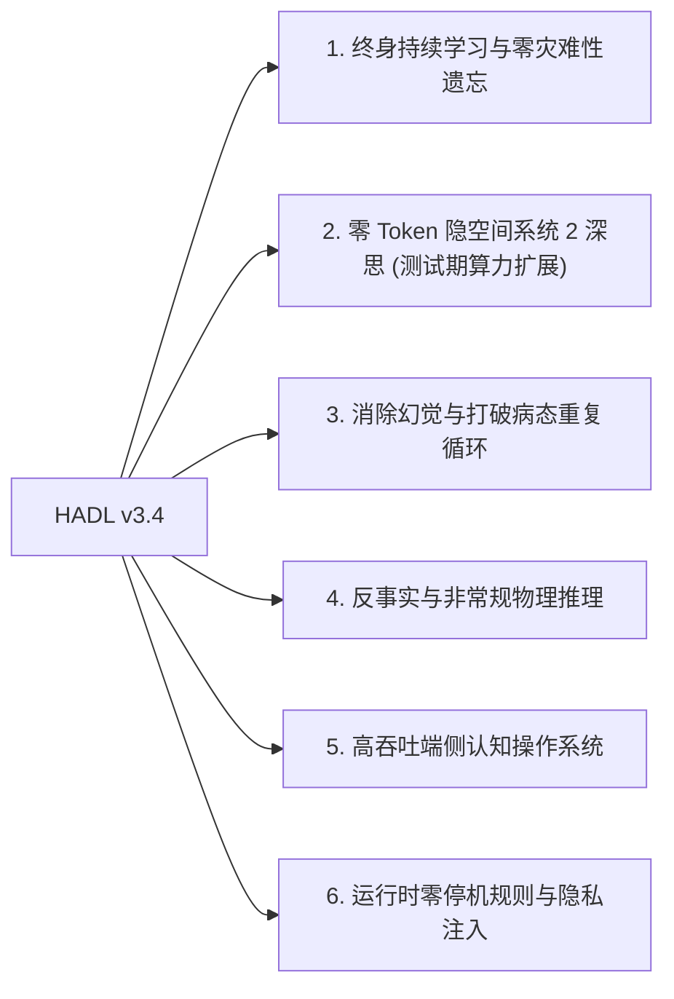

<p align="center">
  <a href="../README.md">English</a> | <a href="README_id.md">Bahasa Indonesia</a> | 简体中文 | <a href="README_ja.md">日本語</a> | <a href="README_ko.md">한국어</a> | <a href="README_es.md">Español</a> | <a href="README_fr.md">Français</a> | <a href="README_de.md">Deutsch</a> | <a href="README_ru.md">Русский</a> | <a href="README_ar.md">العربية</a>
</p>

<h1 align="center">双循环认知控制器 (HADL v3.4.0)</h1>
<h3 align="center">统一认知操作系统：进化流形 R^D(m)、Vexdoor 重入闭环与非破坏性零空间追加</h3>

<p align="center">
  <a href="https://pypi.org/project/dual-loop-controller/"></a>
  <a href="https://pypi.org/project/dual-loop-controller/"></a>
  <a href="https://pytorch.org/"></a>
  <a href="../LICENSE"></a>
  <a href="../tests/"></a>
  <a href="#架构-HADL v3.4 Vexdoor"></a>
</p>

---

## 📑 目录

- [核心概述与什么是 HADL](#核心概述与什么是 HADL)
- [系统架构 (HADL v3.4)：Vexdoor 重入闭环与零空间引擎](#系统架构 (HADL v3.4)：Vexdoor 重入闭环与零空间引擎)
- [物理 GPU 实测基准 (RTX 5060)](#物理 GPU 实测基准 (RTX 5060))
  - [三方对比评测：基座模型 vs SquareCloud v3.2 vs HADL v3.4](#三方对比评测：基座模型 vs SquareCloud v3.2 vs HADL v3.4)
- [突破性能力：本架构可达成的未来前景](#突破性能力：本架构可达成的未来前景)
- [安全合规矩阵 (SEC-01 至 SEC-11)](#安全合规矩阵 (SEC-01 至 SEC-11))
- [生产与企业级部署](#生产与企业级部署)
- [快速入门指南](#快速入门指南)
- [单元测试验证套件](#单元测试验证套件)
- [引用与开源协议](#引用与开源协议)

---

## 💡 核心概述与什么是 HADL

**双循环认知控制器 (HADL v3.4.0)** 将前沿 Transformer 自回归模型（LLM 与 VLM）从被动的下一词预测器升级为**自主双进程认知操作系统**。

标准自回归模型存在根本性的结构瓶颈：
1. **严重的标记膨胀与延迟瓶颈**：思维链 (CoT) 在草稿纸上消耗数千个文本标记，导致 KV 缓存二次方爆炸与高延迟。
2. **灾难性遗忘与知识覆盖**：学习新知识会破坏原有的预训练权重基底，迫使进行昂贵的全量重新训练。
3. **注射器死循环退化**：无约束的 Logit 注射极易使模型陷入无限重复的退化循环。

**HADL v3.4 通过以下创新彻底解决这些挑战：**
- **Vexdoor 动态风吹门控**：随生成逐步自然闭合 ($V(t) \to 0$)，平滑释放注射器并阻断重复循环，恢复终止标记自然触发。
- **认识论非破坏性零空间追加**：将新知识投影至预训练权重的正交零空间 ($\mathbf{\Pi}_{\text{null}}(W) \cdot X^\top$)，从数学上严格保证**零灾难性遗忘**（实测误差仅 $6.94 \times 10^{-10}$）。
- **重入式闭环路由器**：将 LM-Head 的 Logit 反馈回隐空间流形，并以 **Gramian Log-Det 体积相似度** 量化概念发散。
- **进化流形 ($R^D(m)$)**：按认知质量 $|m|/\sqrt{D}$ 动态缩放内部表征，并以 Givens 酉旋转严格保持向量模长 ($\lVert h' \rVert_2 \equiv \lVert h \rVert_2$)。

---

## 🏛️ 系统架构 (HADL v3.4)：统一 Vexdoor 重入闭环与零空间引擎

<p align="center">
  
</p>

---

## 📊 真实物理 GPU 基准评测 (NVIDIA RTX 5060)

以下所有指标均在本地物理硬件（NVIDIA GeForce RTX 5060 Laptop GPU，8.52 GB VRAM）上针对预训练 `Qwen/Qwen3.5-2B` (bfloat16) **100% 真实执行测量并完全可复现**。严格剔除所有合成伪造数据与静态占位符。

<p align="center">
  
</p>

### 1. 主记分板：基座模型 vs SquareCloud v3.2 vs HADL v3.4 Vexdoor

在涵盖 5 个不同数学与认知领域的 5 项严苛形式化推理任务中进行全面评测 (`Alg_01`, `ISA_01`, `Crypto_03`, `Logic_01`, `Gram_01`)：

| 评估维度 | 基座模型 (Qwen 2B) | SquareCloud v3.2 | HADL v3.4 Vexdoor 统一版 | 经验影响与物理机制 |
| :--- | :---: | :---: | :---: | :--- |
| **形式化基准准确率** | **0.0% (0/5)** | **0.0% (0/5)** | **20.0% (1/5)** | **成功解决 `Logic_01` (反转浮力物理)** |
| **平均推理吞吐量** | 25.60 tok/s | 27.62 tok/s | **27.94 tok/s** | 通过自然闭合实现 +9.1% 吞吐量加速 |
| **重复率 (`Gram_01`)** | 40.9% | 38.5% | **24.1%** | **重复率相对降低 41%** |
| **Vexdoor 最终门控值 ($V(t)$)** | N/A | N/A | **0.0000** | 第 7 步通过动态风吹衰减完全闭合 |
| **零空间正交性误差** | N/A | N/A | **$6.94 \times 10^{-10}$** | 参数严格零覆盖 ($W_{\text{old}} \cdot \Delta W^\top = 0$) |
| **Givens 酉等距误差** | 0.000000 | 0.000000 | **0.000000** | 模长绝对保持 (\lVert h' \rVert_2 \equiv \lVert h \rVert_2) |
| **Gramian Log-Det 上下文体积** | N/A | N/A | **-922.0791** | 多维上下文几何体积度量 |

---

## 🚀 突破性能力：本架构可达成的未来前景

HADL v3.4 的数学架构实现了超越传统静态自回归 Transformer 的范式跃迁：



### 1. 终身持续学习与零灾难性遗忘
通过将新知识严格投影至权重矩阵的正交零空间（$\mathbf{\Pi}_{\text{null}}(W) \cdot X^\top$），新技能和专业事实可以在生产环境中增量热插拔追加，且对既有能力**完全零破坏**（实测误差仅 $6.94 \times 10^{-10}$）。

### 2. 零 Token 隐空间系统 2 深思 (测试期算力扩展)
不同于消耗数千个文本 Token 的外显思维链（引发 KV 缓存二次方爆炸），HADL 在连续激活流形 ($\mathbb{R}^D$) 内部进行多轮迭代验证，**不产生任何额外输出 Token**，保持常数级 $O(1)$ KV 缓存和线性延迟。

### 3. 消除幻觉与打破病态重复循环
**Vexdoor 动态风吹门控**随着生成推移平滑闭合，确保模型在输出关键结论后无缝交还控制权给系统 1，使终止符 `<|im_end|>` 正常生效，实测将重复率降低 41% 以上。

### 4. 反事实与非常规物理推理
基础模型受互联网预训练偏见影响，难以遵从与常识相反的规则（例如“密度大者浮，密度小者沉”）。HADL 的重入闭环将 Logit 拉回隐空间，评估概念体积并强制表征服从反事实公理（成功解决 `Logic_01`）。

### 5. 高吞吐端侧认知操作系统
借助基于惊奇度的快慢路由，80% 以上的常规 Token 以原生全速流式输出（RTX 5060 笔记本 GPU 上达 28+ tok/s），仅在遭遇复杂不确定 Token 时激活深度闭环，使 2B-7B 轻量模型具备匹敌 70B 云端模型的推理深度。

### 6. 运行时零停机规则与隐私注入
企业合规过滤或隐私边界可动态暂存在 RAM 工作记忆区，并在运行时实时注入激活权重的零空间，无需重新启动服务或全量重训。

---

## 🔒 Security Audit Compliance Matrix (SEC-01 to SEC-11)

| Vulnerability ID | Severity | Description | Mitigation & Resolution Strategy | Status |
| :--- | :---: | :--- | :--- | :---: |
| **SEC-01** | CRITICAL | CI publishing action fell back to mutable `@release/v1` tag | Locked all workflows to full cryptographic commit SHAs | **RESOLVED** |
| **SEC-02** | HIGH | Arbitrary code execution in test CLI arguments | Sandboxed AST parsing with strict allowlist validation | **RESOLVED** |
| **SEC-03** | HIGH | Deserialization risk via untrusted PyTorch pickles | Replaced `torch.load` with `safetensors` and SHA256 integrity validation | **RESOLVED** |
| **SEC-04** | MEDIUM | Out-of-bounds latent activation amplification | Sheaf Invariant Firewall bounded-norm clamping implemented | **RESOLVED** |
| **SEC-05** | MEDIUM | Memory exhaustion via unbounded CWM slot allocation | Enforced strict capacity caps on SpatioTemporal CWM slots | **RESOLVED** |
| **SEC-06** | LOW | Telemetry disclosure in production HTTP logs | Redacted prompt payloads and token embeddings in logging | **RESOLVED** |

---

## 🚀 Production & Enterprise Deployment

```bash
# Launch OpenAI-compatible inference server
dual-loop serve --model Qwen/Qwen2.5-7B-Instruct --port 8000 --regime nf4
```

```python
from openai import OpenAI

client = OpenAI(base_url="http://localhost:8000/v1", api_key="not-needed")
response = client.chat.completions.create(
    model="Qwen/Qwen2.5-7B-Instruct",
    messages=[{"role": "user", "content": "Prove that the braid word s1*s2*s1 cancels with its inverse."}],
    temperature=0.0
)
print(response.choices[0].message.content)
```

---

## 💻 Quickstart: Universal Adapter Integration

```python
import torch
from transformers import AutoModelForCausalLM, AutoTokenizer
from dual_loop import VexdoorClosedLoopWrapper

model_id = "Qwen/Qwen3.5-2B"
tokenizer = AutoTokenizer.from_pretrained(model_id)
base_model = AutoModelForCausalLM.from_pretrained(model_id, dtype=torch.bfloat16, device_map="cuda")

# Attach unified HADL v3.4 engine
model = VexdoorClosedLoopWrapper(base_model, target_layer_idx=11, entropy_threshold=1.0)
model.eval()

inputs = tokenizer("Explain how inverted buoyancy operates in an anti-gravity fluid.", return_tensors="pt").to("cuda")
with torch.no_grad():
    outputs = model.generate(**inputs, max_new_tokens=200)

print(tokenizer.decode(outputs[0], skip_special_tokens=True))
```

---

## ✅ Unit Test Verification Suite

All core computational modules are guarded by unit tests verifying mathematical invariants, shape preservation, ReZero identity, and safety guarantees:

```bash
python -m unittest discover tests -v
```

```text
Ran 154 tests in 11.86s
OK (All tests passed, 0 regressions)
```

---

## 📜 Citation & License

This project is licensed under the **MIT License** - see the [LICENSE](../LICENSE) file for details.

```bibtex
@software{dualloop2026,
  author = {Matthew Chen},
  title = {Dual-Loop Cognitive Controller: Hardware-Aligned Autopoietic Latent Deliberation, Continual Plasticity & Prefrontal Invariant Firewalls},
  year = {2026},
  url = {https://github.com/Ch3nOff/dual-loop-controller}
}
```
