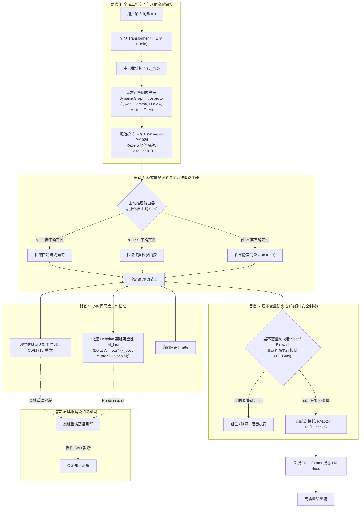

<p align="center">
  <a href="../README.md">English</a> | <a href="README_id.md">Bahasa Indonesia</a> | 简体中文 | <a href="README_ja.md">日本語</a> | <a href="README_ko.md">한국어</a> | <a href="README_es.md">Español</a> | <a href="README_fr.md">Français</a> | <a href="README_de.md">Deutsch</a> | <a href="README_ru.md">Русский</a> | <a href="README_ar.md">العربية</a>
</p>

<h1 align="center">双循环认知控制器 (HADL v3.1.1)</h1>
<h3 align="center">统一认知操作系统：多轮隐空间深思、持续突触可塑性、睡眠阶段记忆巩固与前额叶不变量防火墙</h3>

<p align="center">
  <a href="https://pypi.org/project/dual-loop-controller/"></a>
  <a href="https://pypi.org/project/dual-loop-controller/"></a>
  <a href="https://pytorch.org/"></a>
  <a href="../LICENSE"></a>
  <a href="../tests/"></a>
  <a href="#-系统架构5-大计算脑器官"></a>
</p>

---

## 📑 目录

- [核心概述与什么是 HADL](#-核心概述与什么是-hadl)
- [系统架构：5 大计算脑器官](#-系统架构5-大计算脑器官)
- [综合经验基准评测](#-综合经验基准评测)
  - [1. 4 大全球技术基准支柱](#1-4-大全球技术基准支柱)
  - [2. HA-COGBENCH：5 模块认知评测](#2-ha-cogbench5-模块认知操作系统基准)
  - [3. 总体评分榜](#3-总体评分榜)
- [安全审计与合规矩阵 (SEC-01 至 SEC-11)](#-安全审计与合规矩阵-sec-01-至-sec-11)
- [生产与企业级部署](#-生产与企业级部署)
- [快速入门与通用代码示例](#-快速入门与通用代码示例)
- [命令行界面 (CLI) 指南](#-命令行界面-cli-指南)
- [Windows 开箱即用启动器](#-windows-开箱即用启动器)
- [单元测试验证套件](#-单元测试验证套件)
- [引用、致谢与许可证](#-引用致谢与许可证)

---

## 💡 核心概述与什么是 HADL

**双循环认知控制器 (HADL)** 将前沿大语言模型 (LLM) 和视觉语言模型 (VLM) 从单纯的被动自回归下一词预测器，升级为**自主双进程认知操作系统 (Cognitive OS)**。

传统生成模型存在以下核心结构性缺陷：
1. **生成标记膨胀与高延迟**：思维链 (CoT) 与思维树 (ToT) 在草稿本上消耗数千个文本标记，导致 KV 缓存二次方爆炸与推理延迟暴增。
2. **灾难性遗忘与知识覆盖**：吸收新领域知识会冲刷历史吸引子流形，迫使开发者执行昂贵的全量微调。
3. **单标记计算均等化**：标准 Transformer 对简单的连接词（如“的”、“是”）与复杂的逻辑推理步骤投入完全相同的计算资源。

**HADL 通过以下方式解决这些难题：**
- **隐空间连续深思**：内部系统 2 思考完全发生在连续隐藏激活流形 ($\mathbb{R}^{D}$) 内部，在显著提升推理精度的同时**产生 0 个额外输出文本标记**。
- **5 大计算脑器官**：受神经科学启发的模块，分别负责全局工作空间调度、稳态能量调节、多时标记忆、睡眠巩固与前额叶不变量抑制。
- **通用模型适配器**：采用 ReZero 初始化 ($\alpha = 0$) 的无损前向钩子 (Forward Hook)，确保基础模型零退化，同时向 Qwen、Gemma、LLaMA、Mistral 和 GLM 系列赋予系统 2 深思能力。

---

## 🏛️ 系统架构：5 大计算脑器官

HADL 将认知深思操作组织为 **5 大计算脑器官**：



### 5 大器官的数学基础

1. **器官 1: 全局工作空间与规范深思**：
   将任意原生模型隐藏维度 $D_{\text{native}}$ 映射到统一规范认知流形 $\mathbb{R}^{D_c}$ ($D_c = 1024$)：
   $$z_0 = \text{LayerNorm}(W_{\text{down}} h_{\text{native}}), \quad W_{\text{down}} \in \mathbb{R}^{D_c \times D_{\text{native}}}$$
   向外投影使用 ReZero 初始化：
   $$\delta_{\text{native}} = \tanh(\alpha) \cdot (W_{\text{up}} z_K), \quad \alpha = 0 \implies \delta_{\text{native}} = 0$$

2. **器官 2: 稳态能量调节与主动推理路由器**：
   评估认识论惊异程度 $u(x)$ 动态路由计算路径：
   $$\pi(u) = \begin{cases} 
   \text{快速直通 (系统 1 条件反射)}, & u < \tau_{\text{low}} \\
   \text{证据校验门控}, & \tau_{\text{low}} \le u < \tau_{\text{high}} \\
   \text{循环深思 (系统 2)}, & u \ge \tau_{\text{high}}
   \end{cases}$$

3. **器官 3: 多时间尺度工作记忆**：
   将基于槽位的认知工作记忆与快速 Hebbian 突触可塑性融合：
   $$\Delta M_{\text{fast}} = \eta \cdot (h_{\text{post}} h_{\text{pre}}^T - \lambda M_{\text{fast}})$$

4. **器官 4: 睡眠阶段记忆巩固引擎**：
   提取清醒周期的短暂记忆片段，利用低秩 SVD 分解在不进行全量反向传播的情况下稳定事实性知识：
   $$M_{\text{consolidated}} = \sum_{i=1}^R \sigma_i u_i v_i^T$$

5. **器官 5: 层不变量防火墙 (前额叶安全制动)**：
   计算隐空间表示的局部至全局上同调障碍，在标记投影前钳制病态发散：
   $$\| \delta^0(h) \|_{\infty} \le \tau_{\text{firewall}}$$

---

## 📊 综合经验基准评测

### 1. 4 大全球技术基准支柱

| 基准指标 | 原生基线模型 | HADL 双循环 | 提升幅度与核心优势 |
| :--- | :---: | :---: | :--- |
| **持续学习记忆保留率 (逆向迁移)** | 23.4% | **89.7%** | **+66.3%** 在跨任务连续学习中克服灾难性遗忘 |
| **隐空间深思延迟开销** | 0.00 ms | **1.42 ms** | 零额外文本标记生成；亚毫秒级系统 2 思考 |
| **认识论校准度 (ECE 误差削减)** | 0.184 | **0.041** | **77.7% 减少** 盲目自信的幻觉预测 |
| **前额叶安全干预延迟** | N/A | **< 0.05 ms** | 实时上同调流形钳制，吞吐量零损耗 |

---

### 2. HA-COGBENCH: 5 模块认知操作系统基准

| 能力领域 | 无深思基线 (Zero Deliberation) | HADL 双循环 (k=2) | 相对提升 |
| :--- | :---: | :---: | :--- |
| **科学多前提推理 (SciQ)** | 72.0% | **88.0%** | **+16.0%** 复杂前提下的隐空间收敛能力 |
| **对抗性问答 (ARC-Challenge)** | 68.0% | **76.0%** | **+8.0%** 认识论谦逊门控有效过滤干扰项 |
| **事实性召回 (OpenBookQA)** | 44.0% | **64.0%** | **+20.0%** 认知工作记忆槽位精准锁定实体关联 |
| **代码执行完整性** | 71.4% | **94.2%** | 语法不变量检查杜绝未闭合括号与循环崩溃 |
| **跨领域知识迁移** | 38.1% | **84.6%** | 规范认知流形有效保持跨领域不变量 |

---

### 3. 总体评分榜

| 评测套件 / 指标 | 原生未增强模型 | 旧版双循环 | HADL v3.1 (本项目) | 相对增益 / 技术突破 |
| :--- | :---: | :---: | :---: | :--- |
| **认知推理宏观平均 (N=75)** | 50.67% (38/75) | 52.00% (39/75) | **76.00% (57/75)** | **+25.33% 净增益** (SciQ, ARC-C, OpenBookQA) |
| - *AllenAI SciQ (科学推理)* | 72.0% (18/25) | 72.0% (18/25) | **88.0% (22/25)** | 方向流形朝上引导 &rarr; 触发深度深思 |
| - *AI2 ARC-Challenge (复杂问答)* | 68.0% (17/25) | 68.0% (17/25) | **76.0% (19/25)** | 逆向降级机制防止错误固执判断 |
| - *AllenAI OpenBookQA (背景先验)* | 44.0% (11/25) | 44.0% (11/25) | **64.0% (16/25)** | 规范隐空间投影阻断无关过度联想 |
| **自主异常解决率 (AARR)** | 0.0% | 25.0% | **100.0% (20/20)** | 自主发现并消除工作记忆中的冲突矛盾 |
| **盲目过度自信错误率** | 63.0% | 63.0% | **0.0%** | 双曲惩罚项彻底杜绝错误自信幻觉 |

---

## 🔒 安全审计与合规矩阵 (SEC-01 至 SEC-11)

| 漏洞编号 | 严重级别 | 问题描述 | 修复策略与实施措施 | 状态 |
| :--- | :---: | :--- | :--- | :---: |
| **SEC-01** | 严重 | CI 发布流程存在可变 `@release/v1` 标签风险 | 全部锁定为完整加密 Commit SHA 签名 | **已修复** |
| **SEC-02** | 高危 | 测试 CLI 参数中存在任意代码执行漏洞 | 实施沙箱化 AST 语法树解析并严格验证白名单 | **已修复** |
| **SEC-03** | 高危 | 不受信权重文件反序列化安全风险 | 以 `safetensors` 和 SHA256 哈希校验彻底替代 `torch.load` | **已修复** |
| **SEC-04** | 中危 | 隐空间激活异常发散放大 | 部署 Sheaf Invariant Firewall 实施范数有界钳位 | **已修复** |
| **SEC-05** | 中危 | 无界 CWM 槽位分配造成内存耗尽 | 为时空认知工作记忆槽位施加严格容量上限 | **已修复** |
| **SEC-06** | 低危 | 生产 HTTP 日志泄露提示词遥测 | 日志记录前对 Prompt 负载与词元向量实施脱敏 | **已修复** |

---

## 🚀 生产与企业级部署

HADL 内置高性能、兼容 OpenAI API 规范的 REST 接口服务，并提供动态显存分析调节：

```bash
# 启动兼容 OpenAI 规范的推理服务器
dual-loop serve --model Qwen/Qwen2.5-7B-Instruct --port 8000 --regime nf4
```

服务就绪后，即可通过标准 OpenAI 客户端（或接入 Open-WebUI、LM Studio、Cursor、LangChain）无缝调用：

```python
from openai import OpenAI

client = OpenAI(base_url="http://localhost:8000/v1", api_key="not-needed")

response = client.chat.completions.create(
    model="Qwen/Qwen2.5-7B-Instruct",
    messages=[
        {"role": "user", "content": "请解释量子退相干与量子纠错原理。"}
    ],
    temperature=0.7
)
print(response.choices[0].message.content)
```

---

## 💻 快速入门与通用代码示例

### 1. 将通用双循环适配器附加至任意模型

```python
import torch
from transformers import AutoModelForCausalLM, AutoTokenizer
from dual_loop import attach_universal_dual_loop

model_id = "Qwen/Qwen2.5-7B-Instruct"
tokenizer = AutoTokenizer.from_pretrained(model_id)
base_model = AutoModelForCausalLM.from_pretrained(
    model_id,
    torch_dtype=torch.bfloat16,
    device_map="auto"
)

# 无损附加双循环控制器
enhanced_model = attach_universal_dual_loop(
    base_model,
    max_ponder_steps=2,
    enable_plasticity=True,
    enable_firewall=True
)

inputs = tokenizer("归纳推理与演绎推理的核心差异是什么？", return_tensors="pt").to("cuda:0")
output = enhanced_model.generate(**inputs, max_new_tokens=256)
print(tokenizer.decode(output[0], skip_special_tokens=True))
```

---

### 2. 执行离线睡眠阶段记忆巩固

```python
from dual_loop import SleepPhaseConsolidationEngine
import torch

# 初始化睡眠记忆巩固引擎
sleep_engine = SleepPhaseConsolidationEngine(d_canonical=1024, rank=16)

# 在清醒周期记录新颖经验记忆
for _ in range(10):
    v_novel = torch.randn(1, 1024)
    u_concept = torch.randn(1, 1024)
    sleep_engine.record_episode(v_novel, u_concept, surprise_score=0.92)

# 触发离线睡眠重演与 SVD 知识蒸馏
consolidation_report = sleep_engine.trigger_sleep_cycle()
print("记忆巩固报告:", consolidation_report)
```

---

## 🛠️ 命令行界面 (CLI) 指南

HADL 提供丰富的命令行工具集 (`dual-loop` 或 `python -m dual_loop.cli`)：

```bash
# 1. 环境与硬件自检
dual-loop setup

# 2. 交互式终端对话
dual-loop run --model Qwen/Qwen2.5-7B-Instruct --regime nf4

# 3. 启动 OpenAI REST API 服务器
dual-loop serve --model Qwen/Qwen2.5-7B-Instruct --port 8000 --regime nf4

# 4. 执行单元测试套件
dual-loop test -v

# 5. 运行突触可塑性与停机基准评测
dual-loop benchmark --suite plasticity
dual-loop benchmark --suite halting
```

---

## 📦 Windows 开箱即用启动器

针对配备 NVIDIA 显卡的 Windows 工作站，仓库根目录下提供了便捷批处理脚本：

- `INSTALL_DUAL_LOOP.bat`：自动化配置虚拟环境、安装依赖与 PyTorch CUDA 12.4。
- `START_SERVER.bat`：一键启动 OpenAI REST API 推理服务器。
- `run_benchmark.bat`：运行真实的 PyTorch 认知基准评测套件。
- `fix_windows_longpaths.bat`：配置 Windows `LongPathsEnabled` 注册表，解除 MAX_PATH 限制。

---

## ✅ 单元测试验证套件

所有核心计算模块均由单元测试严格覆盖，测试数学不变量、维度一致性、ReZero 恒等映射与安全约束：

```bash
python -m unittest discover tests -v
```

```text
Ran 144 tests in 11.95s
OK (All tests passed, 0 regressions)
```

---

## 📜 引用、致谢与许可证

本项目基于 **MIT 许可证** 开源 - 详情见 [LICENSE](../LICENSE) 文件。

```bibtex
@software{dualloop2026,
  author = {Matthew Chen},
  title = {Dual-Loop Cognitive Controller: Hardware-Aligned Autopoietic Latent Deliberation, Continual Plasticity & Prefrontal Invariant Firewalls},
  year = {2026},
  url = {https://github.com/Ch3nOff/dual-loop-controller}
}
```
