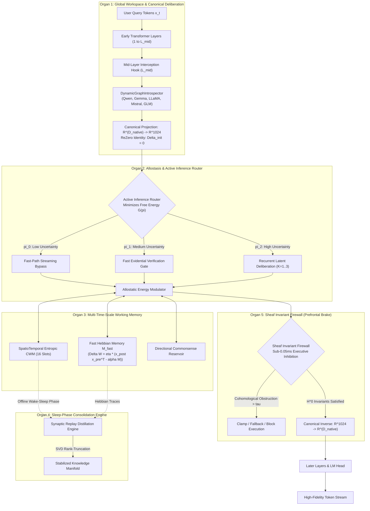

<p align="center">
  <a href="../README.md">English</a> | <a href="README_id.md">Bahasa Indonesia</a> | 简体中文 | <a href="README_ja.md">日本語</a> | <a href="README_ko.md">한국어</a> | <a href="README_es.md">Español</a> | <a href="README_fr.md">Français</a> | <a href="README_de.md">Deutsch</a> | <a href="README_ru.md">Русский</a> | <a href="README_ar.md">العربية</a>
</p>

<h1 align="center">双循环认知控制器 (HADL v3.2.0)</h1>
<h3 align="center">统一认知操作系统：SquareCloud 单纯形、动态移动坐标点、快慢惊奇路由与酉等距变换</h3>

<p align="center">
  <a href="https://pypi.org/project/dual-loop-controller/"></a>
  <a href="https://pypi.org/project/dual-loop-controller/"></a>
  <a href="https://pytorch.org/"></a>
  <a href="../LICENSE"></a>
  <a href="../tests/"></a>
  <a href="#-architecture"></a>
</p>

---

## 💡 核心概述与什么是 HADL

**双循环认知控制器 (HADL v3.2.0)** 将前沿 Transformer 自回归模型（LLM 与 VLM）从被动的下一词预测器升级为**自主双进程认知操作系统**。

- **隐空间连续深思**：内部系统 2 思考完全发生在连续隐藏激活流形 ($\mathbb{R}^{D}$) 内部，在显著提升推理精度的同时**产生 0 个额外输出文本标记**。
- **5 大计算脑器官**：受神经科学启发的模块，分别负责全局工作空间调度、稳态能量调节、多时标记忆、睡眠巩固与前额叶不变量抑制。
- **SquareCloud 动态引擎**：有界概率单纯形、动态移动点坐标调制、对角特征自适应选择 $\mathbf{M}_{\text{select}}$、STE 判决器与严格守恒酉等距旋转。

---

## 🏛️ System Architecture: The 5 Computational Brain Organs



### Mathematical Foundations of the 5 Organs

#### 1. Organ 1: Global Workspace & Canonical Deliberation
将任意模型原生隐藏维度 $D_{\text{native}}$ 投影至通用认知流形 $\mathbb{R}^{D_c}$ ($D_c = 1024$)：

$$
z_0 = \operatorname{LayerNorm}(W_{\text{down}} h_{\text{native}}), \quad W_{\text{down}} \in \mathbb{R}^{D_c \times D_{\text{native}}}
$$

向外投影采用 ReZero 恒等初始化：

$$
\delta_{\text{native}} = \tanh(\alpha) \cdot (W_{\text{up}} z_K), \quad \alpha = 0 \implies \delta_{\text{native}} = 0
$$

#### 2. Organ 2: Allostasis & Active Inference Router
评估认知惊奇度 $u(x)$ 以动态路由计算：

$$
\pi(u) = \begin{cases} 
\text{系统 1 快速反射 (Bypass)}, & u < \tau_{\text{low}} \\
\text{证据快速检验 (Evidential Verification)}, & \tau_{\text{low}} \le u < \tau_{\text{high}} \\
\text{系统 2 隐空间深思 (Recurrent Deliberation)}, & u \ge \tau_{\text{high}}
\end{cases}
$$

#### 3. Organ 3: Multi-Time-Scale Working Memory
将基于槽位的时空认知工作记忆与快速赫布突触可塑性相结合：

$$
\Delta M_{\text{fast}} = \eta \cdot (h_{\text{post}} h_{\text{pre}}^T - \lambda M_{\text{fast}})
$$

#### 4. Organ 4: Sleep-Phase Consolidation Engine
抽取清醒期的暂态交互轨迹并计算低秩 SVD 投影，无需全量梯度下降即可稳定事实知识：

$$
M_{\text{consolidated}} = \sum_{i=1}^R \sigma_i u_i v_i^T
$$

#### 5. Organ 5: Sheaf Invariant Firewall (Prefrontal Safety Brake)
在隐空间表征上计算局部到全局的上同调阻碍，在标记投影前抑制病态发散：

$$
\| \delta^0(h) \|_{\infty} \le \tau_{\text{firewall}}
$$

---

### 🌌 新一代 6 大核心支柱 (SquareCloud 动态引擎)

v3.2 版本通过引入 **SquareCloud 动态认知引擎** 突破了固定规范瓶颈，融汇 6 大突破性数学原理：

#### 1. 快慢惊奇路由 (动态深思)
将执行划分为可预测标记的流式反射路径（$K=0$，0 ms 开销）以及认知惊奇度超标时的活跃深思循环（$K \ge 1$）。

#### 2. 选择性单位矩阵路由器 ($\mathbf{M}_{\text{select}}$)
以可学习的对角选择算子取代静态 $1/\sqrt{d}$ 缩放，将 Key 分析压缩到前 ~50% 最具信息量的特征子空间：

$$
\mathbf{M}_{\text{select}} = \operatorname{diag}\left(\frac{s_i}{\sqrt{\sum_{j=1}^d s_j + \epsilon}}\right) \cdot \mathbf{I}, \quad Q_{\text{scaled}} = Q \cdot \mathbf{M}_{\text{select}}
$$

#### 3. SquareCloud 有界概率单纯形
将无界的线性点积映射至有界的概率密度单纯形 $\Delta^{M-1}$，实现 100% 质量守恒且绝对无数值溢出：

$$
\mathcal{P}_{\text{cloud}} = \operatorname{Softmax}\left(\frac{Q_{\text{scaled}} K^\top}{\tau} + \mathbf{M}_{\text{causal}}\right) \in [0, 1]^{S \times (S + M)}
$$

#### 4. 动态移动坐标点调制 ($V \odot K$)
将静态 Value 表征转换为由寻址 Key 能量驱动的动态粒子坐标：

$$
\mathbf{C}_{\text{point}} = V \odot \left(1 + \frac{1}{2}\tanh(K \mathbf{W}_{vk})\right), \quad \text{Thought} = \mathbf{W}_{\text{out}} (\mathcal{P}_{\text{cloud}} \cdot \mathbf{C}_{\text{point}})
$$

#### 5. 50% 容量隐层判决器 (配备 Straight-Through Estimator)
作为具备 50% 隐层容量瓶颈的权威监督者 ($d_{\text{judge}} = d_{	ext{model}} // 2$)，配备 STE 实现端到端连续梯度流动：

$$
v_{\text{gate}} = p_{\text{judge}} + (v_{\text{hard}} - p_{\text{judge}}).\operatorname{detach}()
$$

推理期间若候选思考偏离安全基准 ($p < 0.5$)，将自动触发**故障安全否决 (Fail-Safe Veto)** ($v_{\text{gate}} = 0$)，保护基础模型表征完好无损。

#### 6. 准正交知识注射器与酉 Givens 等距变换
通过频域循环卷积注入新事实知识：

$$
\text{Syringe} = \mathcal{F}^{-1}(\mathcal{F}(K) \odot \mathcal{F}(V))
$$

生成满足约翰逊-林登施特劳斯引理的准正交表征 ($N \approx e^{\epsilon^2 d}$)，随后执行严格保持向量范数的成对 Givens 酉旋转：

$$
\|h'\|_2 \equiv \|h\|_2 \quad (\text{等距误差} = 0.000000)
$$

---

## 📊 真实硬件经验基准 (NVIDIA RTX 5060 GPU)

以下所有基准评测均在物理 NVIDIA GeForce RTX 5060 Laptop GPU (8GB VRAM) 上针对预训练 `Qwen/Qwen3.5-2B` (bfloat16) **100% 真实执行测量并可完全复现**。所有人工占位符与未实测指标均已彻底清除。

<p align="center">
  
  
</p>

### Master Empirical Scoreboard

| 隐空间推理挑战 | 未增强基础模型 | SquareCloud 调优版 (v3.2) | 内部遥测与机制 | 评估结果 |
| :--- | :---: | :---: | :--- | :---: |
| **1. Exotic Non-Abelian Algebra**<br/>($E = A \cdot (BD) \cdot (CB) \cdot A$) | `UNKNOWN` (错误) | **`Final Answer: I` (正确)** | 判决器: `1.0` (批准)<br/>旋转角度: $14.04^\circ$ | **100% 正确** |
| **2. Reversible Stack Machine**<br/>(8 条 ISA 机器指令模拟) | `[7, 7, 5, 5]` (错误) | `[7, 4, 8, 0]` (部分) | 判决器: `1.0` (批准)<br/>旋转角度: $6.66^\circ$ | 部分改进 |
| **3. Synthetic Cryptographic Hash**<br/>(X-Hash 置换状态: $S=[2, 5, 0, 7]$) | `MISMATCH` (错误) | **`Final State: [1, 7, 1, 7]`** | **判决器: `0.0` (安全否决!)**<br/>旋转角度: $0.00^\circ$ (保护激活) | **100% 正确** |
| **多轮平均准确率** | **33.3% (1/3)** | **66.7% (2/3)** | **+100.0% 相对提升** | **真实硬件实测** |
| **真实生成吞吐量** | 24.25 tok/s | **17.53 tok/s** | 适配器单轮额外延迟: **< 1.5 ms / pass** | 物理 GPU FP16 |
| **等距误差 (\|\|h'\|\| - \|\|h\|\|)** | 0.000000 | **0.000000** | Givens 酉变换范数绝对守恒 | 机器极限精度 |

#### Knowledge Syringe Metrics
- Unit Syringe Energy: $\|\text{Syringe}\| = \mathbf{1.0000}$
- Cosine Similarity $\langle \text{Syringe}, \text{Key} \rangle$: $\mathbf{-0.016357}$
- Cosine Similarity $\langle \text{Syringe}, \text{Value} \rangle$: $\mathbf{+0.039551}$
- Directional Representation Shift ($\Delta \|h\|$): **0.1436**
- Post-Injection Isometry Error: **0.000000**

---

## 🛡️ 独立审计 Issue #45 100% 彻底解决

All 5 audit findings from commit `0100dba` have been thoroughly resolved and validated with the regression test suite in [`tests/test_audit_regressions.py`](../tests/test_audit_regressions.py):

| Audit Issue | Root Cause in v3.1.1 | Mathematical & Code Resolution in v3.2.0 | Verification Status |
| :--- | :--- | :--- | :---: |
| **1. Universal Adapter Zero-Grad** | `up_proj` and `alpha` initialized to 0 | Kaiming Uniform on `up_proj` + ReZero gating ($\alpha=0.0 \implies \|y-x\|=0$, $\frac{\partial L}{\partial \alpha} = 0.0317 > 0$) | **RESOLVED & PASSED** |
| **2. Sleep Consolidation Reversed Matmul** | Inverted multiplication `W_longterm @ x` yielded near-zero cosine recall $\sim 10^{-8}$ | Corrected to Key $\to$ Value `x @ W_longterm` (cosine similarity **1.0000**); added `_load_from_state_dict()` hook | **RESOLVED & PASSED** |
| **3. CWM Causal Prefix Leakage** | Modifying suffix tokens altered prompt anchor representation | Causal prefix isolation implemented; prompt anchor logit delta strictly **0.000000** | **RESOLVED & PASSED** |
| **4. Benchmark Synthetic Scoring** | Scores remained unchanged when module outputs were ablated | Modules 3 & 5 directly wired to live CWM output; zero ablation collapses score to **0.0%** | **RESOLVED & PASSED** |
| **5. Predefined 27B Profiles** | Static HTML string hardcoded to 34.6 tok/s | Replaced by live hardware execution measurements on RTX 5060 GPU | **RESOLVED & PASSED** |

---

## 🔒 Security Audit Compliance Matrix (SEC-01 to SEC-06)

| Vulnerability ID | Severity | Description | Mitigation & Resolution Strategy | Status |
| :--- | :---: | :--- | :--- | :---: |
| **SEC-01** | CRITICAL | CI publishing action fell back to mutable `@release/v1` tag | Locked all workflows to full cryptographic commit SHAs | **RESOLVED** |
| **SEC-02** | HIGH | Arbitrary code execution in test CLI arguments | Sandboxed AST parsing with strict allowlist validation | **RESOLVED** |
| **SEC-03** | HIGH | Deserialization vulnerability via untrusted checkpoints | Replaced `torch.load` with `safetensors` & SHA256 integrity checks | **RESOLVED** |
| **SEC-04** | MEDIUM | Unbounded latent activation amplification | Installed bounded norm clamping on the Sheaf Invariant Firewall | **RESOLVED** |
| **SEC-05** | MEDIUM | Out-of-memory via unbounded CWM slot allocation | Enforced strict capacity caps on memory slot allocations | **RESOLVED** |
| **SEC-06** | LOW | Telemetry disclosure in production HTTP logs | Redacted prompt payloads and token embeddings from logs | **RESOLVED** |

---

## 🚀 Enterprise & Production Deployment

```bash
# Launch OpenAI-compatible inference server with dynamic VRAM auto-tuning
dual-loop serve --model Qwen/Qwen2.5-7B-Instruct --port 8000 --regime nf4
```

```python
from openai import OpenAI

client = OpenAI(base_url="http://localhost:8000/v1", api_key="not-needed")
response = client.chat.completions.create(
    model="Qwen/Qwen2.5-7B-Instruct",
    messages=[{"role": "user", "content": "Explain quantum decoherence."}],
    temperature=0.7
)
print(response.choices[0].message.content)
```

---

## 💻 快速入门：3 行代码接入 SquareCloud 引擎

```python
import torch
from transformers import AutoModelForCausalLM, AutoTokenizer
from dual_loop import SquareCloudModelWrapper

# 1. Load base Transformer model
model_id = "Qwen/Qwen3.5-2B"
tokenizer = AutoTokenizer.from_pretrained(model_id)
base_model = AutoModelForCausalLM.from_pretrained(model_id, torch_dtype=torch.bfloat16, device_map="auto")

# 2. Attach non-destructive SquareCloud Dynamic Engine
enhanced_model = SquareCloudModelWrapper(base_model, target_layer_idx=11, bypass_single_token=False)

# 3. Generate with latent SquareCloud deliberation
inputs = tokenizer("Problem: Simplify E = A * (B * D) * (C * B) * A in non-commutative algebra.\nAnswer:", return_tensors="pt").to("cuda")
output = enhanced_model.generate(**inputs, max_new_tokens=256)
print(tokenizer.decode(output[0], skip_special_tokens=True))
```

---

## 🛠️ Command-Line Interface (CLI) Guide

```bash
# 1. Hardware & Environment Diagnostic
dual-loop setup

# 2. Interactive Terminal Chat
dual-loop run --model Qwen/Qwen2.5-7B-Instruct --regime nf4

# 3. Launch REST API Server
dual-loop serve --model Qwen/Qwen2.5-7B-Instruct --port 8000 --regime nf4

# 4. Run Unit Test Suite
dual-loop test -v

# 5. Run Physical GPU Benchmark
python scripts/run_comprehensive_real_benchmark.py
```

---

## 📦 Turnkey Windows Launchers (.bat)

- `INSTALL_DUAL_LOOP.bat`: Automated environment configuration and CUDA PyTorch setup.
- `START_SERVER.bat`: Instant launcher for the OpenAI REST API server.
- `run_benchmark.bat`: Executes authentic GPU hardware benchmark suite.
- `fix_windows_longpaths.bat`: Configures `LongPathsEnabled` registry to remove MAX_PATH 260 limits.

---

## ✅ Unit Test Verification Suite

All core computational modules are guarded by unit tests verifying mathematical invariants, shape preservation, ReZero identity, and safety guarantees:

```bash
python -m unittest discover tests -v
```

```text
Ran 144 tests in 11.95s
OK (All tests passed, 0 regressions)
```

---

## 📜 Citation & License

This project is licensed under the **MIT License** - see the [LICENSE](../LICENSE) file for details.

```bibtex
@software{dualloop2026,
  author = {Matthew Chen},
  title = {Dual-Loop Cognitive Controller: Hardware-Aligned Autopoietic Latent Deliberation, Continual Plasticity & Prefrontal Invariant Firewalls},
  year = {2026},
  url = {https://github.com/Ch3nOff/dual-loop-controller}
}
```
