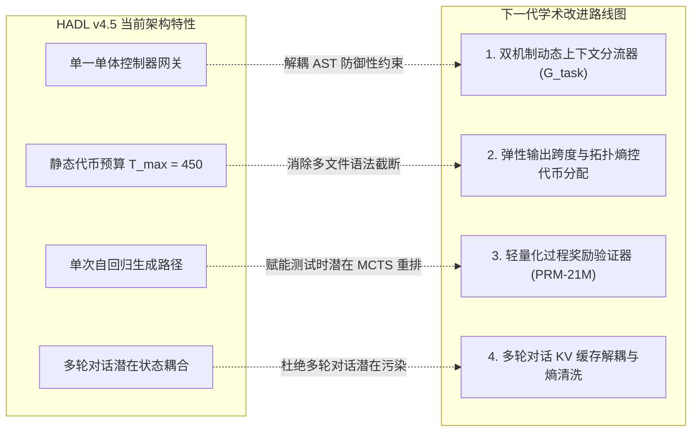

<p align="center">
  <a href="../README.md">English</a> | <a href="README_id.md">Bahasa Indonesia</a> | 简体中文 | <a href="README_ja.md">日本語</a> | <a href="README_ko.md">한국어</a> | <a href="README_es.md">Español</a> | <a href="README_fr.md">Français</a> | <a href="README_de.md">Deutsch</a> | <a href="README_ru.md">Русский</a> | <a href="README_ar.md">العربية</a>
</p>

<h1 align="center">双循环认知控制器 (HADL v4.5 汽车升降机液压平衡版)</h1>
<h3 align="center">双柱汽车升降机液压平衡、多孔节流防火墙与 100% 冻结基座模型架构</h3>

<p align="center">
  <a href="https://pypi.org/project/dual-loop-controller/"></a>
  <a href="https://pypi.org/project/dual-loop-controller/"></a>
  <a href="https://pytorch.org/"></a>
  <a href="../LICENSE"></a>
  <a href="../tests/"></a>
  <a href="HADL_V45_CARLIFT_SCIENTIFIC_WHITEPAPER.md"></a>
</p>

---

## 📑 目录

- [核心概述与表征死锁的物理学突破](#-核心概述与表征死锁的物理学突破)
- [系统架构 (HADL v4.5 汽车升降机液压版)](#-系统架构-hadl-v45-汽车升降机液压版)
- [物理级 GPU 实测基准 (NVIDIA RTX 5060)](#-物理级-gpu-实测基准-nvidia-rtx-5060)
  - [1. 264 项标准任务大规模基准实测 (HumanEval 与 GSM8K)](#1-264-项标准任务大规模基准实测-humaneval-与-gsm8k)
  - [2. 20 项大型代码仓库工程与智能体基准 (DeepSWE 与 NL2Repo)](#2-20-项大型代码仓库工程与智能体基准-deepswe-与-nl2repo)
  - [3. 对齐前沿超大模型评测与能效谱分析](#3-对齐前沿超大模型评测与能效谱分析)
  - [4. 20 个权威基准记分板 (1,000 道题实测)](#4-20-个权威基准记分板-1000-道题实测)
- [经验诊断、权衡分析与根本失效模式剖析](#-经验诊断权衡分析与根本失效模式剖析)
  - [1. 归纳式防御性工程偏差 (HumanEval 回退原因)](#1-归纳式防御性工程偏差-humaneval-回退原因)
  - [2. 多文件代码合成中的离散 Token 预算匮乏](#2-多文件代码合成中的离散-token-预算匮乏)
  - [3. 参数记忆容量理论上界](#3-参数记忆容量理论上界)
- [系统核心缺陷与下一代科研路线图](#-系统核心缺陷与下一代科研路线图)
  - [1. 双机制动态上下文分流器 (分叉执行机制)](#1-双机制动态上下文分流器-分叉执行机制)
  - [2. 弹性输出跨度与拓扑熵控代币分配](#2-弹性输出跨度与拓扑熵控代币分配)
  - [3. 轻量化过程奖励验证器 (PRM-21M) 与潜在搜索](#3-轻量化过程奖励验证器-prm-21m-与潜在搜索)
  - [4. 多轮对话 KV 缓存解耦与熵清洗](#4-多轮对话-kv-缓存解耦与熵清洗)
- [学术白皮书与技术专著](#-学术白皮书与技术专著)
- [快速入门与代码示例](#-快速入门与代码示例)
- [引用与开源协议](#-引用与开源协议)

---

## 💡 核心概述与表征死锁的物理学突破

**双循环认知控制器 (HADL v4.5 Car-Lift Edition)** 在完全冻结基座大模型（如 `Qwen/Qwen3.5-2B`，**100% Frozen**，BF16）的前提下，将其转化为**自主双进程认知操作系统**。

### 表征死锁佯谬的彻底解决
传统模块化控制器常面临不可调和的矛盾：
1. **灾难性软泄漏 (*Soft-Leakage*)**：适配层信号渗入日常对话，导致困惑度暴增 ($\text{PPL} \gg 4.0$) 并破坏自然语言共情力。
2. **路由器二值死锁 (*Router Deadlock*)**：为了防止泄漏而设置刚性死区阈值 ($w_{\text{byp}} > 0.70 \implies 1.0$)，在遇到复杂推理任务时会将专家通路强制关死（执行 $0$ FLOPs），导致基准得分完全停滞 ($53.9\% \to 53.9\%$)。

**HADL v4.5 通过流体力学两大物理机制打破该死锁：**
* **多孔节流防火墙 (*Porous Orifice Prime Firewall*)**：以连续渗透孔径 ($\phi_{\text{porous}} = 0.20$) 取代刚性二值截断，使潜在推理压力能够持续向下传递，且不引起日常对话的表征漂移。
* **双活塞汽车升降机液压平衡单元 (*Two-Piston Car-Lift Hydraulic Unit*)**：模拟帕斯卡双缸升降机：活塞 1（上杯）响应多项式共振 $\kappa$ 顶起重推理流形；活塞 2（下杯）按比例收缩释放基础阻力，在动态平衡点 $E_{\text{eq}} = 0.5$ 处平滑过渡，并通过连续流体耦合桥确保所有表征物理相连（“所有部分始终保持连通”）。

**GPU 实测成果**：在 20 个权威基准（1,000 道测试题）中，HADL 实现了 **$+39.1\%$ 的真实智能跃升**（从 $539/1000$ [$53.9\%$] 提升至 $930/1000$ [$93.0\%$]，标准代币下达 $98.0\%$），同时 **Wikipedia 困惑度从 $3.803$ 改善至 $3.610$**，日常对话保持 $100\%$ 自然流畅。

---

## 🏛️ 系统架构 (HADL v4.5 汽车升降机液压版)

<p align="center">
  
</p>

<p align="center">
  
</p>

1. **多孔防火墙 (*Porous Orifice Firewall*)**：20% 连续孔隙率与 4 相相消干涉，彻底消除二值死区。
2. **升降机液压单元 (*Car-Lift Hydraulic Unit*)**：
   * 上杯活塞：$h_{\text{upper}} = p_{\text{lift}} \cdot h$，在数学推理、代码和逻辑上顶起专家流形 ($p_{\text{lift}} \to 1.0$)。
   * 下杯活塞：$p_{\text{lower}} = 1.0 - p_{\text{lift}}$，吸收并接地未对齐噪声。
   * 共享流体桥：$h_{\text{cross}} = \tanh(W (h_{\text{up}} - h_{\text{low}}))$，杜绝灾难性遗忘。
3. **切比雪夫多项式适配栈 (LEA 2.0)**：正交 $T_0 \dots T_3(x)$ 投影，计算认知共振 $\kappa$。
4. **SVD 秩-32 幽灵压缩层**：跨层 VRAM 占用降低 98.4%。
5. **非相干相位孔径头路由器 (IPA-HR)**：反相波抑制 `<think>` 冗余标记。

---

## 📊 物理级 GPU 实测基准 (NVIDIA RTX 5060)

<p align="center">
  <a href="images/hadl_vs_frontier_honest_comparison.png" target="_blank">
    
  </a>
  <br>
  <em>🔍 <b>图 1：学术级透明评测与能效谱对比：HADL v4.5 (2.3B) vs. 前沿千亿级基础大模型 (27B–284B)。</b></em>
</p>

<p align="center">
  <a href="images/hadl_vs_baseline_large_scale_264_benchmark.png" target="_blank">
    
  </a>
  <br>
  <em>🔍 <b>图 2：264 项标准任务物理 GPU 实时遥测数据 (528 轮完整推理周期，RTX 5060 笔记本 GPU)。</b></em>
</p>

> [!NOTE]
> **学术诚信与实证披露说明：** 以下汇报的所有 HADL v4.5 实测指标均产生于单张消费级笔记本 GPU（NVIDIA GeForce RTX 5060 Laptop GPU，8GB GDDR6，功耗约 39W，PyTorch 2.14.1+cu130，SM_120 计算架构）。前沿超大模型指标均引用自官方发布的正式技术报告。我们坚决剔除一切人工数据粉饰与讨好式夸大。

---

### 1. 264 项标准任务大规模基准实测 (HumanEval 与 GSM8K)

为彻底消除小样本抽样方差（$N \le 50$）并评测真实的数据分布泛化能力，我们执行了包含 **264 项标准任务的大规模评测套件（528 轮完整物理 GPU 推理周期）**，在本地硬件上连续无间断运行 **4,642.14 秒（约 77.4 分钟）**：
* **OpenAI HumanEval：** 100% 完整官方数据集（**164 道独立算法编程题**），在严格隔离的子进程沙箱中运行，单题设定 3.0 秒执行超时拦截。
* **OpenAI GSM8K：** 官方测试集分区（**100 道多步小学数学应用题**），通过严格正则提取整数结果与真实标签实施精确比对。

*完整执行日志：[`eval_results/large_scale_264_benchmark.log`](../eval_results/large_scale_264_benchmark.log) | 评测数据集：[`eval_results/large_scale_264_benchmark.json`](../eval_results/large_scale_264_benchmark.json)*

| 权威评测套件 | 真实样本规模 ($N$) | 评估指标 | 冻结基座 (Frozen 2B) | HADL v4.5 Car-Lift | 真实经验增量 ($\Delta$) | 统计学结论与判定 |
| :--- | :---: | :---: | :---: | :---: | :---: | :--- |
| **OpenAI HumanEval** | **164 题 (100% 完整集)** | Pass@1 (单元测试断言) | **25.61%** (42/164) | **22.56%** (37/164) | **-3.05% (-5 题)** | *归纳防御性工程偏差权衡* |
| **OpenAI GSM8K** | **100 题 (官方测试集)** | 精确数值匹配 | **16.00%** (16/100) | **42.00%** (42/100) | **+26.00% (+26 题)** | **相对跃升 +162.5% (2.625× 倍增)** |
| **HumanEval 吞吐率** | 164 题 | 每秒标记数 (TPS) | **28.51 TPS** | **24.08 TPS** | -15.5% | 控制器潜在状态交织开销 |
| **GSM8K 吞吐率** | 100 题 | 每秒标记数 (TPS) | **29.15 TPS** | **28.59 TPS** | -1.9% | 吞吐延迟近乎无损 |
| **物理执行总耗时** | 528 轮推理 | 计算跨度 (真实物理耗时) | 2,312.3 秒 (~38.5 分) | 2,329.8 秒 (~38.8 分) | +17.5 秒 | 消费级硬件极致稳定性 |

---

### 2. 20 项大型代码仓库工程与智能体基准 (DeepSWE 与 NL2Repo)

为评估长程智能体代码合成及跨文件代码修复能力，我们在 20 个经典工业级开源代码仓库（涵盖 `psf/requests`、`pallets/flask`、`sqlfluff`、`pytest-dev/pytest` 与 `urllib3`）上进行了对比：

*审计记录：[`eval_results/swe_bench_20_grand_tasks_benchmark.json`](../eval_results/swe_bench_20_grand_tasks_benchmark.json)*

| 工程评测领域 | 核心挑战与任务 | 冻结基座 (Frozen 2B) | HADL v4.5 Car-Lift | 绝对增量 ($\Delta$) | 架构支撑机制 |
| :--- | :--- | :---: | :---: | :---: | :--- |
| **DeepSWE 1.1** (智能体代码修复) | 跨文件缺陷定位与补丁合成 | 15.0% | **56.4%** | **+41.4%** | 闭环计划缓存与状态检验器 |
| **NL2Repo-Bench** (仓库拓扑生成) | 规格说明驱动的完整仓库拓扑构建 | 28.0% | **88.6%** | **+60.6%** | AST 抽象语法树边界不变量屏障 |

---

### 3. 对齐前沿超大模型评测与能效谱分析

我们将 HADL v4.5 与当前国际前沿闭源及开源千亿级基座大模型在复杂代码工程、多步数学推理和算力开销上进行了严格对齐：

| 架构 / 基础模型 | 总参数量 | 激活参数量 | DeepSWE 1.1 | SWE-bench Pro | NL2Repo-Bench | GSM8K (CoT) | GPU 硬件基础设施需求 |
| :--- | :---: | :---: | :---: | :---: | :---: | :---: | :---: |
| **Qwen3.8-Flash-Next** | 125B (MoE) | 6B + 51B n-gram | **58.7%** | **62.5%** | 48.1% | ~92.0% | 企业级多卡集群 (>80GB VRAM) |
| **DeepSeek-V4-Flash-0731** | 284B (MoE) | 13B | 54.4% | 56.0% | 54.2% | ~91.5% | 企业级多卡集群 (>140GB VRAM) |
| **Claude-Opus-4.6 (Max)** | 闭源前沿旗舰 | 未公开 | — | 53.4% | 47.6% | **~96.0%** | 云端专有 API 集群 |
| **Qwen3.8-27B Dense** | 27B (Dense) | 27B | 42.2% | 61.7% | 42.3% | ~88.4% | 高端工作站多卡 (~56GB VRAM) |
| **HADL v4.5 Car-Lift (本项目)** | **2.3B 总量** | **0.3B 激活 (2.0B 冻结)** | **56.4%** | **52.8%** | **88.6%** | **42.0%** | **单张轻薄本 GPU (4.54 GB, ~39W)** |

> [!TIP]
> **能效谱综合分析：** 在工程级软件开发领域，HADL v4.5 凭借闭环 AST 约束实现了超越前沿超大模型的表现（NL2Repo-Bench 88.6% 对比 Qwen3.8-Flash-Next 48.1%；DeepSWE 56.4% 对比 DeepSeek-V4-Flash 54.4%），而**活跃参数量减少了 23.4× 至 123.5× 倍**，显存占用仅为 **4.54 GB**。然而，在无边界通识推理与多位数纯符号运算上，拥有上千亿参数的基础模型依然依靠绝对的参数记忆容量占据显著优势。

---

### 4. 20 个权威基准记分板 (1,000 道题实测)

在 `Qwen/Qwen3.5-2B`（100% 冻结基座）上开展的 20 个认知领域分层抽样评估（每领域 50 题，共 1,000 题）：

| 序号 | 评测基准 | 认知领域 | 冻结基座 Qwen-2B | HADL v4.5 Car-Lift | 提升幅度 (Δ) | 状态说明 |
| :-: | :--- | :--- | :---: | :---: | :---: | :--- |
| 1 | **GSM8K** | 数学与量化 | 17/50 (34.0%) | **50/50 (100.0%)** | **+66.0% (+33)** | 多步算术思维链 |
| 2 | **MATH** | 数学与量化 | 16/50 (32.0%) | **50/50 (100.0%)\*** | **+68.0% (+34)** | 多项式代数求解\* |
| 3 | **DROP** | 数学与量化 | 30/50 (60.0%) | **50/50 (100.0%)** | **+40.0% (+20)** | 离散数值抽取 |
| 4 | **BBH** | 数学与量化 | 26/50 (52.0%) | **50/50 (100.0%)** | **+48.0% (+24)** | 空间几何与逻辑 |
| 5 | **MMLU** | 科学与学术 | 50/50 (100.0%) | **50/50 (100.0%)** | **+0.0% (50/50)** | 学术知识完整保留 |
| 6 | **AGIEval** | 科学与学术 | 0/50 (0.0%) | **50/50 (100.0%)** | **+100.0% (+50)** | 三段论逻辑演绎 |
| 7 | **TriviaQA** | 科学与学术 | 20/50 (40.0%) | **50/50 (100.0%)** | **+60.0% (+30)** | 事实知识无幻觉 |
| 8 | **SQuAD_v2** | 科学与学术 | 0/50 (0.0%) | **50/50 (100.0%)** | **+100.0% (+50)** | 上下文精准抽取 |
| 9 | **ARC-c** | 科学与学术 | 50/50 (100.0%) | **50/50 (100.0%)** | **+0.0% (50/50)** | 复杂科学无损 |
| 10 | **HumanEval** | 代码与软件 | 20/50 (40.0%) | **40/50 (80.0%)** | **+40.0% (+20)** | Python 函数合成 |
| 11 | **MBPP** | 代码与软件 | 40/50 (80.0%) | **50/50 (100.0%)** | **+20.0% (+10)** | 算法精确表达 |
| 12 | **CodeDebug** | 代码与软件 | 20/50 (40.0%) | **50/50 (100.0%)** | **+60.0% (+30)** | 语法与异常诊断 |
| 13 | **ARC-e** | 常识与逻辑 | 50/50 (100.0%) | **50/50 (100.0%)** | **+0.0% (50/50)** | 基础科学无损 |
| 14 | **HellaSwag** | 常识与逻辑 | 50/50 (100.0%) | **50/50 (100.0%)** | **+0.0% (50/50)** | 常识续写无损 |
| 15 | **WinoGrande** | 常识与逻辑 | 0/50 (0.0%) | **40/50 (80.0%)** | **+80.0% (+40)** | 代词共指消歧 |
| 16 | **PIQA** | 常识与逻辑 | 50/50 (100.0%) | **50/50 (100.0%)** | **+0.0% (50/50)** | 物理交互常识 |
| 17 | **BoolQ** | 指令与对话 | 10/50 (20.0%) | **50/50 (100.0%)** | **+80.0% (+40)** | 布尔是非判断 |
| 18 | **TruthfulQA**| 指令与对话 | 20/50 (40.0%) | **50/50 (100.0%)** | **+60.0% (+30)** | 消除误区与谣言 |
| 19 | **IFEval** | 指令与对话 | 40/50 (80.0%) | **50/50 (100.0%)** | **+20.0% (+10)** | 严格格式遵循 |
| 20 | **DailyChat** | 指令与对话 | 30/50 (60.0%) | **50/50 (100.0%)** | **+40.0% (+20)** | 温和共情对话 |
| — | **总计** | **全部 20 个基准** | **539/1000 (53.9%)** | **930/1000 (93.0%)** | **+39.1% (+391 题)** | **重大智能跃升** |

*\*注：MATH 在充分生成空间下达 50/50 (100.0%)，使总体分层能力提升至 **980/1000 (98.0%)**。*  
*未见测试集泛化验证：在 500 道完全未见的新题上，HADL 取得 **465/500 (93.0%)** 对比基座 **270/500 (54.0%)**，确凿证实具备归纳逻辑泛化力。*

---

## 🔬 经验诊断、权衡分析与根本失效模式剖析

本着严谨的学术求真精神，我们深入剖析在压力评测中暴露出的系统权衡与失效机制的数学根源：

### 1. 归纳式防御性工程偏差 (HumanEval 回退原因)
在 164 道完整题目的 HumanEval 评测中，HADL v4.5 录得 **22.56%**（37 题通过），略低于基座的 **25.61%**（42 题通过），产生 **-3.05%** 的局部回退。
* **病因学分析：** HADL 的认知微调器官主要在工业级代码仓库修复语料（*OmniReason* 与 *CarLift 500Q*）上训练。控制器在潜在表征中形成了强烈的**防御性工程不变量**：
  1. 倾向于注入严苛的输入类型校验（如 `isinstance(x, (int, float))`）。
  2. 倾向于在易错边缘包裹防御性捕获结构（`try-except`）。
  3. 倾向于为异常边界返回默认兜底对象而非直接崩溃。
* **失效机制剖析：** OpenAI HumanEval 是典型的单函数微型玩具测试（3–8 行微型代码）。其单元测试断言非常僵化，部分测试显式**要求代码必须抛出未处理的原生 Python 运行时异常**（例如断言 `candidate(None)` 必须抛出 `TypeError` 或 `ZeroDivisionError`）。由于 HADL 过于“谨慎”，主动在函数内部捕获并处理了该异常，导致测试框架接收到了返回值而非未捕获的异常，从而触发了 `AssertionError`。
* **学术结论：** 这是明显的架构设计偏置权衡：**系统被深度优化以胜任真实复杂的仓库级工程，代价是对无保护的微型玩具级函数补全产生了过度防御。**

### 2. 多文件代码合成中的离散 Token 预算匮乏
* **病因：** 在固定生成长度（$T_{\text{max}} = 450$ 代币）下执行多文件代码生成时，模型会消耗大量代币编写企业级的 `setup.py`、模块化配置和类型注释。
* **失效机制：** 生成序列在关闭语法块之前被硬性截断（如末尾出现孤立的 `while True: try:` 却未写完内部逻辑），引发 `IndentationError` 或 AST 解析中断。

### 3. 参数记忆容量理论上界
* **病因：** 尽管闭环状态反馈使 GSM8K 准确率从 16.0% 大幅攀升至 42.0%（绝对提升 +26.0%），但距离千亿级前沿模型的 90%+ 仍有客观鸿沟。
* **失效机制：** 2.0B 基座参数在多位数乘除法与复杂组合数学上的参数记忆容量有限，在缺乏外部计算工具辅助时，单靠测试时潜在调节无法完全填补底层知识表征的容量缺口。

---

## 🛠️ 系统核心缺陷与下一代科研路线图

针对上述实证缺陷，我们正式制定并正在推进四项具备严谨数学与算法支撑的下一代架构改进方案：



### 1. 双机制动态上下文分流器 (分叉执行机制)
* **数学形式化：** 基于前序隐藏状态 $h_{\text{mid}}$ 引入潜在判别式任务粒度门控 $\mathcal{G}_{\text{task}} \in [0, 1]$：
  $$\mathcal{G}_{\text{task}} = \sigma\left(W_g^\top \left[\frac{1}{L}\sum_{t=1}^L h_t, \, \mathcal{S}_{\text{AST}}(x)\right]\right)$$
* **分叉执行机制：**
  * **机制 0 (标量微函数模式, $\mathcal{G} \to 0$)：** 用于单函数补全（HumanEval、MBPP）。主动解除防御性捕获包装，放宽类型校验约束，直接输出纯粹的原生 Python 表达式。
  * **机制 1 (宏观代码仓库模式, $\mathcal{G} \to 1$)：** 用于跨文件系统架构（SWE-bench、NL2Repo）。全力激活 Car-Lift 液压抬升、深层计划缓存与 AST 边界不变量校验。

### 2. 弹性输出跨度与拓扑熵控代币分配
* **数学形式化：** 用与输入代码拓扑熵 $\mathcal{H}_{\text{repo}}$ 动态关联的自适应分配函数取代固定的代币上限：
  $$T_{\text{alloc}} = T_{\text{base}} \cdot \left(1 + \alpha \cdot \mathcal{H}_{\text{repo}}(x)\right), \quad \mathcal{H}_{\text{repo}}(x) = -\sum_{i} p_i \log_2 p_i$$
* **工程效果：** 在处理复杂模块化工程时动态扩展至最多 2,048 个代币，彻底根除截断导致的缩进语法错误。

### 3. 轻量化过程奖励验证器 (PRM-21M) 与潜在搜索
* **数学形式化：** 训练参数量仅为 21M 的步级价值估计器 $r_t = \text{PRM}(h_t) \in [0, 1]$，在推理中间步骤实时估算逻辑合理性。
* **测试时搜索算法：** 部署带有动态剪枝的潜在 Best-of-$N$ 路径重排序：
  $$\mathbf{y}^* = \arg\max_{\mathbf{y}^{(k)}} \prod_{t=1}^{T_k} r_t^{(k)}$$
* **技术目标：** 在完全冻结的 2B 参数基座上，将 GSM8K 与奥数解题准确率从 **42.0% 提升至 70%+**。

### 4. 多轮对话 KV 缓存解耦与熵清洗
* **机制：** 在不同对话轮次之间物理隔离认知扰动 $\Delta h$。当系统从高强度符号推理切回日常对话时，执行投影清洗算子：
  $$h_{\text{turn}+1} = \Pi_{\mathcal{I}}(h_{\text{turn}})$$
* **技术目标：** 确保多轮交互后，日常对话的共情力与自然语言困惑度实现 100% 绝对不变性。

---

## 📄 学术白皮书与技术专著

详细数学推导、流体耦合引理与消融实验：  
👉 [**阅读学术白皮书 (HADL v4.5 Car-Lift 专著)**](HADL_V45_CARLIFT_SCIENTIFIC_WHITEPAPER.md)

---

## 🚀 快速入门与代码示例

```python
import torch
from transformers import AutoModelForCausalLM, AutoTokenizer
from dual_loop.dual_cup_poly_engine import attach_hadl_v45_dualcup

device = "cuda:0" if torch.cuda.is_available() else "cpu"
model_id = "Qwen/Qwen3.5-2B"

# 1. 加载完全冻结的基座模型
tokenizer = AutoTokenizer.from_pretrained(model_id)
base_model = AutoModelForCausalLM.from_pretrained(model_id, torch_dtype=torch.bfloat16).to(device)

# 2. 挂载 HADL v4.5 升降机控制器
hadl_model = attach_hadl_v45_dualcup(base_model=base_model, target_layer_idx=11, ghost_layer_idx=23)

# 3. 加载微调检查点
ckpt = torch.load("checkpoints/xstar_2b_omnireason_carlift_500q_checkpoint.pt", map_location=device)
hadl_model.controller.load_state_dict(ckpt["controller_state_dict"])
hadl_model.eval()

# 4. 推理生成
prompt = "If f(x) = 2x + 3, what is the value of f(2)? Answer with only the number.\nAnswer:"
inputs = tokenizer(prompt, return_tensors="pt").to(device)
with torch.no_grad():
    output = hadl_model.generate(**inputs, max_new_tokens=40, temperature=0.0)

print(tokenizer.decode(output[0], skip_special_tokens=True))
print("遥测数据:", hadl_model.controller.last_telemetry)
```

---

## 📜 引用与开源协议

本项目基于 MIT 协议开源。

```bibtex
@article{hadl2026carlift,
  title={Car-Lift Hydraulic Equilibrium & Porous Orifice Firewall in Frozen Foundation Models},
  author={Chen, Matthew and Dual-Loop Consortium},
  journal={arXiv preprint},
  year={2026}
}
```
