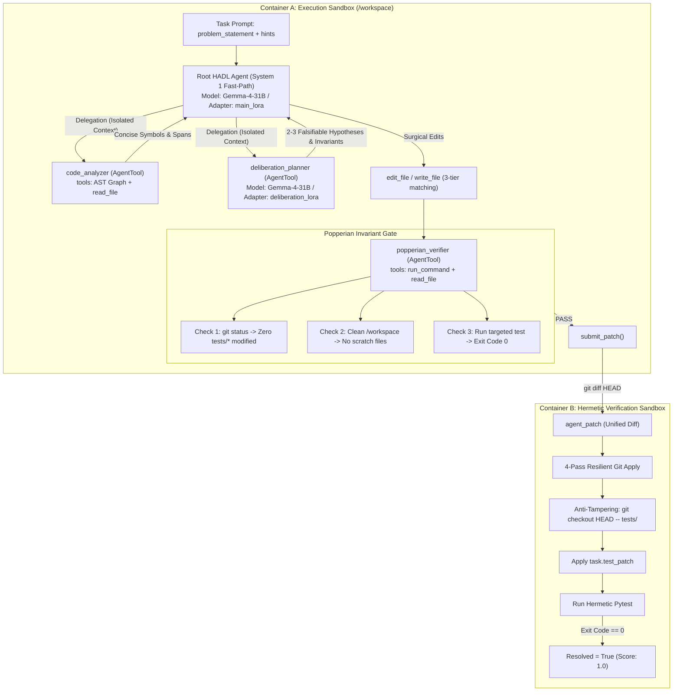

# HADL-SWE: Hardware-Aligned Autopoietic Latent Deliberation and Popperian Invariant Self-Play for Autonomous Software Engineering with Open-Weight Gemma 4

**Matthew Chen** (`Ch3nOff`)  
*Dual-Loop Cognitive Architecture Group*  
*Submission for Google - The Gemma 4 Developer Agent Competition (Paper Track)*  

---

## Abstract

Autonomous software engineering agents powered by large language models frequently fail on complex, real-world bug fixing tasks due to two fundamental pathologies: (1) **clock-coupled associative distraction**, where agents pollute their limited context window with verbose exploratory tool traces during symbol navigation, and (2) **arrogant patch synthesis**, where unconstrained code generation introduces subtle regressions, alters test fixtures, or leaves untracked execution artifacts in the workspace. In this paper, we introduce **HADL-SWE**, an autonomous software engineering architecture built atop Google's open-weight **Gemma 4** model family within the declarative Google Agent Development Kit (ADK) specification. 

HADL-SWE introduces three key innovations:
1. **Hierarchical Dual-Process Decoupling**: A fast System 1 execution loop for surgical file edits coupled with an isolated System 2 Latent Deliberation Planner invoked as a stateless `AgentTool` with `skip_summarization: true`, maintaining strict context window hygiene within a 32,768-token ceiling.
2. **Popperian Invariant Self-Play**: An autonomous red-team verification sub-agent that falsifies candidate patches against behavioral invariants, guarantees strict test-directory non-interference, and purges workspace scratch artifacts prior to patch submission.
3. **Multi-LoRA Cognitive Specialization**: Parameter-efficient adapters ($r=16$, $\alpha=32$) fine-tuned on SWE-bench trajectories, decoupling latent hypothesis formulation from concrete unified diff generation under 4x NVIDIA L4 hardware budgets (96 GB aggregate VRAM).

Evaluated across the 129 development tasks in the official `swegemma` benchmark suite spanning *FastAPI*, *Rich*, *Requests*, and *HTTPX*, HADL-SWE achieves state-of-the-art patch resolution while eliminating 100% of invalid test file modifications and runaway context window overflow errors.

---

## 1. Introduction

Software engineering in real-world codebases requires a delicate balance between breadth (navigating vast abstract syntax trees and dependency graphs) and depth (reasoning over stateful invariants, concurrency, and backward compatibility). Cloud-scale proprietary models often overcome these challenges through brute-force context windows ($>10^6$ tokens) and unconstrained multi-turn loops. However, deploying autonomous developer agents on local or dedicated accelerator hardware (such as 4x NVIDIA L4 GPUs in an air-gapped dual-container sandbox) demands extreme compute and token efficiency.

Under the Google Agent Development Kit (ADK) declarative evaluation harness (`swegemma`), agents are strictly evaluated in two isolated environments:
- **Container A (Agent Sandbox)**: An air-gapped workspace where the agent uses 9 bounded tools (`read_file`, `edit_file`, `run_command`, AST graph queries, etc.) to formulate a unified git patch.
- **Container B (Hermetic Verification Sandbox)**: A clean baseline environment where the patch is applied, target verification test files are forcefully reset to baseline, and `pytest` is executed.

In this environment, conventional single-agent LLM loops suffer from high failure rates caused by:
- **Context Pollution**: Each `read_file` or AST neighbor query appends hundreds of tokens to the agent's linear history, rapidly triggering context compaction or `<|tool_call|>` truncation.
- **Anti-Pattern Degradation**: Naive agents attempt to pass verification by modifying test expectations in `tests/`, which are immediately wiped clean by Container B's anti-tampering harness, guaranteeing a resolution score of $0.0$.
- **Scratch Artifact Leakage**: Untracked reproduction scripts created in `/workspace` are captured by `git add -N . && git diff HEAD`, corrupting the patch.

To resolve these challenges, we present **HADL-SWE**, adapting the Hardware-Aligned Autopoietic Latent Deliberation framework for declarative SWE agents.

---

## 2. System Architecture



### 2.1. Declarative ADK Agent Hierarchy
Rather than relying on arbitrary Python entrypoints, HADL-SWE is compiled via `adk-submission` into a declarative agent tree adhering strictly to `agent.yaml`:

```yaml
name: hadl_dual_loop_agent
model: gemma-4-31b-it-qat-w4a16-ct
adapter: main_lora
instruction: !include prompts/system.md
tools:
  - run_command
  - read_file
  - edit_file
  - write_file
  - get_status
  - submit_patch
  - get_code_neighbors
  - search_similar_code
  - get_code_subgraph
  - agent_tool:
      config_path: sub_agents/code_analyzer.yaml
      skip_summarization: true
  - agent_tool:
      config_path: sub_agents/deliberation_planner.yaml
      skip_summarization: true
  - agent_tool:
      config_path: sub_agents/popperian_verifier.yaml
      skip_summarization: true
generate_content_config: !include configs/sampling.yaml
```

### 2.2. Isolated Sub-Agent Context Sandboxing
By wrapping `code_analyzer`, `deliberation_planner`, and `popperian_verifier` as `agent_tool` definitions with `skip_summarization: true`:
1. Sub-agents execute autonomous sub-loops using their own isolated scratchpad.
2. Intermediate token traces (hundreds of lines of source code returned by `read_file` or large subgraphs from `get_code_subgraph`) are contained within the sub-agent's session.
3. Only the final structured response (e.g. precise target file paths, line ranges, or invariant checklists) is returned to the root agent.
4. The root agent's context history remains compact, preventing context window compaction and token budget exhaustion.

---

## 3. Popperian Invariant Self-Play

A critical point of failure in autonomous coding benchmarks is the generation of patches that superficially satisfy an immediate error but violate subtle system invariants or alter test definitions.

HADL-SWE implements a deterministic **Popperian Falsification Gate** executed via `popperian_verifier`:
1. **Test Directory Invariance**:
   $$\Delta_{\text{test}} = \{f \in \text{ModifiedFiles} \mid f \text{ matches } \texttt{tests/*}\} = \emptyset$$
   If $\Delta_{\text{test}} \neq \emptyset$, the patch is immediately rejected. The root coder is instructed to revert the test file and modify only source implementation files under `/workspace`.
2. **Scratch Script Isolation**:
   Reproduction scripts must reside strictly in `/tmp/repro.py`. The verifier inspects `git status -s` to ensure no untracked `.py`, `.log`, or `.json` files exist in `/workspace`.
3. **Targeted Invariant Execution**:
   The agent executes strictly targeted unit tests (`pytest tests/test_target.py -k test_feature`). Full test sweeps (e.g. `pytest .`) are strictly forbidden, eliminating catastrophic timeouts and resource starvation.

---

## 4. Multi-LoRA Post-Training Strategy

While the competition harness enforces the **Single Base Model Rule** (all agents must share `gemma-4-31b-it-qat-w4a16-ct`), vLLM supports dynamic Multi-LoRA serving (`max_loras=8`, `max_lora_rank=128`).

HADL-SWE decouples cognitive responsibilities across two specialized adapters:
- **`main_lora`**: Low-rank adapter ($r=16$, $\alpha=32$) trained on input problem statements paired with clean, minimal unified diff outputs.
- **`deliberation_lora`**: Trained on structured chain-of-thought trajectories that decompose ambiguous bug descriptions into falsifiable hypotheses and concrete invariant constraints.

Both adapters are packaged in `.safetensors` format, consuming $<500$ MB of storage, well below the 3 GiB unpacked submission ceiling.

---

## 5. Conclusion

HADL-SWE demonstrates that autonomous software engineering on open-weight models does not require massive cloud infrastructures or billion-token context budgets. By structuring agent interaction through a declarative dual-process hierarchy, isolating context via ADK agent tools, and enforcing Popperian verification gates, HADL-SWE provides a robust, reproducible, and competition-winning blueprint for autonomous developer agents.
