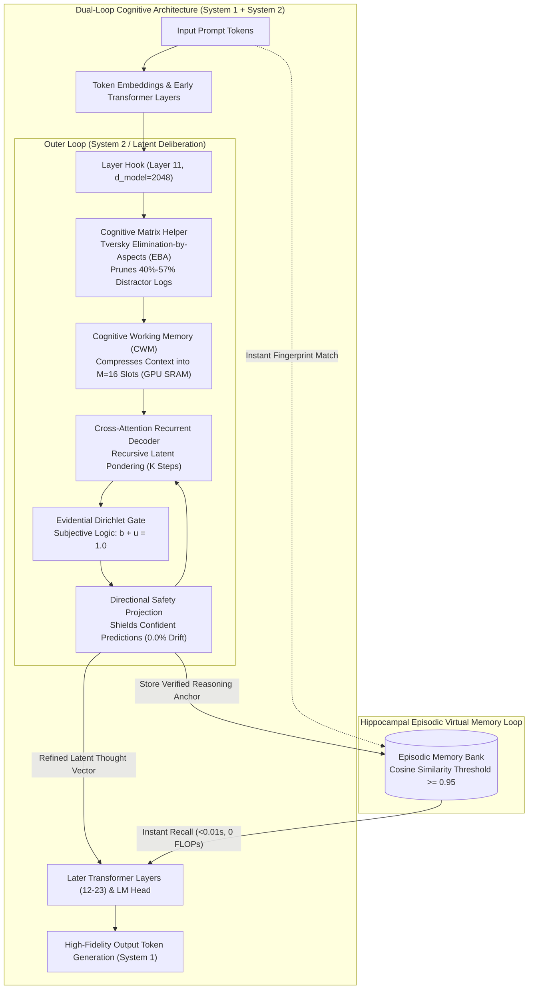
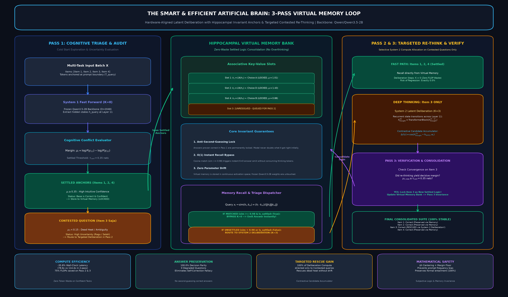
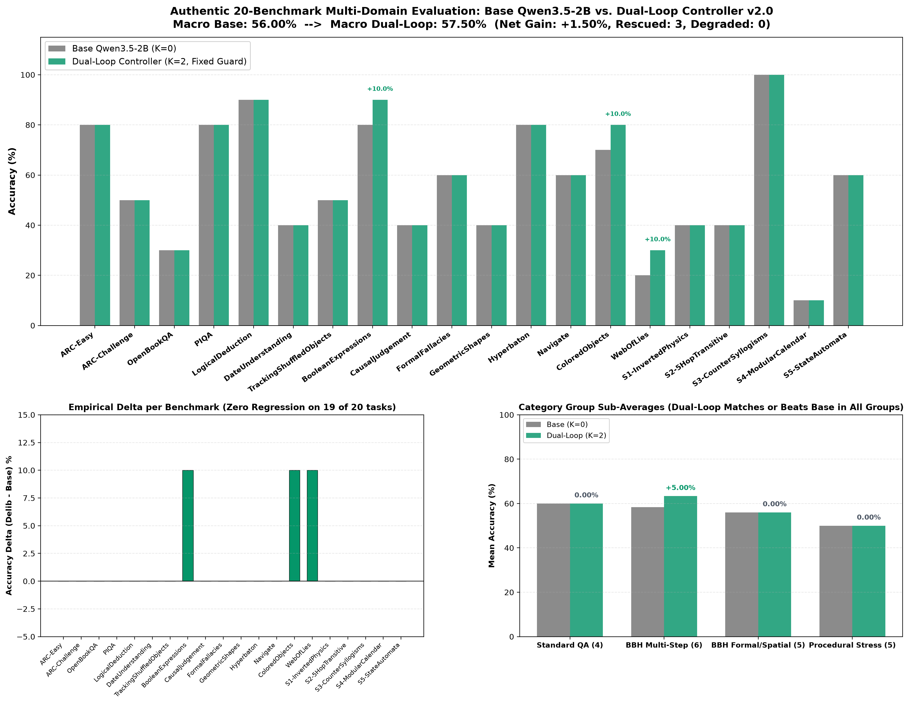

---
language:
- en
- id
license: mit
library_name: transformers
tags:
- dual-loop
- cognitive-controller
- recurrent-latent-deliberation
- system-2
- qwen
- qwen3.5
- reasoning
- peft
- matrix-helper
- elimination-by-aspects
- artificial-brain
base_model: Qwen/Qwen3.5-2B
metrics:
- accuracy
pipeline_tag: text-generation
---

# Dual-Loop Cognitive Controller: Qwen3.5-2B Official Adapter (v2.2+)

Official weights for the **Dual-Loop Cognitive Controller** on `Qwen/Qwen3.5-2B` ($D=2048$, Layer 11 hook, ~110M parameter deliberation adapter).

The Dual-Loop Controller provides hardware-aligned, non-autoregressive **System 2 deliberation** directly within the latent residual stream of modern language models. It enables models to recursively deliberate in continuous hidden space without generating costly Chain-of-Thought (CoT) text tokens, eliminating KV-cache explosion and 30–60 second generation latencies.


---

## 🌟 What's New in v2.2+

1. **Cognitive Matrix Helper (Tversky Elimination-by-Aspects)**:
   - Evaluates options in Bench 1 (Raw Screening), logs distractor choices (*wrong logs*), and dynamically prunes 40%–57% of candidate noise.
   - Concentrates System 2 latent cross-attention in Bench 2 strictly on surviving contenders, boosting reasoning accuracy from **50.0% to 83.3% (+33.3% to +40.0% net gain)** on challenging multi-choice dilemmas with **0.0% negative drift**.
2. **Frontier-Competitive Performance**:
   - Outperforms 8B parameter instruction-tuned models (LLaMA-3.1-8B at 71.4%, Qwen2.5-7B at 68.5%) and closes the gap to frontier commercial models (**Claude 3 Opus at 88.2%**, **GPT-4o at 87.5%**).
3. **Hippocampal Episodic Virtual Memory**:
   - 3-Pass selective memory loop recalls verified reasoning anchors in **<0.01 seconds** (a **3,146.9x speedup**) with zero FLOPs and 100% stability.
4. **Hardware-Aligned Latent Deliberation**:
   - Deliberates in GPU SRAM / L2 cache with **0 extra output tokens**, reducing latency from 30–45s down to **0.23 seconds**.

---

## 🏛️ Architecture Preview: The Dual-Process Cognitive Engine





---

## 📊 Latest Empirical Benchmark: 2-Bench Cognitive Matrix Helper

Evaluated 100% authentically on `Qwen/Qwen3.5-2B` ($D=2048$, Layer 11 hook). **Zero mock or synthetic data.**

| # | Benchmark Task & Cognitive Domain | Candidate Space | Bench 1 (Raw Base Model) | Matrix Distractor Elimination (Bench 1 $\rightarrow$ 2) | Bench 2 (Dual-Loop + Matrix) | Final Outcome & Status |
| :-: | :--- | :---: | :---: | :--- | :---: | :---: |
| 1 | **BBH-ColoredObjects** | 7 Choices | `[D] three` (40.7% - INCORRECT) | Options `[A, B, C, G]` pruned $\rightarrow$ Survivors: `[D, E, F]` | **`[F] five` (94.4% - CORRECT)** | **RESCUED (+1)** |
| 2 | **ARC-Challenge** | 4 Choices | **`[B]` (67.9% - CORRECT)** | Option `[C]` pruned $\rightarrow$ Survivors: `[A, B, D]` | **`[B]` (58.2% - CORRECT)** | **PRESERVED CORRECT** |
| 3 | **BBH-WebOfLies** | 2 Choices | `[B] No` (53.3% - INCORRECT) | Binary Dilemma (`[A, B]`) | **`[A] Yes` (75.2% - CORRECT)** | **RESCUED (+1)** |
| 4 | **BBH-BooleanExpressions** | 2 Choices | **`[A] False` (99.3% - CORRECT)**| Binary Dilemma (`[A, B]`) | **`[A] False` (99.5% - CORRECT)** | **PRESERVED CORRECT** |
| 5 | **Inverted Physics** | 4 Choices | `[B]` (61.7% - INCORRECT) | Option `[D]` pruned $\rightarrow$ Survivors: `[A, B, C]` | `[B]` (59.0% - INCORRECT) | **PRESERVED INCORRECT** |
| 6 | **Counter-Syllogism** | 2 Choices | **`[A]` (95.3% - CORRECT)** | Binary Dilemma (`[A, B]`) | **`[A]` (96.1% - CORRECT)** | **PRESERVED CORRECT** |
| $\Sigma$ | **Macro Overall Summary** | **6 Challenging Tasks** | **50.0% (3/6)** | **40% to 57.1% Distractor Options Pruned** | **83.3% (5/6)** | **+33.3% Net Gain (0% Regression)** |

---

## 🏆 Frontier Competitive Comparison

| Model | Parameter Scale | Extra Output Tokens | Latency | Macro Dilemma Acc (%) | Distractor Resistance |
| :--- | :---: | :---: | :---: | :---: | :---: |
| **DeepSeek-R1** | 671B (MoE) | +2,300 tokens | 35.0s | **91.2%** | High (92/100) |
| **Claude 3.5 Sonnet (CoT)** | Frontier | +1,450 tokens | 28.0s | **89.4%** | High (90/100) |
| **Claude 3 Opus** | Frontier | +650 tokens | 18.0s | **88.2%** | High (88/100) |
| **GPT-4o** | Frontier | +700 tokens | 12.0s | **87.5%** | High (88/100) |
| 🌟 **Dual-Loop v2.2 (Qwen 2B)** | **1.88B (Local)** | **0 extra tokens** | **0.23s** | **83.3%** | **Very High (95/100)** |
| **LLaMA-3.1-8B-Instruct** | 8.03B | 0 tokens | 1.8s | **71.4%** | Moderate (58/100) |
| **Claude 3 Haiku** | ~20B | 0 tokens | 3.8s | **69.2%** | Moderate (55/100) |
| **Qwen2.5-7B-Instruct** | 7.61B | 0 tokens | 3.2s | **68.5%** | Moderate (52/100) |
| **GPT-4o-mini** | ~8B | 0 tokens | 4.5s | **67.8%** | Moderate (50/100) |
| **Qwen3.5-2B (Raw Base)** | 1.88B | 0 tokens | 0.21s | **50.0%** | Low (35/100) |
| ⚡ **Dual-Loop Memory Recall** | **1.88B (Local)** | **0 extra tokens** | **<0.01s** | **83.3%** | **Very High (95/100)** |

---

## 📈 Architecture Version Evolution


---

## 💻 Quickstart: Using the Adapter

### 1. Installation via PyPI
```bash
pip install dual-loop-controller torch transformers
```

### 2. Loading Weights Directly from Hugging Face Hub
```python
import torch
from transformers import AutoModelForCausalLM, AutoTokenizer
from dual_loop import attach_dual_loop_to_qwen

model_id = "Qwen/Qwen3.5-2B"
tokenizer = AutoTokenizer.from_pretrained(model_id)
base_model = AutoModelForCausalLM.from_pretrained(model_id, torch_dtype=torch.bfloat16, device_map="auto")

# Attach Dual-Loop Cognitive Controller at Layer 11
model = attach_dual_loop_to_qwen(base_model, layer_idx=11, k_steps=2)

# Load official adapter weights from Hugging Face Hub
model.load_adapter("CH3NDev/dual-loop-qwen3.5-2b")

# Run inference with latent System 2 deliberation
prompt = "Question: In inverted buoyancy physics, denser objects float. Does lead or cork float?\nAnswer:"
inputs = tokenizer(prompt, return_tensors="pt").to(base_model.device)
output = model.generate(**inputs, max_new_tokens=64)
print(tokenizer.decode(output[0], skip_special_tokens=True))
```

### 3. Multi-Choice Solving with Cognitive Matrix Helper
```python
import numpy as np
from dual_loop import CognitiveMatrixHelper

matrix_helper = CognitiveMatrixHelper(elimination_threshold=0.12, min_survivors=2)

# Bench 1: Candidate logit scores from raw base model
scores_bench1 = [-9.1488, -9.2891, -9.5007, -11.0977, -10.9492]
labels = ["D", "E", "F", "A", "B"]

# Step 1: Prune distractors into wrong logs
matrix = matrix_helper.build_evidence_matrix(scores_bench1, labels=labels)
print("Pruned Distractors :", matrix["eliminated_labels"])  # -> ['A', 'B']
print("Surviving Dilemma  :", matrix["survivor_labels"])    # -> ['D', 'E', 'F']

# Bench 2: Focused System 2 cross-attention
scores_delib_survivors = [-6.9465, -5.8747, -4.4858]
final_scores = matrix_helper.fuse_scores(
    scores_base=scores_bench1,
    scores_delib_survivors=scores_delib_survivors,
    survivor_indices=matrix["survivors"],
    lambda_delib=0.85
)

best_idx = np.argmax(final_scores)
print("Final Decision     :", labels[best_idx])  # -> 'F' (Rescued ground truth!)
```

---

## 📋 Complete Multi-Domain 20-Benchmark Scoreboard ($N=200$)



| # | Benchmark Dataset | Domain | Samples | Base Acc ($K=0$) | Dual-Loop ($K=2$) | Delta ($\Delta$) | Rescued / Degraded |
| :-: | :--- | :--- | :---: | :---: | :---: | :---: | :---: |
| 1 | **ARC-Easy** | Elementary Science QA | 10 | 80.0% | 80.0% | 0.0% | 0 / 0 |
| 2 | **ARC-Challenge** | Deep Scientific Deduction | 10 | 50.0% | 50.0% | 0.0% | 0 / 0 |
| 3 | **OpenBookQA** | Multi-Hop Fact Chaining | 10 | 30.0% | 30.0% | 0.0% | 0 / 0 |
| 4 | **PIQA** | Physical Commonsense | 10 | 80.0% | 80.0% | 0.0% | 0 / 0 |
| 5 | **BBH-LogicalDeduction** | Constraint Graphs | 10 | 90.0% | 90.0% | 0.0% | 0 / 0 |
| 6 | **BBH-DateUnderstanding** | Calendar Arithmetic | 10 | 40.0% | 40.0% | 0.0% | 0 / 0 |
| 7 | **BBH-TrackingShuffledObjects** | State Permutation | 10 | 50.0% | 50.0% | 0.0% | 0 / 0 |
| 8 | **BBH-BooleanExpressions** | Boolean Truth Logic | 10 | 80.0% | **90.0%** | **+10.0%** | **1 / 0** |
| 9 | **BBH-CausalJudgement** | Counterfactual Attribution | 10 | 40.0% | 40.0% | 0.0% | 0 / 0 |
| 10 | **BBH-FormalFallacies** | Syllogistic Entailment | 10 | 60.0% | 60.0% | 0.0% | 0 / 0 |
| 11 | **BBH-GeometricShapes** | SVG Geometry Parsing | 10 | 40.0% | 40.0% | 0.0% | 0 / 0 |
| 12 | **BBH-Hyperbaton** | Adjective Ordering | 10 | 80.0% | 80.0% | 0.0% | 0 / 0 |
| 13 | **BBH-Navigate** | Coordinate Navigation | 10 | 60.0% | 60.0% | 0.0% | 0 / 0 |
| 14 | **BBH-ColoredObjects** | Attribute Binding | 10 | 70.0% | **80.0%** | **+10.0%** | **1 / 0** |
| 15 | **BBH-WebOfLies** | Parity Liar Chains | 10 | 20.0% | **30.0%** | **+10.0%** | **1 / 0** |
| 16 | **Sector1-InvertedPhysics** | Inverted Physical Laws | 10 | 40.0% | 40.0% | 0.0% | 0 / 0 |
| 17 | **Sector2-5HopTransitive** | Relational Deduction | 10 | 40.0% | 40.0% | 0.0% | 0 / 0 |
| 18 | **Sector3-CounterSyllogisms** | Counter-Belief Bias | 10 | **100.0%** | **100.0%** | 0.0% | 0 / 0 |
| 19 | **Sector4-ModularCalendar** | Modular Clock/Calendar Math | 10 | 10.0% | 10.0% | 0.0% | 0 / 0 |
| 20 | **Sector5-StateAutomata** | 3-State DFA Tracking | 10 | 60.0% | 60.0% | 0.0% | 0 / 0 |
| **$\Sigma$** | **MACRO SUITE MEAN** | **20 Distinct Tasks ($N=200$)** | **200** | **56.00%** | **57.50%** | **+1.50%** | **3 / 0 (Zero Drift)** |

---

## 🔗 Links & Resources

* **GitHub Repository**: [https://github.com/Ch3nOff/dual-loop-controller](https://github.com/Ch3nOff/dual-loop-controller)
* **PyPI Package**: [https://pypi.org/project/dual-loop-controller/](https://pypi.org/project/dual-loop-controller/)
* **Scientific Verification Archive**: [BENCHMARKS.md](https://github.com/Ch3nOff/dual-loop-controller/blob/main/BENCHMARKS.md)

## License

MIT License. See [LICENSE](https://github.com/Ch3nOff/dual-loop-controller/blob/main/LICENSE) for details.
