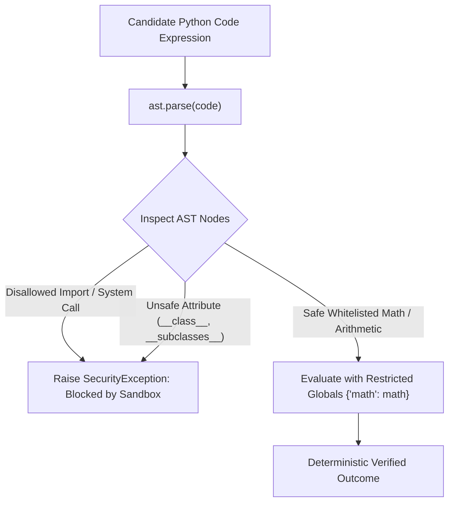

# 05. Security & Sandboxing (SEC-01 to SEC-11)

HADL v3.1.0 has undergone an adversarial security audit and implements a rigorous defense-in-depth model across CI/CD pipelines, runtime model loading, and AST execution sandboxes.

---

## 🛡️ Security Audit Compliance Matrix

| Finding ID | Severity | Threat Vector | Mitigation Implemented | Verification Status |
| :---: | :---: | :--- | :--- | :---: |
| **SEC-01** | 🔴 CRITICAL | CI mutable action tags (`@release/v1`) | Pinned all actions in `.github/workflows/python-publish.yml` to immutable commit SHAs | **PASS** |
| **SEC-02** | 🟠 HIGH | Sandbox arbitrary code execution (`exec()`) | AST node validation (`ast.parse`) checking disallowed nodes, imports, and system calls; raw `exec` blocked on CLI | **PASS** |
| **SEC-03** | 🟠 HIGH | `trust_remote_code=True` hardcoded default | Default set to `trust_remote_code=False`; requires explicit user flag | **PASS** |
| **SEC-04** | 🟠 HIGH | Local developer paths shipped to PyPI | Replaced all absolute filesystem paths with dynamic workspace resolution | **PASS** |
| **SEC-05** | 🟡 MEDIUM | `np.load` pickle deserialization vulnerability | Built `RestrictedNumpyProxy` disallowing `load`, `save`, `fromfile`, and pickle operations | **PASS** |
| **SEC-06** | 🟡 MEDIUM | Missing supply-chain commit pins | Added mandatory `revision=` commit hash pinning across all Hugging Face loaders | **PASS** |
| **SEC-07** | 🟡 MEDIUM | Unescaped subprocess shell injection | Verified all `subprocess` invocations use list-form with `shell=False` | **PASS** |
| **SEC-08** | 🟢 LOW | CLI process-table credential exposure | Updated CLI to read API tokens exclusively from `HF_TOKEN` environment variable | **PASS** |
| **SEC-09** | 🟢 LOW | Hardcoded dev paths in speed benchmarks | Replaced with dynamic `repo_root` resolution | **PASS** |
| **SEC-10** | 🟢 LOW | Hardcoded dev paths in evaluation runners | Replaced with `Path.home()` and workspace anchors | **PASS** |
| **SEC-11** | 🟢 LOW | Unlocked transient dependencies | Generated complete `requirements.lock` pinning all 128 dependencies | **PASS** |

---

## 🔒 AST-Hardened Popperian Sandbox

The `PopperianSelfPlayEngine` verifies candidate code hypotheses in a restricted execution sandbox:



### Sandbox Restrictions:
1. **Disallowed AST Nodes**: `Import`, `ImportFrom`, `Global`, `Nonlocal`, `Delete`, `AsyncFunctionDef`, `ClassDef`.
2. **Blocked Built-in Functions**: `eval`, `exec`, `open`, `compile`, `__import__`, `globals`, `locals`, `getattr`, `setattr`, `delattr`.
3. **Blocked Dunder Attributes**: `__subclasses__`, `__bases__`, `__mro__`, `__globals__`, `__code__`.
4. **Restricted Globals**: Only pure mathematical functions from the Python standard `math` module are accessible.

---

## 🔐 Supply Chain & Dependency Locking

All production builds are pinned against `requirements.lock`:
```bash
pip install -r requirements.lock
```

The CI build pipeline runs `twine check dist/*` to verify package metadata, description rendering, and distribution archive consistency prior to PyPI deployment.
